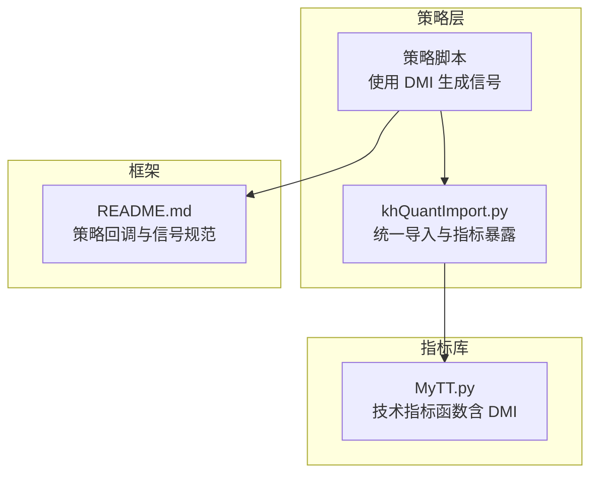
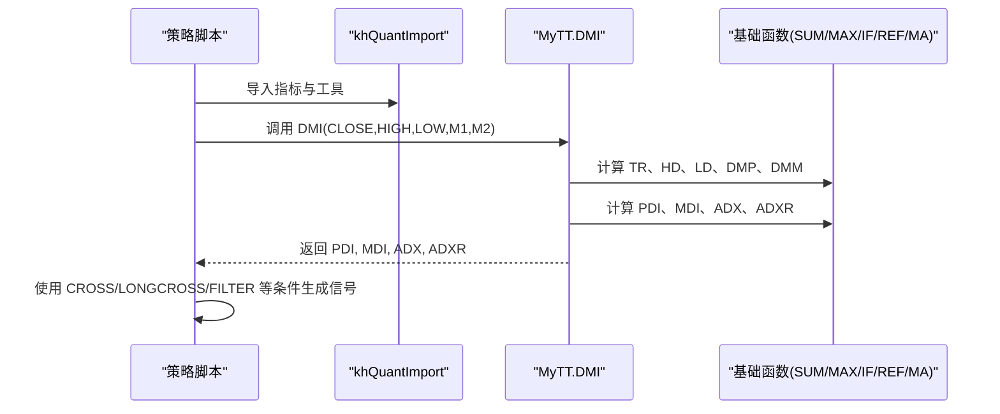
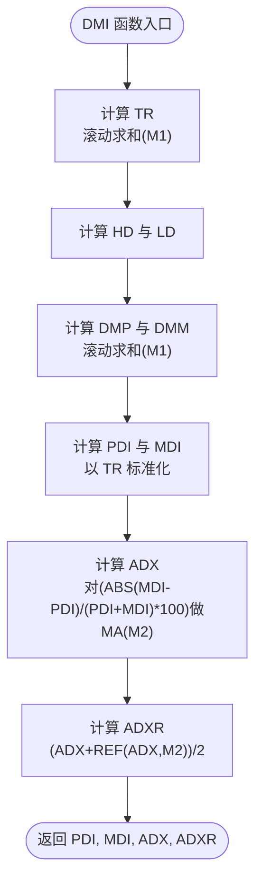
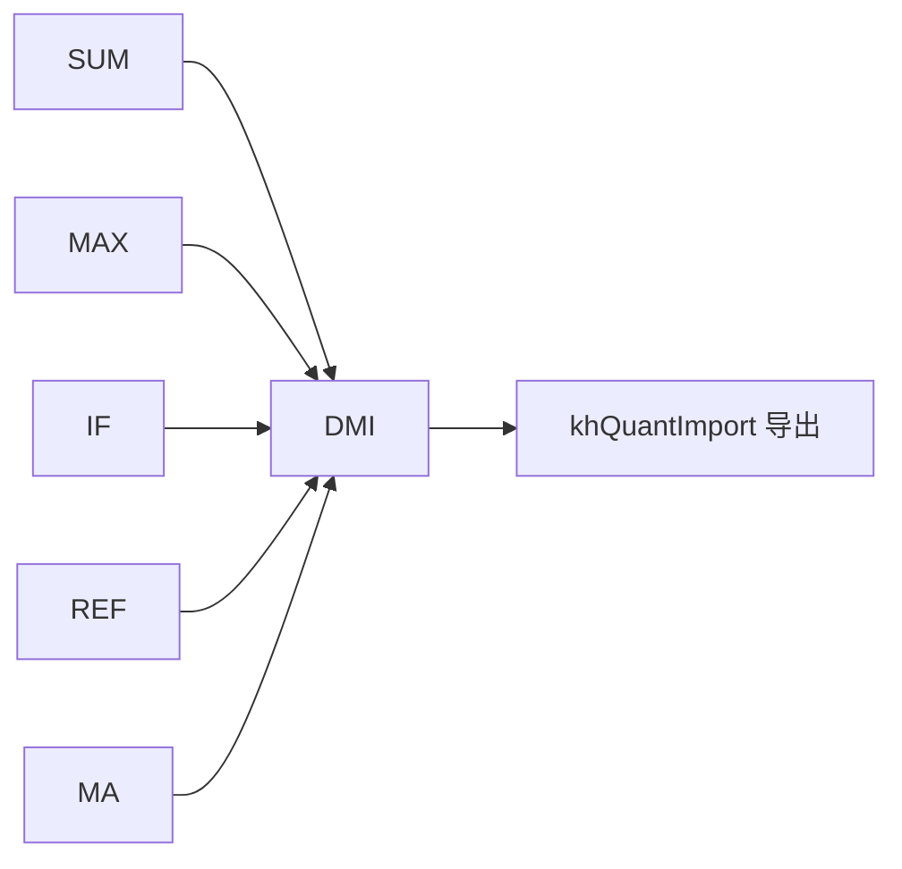

# 动向指标

<cite>
**本文引用的文件**
- [MyTT.py](file://MyTT.py)
- [khQuantImport.py](file://khQuantImport.py)
- [README.md](file://README.md)
</cite>

## 目录
1. [简介](#简介)
2. [项目结构](#项目结构)
3. [核心组件](#核心组件)
4. [架构总览](#架构总览)
5. [详细组件分析](#详细组件分析)
6. [依赖分析](#依赖分析)
7. [性能考量](#性能考量)
8. [故障排查指南](#故障排查指南)
9. [结论](#结论)
10. [附录](#附录)

## 简介
本文件系统化解析 khQuant 量化平台中的 DMI（动向指标）实现，聚焦于 MyTT.py 中 DMI(CLOSE, HIGH, LOW, M1=14, M2=6) 的完整计算流程。文档将分步讲解 TR、HD、LD、DMP、DMM 的计算方法，以及 PDI（+DI）、MDI（-DI）、ADX 和 ADXR 的推导过程；强调 M1（方向评估周期）与 M2（ADX 平滑周期）参数的作用；并通过实际数据演示说明如何用 ADX 衡量趋势强度（如 ADX>25 为强趋势），以及 PDI 与 MDI 交叉如何判断多空方向。最后总结 DMI 在量化策略中的综合应用：利用 ADX 过滤震荡行情，结合 PDI/MDI 金叉进行趋势启动确认，并给出多时间周期联用的优化方案。

## 项目结构
- MyTT.py 提供统一的指标函数库，DMI 位于“技术指标函数”层级，依赖于 MyTT 内部的基础函数（如 SUM、MAX、IF、REF、MA 等）。
- khQuantImport.py 将 MyTT 指标函数暴露给策略脚本，策略通过 khQuantImport 一键导入指标与工具。
- README.md 提供框架与策略回调接口说明，为 DMI 在策略中的落地提供上下文。

**图表来源**
- [MyTT.py](file://MyTT.py#L264-L276)
- [khQuantImport.py](file://khQuantImport.py#L44-L46)
- [README.md](file://README.md#L1677-L1726)

**章节来源**
- [MyTT.py](file://MyTT.py#L264-L276)
- [khQuantImport.py](file://khQuantImport.py#L44-L46)
- [README.md](file://README.md#L1677-L1726)

## 核心组件
- DMI 函数：接收 CLOSE、HIGH、LOW 三价序列，返回 PDI、MDI、ADX、ADXR 四个指标序列。
- 参数 M1：方向评估周期，决定 TR、DMP、DMM 的滚动窗口长度。
- 参数 M2：ADX 平滑周期，决定 ADX 的移动平均平滑长度。
- 基础函数依赖：SUM、MAX、IF、REF、MA 等，用于滚动窗口计算与平滑。

**章节来源**
- [MyTT.py](file://MyTT.py#L264-L276)

## 架构总览
DMI 的计算在 MyTT 指标库中完成，策略通过 khQuantImport 导入后，在 khHandlebar 中按需调用 DMI，结合 CROSS、LAST 等条件函数生成交易信号。

**图表来源**
- [MyTT.py](file://MyTT.py#L264-L276)
- [khQuantImport.py](file://khQuantImport.py#L44-L46)

## 详细组件分析

### DMI 计算流程详解
DMI 的计算分为以下步骤：
1) 计算 TR（真实波幅）
- TR = SUM(MAX(MAX(HIGH - LOW, ABS(HIGH - REF(CLOSE, 1))), ABS(LOW - REF(CLOSE, 1))), M1)
- 说明：取当日最高与最低之差、与昨日收盘价与今日最高差的绝对值、与昨日收盘价与今日最低差的绝对值三者最大值，滚动求和，窗口长度为 M1。

2) 计算 HD（当日最高与前一日最高之差）与 LD（前一日最低与当日最低之差）
- HD = HIGH - REF(HIGH, 1)
- LD = REF(LOW, 1) - LOW

3) 计算 DMP（正向动向）与 DMM（负向动向）
- DMP = SUM(IF((HD > 0) & (HD > LD), HD, 0), M1)
- DMM = SUM(IF((LD > 0) & (LD > HD), LD, 0), M1)
- 说明：仅在 HD>0 且 HD>LD 时计入 HD 作为 DMP；仅在 LD>0 且 LD>HD 时计入 LD 作为 DMM，滚动求和窗口为 M1。

4) 计算 PDI（+DI）与 MDI（-DI）
- PDI = DMP × 100 / TR
- MDI = DMM × 100 / TR
- 说明：将 DMP、DMM 以 TR 为基准标准化为百分比。

5) 计算 ADX（平均动向指数）
- ADX = MA(ABS(MDI - PDI) / (PDI + MDI) × 100, M2)
- 说明：先计算 PDI 与 MDI 的差的绝对值与两者和的比值，乘以 100，再对窗口长度为 M2 的序列进行移动平均。

6) 计算 ADXR（动向振荡领先滞后线）
- ADXR = (ADX + REF(ADX, M2)) / 2
- 说明：ADXR 为 ADX 与其 M2 前的 ADX 的简单平均，用于观察 ADX 的趋势变化。

**图表来源**
- [MyTT.py](file://MyTT.py#L264-L276)

**章节来源**
- [MyTT.py](file://MyTT.py#L264-L276)

### 参数 M1 与 M2 的作用
- M1（方向评估周期）：决定 TR、DMP、DMM 的滚动窗口长度。M1 越大，对短期噪音的敏感度越低，但对趋势的反应越慢；M1 越小，对短期波动越敏感，但可能产生更多假信号。
- M2（ADX 平滑周期）：决定 ADX 的平滑程度。M2 越大，ADX 越平滑，趋势信号更稳健；M2 越小，ADX 波动更大，对趋势变化更敏感。

**章节来源**
- [MyTT.py](file://MyTT.py#L264-L276)

### 实战应用：趋势强度与方向判断
- 趋势强度判定：通常以 ADX 值衡量趋势强度。例如，当 ADX>25 时视为强趋势，ADX 在 20~25 之间为中等趋势，ADX<20 时视为震荡或弱趋势。
- 方向判断：PDI 与 MDI 的交叉用于判断多空方向。当 PDI 上穿 MDI 时，视为多头占优；当 MDI 上穿 PDI 时，视为空头占优。
- 过滤震荡：在震荡市场中，ADX 值较低，可采用“仅在 ADX>阈值时才开仓”的策略，以避免逆势交易。

**章节来源**
- [MyTT.py](file://MyTT.py#L264-L276)

### 多时间周期联用优化方案
- 多周期共振：在更高周期（如日线）上计算 DMI，确认大趋势方向；在更低周期（如 1 分钟或 5 分钟）上捕捉入场时机。例如：日线 ADX>25 且 PDI>MDI，再在 1 分钟图上等待 PDI 金叉 MDI。
- 参数差异化：高周期使用较大的 M1、M2（如 M1=14、M2=6），低周期使用较小的 M1、M2（如 M1=5、M2=3），以兼顾趋势稳定性与入场灵敏度。
- 信号过滤：结合过滤函数（如 FILTER）避免重复信号，或使用 LONGCROSS 等条件函数确认突破的有效性。

[本节为概念性说明，不直接分析具体文件，故不附“章节来源”]

## 依赖分析
- DMI 依赖的基础函数：
  - SUM：滚动求和，用于 TR、DMP、DMM 的累积。
  - MAX：取三者最大值，用于 TR 的计算。
  - IF：条件判断，用于 DMP/DMM 的筛选。
  - REF：序列滞后，用于 HD、LD 的计算。
  - MA：移动平均，用于 ADX 的平滑。
- khQuantImport 将 MyTT 的指标函数暴露给策略脚本，策略可直接调用 DMI。

**图表来源**
- [MyTT.py](file://MyTT.py#L264-L276)
- [khQuantImport.py](file://khQuantImport.py#L44-L46)

**章节来源**
- [MyTT.py](file://MyTT.py#L264-L276)
- [khQuantImport.py](file://khQuantImport.py#L44-L46)

## 性能考量
- 计算复杂度：DMI 的核心计算为滚动窗口的 SUM/MAX/IF/REF/MA，整体复杂度与数据长度呈线性关系，适合批量回测。
- 内存占用：依赖 pandas rolling 与 numpy 数组，建议在策略中缓存必要的中间序列（如 TR、DMP、DMM），避免重复计算。
- 参数选择：M1、M2 增大会增加计算窗口，可能影响实时性；在回测中可适当放宽，但在实盘中需权衡延迟与稳定性。

[本节为一般性建议，不直接分析具体文件，故不附“章节来源”]

## 故障排查指南
- 数据缺失：若 CLOSE/HIGH/LOW 序列中存在 NaN 或长度不一致，可能导致计算异常。可在策略中先检查数据有效性，再调用 DMI。
- 参数设置：M1、M2 过小可能产生过多噪音信号，过大可能错过趋势转折。建议通过回测对比不同参数组合的表现。
- 信号生成：结合 CROSS、LONGCROSS、FILTER 等条件函数生成信号时，注意避免“同周期内重复触发”，可使用 FILTER 屏蔽 N 周期内的重复信号。

[本节为一般性建议，不直接分析具体文件，故不附“章节来源”]

## 结论
DMI 通过 TR、HD、LD、DMP、DMM 的组合，将价格波动转化为方向与强度的量化指标。PDI/MDI 的交叉用于判断多空方向，ADX 用于衡量趋势强度，ADXR 用于观察趋势变化。在量化策略中，可利用 ADX 过滤震荡行情，结合 PDI/MDI 金叉确认趋势启动。通过多时间周期联用与参数优化，可进一步提升策略的稳定性与胜率。

[本节为总结性内容，不直接分析具体文件，故不附“章节来源”]

## 附录
- 策略回调与信号规范：khHandlebar 的返回值为交易信号列表，信号字典包含 code、action、price、volume、reason、timestamp 等键，用于框架执行下单。
- 数据字段兼容：khQuantImport 对 Tick/K 线数据的 close 字段做了 lastPrice 映射，确保策略在不同数据周期下的一致性。

**章节来源**
- [README.md](file://README.md#L1677-L1726)
- [README.md](file://README.md#L1890-L1904)
- [khQuantImport.py](file://khQuantImport.py#L48-L54)