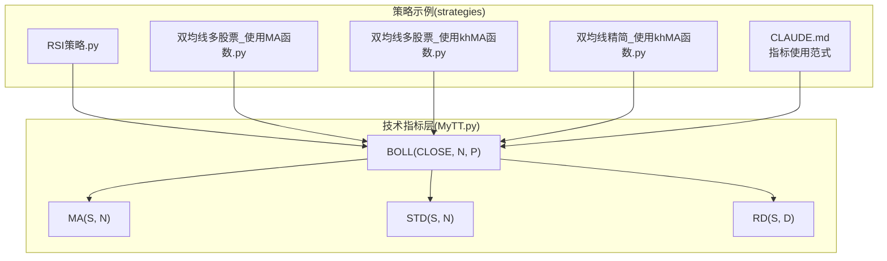
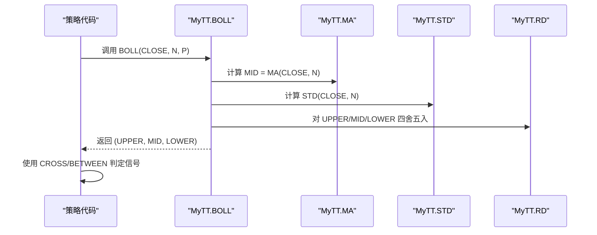
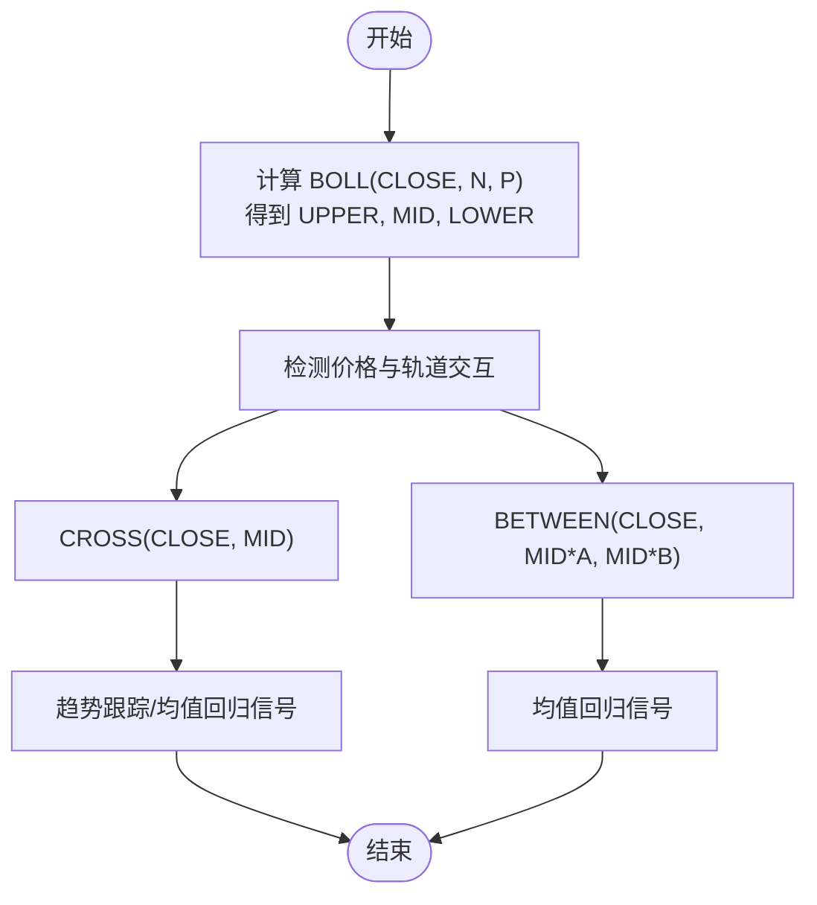
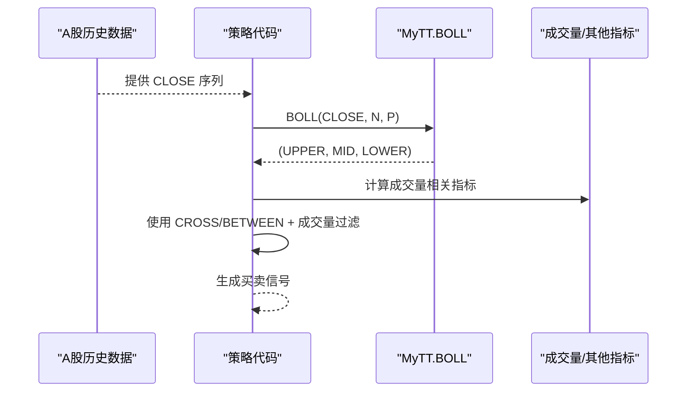
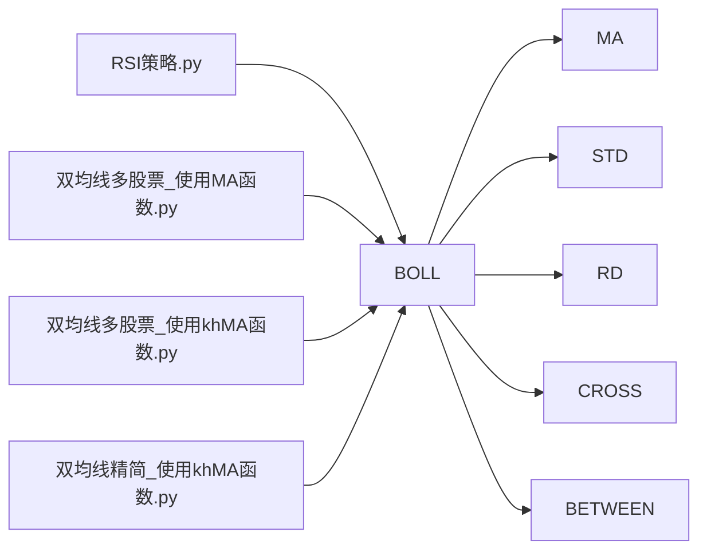

# 布林带指标

<cite>
**本文引用的文件**
- [MyTT.py](file://MyTT.py)
- [CLAUDE.md](file://strategies/CLAUDE.md)
- [RSI策略.py](file://strategies/RSI策略.py)
- [双均线多股票_使用MA函数.py](file://strategies/双均线多股票_使用MA函数.py)
- [双均线多股票_使用khMA函数.py](file://strategies/双均线多股票_使用khMA函数.py)
- [双均线精简_使用khMA函数.py](file://strategies/双均线精简_使用khMA函数.py)
</cite>

## 目录
1. [简介](#简介)
2. [项目结构](#项目结构)
3. [核心组件](#核心组件)
4. [架构概览](#架构概览)
5. [详细组件分析](#详细组件分析)
6. [依赖关系分析](#依赖关系分析)
7. [性能考量](#性能考量)
8. [故障排查指南](#故障排查指南)
9. [结论](#结论)
10. [附录](#附录)

## 简介
本文件围绕仓库中的布林带指标实现，系统梳理BOLL函数的数学原理、参数含义、信号判定方法与实战应用。重点覆盖：
- 数学模型：中轨MID=MA(CLOSE,N)、上轨UPPER=MID+P×STD(CLOSE,N)、下轨LOWER=MID−P×STD(CLOSE,N)
- 参数N与P对通道宽度与信号频率的影响
- 基于A股历史数据的计算实例与价格触及上下轨的波动特性
- 三种典型用法：趋势跟踪、均值回归、收口/开口形态预测突破
- 使用CROSS/BETWEEN检测价格与轨道交互，并结合成交量变化提升信号质量
- 在震荡市与趋势市中的表现差异与参数调整策略

## 项目结构
本项目采用模块化设计，技术指标集中于MyTT.py，策略示例位于strategies目录。与布林带相关的要点如下：
- MyTT.py提供BOLL函数及其依赖的MA、STD等基础函数
- 策略示例展示了如何在策略中调用BOLL并结合其他指标进行信号生成
- README与CLAUDE.md提供了指标使用范式与多周期分析思路

图表来源
- [MyTT.py](file://MyTT.py#L232-L238)
- [MyTT.py](file://MyTT.py#L87-L89)
- [MyTT.py](file://MyTT.py#L59-L61)
- [MyTT.py](file://MyTT.py#L15-L16)
- [RSI策略.py](file://strategies/RSI策略.py#L1-L26)
- [双均线多股票_使用MA函数.py](file://strategies/双均线多股票_使用MA函数.py#L1-L36)
- [双均线多股票_使用khMA函数.py](file://strategies/双均线多股票_使用khMA函数.py#L1-L33)
- [双均线精简_使用khMA函数.py](file://strategies/双均线精简_使用khMA函数.py#L1-L31)
- [CLAUDE.md](file://strategies/CLAUDE.md#L192-L216)

章节来源
- [MyTT.py](file://MyTT.py#L232-L238)
- [MyTT.py](file://MyTT.py#L87-L89)
- [MyTT.py](file://MyTT.py#L59-L61)
- [MyTT.py](file://MyTT.py#L15-L16)
- [CLAUDE.md](file://strategies/CLAUDE.md#L192-L216)

## 核心组件
- BOLL函数：返回上轨、中轨、下轨三线，参数N控制周期长度，P控制标准差倍数
- MA函数：N日简单移动平均，作为中轨的基础
- STD函数：N日总体标准差，衡量价格波动幅度
- RD函数：四舍五入，用于输出精度控制
- CROSS/BETWEEN：用于检测价格与轨道的交叉与区间关系，是构建信号的关键

章节来源
- [MyTT.py](file://MyTT.py#L232-L238)
- [MyTT.py](file://MyTT.py#L87-L89)
- [MyTT.py](file://MyTT.py#L59-L61)
- [MyTT.py](file://MyTT.py#L15-L16)
- [MyTT.py](file://MyTT.py#L165-L178)

## 架构概览
下图展示BOLL函数在指标体系中的位置以及与策略层的交互路径。

图表来源
- [MyTT.py](file://MyTT.py#L232-L238)
- [MyTT.py](file://MyTT.py#L87-L89)
- [MyTT.py](file://MyTT.py#L59-L61)
- [MyTT.py](file://MyTT.py#L15-L16)

## 详细组件分析

### 数学原理与参数说明
- 中轨MID：N日简单移动平均，反映价格趋势的中枢位置
- 上轨UPPER：中轨加上P倍N日总体标准差，反映价格波动上限
- 下轨LOWER：中轨减去P倍N日总体标准差，反映价格波动下限
- 参数N：决定中轨的平滑程度与对近期价格变化的敏感度；N越大，中轨越平滑，通道越窄
- 参数P：决定通道宽度；P越大，通道越宽，信号越稀疏；P越小，通道越窄，信号越密集

章节来源
- [MyTT.py](file://MyTT.py#L232-L238)
- [MyTT.py](file://MyTT.py#L87-L89)
- [MyTT.py](file://MyTT.py#L59-L61)

### 信号判定与交互检测
- 趋势跟踪：价格沿上轨或下轨运行时，可视为趋势延续的确认
- 均值回归：价格从上轨回落或从下轨反弹，可视为回归中轨的信号
- 收口/开口形态：通道收窄后突破，通常伴随方向选择
- 交互检测：使用CROSS检测价格与中轨的交叉，使用BETWEEN检测价格是否在中轨附近波动

图表来源
- [MyTT.py](file://MyTT.py#L232-L238)
- [MyTT.py](file://MyTT.py#L165-L178)

章节来源
- [MyTT.py](file://MyTT.py#L165-L178)

### 基于A股历史数据的计算实例
以下为基于仓库中指标使用范式的实践步骤，帮助读者在A股数据上完成BOLL计算与信号判定：
- 步骤1：获取A股收盘价序列（例如通过策略示例中的历史数据拉取方式）
- 步骤2：调用BOLL(CLOSE, N, P)得到上轨、中轨、下轨
- 步骤3：使用CROSS检测价格与中轨的交叉，或使用BETWEEN检测价格在中轨附近的波动
- 步骤4：结合成交量（如OBV、MFI等）进行信号过滤，提升可靠性

图表来源
- [CLAUDE.md](file://strategies/CLAUDE.md#L192-L216)
- [MyTT.py](file://MyTT.py#L232-L238)
- [MyTT.py](file://MyTT.py#L165-L178)

章节来源
- [CLAUDE.md](file://strategies/CLAUDE.md#L192-L216)
- [MyTT.py](file://MyTT.py#L232-L238)
- [MyTT.py](file://MyTT.py#L165-L178)

### 三种主要用法与参数策略
- 趋势跟踪：当价格长期在上轨之上运行或在下轨之下运行时，视为趋势延续。参数建议：N较大（如20~60），P适中（如1.5~2.5），以降低噪音。
- 均值回归：当价格触及上轨或下轨后出现回调或反弹，视为回归中轨的机会。参数建议：N较小（如10~20），P较小（如1~2），提高信号频率。
- 收口/开口形态：通道收窄后突破，通常伴随方向选择。参数建议：N中等（如20），P在通道收窄时适当放大（如2.5~3），以捕捉突破信号。

章节来源
- [MyTT.py](file://MyTT.py#L232-L238)

### 与成交量结合提升信号质量
- 成交量确认：在价格触及上轨/下轨或穿越中轨时，观察成交量是否放大，以确认突破或回调的有效性
- 成交量比率类指标：如MFI、OBV等，可用于过滤假突破或确认趋势强度

章节来源
- [MyTT.py](file://MyTT.py#L377-L381)
- [MyTT.py](file://MyTT.py#L383-L389)

### 在震荡市与趋势市中的表现差异与参数调整
- 震荡市：波动相对稳定，适合使用较小N与较小P，提高均值回归信号频率；同时结合成交量过滤，避免假信号
- 趋势市：波动较大，适合使用较大N与适中P，降低信号频率，避免频繁反转；通道收口后突破策略更适用

章节来源
- [MyTT.py](file://MyTT.py#L232-L238)

## 依赖关系分析
BOLL函数依赖MA与STD，二者分别来自滚动窗口均值与滚动窗口标准差计算。CROSS与BETWEEN用于信号判定，广泛应用于策略层。

图表来源
- [MyTT.py](file://MyTT.py#L232-L238)
- [MyTT.py](file://MyTT.py#L87-L89)
- [MyTT.py](file://MyTT.py#L59-L61)
- [MyTT.py](file://MyTT.py#L15-L16)
- [MyTT.py](file://MyTT.py#L165-L178)
- [RSI策略.py](file://strategies/RSI策略.py#L1-L26)
- [双均线多股票_使用MA函数.py](file://strategies/双均线多股票_使用MA函数.py#L1-L36)
- [双均线多股票_使用khMA函数.py](file://strategies/双均线多股票_使用khMA函数.py#L1-L33)
- [双均线精简_使用khMA函数.py](file://strategies/双均线精简_使用khMA函数.py#L1-L31)

章节来源
- [MyTT.py](file://MyTT.py#L232-L238)
- [MyTT.py](file://MyTT.py#L87-L89)
- [MyTT.py](file://MyTT.py#L59-L61)
- [MyTT.py](file://MyTT.py#L15-L16)
- [MyTT.py](file://MyTT.py#L165-L178)
- [RSI策略.py](file://strategies/RSI策略.py#L1-L26)
- [双均线多股票_使用MA函数.py](file://strategies/双均线多股票_使用MA函数.py#L1-L36)
- [双均线多股票_使用khMA函数.py](file://strategies/双均线多股票_使用khMA函数.py#L1-L33)
- [双均线精简_使用khMA函数.py](file://strategies/双均线精简_使用khMA函数.py#L1-L31)

## 性能考量
- 向量化计算：MA与STD基于pandas滚动窗口与numpy计算，具备良好性能
- 参数选择：N过大导致滞后性强，P过大导致通道过宽，信号稀少；应结合数据特征与回测结果优化
- 信号过滤：结合CROSS/BETWEEN与成交量指标，可显著降低误报率，提高信号稳定性

[本节为通用性能建议，不直接分析具体文件]

## 故障排查指南
- 数据长度不足：当历史数据长度小于N时，滚动窗口计算可能产生NaN，需确保数据完整性
- 信号过于稀疏或过于频繁：调整N与P，或引入成交量过滤
- 交叉信号误判：结合BETWEEN检测价格是否在中轨附近波动，避免“浅交叉”带来的噪声

章节来源
- [MyTT.py](file://MyTT.py#L232-L238)
- [MyTT.py](file://MyTT.py#L165-L178)

## 结论
BOLL指标通过中轨与上下轨刻画价格波动区间，是趋势跟踪、均值回归与通道突破策略的重要工具。在本仓库中，BOLL由MA与STD构成，配合CROSS/BETWEEN可高效生成信号。实践中应依据市场环境选择合适的N与P，并结合成交量等指标进行信号过滤，以提升策略稳健性。

[本节为总结性内容，不直接分析具体文件]

## 附录
- 指标使用范式参考：策略示例展示了如何在策略中调用BOLL并与其他指标协同使用
- 多周期分析思路：可在日线与周线等多周期上确认趋势，再以BOLL进行信号过滤

章节来源
- [CLAUDE.md](file://strategies/CLAUDE.md#L192-L216)
- [CLAUDE.md](file://strategies/CLAUDE.md#L219-L240)