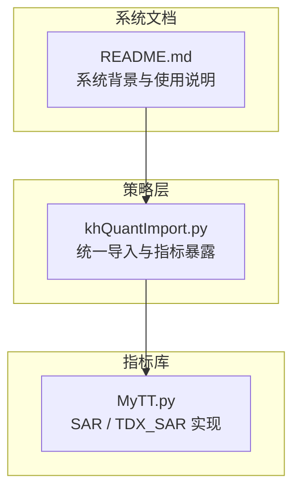
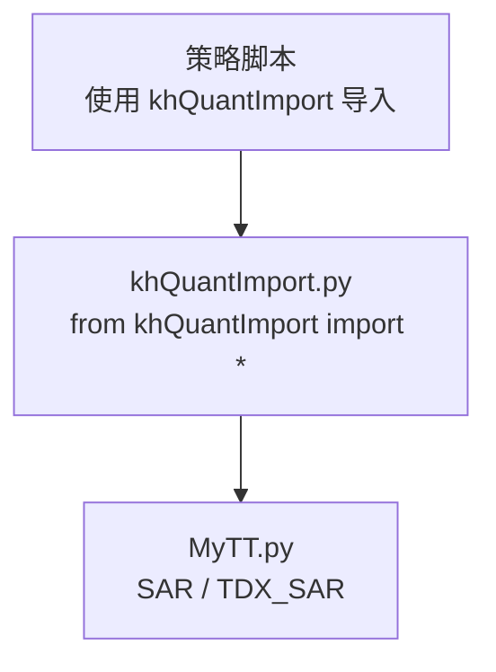
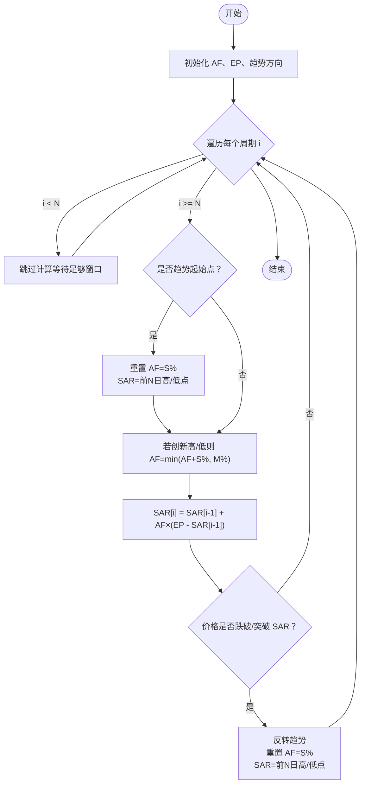
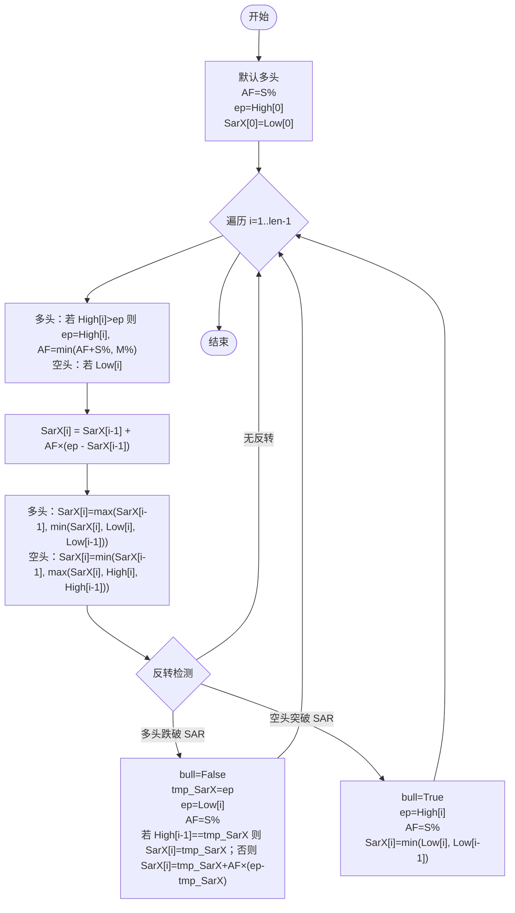
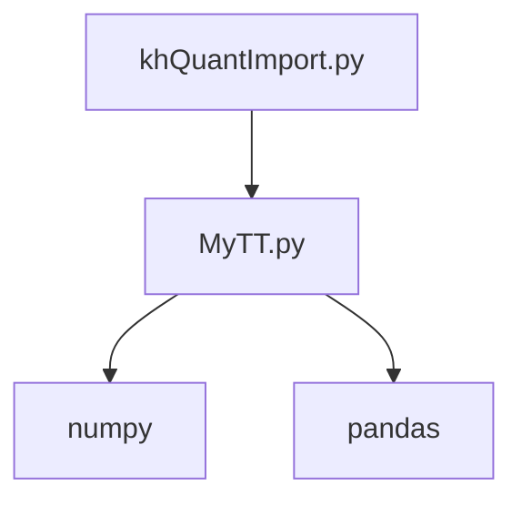

# 抛物转向指标

<cite>
**本文引用的文件**
- [MyTT.py](file://MyTT.py)
- [khQuantImport.py](file://khQuantImport.py)
- [README.md](file://README.md)
</cite>

## 目录
1. [简介](#简介)
2. [项目结构](#项目结构)
3. [核心组件](#核心组件)
4. [架构总览](#架构总览)
5. [详细组件分析](#详细组件分析)
6. [依赖分析](#依赖分析)
7. [性能考虑](#性能考虑)
8. [故障排查指南](#故障排查指南)
9. [结论](#结论)
10. [附录](#附录)

## 简介
本文件围绕 MyTT.py 中的两个抛物转向（SAR）指标实现展开：SAR(HIGH, LOW, N=10, S=2, M=20) 与 TDX_SAR。文档系统性解析加速因子（AF）从初始步长 S% 逐步递增至极限 M% 的动态调整机制，给出多头/空头趋势下的递推公式 SAR[i] = SAR[i-1] + AF×(EP - SAR[i-1])，并对比通用 SAR 与通达信版本在极值修正与反转逻辑上的差异（如 SAR 值不穿透前两日 K 线）。最后阐述 SAR 作为趋势跟踪与止损工具的双重用途，以及在强趋势与震荡市中的表现差异，并提出结合 ADX 过滤的优化思路。

## 项目结构
- MyTT.py 提供统一指标库，包含 SAR 与 TDX_SAR 实现，以及大量通用技术指标与数据处理函数。
- khQuantImport.py 将 MyTT 指标函数暴露给策略脚本，便于策略直接使用。
- README.md 提供系统背景与使用说明，便于理解 SAR 在回测与策略中的定位。

**图表来源**
- [MyTT.py](file://MyTT.py#L524-L624)
- [khQuantImport.py](file://khQuantImport.py#L40-L60)
- [README.md](file://README.md#L1-L120)

**章节来源**
- [MyTT.py](file://MyTT.py#L524-L624)
- [khQuantImport.py](file://khQuantImport.py#L40-L60)
- [README.md](file://README.md#L1-L120)

## 核心组件
- SAR(HIGH, LOW, N=10, S=2, M=20)
  - 基于 N 日窗口的最高/最低价确定初始极值，采用步长 S% 与极限 M% 控制 AF 动态增长，遵循 SAR 递推公式进行趋势跟踪与反转检测。
- TDX_SAR(High, Low, iAFStep=2, iAFLimit=20)
  - 与通用 SAR 的差异在于反转后的 SAR 值修正与“不穿透前两日 K 线”的约束，更贴近通达信显示效果。

**章节来源**
- [MyTT.py](file://MyTT.py#L524-L624)

## 架构总览
SAR 与 TDX_SAR 作为 MyTT 指标库的一部分，通过 khQuantImport.py 暴露给策略脚本，策略可在回测中直接调用这两个函数生成趋势信号与动态止损位。

**图表来源**
- [khQuantImport.py](file://khQuantImport.py#L40-L60)
- [MyTT.py](file://MyTT.py#L524-L624)

**章节来源**
- [khQuantImport.py](file://khQuantImport.py#L40-L60)
- [MyTT.py](file://MyTT.py#L524-L624)

## 详细组件分析

### 通用 SAR（SAR 函数）
- 输入与参数
  - HIGH/LOW：最高价与最低价序列
  - N：初始计算周期，决定初始极值窗口
  - S：步长百分比（AF 初始增量）
  - M：步长极限百分比（AF 上限）
- 初始趋势判定
  - 通过前 N 日最高价与最低价的相对关系确定初始多头/空头方向。
- 极值与 AF 更新
  - 若当前周期价格创新高/低，则 AF 增加 S%，但不超过 M%。
- SAR 递推
  - SAR[i] = SAR[i-1] + AF×(EP - SAR[i-1])
  - EP 为当前趋势下的极值（多头为新高，空头为新低）。
- 趋势反转
  - 当价格跌破/突破 SAR 时反转趋势，重置 AF 并将 SAR 设为前 N 日高/低点。

**图表来源**
- [MyTT.py](file://MyTT.py#L524-L561)

**章节来源**
- [MyTT.py](file://MyTT.py#L524-L561)

### 通达信版本 SAR（TDX_SAR 函数）
- 初始设定
  - 默认多头，SAR 初始为当日低点，AF=S%。
- 极值与 AF 更新
  - 多头：若 High[i] > ep，则 ep 更新为 High[i]，AF=min(AF+S%, M%)；空头同理。
- SAR 递推与修正
  - SAR[i] = SAR[i-1] + AF×(EP - SAR[i-1])
  - 多头：SAR 不低于前两日低点的最小值；空头：SAR 不高于前两日高点的最大值。
- 趋势反转与反转后 SAR 修正
  - 多头跌破 SAR：转空，tmp_SarX=前阶段最高点；若 High[i-1]==tmp_SarX，则 SAR[i]=tmp_SarX；否则 SAR[i]=tmp_SarX+AF×(ep-tmp_SarX)。
  - 空头突破 SAR：转多，SAR[i]=min(Low[i], Low[i-1])。

**图表来源**
- [MyTT.py](file://MyTT.py#L564-L624)

**章节来源**
- [MyTT.py](file://MyTT.py#L564-L624)

### 通用 SAR 与通达信 SAR 的差异对比
- 极值修正与反转逻辑
  - 通用 SAR：反转后直接重置 AF 并将 SAR 设为前 N 日高/低点。
  - 通达信 SAR：反转后对 SAR 值进行“不穿透前两日 K 线”的修正，避免跳空与过度穿透。
- SAR 值约束
  - 通达信 SAR 在多头/空头状态下分别对 SAR 值进行上下限修正，使显示更贴近实际 K 线。
- 适用场景
  - 通用 SAR 更偏向纯数学递推，适合回测与信号生成。
  - 通达信 SAR 更贴近实际显示效果，适合可视化与人工观察。

**章节来源**
- [MyTT.py](file://MyTT.py#L524-L624)

### SAR 的双重用途与策略应用
- 趋势跟踪与信号生成
  - 价格在 SAR 上方视为多头，下方为空头；可据此生成多空入场/离场信号。
- 动态止损/止盈位
  - SAR 值随趋势演进形成动态止损线；在反转前可作为止盈或止损位参考。
- 与 ADX 过滤的结合
  - 强趋势行情中 SAR 表现优异，震荡市中反转频繁；可结合 ADX 判断趋势强度，仅在 ADX 超过阈值时才依据 SAR 生成信号，减少假信号。

**章节来源**
- [MyTT.py](file://MyTT.py#L524-L624)

## 依赖分析
- khQuantImport.py 将 MyTT 的指标函数（包括 SAR/TDX_SAR）统一暴露给策略脚本，策略只需 from khQuantImport import * 即可直接使用。
- MyTT.py 内部依赖 numpy/pandas 与若干通用函数（如 HHV/LLV/REF 等）实现滚动窗口与序列运算。

**图表来源**
- [khQuantImport.py](file://khQuantImport.py#L40-L60)
- [MyTT.py](file://MyTT.py#L1-L120)

**章节来源**
- [khQuantImport.py](file://khQuantImport.py#L40-L60)
- [MyTT.py](file://MyTT.py#L1-L120)

## 性能考虑
- 计算复杂度
  - SAR/TDX_SAR 为 O(T) 的单次遍历，主要消耗在滚动窗口函数（如 HHV/LLV/REF）与向量化运算上。
- 向量化实现
  - 使用 numpy/pandas 的向量化操作，避免 Python 循环，提升回测效率。
- 参数选择
  - N/S/M 的取值直接影响信号频率与止损灵敏度；在回测中可通过网格搜索优化参数组合。

[本节为一般性讨论，不直接分析具体文件]

## 故障排查指南
- 输入数据缺失或异常
  - 确保 HIGH/LOW 序列长度足够，且无 NaN/无穷值；必要时在策略层进行清洗。
- 参数设置不当
  - N 过小易受噪音干扰，过大则滞后；S/M 过大可能导致反转过于敏感或过迟钝。
- 显示与回测差异
  - 通达信 SAR 的修正逻辑与通用 SAR 存在差异，若策略依赖显示一致性，应选择 TDX_SAR 并注意反转后的 SAR 修正规则。

**章节来源**
- [MyTT.py](file://MyTT.py#L524-L624)

## 结论
SAR 指标通过加速因子的动态调整实现趋势跟踪与止损功能。通用 SAR 与通达信 SAR 在反转逻辑与 SAR 值修正上存在差异：前者更偏向数学递推，后者更贴近显示效果。在强趋势行情中 SAR 表现稳健，而在震荡市中反转频繁，建议结合 ADX 过滤以提升信号质量。通过 khQuantImport.py 的统一导入，策略可直接使用 SAR/TDX_SAR 进行回测与实盘信号生成。

[本节为总结性内容，不直接分析具体文件]

## 附录
- 使用建议
  - 在策略中调用 SAR/TDX_SAR 时，先拉取足够长度的历史数据，再传入函数计算。
  - 对于可视化与人工观察，优先选择 TDX_SAR；对于严格回测与信号生成，通用 SAR 更合适。
- 相关文件
  - [MyTT.py](file://MyTT.py#L524-L624)
  - [khQuantImport.py](file://khQuantImport.py#L40-L60)
  - [README.md](file://README.md#L1-L120)