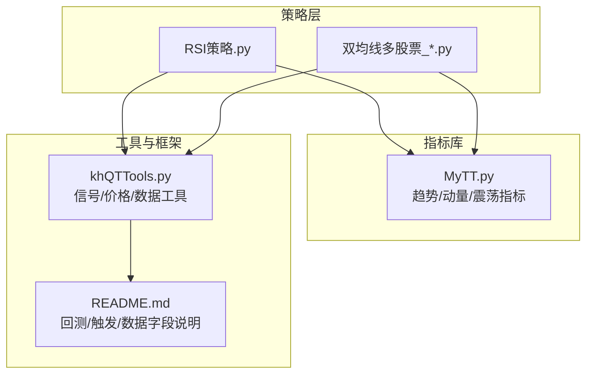
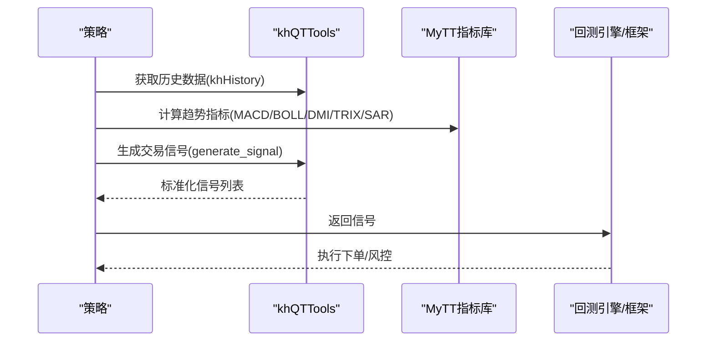
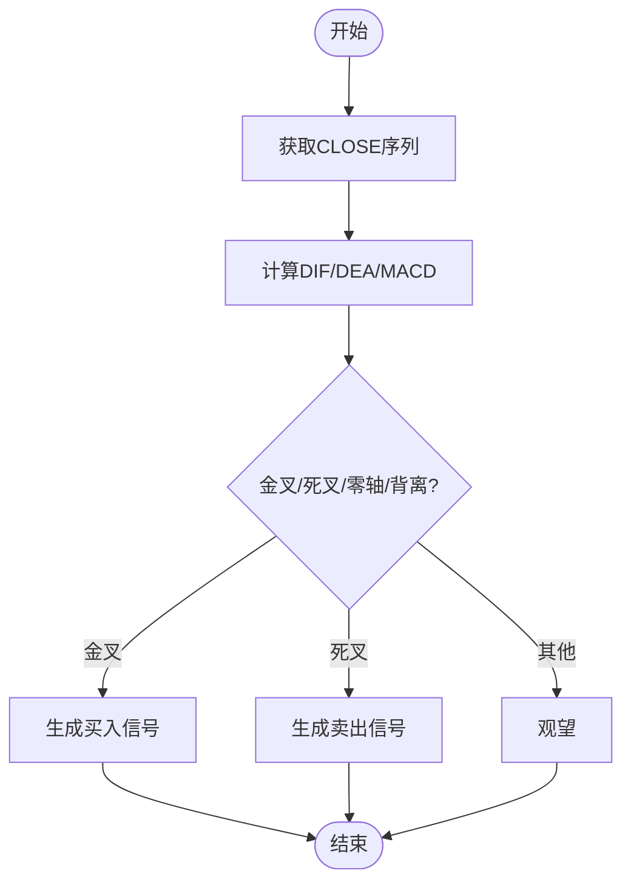
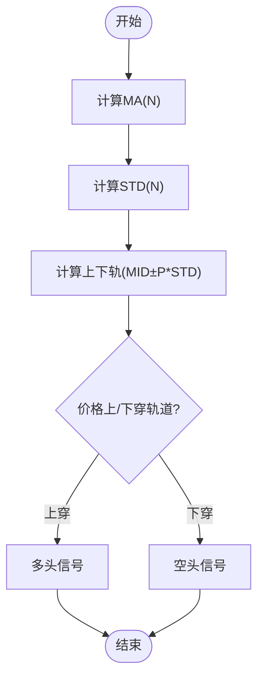
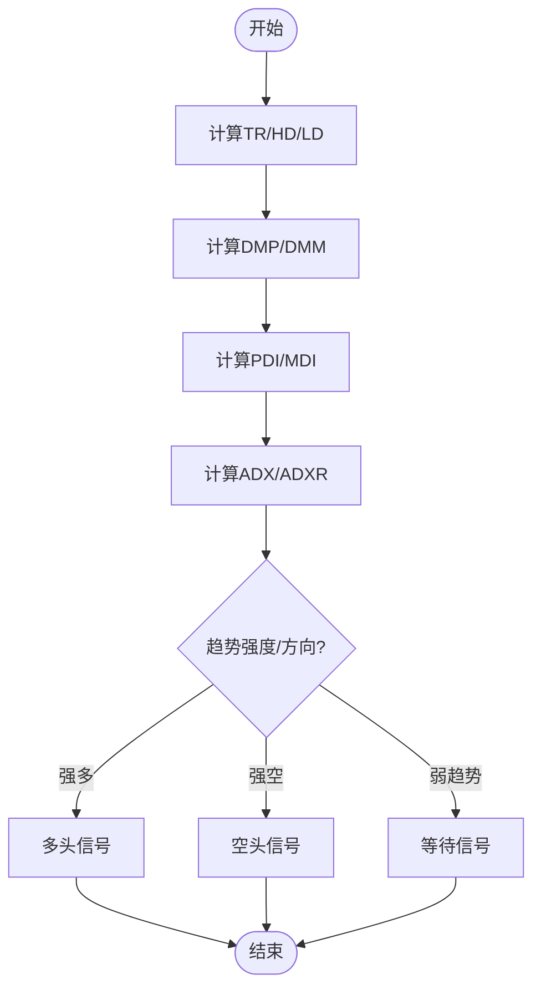
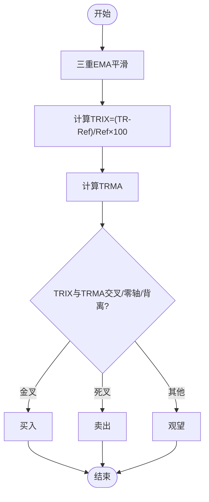
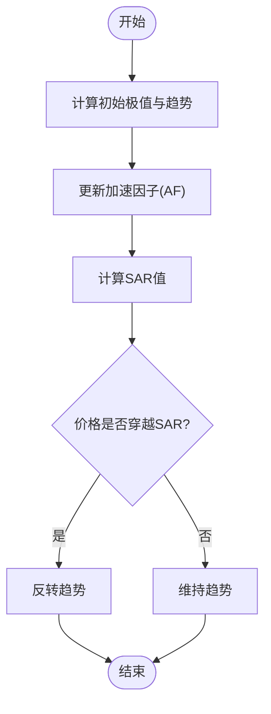
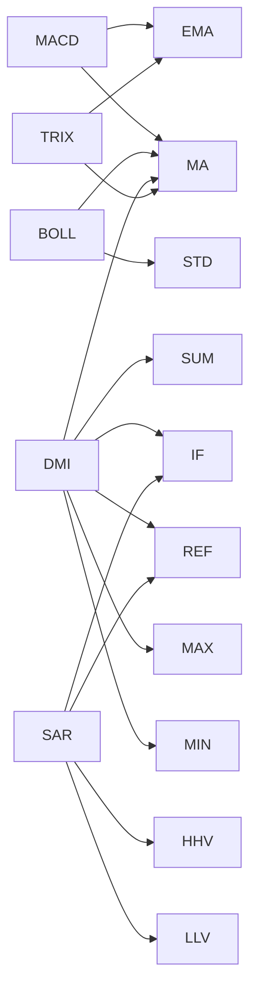

# 趋势类技术指标

<cite>
**本文引用的文件**
- [MyTT.py](file://MyTT.py)
- [khQTTools.py](file://khQTTools.py)
- [README.md](file://README.md)
- [RSI策略.py](file://strategies/RSI策略.py)
- [双均线多股票_使用MA函数.py](file://strategies/双均线多股票_使用MA函数.py)
- [双均线精简_使用khMA函数.py](file://strategies/双均线精简_使用khMA函数.py)
</cite>

## 目录
1. [简介](#简介)
2. [项目结构](#项目结构)
3. [核心组件](#核心组件)
4. [架构总览](#架构总览)
5. [详细组件分析](#详细组件分析)
6. [依赖分析](#依赖分析)
7. [性能考虑](#性能考虑)
8. [故障排查指南](#故障排查指南)
9. [结论](#结论)
10. [附录](#附录)

## 简介
本文件聚焦于趋势类技术指标，系统性梳理 MyTT.py 中用于识别与跟踪市场趋势的指标函数，重点覆盖：
- MACD（异同移动平均线）
- BOLL（布林带）
- DMI（动向指标）
- TRIX（三重指数平滑平均线）
- SAR（抛物转向指标）

文档将从数学原理、输入参数、返回值、典型应用场景、信号确认策略以及与 khQTTools.py 工具函数的集成使用等方面进行深入说明，并提供基于真实数据的计算示例与流程图，帮助读者在量化策略中正确、稳健地运用这些指标。

## 项目结构
- MyTT.py：提供指标计算函数与通用序列运算工具，是策略层调用的核心指标库。
- khQTTools.py：提供与交易执行、信号生成、数据获取、价格精度等相关的工具函数，是策略与框架交互的桥梁。
- README.md：系统使用说明与策略编写指南，包含触发方式、数据字段、交易成本、滑点等关键配置说明。
- 策略示例：RSI策略.py、双均线多股票_*.py 等，展示如何在策略中调用 MyTT 指标与 khQTTools 工具。

图表来源
- [MyTT.py](file://MyTT.py#L190-L310)
- [khQTTools.py](file://khQTTools.py#L1-L200)
- [README.md](file://README.md#L1180-L1260)

章节来源
- [MyTT.py](file://MyTT.py#L190-L310)
- [khQTTools.py](file://khQTTools.py#L1-L200)
- [README.md](file://README.md#L1180-L1260)

## 核心组件
- 指标函数族（趋势/动向/震荡）
  - MACD：快慢线与柱状图，用于趋势强度与背离识别。
  - BOLL：中轨、上下轨，用于通道突破与超买超卖辅助。
  - DMI：+DI/-DI/ADX/ADXR，用于趋势强度与方向确认。
  - TRIX：三重平滑序列与均线，用于趋势加速/减速与背离。
  - SAR：抛物转向点，用于趋势跟踪与反转捕捉。
- 通用序列工具
  - MA/EMA/SMA/WMA/DMA/STD/AVEDEV/SLOPE/FORCAST 等，为指标提供基础运算。
  - REF/DIFF/COUNT/EVERY/EXIST/CROSS/LONGCROSS 等，为信号生成提供条件判断与过滤。

章节来源
- [MyTT.py](file://MyTT.py#L87-L119)
- [MyTT.py](file://MyTT.py#L190-L310)
- [MyTT.py](file://MyTT.py#L264-L301)

## 架构总览
趋势指标在策略中的典型调用链路如下：
- 策略通过 khHistory 或直接传入字段序列获取 OHLCV 数据；
- 调用 MyTT 指标函数计算指标序列；
- 使用 khQTTools.generate_signal 等工具生成标准化交易信号；
- 框架根据信号执行下单与风控。

图表来源
- [RSI策略.py](file://strategies/RSI策略.py#L12-L26)
- [双均线多股票_使用MA函数.py](file://strategies/双均线多股票_使用MA函数.py#L14-L36)
- [双均线精简_使用khMA函数.py](file://strategies/双均线精简_使用khMA函数.py#L12-L31)
- [khQTTools.py](file://khQTTools.py#L543-L740)
- [MyTT.py](file://MyTT.py#L190-L310)

## 详细组件分析

### MACD（异同移动平均线）
- 数学原理
  - 快线：SHORT周期指数平滑（EMA）
  - 慢线：LONG周期指数平滑（EMA）
  - DIF = 快线 - 慢线
  - DEA = DIF 的 M 周期指数平滑（EMA）
  - MACD 柱 = (DIF - DEA) × 2
- 输入参数
  - CLOSE：收盘价序列
  - SHORT：快线周期（默认12）
  - LONG：慢线周期（默认26）
  - M：DEA 周期（默认9）
- 返回值
  - DIF、DEA、MACD（均为等长序列）
- 典型应用场景
  - 金叉死叉：DIF 上穿/下穿 DEA
  - 柱状图零轴上下：多/空趋势强度
  - 背离：价格与 MACD 走势相反
- 信号确认策略
  - 结合 DIF/DEA 斜率（SLOPE）判断趋势加速
  - 结合成交量（VOL）确认突破力度
  - 过滤噪音：LONGCROSS（持续 N 周期后交叉）
- 与 khQTTools 集成
  - 使用 generate_signal 生成 buy/sell 信号，结合 khPrice 获取开盘价作为委托价
  - 使用 khHas/khGet 判断持仓与日期，避免重复信号

图表来源
- [MyTT.py](file://MyTT.py#L194-L200)
- [RSI策略.py](file://strategies/RSI策略.py#L12-L26)

章节来源
- [MyTT.py](file://MyTT.py#L194-L200)
- [RSI策略.py](file://strategies/RSI策略.py#L12-L26)

### BOLL（布林带）
- 数学原理
  - MID = N 日简单移动平均（MA）
  - 上轨 = MID + P × N 日标准差（STD）
  - 下轨 = MID - P × N 日标准差（STD）
- 输入参数
  - CLOSE：收盘价序列
  - N：周期（默认20）
  - P：标准差倍数（默认2）
- 返回值
  - UPPER、MID、LOWER（均为等长序列）
- 典型应用场景
  - 带宽（BBANDS）：衡量波动率
  - 突破交易：价格上穿/下穿上/下轨
  - 回踩确认：价格回踩中轨附近
- 信号确认策略
  - 结合成交量（VOL）与价格动能（RSI/MTM）确认突破有效性
  - 使用 CROSS/LONGCROSS 等过滤器避免假突破
  - 结合 SAR 或 DMI 判断趋势方向

图表来源
- [MyTT.py](file://MyTT.py#L232-L238)
- [双均线多股票_使用MA函数.py](file://strategies/双均线多股票_使用MA函数.py#L14-L36)

章节来源
- [MyTT.py](file://MyTT.py#L232-L238)
- [双均线多股票_使用MA函数.py](file://strategies/双均线多股票_使用MA函数.py#L14-L36)

### DMI（动向指标）
- 数学原理
  - TR = Sum(Max(High - Low, Abs(High - Ref(Close,1)), Abs(Low - Ref(Close,1))), M1)
  - HD = High - Ref(High,1)
  - LD = Ref(Low,1) - Low
  - DMP = Sum(If(HD>0 & HD>LD, HD, 0), M1)
  - DMM = Sum(If(LD>0 & LD>HD, LD, 0), M1)
  - PDI = DMP × 100 / TR
  - MDI = DMM × 100 / TR
  - ADX = MA(Abs(MDI - PDI)/(PDI + MDI) × 100, M2)
  - ADXR = (ADX + Ref(ADX, M2))/2
- 输入参数
  - CLOSE/HIGH/LOW：价格序列
  - M1：平滑周期（默认14）
  - M2：ADX 平滑周期（默认6）
- 返回值
  - PDI、MDI、ADX、ADXR（均为等长序列）
- 典型应用场景
  - 趋势强度：ADX 值越高，趋势越强
  - 趋势方向：PDI > MDI 为多头趋势，反之为空头
  - 趋势转换：PDI 与 MDI 交叉
- 信号确认策略
  - ADX 超过阈值（如 20/25）才考虑入场
  - 结合 MA/EMA 判断方向
  - 使用 CROSS/LONGCROSS 等过滤器确认交叉

图表来源
- [MyTT.py](file://MyTT.py#L264-L276)

章节来源
- [MyTT.py](file://MyTT.py#L264-L276)

### TRIX（三重指数平滑平均线）
- 数学原理
  - TR = EMA(EMA(EMA(CLOSE, M1), M1), M1)
  - TRIX = (TR - Ref(TR, 1)) / Ref(TR, 1) × 100
  - TRMA = MA(TRIX, M2)
- 输入参数
  - CLOSE：收盘价序列
  - M1：三重平滑周期（默认12）
  - M2：TRIX 均线周期（默认20）
- 返回值
  - TRIX、TRMA（均为等长序列）
- 典型应用场景
  - 趋势加速/减速：TRIX 斜率变化
  - 背离：价格与 TRIX 走势相反
  - 交叉信号：TRIX 与 TRMA 交叉
- 信号确认策略
  - 结合 DMI/ADX 判断趋势强度
  - 使用 CROSS/LONGCROSS 等过滤器确认交叉

图表来源
- [MyTT.py](file://MyTT.py#L295-L301)

章节来源
- [MyTT.py](file://MyTT.py#L295-L301)

### SAR（抛物转向指标）
- 数学原理
  - 以 N 日最高/最低为初始极值，按步长（S）与上限（M）递增加速因子（AF），计算抛物 SAR 值
  - 价格跌破/突破 SAR 时反转趋势
  - 通达信版本（TDX_SAR）包含极值修正与反转修正逻辑，更贴近实际显示
- 输入参数
  - HIGH/LOW：最高/最低价序列
  - N：初始计算周期（默认10）
  - S：步长百分比（默认2）
  - M：步长上限百分比（默认20）
- 返回值
  - SAR 序列（等长于 HIGH/LOW）
- 典型应用场景
  - 趋势跟踪：SAR 之上为多头，之下为空头
  - 反转捕捉：价格穿越 SAR
- 信号确认策略
  - 结合 DMI/ADX 判断趋势强度
  - 使用 CROSS/LONGCROSS 等过滤器确认反转

图表来源
- [MyTT.py](file://MyTT.py#L525-L562)
- [MyTT.py](file://MyTT.py#L564-L624)

章节来源
- [MyTT.py](file://MyTT.py#L525-L562)
- [MyTT.py](file://MyTT.py#L564-L624)

## 依赖分析
- 指标依赖关系
  - MACD 依赖 EMA/STD/MA 等基础函数
  - BOLL 依赖 MA/STD
  - DMI 依赖 SUM/IF/REF/MAX/MIN/MA
  - TRIX 依赖 EMA/MA/REF
  - SAR 依赖 REF/HHV/LLV/IF/ELSE（通用序列工具）
- 策略与工具集成
  - khHistory：策略侧获取历史 OHLCV 数据
  - generate_signal：生成标准化交易信号
  - khMA：封装行情获取与均线计算
  - khPrice/khHas：获取当前价格与判断持仓

图表来源
- [MyTT.py](file://MyTT.py#L87-L119)
- [MyTT.py](file://MyTT.py#L190-L310)

章节来源
- [MyTT.py](file://MyTT.py#L87-L119)
- [MyTT.py](file://MyTT.py#L190-L310)

## 性能考虑
- 指标计算复杂度
  - EMA/MA/STD/AVEDEV 等滚动窗口计算，时间复杂度 O(N×窗口)，空间复杂度 O(N)
  - SUM/HHV/LLV 等滚动聚合，注意窗口大小对性能影响
- 策略触发与数据字段
  - README 指出回测支持 1 分钟/5 分钟 K 线触发，Tick 触发数据量大，回测耗时高
  - 仅勾选策略实际使用的字段，减少内存与 IO 压力
- 交易成本与滑点
  - README 提供滑点与交易成本设置说明，合理设置可降低回测偏差

章节来源
- [README.md](file://README.md#L800-L820)
- [README.md](file://README.md#L860-L876)

## 故障排查指南
- 数据字段缺失
  - 确认在回测配置中勾选了所需字段（如 close/high/low/open/volume）
- 指标返回 NaN
  - 检查输入序列长度是否满足最小周期（如 N 日滚动窗口）
  - 检查是否存在空值或异常值
- 信号重复或遗漏
  - 使用 FILTER/LONGCROSS/CROSS 等过滤器避免重复信号
  - 使用 BARSLAST/BARSLASTCOUNT 等辅助判断周期
- 价格精度与下单
  - 使用 khQTTools 的价格精度函数与 generate_signal 生成符合框架要求的信号

章节来源
- [khQTTools.py](file://khQTTools.py#L238-L286)
- [khQTTools.py](file://khQTTools.py#L543-L740)
- [MyTT.py](file://MyTT.py#L140-L191)

## 结论
- MACD/BOLL/DMI/TRIX/SAR 构成趋势跟踪的五大支柱，各有侧重：MACD 强趋势强度、BOLL 强通道突破、DMI 强趋势强度与方向、TRIX 强趋势加速/背离、SAR 强趋势跟踪与反转。
- 在策略中应结合多个指标进行信号确认，避免单一指标误判。
- 与 khQTTools 的集成可显著提升策略开发效率与一致性，建议统一使用 generate_signal、khHistory、khMA 等工具函数。

## 附录
- 策略示例参考
  - RSI 策略：展示如何在策略中调用 RSI 指标并生成信号
  - 双均线策略：展示如何在策略中调用 MA 指标并生成信号
  - khMA 策略：展示如何使用 khQTTools 的 khMA 封装函数

章节来源
- [RSI策略.py](file://strategies/RSI策略.py#L12-L26)
- [双均线多股票_使用MA函数.py](file://strategies/双均线多股票_使用MA函数.py#L14-L36)
- [双均线精简_使用khMA函数.py](file://strategies/双均线精简_使用khMA函数.py#L12-L31)