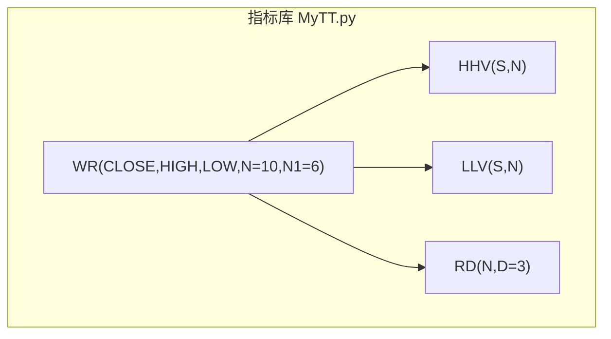
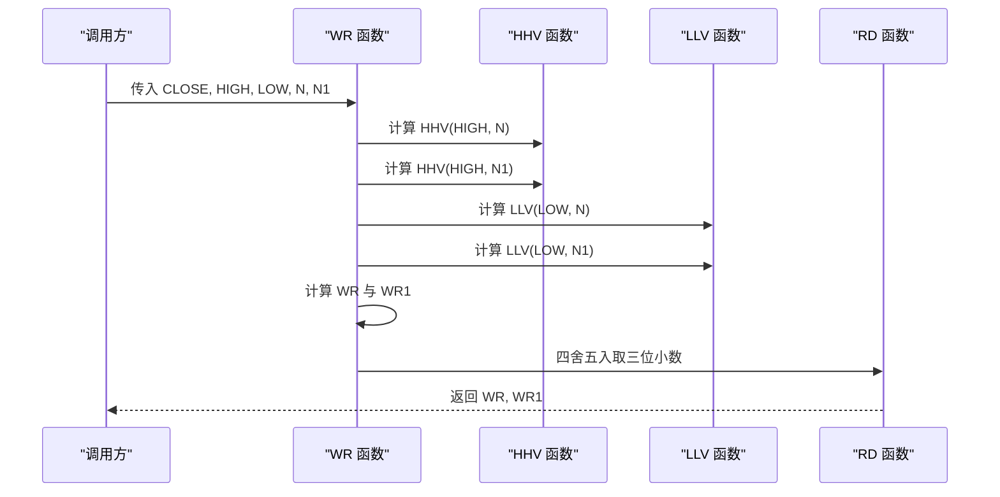
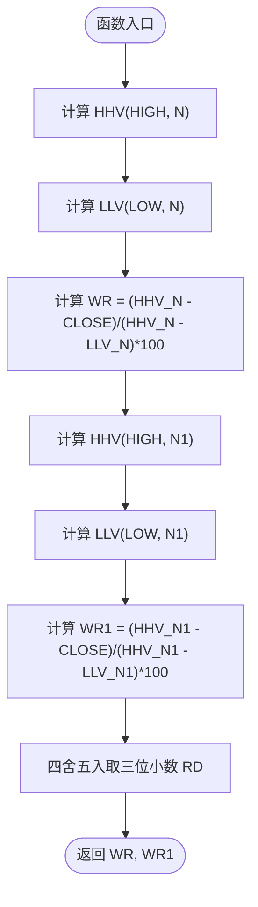
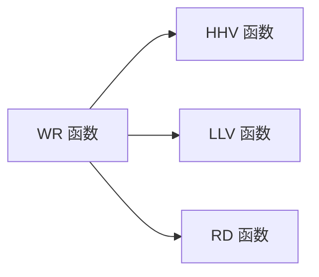

# 威廉指标 (WR)

<cite>
**本文引用的文件**
- [MyTT.py](file://MyTT.py)
- [README.md](file://README.md)
</cite>

## 目录
1. [简介](#简介)
2. [项目结构](#项目结构)
3. [核心组件](#核心组件)
4. [架构总览](#架构总览)
5. [详细组件分析](#详细组件分析)
6. [依赖分析](#依赖分析)
7. [性能考虑](#性能考虑)
8. [故障排查指南](#故障排查指南)
9. [结论](#结论)
10. [附录](#附录)

## 简介
本文件系统性阐述 khQuant 指标库中的威廉指标 WR 的市场情绪测度机制与实战应用。WR 通过计算当前收盘价在 N 日价格区间中的相对位置，衡量市场超买超卖状态，取值范围为 0–100。数值越大，表示越接近区间最低，越偏“超卖”；反之，越接近区间最高，越偏“超买”。WR 与 KD 指标存在反向逻辑：WR 值越低越“超买”，WR 值越高越“超卖”。

WR 函数采用双参数 N 与 N1，分别计算长短周期的 WR 值，形成“长短周期共振”的判据。在实战中，通常以 WR 的短周期（N1）作为“灵敏度”指标，长周期（N）作为“趋势确认”。结合趋势方向，可制定如下策略：
- 趋势向上：WR 短周期进入 20 以下区域视为“超买”信号，可考虑逢低吸纳；WR 短周期从 20 以上回落至 20 附近，可视为短期回调吸筹信号。
- 趋势向下：WR 短周期进入 80 以上区域视为“超卖”信号，可考虑逢高减仓或离场；WR 短周期从 80 以下反弹至 80 附近，可视为短期冲高派发信号。
- 趋势震荡：WR 短周期在 20–80 区间反复横盘，结合成交量与趋势线等其他信号，可采取高抛低吸或区间交易策略。

本文件还提供 WR 的计算公式、取值含义、与 KD 的反向逻辑、双参数短长周期配合方式，以及逃顶与抄底的实战技巧。

## 项目结构
khQuant 的技术指标集中于 MyTT.py，WR 指标位于“2级：技术指标函数”区域，其依赖一系列基础函数（如 HHV、LLV、EMA、MA 等）实现滚动窗口内的最高/最低价查找与数值处理。

**图表来源**
- [MyTT.py](file://MyTT.py#L217-L221)

**章节来源**
- [MyTT.py](file://MyTT.py#L1-L120)
- [MyTT.py](file://MyTT.py#L217-L221)

## 核心组件
- WR 函数：接收收盘价、最高价、最低价序列，以及两个周期参数 N（长周期）与 N1（短周期），返回两个 WR 值序列（长周期 WR 与短周期 WR）。
- 计算逻辑：
  - 长周期 WR = (N 日最高价 − 当前收盘价) / (N 日最高价 − N 日最低价) × 100
  - 短周期 WR1 = (N1 日最高价 − 当前收盘价) / (N1 日最高价 − N1 日最低价) × 100
  - 结果经四舍五入取三位小数（RD）。
- 取值范围与含义：
  - WR ∈ [0, 100]，数值越大，越接近最低价，越偏“超卖”；越小，越接近最高价，越偏“超买”。
- 与 KD 的反向逻辑：
  - KD 通过 RSV 衡量相对位置，WR 直接以最高价与最低价区间衡量相对位置，二者方向相反：WR 值越低越“超买”，WR 值越高越“超卖”。

**章节来源**
- [MyTT.py](file://MyTT.py#L217-L221)

## 架构总览
WR 的实现依赖于滚动窗口函数 HHV 与 LLV，分别计算 N 日最高价与最低价序列，再进行归一化与缩放，最终输出 WR 与 WR1。RD 用于数值精度控制。

**图表来源**
- [MyTT.py](file://MyTT.py#L217-L221)
- [MyTT.py](file://MyTT.py#L426-L458)

## 详细组件分析

### WR 函数实现与数据流
- 输入：CLOSE、HIGH、LOW（日线字段映射见 MyTT.py 头部注释）
- 计算步骤：
  1) 计算 N 日最高价序列 HHV(HIGH, N) 与 N 日最低价序列 LLV(LOW, N)；
  2) 计算长周期 WR = (HHV − CLOSE) / (HHV − LLV) × 100；
  3) 计算 N1 日最高价序列 HHV(HIGH, N1) 与 N1 日最低价序列 LLV(LOW, N1)；
  4) 计算短周期 WR1 = (HHV − CLOSE) / (HHV − LLV) × 100；
  5) 使用 RD 对结果进行四舍五入取三位小数；
  6) 返回 WR, WR1。
- 复杂度：对每个位置进行一次滚动窗口计算，时间复杂度 O(N + N1)，空间复杂度 O(N + N1)。

**图表来源**
- [MyTT.py](file://MyTT.py#L217-L221)

**章节来源**
- [MyTT.py](file://MyTT.py#L217-L221)

### 取值范围与市场情绪含义
- WR ∈ [0, 100]：
  - WR 越大，表示当前收盘价越接近 N 日最低价，越偏“超卖”；
  - WR 越小，表示当前收盘价越接近 N 日最高价，越偏“超买”。
- 与 KD 的反向逻辑：
  - KD 通过 RSV 衡量相对位置，WR 直接以最高价与最低价区间衡量相对位置，二者方向相反：WR 值越低越“超买”，WR 值越高越“超卖”。

**章节来源**
- [MyTT.py](file://MyTT.py#L217-L221)
- [MyTT.py](file://MyTT.py#L202-L209)

### 双参数 N 与 N1 的短长周期配合
- N（长周期）：用于趋势确认与区间确认，波动更平滑，减少噪音；
- N1（短周期）：用于捕捉短期动能与超买超卖的快速变化；
- 实战配合方式：
  - 短周期 WR1 作为“灵敏度”指标，长周期 WR 作为“趋势确认”指标；
  - 当 WR1 从高位回落并穿越 WR 的上轨（如 WR1 从 80 以上回落至 WR 的上沿附近）时，可视为短期回调吸筹信号；
  - 当 WR1 从低位反弹并穿越 WR 的下轨（如 WR1 从 20 以下反弹至 WR 的下沿附近）时，可视为短期冲高派发信号。

**章节来源**
- [MyTT.py](file://MyTT.py#L217-L221)

### 趋势方向下的逃顶与抄底实战技巧
- 趋势向上：
  - WR 短周期 WR1 进入 20 以下区域视为“超买”信号，可考虑逢低吸纳；
  - WR1 从 20 以上回落至 20 附近，可视为短期回调吸筹信号；
- 趋势向下：
  - WR 短周期 WR1 进入 80 以上区域视为“超卖”信号，可考虑逢高减仓或离场；
  - WR1 从 80 以下反弹至 80 附近，可视为短期冲高派发信号；
- 趋势震荡：
  - WR1 在 20–80 区间反复横盘，结合成交量与趋势线等其他信号，可采取高抛低吸或区间交易策略。

**章节来源**
- [MyTT.py](file://MyTT.py#L217-L221)

## 依赖分析
WR 的实现依赖于以下基础函数：
- HHV：计算 N 日最高价滚动窗口；
- LLV：计算 N 日最低价滚动窗口；
- RD：对结果进行四舍五入取三位小数；
- REF：用于历史值获取（WR 未直接使用，但其他指标广泛使用）。

**图表来源**
- [MyTT.py](file://MyTT.py#L217-L221)
- [MyTT.py](file://MyTT.py#L426-L458)

**章节来源**
- [MyTT.py](file://MyTT.py#L1-L120)
- [MyTT.py](file://MyTT.py#L217-L221)
- [MyTT.py](file://MyTT.py#L426-L458)

## 性能考虑
- 时间复杂度：WR 对每个位置进行一次滚动窗口计算，时间复杂度 O(N + N1)，空间复杂度 O(N + N1)；
- 数据规模：在长周期 N 与 N1 较大时，滚动窗口计算成本上升，建议根据回测与实盘需求合理选择参数；
- 数值精度：WR 结果经 RD 四舍五入取三位小数，避免浮点误差对信号判断造成干扰；
- 与 KD 的互补：WR 与 KD 存在反向逻辑，可结合两者进行交叉验证，降低单一指标的误判概率。

[本节为一般性建议，不直接分析具体文件，故无“章节来源”标注]

## 故障排查指南
- WR 结果异常为 NaN 或 0：
  - 检查输入序列是否存在缺失值或异常值；
  - 确认 N 与 N1 参数是否合理（过大可能导致窗口内无有效数据）；
- WR 与 KD 判据冲突：
  - WR 与 KD 方向相反，需结合趋势与成交量等其他信号综合判断；
- 信号过于频繁：
  - 调整 N 与 N1 参数，增大长周期 WR 的平滑性，减少噪音；
- 与趋势方向不符：
  - 引入趋势线或移动平均线确认趋势方向，避免在震荡市中盲目追涨杀跌。

[本节为一般性建议，不直接分析具体文件，故无“章节来源”标注]

## 结论
WR 指标通过计算当前收盘价在 N 日价格区间中的相对位置，提供市场超买超卖的直观测度。其与 KD 指标存在反向逻辑，WR 值越低越“超买”，WR 值越高越“超卖”。通过双参数 N 与 N1 的短长周期配合，WR 可在趋势确认与短期动能之间取得平衡。结合趋势方向与成交量等信号，WR 可用于逃顶与抄底的实战策略中，提高交易决策的准确性与胜率。

[本节为总结性内容，不直接分析具体文件，故无“章节来源”标注]

## 附录
- 日线字段映射（CLOSE、HIGH、LOW、OPEN、VOL 等）见 MyTT.py 头部注释，WR 函数输入字段与之对应。
- WR 的计算公式与取值含义、与 KD 的反向逻辑、双参数短长周期配合方式、逃顶与抄底实战技巧详见本文件“详细组件分析”与“实战应用”。

**章节来源**
- [MyTT.py](file://MyTT.py#L1-L20)
- [MyTT.py](file://MyTT.py#L217-L221)