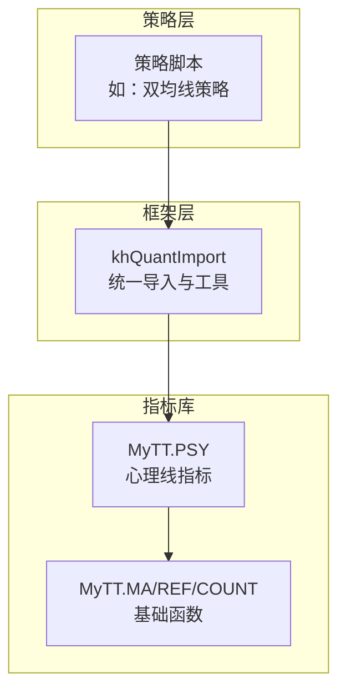
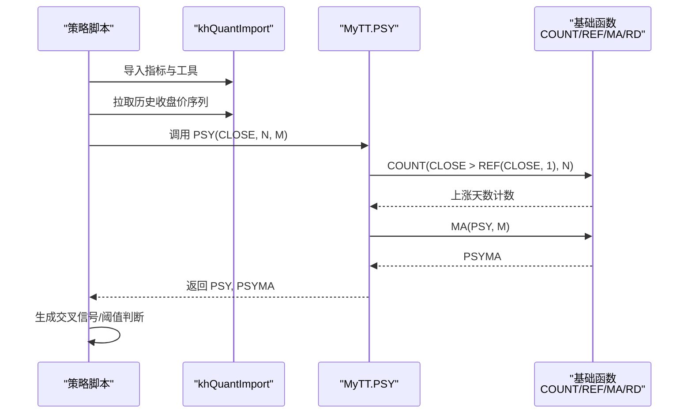
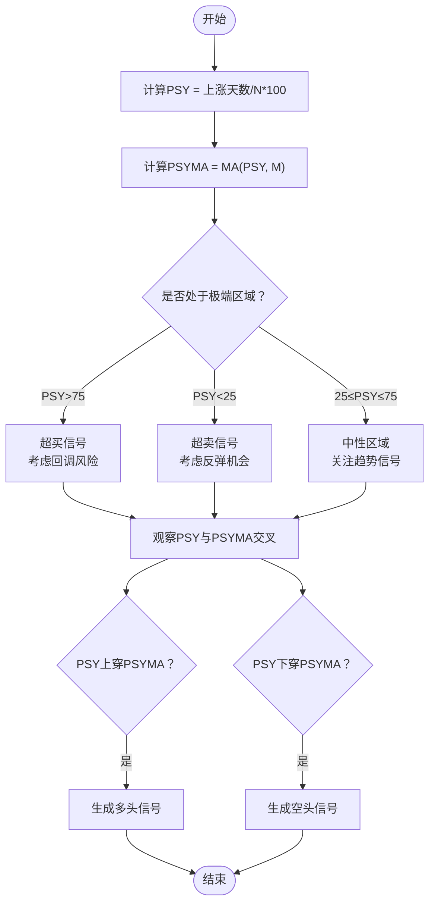
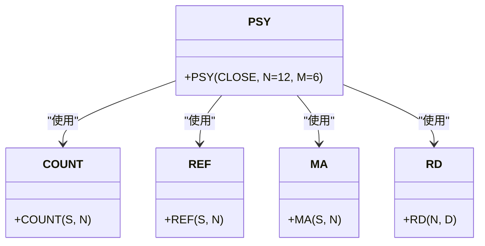
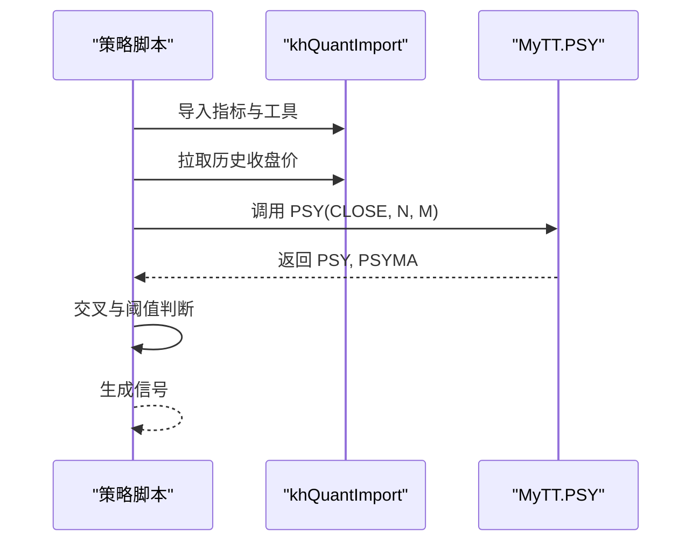

# 心理线 (PSY)

<cite>
**本文引用的文件**
- [MyTT.py](file://MyTT.py)
- [khQuantImport.py](file://khQuantImport.py)
- [README.md](file://README.md)
- [strategies/双均线多股票_使用MA函数.py](file://strategies/双均线多股票_使用MA函数.py)
</cite>

## 目录
1. [简介](#简介)
2. [项目结构](#项目结构)
3. [核心组件](#核心组件)
4. [架构总览](#架构总览)
5. [详细组件分析](#详细组件分析)
6. [依赖分析](#依赖分析)
7. [性能考量](#性能考量)
8. [故障排查指南](#故障排查指南)
9. [结论](#结论)
10. [附录](#附录)

## 简介
本文件围绕心理线指标（PSY）展开，系统性阐述其在本项目中的实现与使用方式，重点解释：
- PSY(CLOSE, N=12, M=6) 的计算原理：统计N日内上涨天数占比，衡量市场多空情绪；
- 取值范围与阈值含义：0–100，50为多空分水岭，25/75为极端情绪阈值；
- PSY与PSYMA（M日均值）交叉信号的生成逻辑；
- 结合成交量变化对情绪指标有效性进行分析；
- 指导用户在情绪极端区域结合其他指标进行逆向操作。

## 项目结构
本项目采用“指标库 + 策略层”的分层设计：
- 指标库：MyTT.py 提供统一的技术指标函数，PSY 位于其中；
- 策略层：策略脚本通过 khQuantImport 导入指标函数，调用 PSY 计算并生成交易信号；
- README 提供系统背景、安装与回测流程说明，便于理解指标在回测中的使用场景。

**图表来源**
- [MyTT.py](file://MyTT.py#L240-L245)
- [khQuantImport.py](file://khQuantImport.py#L44-L46)

**章节来源**
- [README.md](file://README.md#L160-L176)
- [MyTT.py](file://MyTT.py#L240-L245)
- [khQuantImport.py](file://khQuantImport.py#L44-L46)

## 核心组件
- 心理线指标函数：PSY(CLOSE, N=12, M=6)
  - 计算：PSY = N日内上涨天数占比 × 100；PSYMA = MA(PSY, M)
  - 返回：PSY 与 PSYMA 的四舍五入结果
- 基础函数依赖：
  - COUNT：统计条件成立的天数（N日内上涨天数）
  - REF：获取前一日收盘价（用于比较涨跌）
  - MA：对PSY序列求M日简单移动平均
  - RD：对结果进行四舍五入（保留小数位）

上述组件共同构成PSY指标的完整实现，满足情绪类指标的统计口径与平滑需求。

**章节来源**
- [MyTT.py](file://MyTT.py#L240-L245)
- [MyTT.py](file://MyTT.py#L130-L146)
- [MyTT.py](file://MyTT.py#L51-L57)
- [MyTT.py](file://MyTT.py#L87-L93)

## 架构总览
PSY在策略中的典型调用流程如下：

**图表来源**
- [MyTT.py](file://MyTT.py#L240-L245)
- [MyTT.py](file://MyTT.py#L130-L146)
- [MyTT.py](file://MyTT.py#L51-L57)
- [MyTT.py](file://MyTT.py#L87-L93)
- [khQuantImport.py](file://khQuantImport.py#L44-L46)

## 详细组件分析

### 心理线指标（PSY）实现与原理
- 计算口径
  - PSY 衡量“上涨天数占比”，即在N个交易日中，收盘价较前一日上涨的天数占总数的比例，乘以100得到百分比。
  - PSYMA 是对PSY序列进行M日简单移动平均，用于平滑短期波动，识别趋势方向。
- 取值范围与阈值
  - 取值范围：0–100；
  - 分水岭：50；
  - 极端阈值：25（超卖）、75（超买）。
- 情绪判断标准
  - PSY 持续高于75：市场过热（超买），可能出现回调；
  - PSY 持续低于25：市场恐慌（超卖），可能出现反弹。
- 交叉信号逻辑
  - PSY 向上穿越 PSYMA：多头信号；
  - PSY 向下穿越 PSYMA：空头信号。
- 与成交量结合的分析
  - 在PSY处于极端区域时，若成交量同步放大，通常强化趋势强度；
  - 若PSY进入极端区域但成交量萎缩，可能预示趋势动能减弱，需警惕反转。

**图表来源**
- [MyTT.py](file://MyTT.py#L240-L245)

**章节来源**
- [MyTT.py](file://MyTT.py#L240-L245)

### 指标函数依赖关系（类图）
PSY 的实现依赖若干基础函数，形成清晰的依赖链路。

**图表来源**
- [MyTT.py](file://MyTT.py#L240-L245)
- [MyTT.py](file://MyTT.py#L130-L146)
- [MyTT.py](file://MyTT.py#L51-L57)
- [MyTT.py](file://MyTT.py#L87-L93)

**章节来源**
- [MyTT.py](file://MyTT.py#L240-L245)
- [MyTT.py](file://MyTT.py#L130-L146)
- [MyTT.py](file://MyTT.py#L51-L57)
- [MyTT.py](file://MyTT.py#L87-L93)

### 在策略中的调用示例与流程
- 策略脚本通过 khQuantImport 导入指标函数；
- 使用 khHistory 拉取历史收盘价序列；
- 调用 PSY 计算 PSY 与 PSYMA；
- 基于交叉与阈值生成交易信号。

**图表来源**
- [khQuantImport.py](file://khQuantImport.py#L44-L46)
- [MyTT.py](file://MyTT.py#L240-L245)

**章节来源**
- [khQuantImport.py](file://khQuantImport.py#L44-L46)
- [strategies/双均线多股票_使用MA函数.py](file://strategies/双均线多股票_使用MA函数.py#L14-L36)

## 依赖分析
- 指标库与策略层的耦合
  - khQuantImport 将 MyTT 暴露为统一导入入口，策略脚本无需关心具体实现细节；
  - PSY 依赖 COUNT/REF/MA/RD 等基础函数，这些函数在 MyTT.py 中实现，彼此独立、职责清晰。
- 外部依赖
  - 本项目未直接引入第三方绘图或回测引擎，PSY 的计算纯属数值运算，不依赖外部库；
  - 回测与图形化展示由框架层提供，PSY 可作为策略信号输入参与回测。

**图表来源**
- [khQuantImport.py](file://khQuantImport.py#L44-L46)
- [MyTT.py](file://MyTT.py#L240-L245)
- [MyTT.py](file://MyTT.py#L130-L146)
- [MyTT.py](file://MyTT.py#L51-L57)
- [MyTT.py](file://MyTT.py#L87-L93)

**章节来源**
- [khQuantImport.py](file://khQuantImport.py#L44-L46)
- [MyTT.py](file://MyTT.py#L240-L245)
- [MyTT.py](file://MyTT.py#L130-L146)
- [MyTT.py](file://MyTT.py#L51-L57)
- [MyTT.py](file://MyTT.py#L87-L93)

## 性能考量
- 计算复杂度
  - PSY 的计算包含滚动窗口统计（COUNT）与移动平均（MA），时间复杂度与窗口长度 N 和 M 线性相关；
  - 对于日线回测，N=12、M=6 的参数属于轻量级计算，性能开销可忽略。
- 数据规模
  - 回测中通常对多只股票批量计算指标，建议在策略层按需拉取历史数据，避免重复计算；
  - 使用 khHistory 按需获取 CLOSE 序列，减少不必要的数据传输与计算。
- 平滑与噪声
  - PSYMA 的引入可有效平滑短期波动，降低误判概率；
  - 在高频数据上，建议适当增大 M 或结合其他趋势指标共同判断。

[本节为通用性能建议，不直接分析具体文件]

## 故障排查指南
- 指标返回异常
  - 确认输入 CLOSE 序列长度足够覆盖 N 日；
  - 检查是否存在 NaN 或缺失值，必要时在策略层进行填充或剔除。
- 交叉信号误判
  - 检查 PSY 与 PSYMA 的参数设置（N/M）是否合理；
  - 在震荡市中，交叉信号可能频繁但收益不佳，建议结合趋势类指标（如均线）过滤。
- 与成交量结合分析
  - 在 PSY 极端区域时，若成交量同步放大，趋势可信度提升；
  - 若成交量萎缩，需警惕反转风险，避免追涨杀跌。

[本节为通用排查建议，不直接分析具体文件]

## 结论
- PSY 通过统计上涨天数占比衡量市场情绪，取值0–100，50为中性，25/75为极端阈值；
- PSYMA 作为平滑指标，可识别多空趋势方向；
- 交叉信号（PSY上穿/下穿PSYMA）与阈值（超买/超卖）结合，可在情绪极端区域指导逆向操作；
- 实践中建议结合成交量与趋势指标，提高信号可靠性。

[本节为总结性内容，不直接分析具体文件]

## 附录
- 相关文件与位置
  - PSY 实现：[MyTT.py](file://MyTT.py#L240-L245)
  - 基础函数：COUNT/REF/MA/RD（见 MyTT.py 对应行）
  - 指标导入入口：[khQuantImport.py](file://khQuantImport.py#L44-L46)
  - 策略调用示例：[strategies/双均线多股票_使用MA函数.py](file://strategies/双均线多股票_使用MA函数.py#L14-L36)
  - 系统背景与回测说明：[README.md](file://README.md#L160-L176)

[本节为索引性内容，不直接分析具体文件]