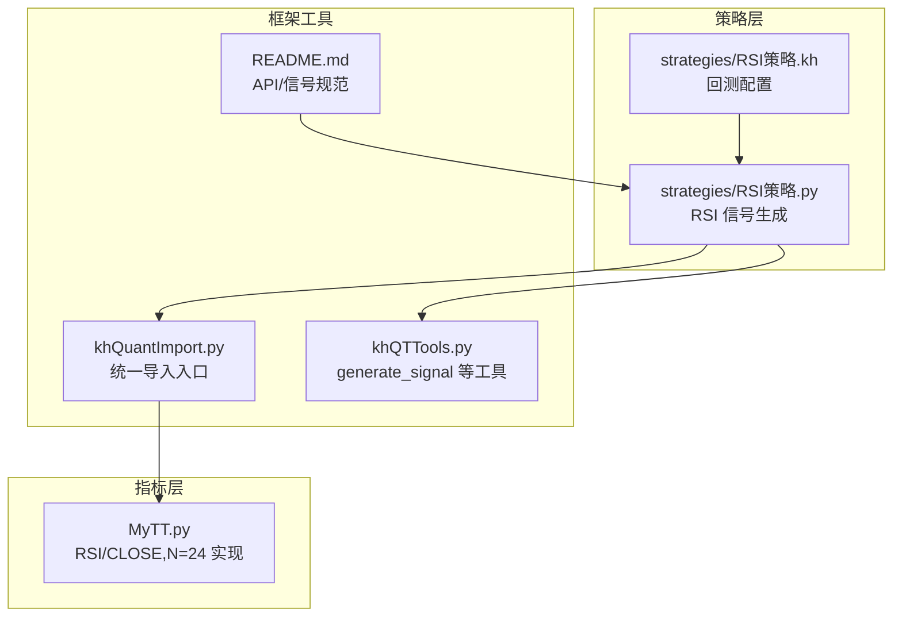
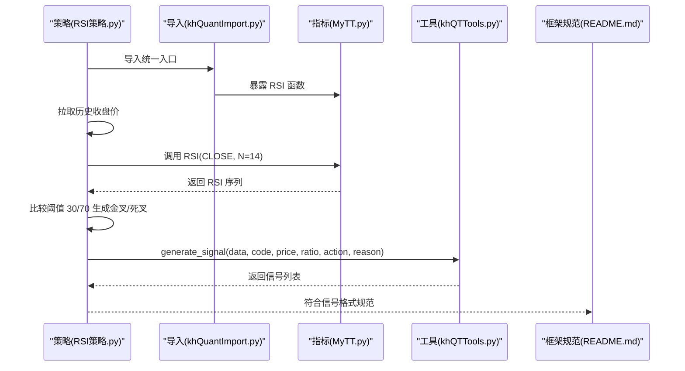
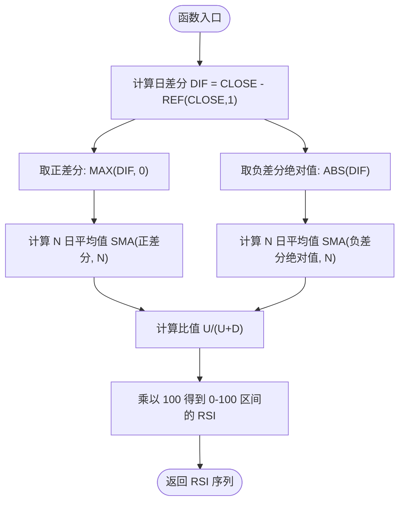
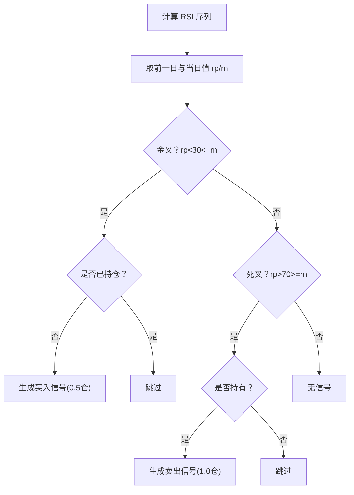
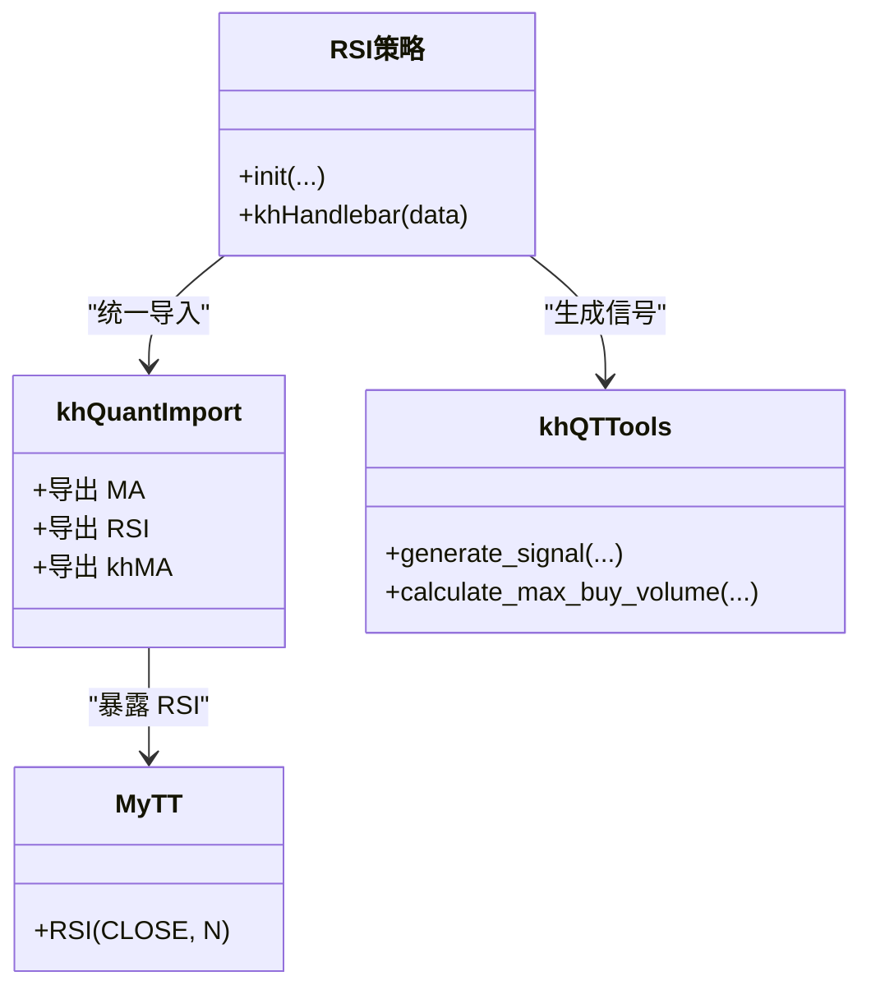
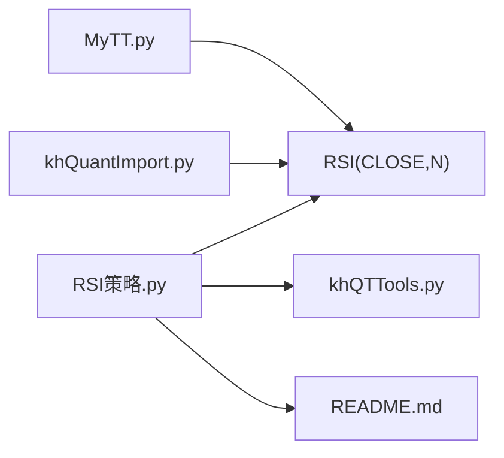

# 相对强弱指数 (RSI)

<cite>
**本文引用的文件**
- [MyTT.py](file://MyTT.py)
- [khQuantImport.py](file://khQuantImport.py)
- [RSI策略.py](file://strategies/RSI策略.py)
- [RSI策略.kh](file://strategies/RSI策略.kh)
- [README.md](file://README.md)
- [khQTTools.py](file://khQTTools.py)
</cite>

## 目录
1. [简介](#简介)
2. [项目结构](#项目结构)
3. [核心组件](#核心组件)
4. [架构总览](#架构总览)
5. [详细组件分析](#详细组件分析)
6. [依赖关系分析](#依赖关系分析)
7. [性能考量](#性能考量)
8. [故障排查指南](#故障排查指南)
9. [结论](#结论)
10. [附录](#附录)

## 简介
本文件围绕仓库中的 RSI 指标实现与应用展开，系统阐述 RSI(CLOSE, N=24) 的数学原理、参数 N 的敏感度影响、典型阈值（30/70）的实战用法、金叉死叉信号生成逻辑，以及如何结合价格趋势过滤假信号。同时给出背离现象在顶底判断中的实战价值，并对比其在震荡市与趋势市中的表现差异，帮助读者在本项目框架下高效、稳健地使用 RSI 指标。

## 项目结构
本项目采用“指标库 + 策略示例 + 框架工具”的组织方式：
- 指标库：MyTT.py 提供 RSI、MA、KDJ、MACD 等技术指标函数
- 策略示例：strategies/RSI策略.py 展示如何在策略中调用 RSI 并生成买卖信号
- 框架工具：khQuantImport.py 暴露统一导入入口，使策略可直接使用 RSI 等指标
- 运行配置：strategies/RSI策略.kh 为回测/模拟运行的配置文件
- 文档与接口：README.md 描述框架 API、信号格式与数据结构

图表来源
- [MyTT.py](file://MyTT.py#L211-L215)
- [khQuantImport.py](file://khQuantImport.py#L41-L572)
- [RSI策略.py](file://strategies/RSI策略.py#L1-L26)
- [RSI策略.kh](file://strategies/RSI策略.kh#L1-L71)
- [README.md](file://README.md#L1677-L1726)

章节来源
- [MyTT.py](file://MyTT.py#L211-L215)
- [khQuantImport.py](file://khQuantImport.py#L41-L572)
- [RSI策略.py](file://strategies/RSI策略.py#L1-L26)
- [RSI策略.kh](file://strategies/RSI策略.kh#L1-L71)
- [README.md](file://README.md#L1677-L1726)

## 核心组件
- RSI 指标实现：位于 MyTT.py 的 RSI(CLOSE, N=24) 函数，基于每日涨跌差分的正负绝对值的 N 日平均值之比，再乘以 100 归一化到 0-100。
- 策略调用与信号生成：strategies/RSI策略.py 通过 khQuantImport 统一导入入口调用 RSI，并以 30/70 为阈值生成金叉/死叉信号。
- 框架工具：khQuantImport.py 暴露 MA、RSI、khMA 等指标函数，便于策略直接使用；khQTTools.py 提供 generate_signal 等下单辅助函数。

章节来源
- [MyTT.py](file://MyTT.py#L211-L215)
- [khQuantImport.py](file://khQuantImport.py#L540-L572)
- [RSI策略.py](file://strategies/RSI策略.py#L1-L26)

## 架构总览
RSI 在本项目中的调用链路如下：
- 策略文件引入 khQuantImport，间接获得 RSI 等指标函数
- 策略拉取历史收盘价，调用 RSI(CLOSE, N=14) 计算指标序列
- 通过阈值 30/70 识别金叉/死叉，结合 khHas 判断持仓状态，生成交易信号
- 交易信号由 generate_signal 统一生成，遵循框架信号格式

图表来源
- [RSI策略.py](file://strategies/RSI策略.py#L12-L24)
- [khQuantImport.py](file://khQuantImport.py#L41-L572)
- [MyTT.py](file://MyTT.py#L211-L215)
- [khQTTools.py](file://khQTTools.py#L518-L551)
- [README.md](file://README.md#L1677-L1726)

## 详细组件分析

### RSI 指标实现原理
- 数学定义：RSI = 100 × U/(U+D)，其中 U 为 N 日内上涨幅度的平均值，D 为 N 日内下跌幅度绝对值的平均值。
- 实现要点：
  - 计算日差分 DIF = CLOSE - REF(CLOSE, 1)
  - 取正差分与负差分的绝对值，分别求 N 日平均值
  - 指标归一化到 0-100 区间
- 参数 N 的含义：N 越大，RSI 越平滑，对短期噪音不敏感；N 越小，RSI 越敏感，容易产生更多假信号。

图表来源
- [MyTT.py](file://MyTT.py#L211-L215)

章节来源
- [MyTT.py](file://MyTT.py#L211-L215)

### 参数 N 的敏感度与取值建议
- 敏感度：N 较小（如 7~14）对短期波动更敏感，适合震荡市捕捉快速反转；N 较大（如 20~50）更平滑，适合趋势市过滤噪音。
- 本策略使用 N=14，兼顾灵敏度与稳定性；若追求更高灵敏度可下调至 9~12，若追求更稳健可上调至 20~28。
- 建议在回测中对比不同 N 的收益与回撤，结合交易成本选择最优参数。

章节来源
- [RSI策略.py](file://strategies/RSI策略.py#L16-L18)

### 阈值与金叉死叉信号生成
- 阈值：30（超卖）与 70（超买）为经典阈值，用于识别极端情绪与潜在反转。
- 金叉/死叉：
  - 金叉：RSI 从下向上穿越 30，视为短期企稳信号
  - 死叉：RSI 从上向下穿越 70，视为短期见顶信号
- 策略逻辑：
  - 金叉且无持仓时买入
  - 死叉且有持仓时卖出
- 价格过滤：策略使用当日开盘价作为委托价格，减少滑点与冲击成本。

图表来源
- [RSI策略.py](file://strategies/RSI策略.py#L12-L24)

章节来源
- [RSI策略.py](file://strategies/RSI策略.py#L12-L24)

### 结合价格趋势过滤假信号
- 方法一：趋势过滤
  - 使用 MA 或趋势线判断多/空头市场，仅在趋势方向一致时执行信号
  - 例如：仅在股价站上 MA20 之上时才考虑 RSI 金叉做多
- 方法二：背离过滤
  - 价格创新高而 RSI 不创新高（顶背离）→ 谨慎做空
  - 价格创新低而 RSI 不创新低（底背离）→ 谨慎做多
- 方法三：确认周期
  - 使用更长周期的 RSI（如 N=24）作为确认信号，避免短周期频繁假信号

章节来源
- [RSI策略.py](file://strategies/RSI策略.py#L12-L24)
- [MyTT.py](file://MyTT.py#L211-L215)

### RSI 背离现象在顶底判断中的实战价值
- 顶背离：价格创新高，RSI 未能创新高，预示上涨动能减弱，可能见顶回落
- 底背离：价格创新低，RSI 未能创新低，预示下跌动能减弱，可能见底反弹
- 实战建议：
  - 结合成交量、布林带等指标共同确认
  - 在趋势确认后，利用背离作为加减仓信号，而非唯一入场依据

章节来源
- [MyTT.py](file://MyTT.py#L211-L215)

### 在震荡市与趋势市中的表现差异
- 震荡市（横盘）：
  - RSI 在 30-70 区间反复波动，适合超买超卖策略
  - 金叉死叉信号较为频繁，需配合过滤与止损
- 趋势市（单边）：
  - RSI 容易长时间处于超买/超卖区域，金叉死叉信号滞后
  - 更适合结合趋势过滤与背离，避免逆势追涨杀跌

章节来源
- [RSI策略.py](file://strategies/RSI策略.py#L12-L24)

### 代码级类图（指标与策略关系）

图表来源
- [RSI策略.py](file://strategies/RSI策略.py#L1-L26)
- [khQuantImport.py](file://khQuantImport.py#L41-L572)
- [MyTT.py](file://MyTT.py#L211-L215)
- [khQTTools.py](file://khQTTools.py#L518-L551)

## 依赖关系分析
- 指标依赖：RSI 依赖 DIFF、REF、SMA、MAX、ABS 等基础函数
- 策略依赖：RSI策略 依赖 khQuantImport（统一导入）与 khQTTools（信号生成）
- 框架依赖：README.md 规范了信号格式与数据结构，确保策略输出符合框架要求

图表来源
- [MyTT.py](file://MyTT.py#L211-L215)
- [khQuantImport.py](file://khQuantImport.py#L41-L572)
- [RSI策略.py](file://strategies/RSI策略.py#L1-L26)
- [README.md](file://README.md#L1677-L1726)

章节来源
- [MyTT.py](file://MyTT.py#L211-L215)
- [khQuantImport.py](file://khQuantImport.py#L41-L572)
- [RSI策略.py](file://strategies/RSI策略.py#L1-L26)
- [README.md](file://README.md#L1677-L1726)

## 性能考量
- 计算复杂度：RSI 为 O(T·N)（T 为交易日数），N 越大计算量越大
- 数据规模：策略使用 60 日收盘价计算 RSI，回测时建议控制股票池规模与交易频率
- 信号生成：generate_signal 会根据资金与可用股数自动计算最大可买/可卖数量，避免无效信号

章节来源
- [RSI策略.py](file://strategies/RSI策略.py#L16-L18)
- [khQTTools.py](file://khQTTools.py#L518-L551)

## 故障排查指南
- 信号为空
  - 检查是否满足金叉/死叉条件与持仓状态
  - 确认数据拉取是否成功（收盘价长度应≥N）
- 价格异常
  - 使用 khPrice 获取当日开盘价，避免使用 NaN 或 None
- 资金不足
  - 使用 generate_signal 的资金比例参数，自动计算最大可买数量
- 信号格式错误
  - 确保遵循 README.md 中的信号字段规范（code、action、price、volume、reason）

章节来源
- [RSI策略.py](file://strategies/RSI策略.py#L12-L24)
- [khQuantImport.py](file://khQuantImport.py#L443-L528)
- [README.md](file://README.md#L1677-L1726)
- [khQTTools.py](file://khQTTools.py#L518-L551)

## 结论
本项目以 MyTT 的 RSI 实现为基础，结合 khQuantImport 的统一导入与 khQTTools 的信号生成，提供了清晰、可复用的 RSI 策略模板。通过 N 参数调节、阈值过滤、趋势确认与背离识别，可在震荡与趋势市场中取得稳健收益。建议在实盘前充分回测与参数优化，并严格遵循框架信号规范。

## 附录
- RSI 参数建议
  - N=14：平衡灵敏度与稳定性
  - N=9~12：高灵敏度，适合震荡
  - N=20~28：更稳健，适合趋势
- 信号字段参考
  - code、action、price、volume、reason、timestamp（可选）

章节来源
- [RSI策略.py](file://strategies/RSI策略.py#L12-L24)
- [README.md](file://README.md#L1677-L1726)