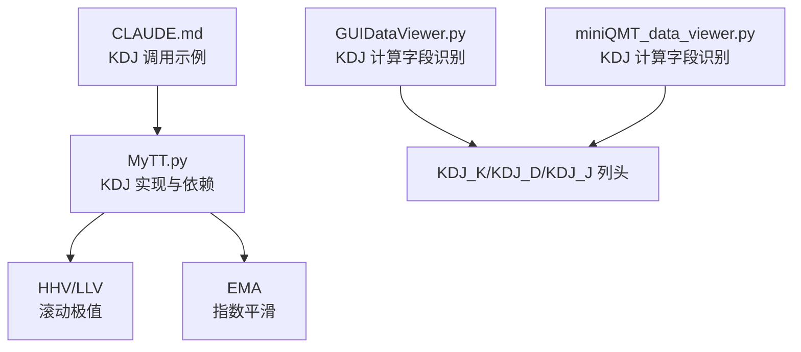
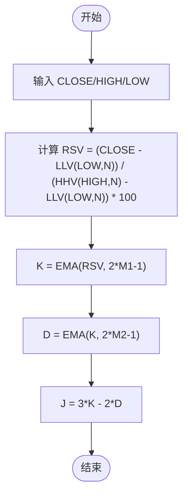
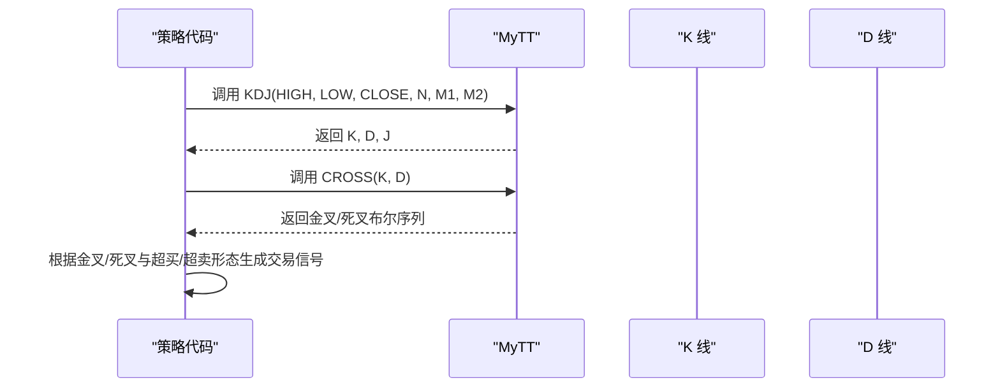
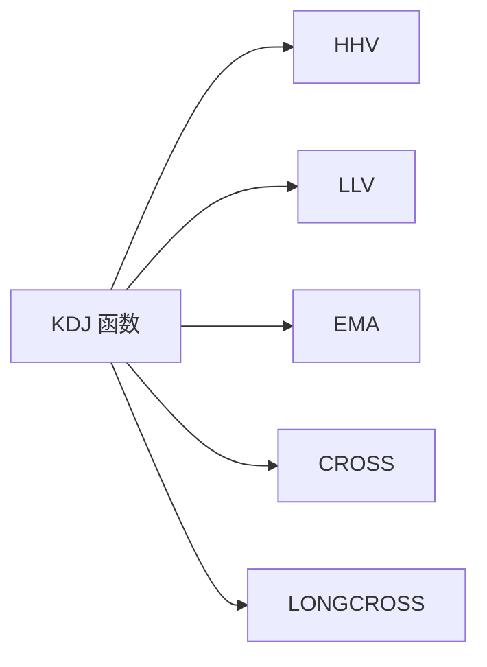

# 随机指标 (KDJ)

<cite>
**本文引用的文件**
- [MyTT.py](file://MyTT.py)
- [README.md](file://README.md)
- [GUIDataViewer.py](file://GUIDataViewer.py)
- [miniQMT_data_viewer.py](file://miniQMT_data_viewer.py)
- [CLAUDE.md](file://modules/CLAUDE.md)
</cite>

## 目录
1. [简介](#简介)
2. [项目结构](#项目结构)
3. [核心组件](#核心组件)
4. [架构总览](#架构总览)
5. [详细组件分析](#详细组件分析)
6. [依赖分析](#依赖分析)
7. [性能考虑](#性能考虑)
8. [故障排查指南](#故障排查指南)
9. [结论](#结论)
10. [附录](#附录)

## 简介
本文件面向使用 khQuant 量化平台的用户，系统化阐述 KDJ 随机指标的计算与应用。依据仓库中 MyTT 指标库的实现，本文将深入解析 KDJ(CLOSE, HIGH, LOW, N=9, M1=3, M2=3) 的三线计算流程，重点说明：
- RSV 原始值的归一化处理
- K 线的指数平滑算法
- D 线的二次平滑
- J 线的放大效应
- K、D、J 三线的取值范围（0-100）及其在超买（>80）和超卖（<20）区域的信号意义
- K 线上穿 D 线为金叉、下穿为死叉的具体判断逻辑
- 结合价格形态识别顶背离与底背离的方法与交易策略

## 项目结构
与 KDJ 直接相关的核心文件与位置如下：
- 指标实现：MyTT.py 中的 KDJ 函数
- 指标依赖：MyTT.py 中的 HHV、LLV、EMA 等基础函数
- GUI 展示：GUIDataViewer.py 与 miniQMT_data_viewer.py 对 KDJ 计算字段的识别与列头标注
- 使用示例：CLAUDE.md 中对 KDJ 的调用示例

**图表来源**
- [MyTT.py](file://MyTT.py#L201-L208)
- [MyTT.py](file://MyTT.py#L71-L85)
- [MyTT.py](file://MyTT.py#L91-L93)
- [GUIDataViewer.py](file://GUIDataViewer.py#L2580-L2593)
- [miniQMT_data_viewer.py](file://miniQMT_data_viewer.py#L1870-L1882)
- [CLAUDE.md](file://modules/CLAUDE.md#L193-L215)

**章节来源**
- [MyTT.py](file://MyTT.py#L201-L208)
- [GUIDataViewer.py](file://GUIDataViewer.py#L2580-L2593)
- [miniQMT_data_viewer.py](file://miniQMT_data_viewer.py#L1870-L1882)
- [CLAUDE.md](file://modules/CLAUDE.md#L193-L215)

## 核心组件
- KDJ 函数：接收收盘价、最高价、最低价序列，返回 K、D、J 三线
- RSV 计算：基于 N 日最高价与最低价的归一化
- 平滑算法：K 线采用指数平滑，D 线为 K 线的指数平滑，J 线为 K 与 D 的线性组合

**章节来源**
- [MyTT.py](file://MyTT.py#L201-L208)

## 架构总览
KDJ 的计算链路如下：
- 输入序列：CLOSE、HIGH、LOW
- 中间序列：RSV（归一化）
- 平滑序列：K（EMA）、D（EMA(K)）
- 最终序列：J（K 的线性组合）

**图表来源**
- [MyTT.py](file://MyTT.py#L201-L208)
- [MyTT.py](file://MyTT.py#L71-L85)
- [MyTT.py](file://MyTT.py#L91-L93)

## 详细组件分析

### KDJ 函数实现与参数
- 函数签名：KDJ(CLOSE, HIGH, LOW, N=9, M1=3, M2=3)
- 参数含义：
  - N：计算 RSV 的周期
  - M1：K 线平滑系数相关参数
  - M2：D 线平滑系数相关参数
- 计算步骤：
  1) RSV 归一化
  2) K 线指数平滑
  3) D 线二次平滑
  4) J 线放大效应

**章节来源**
- [MyTT.py](file://MyTT.py#L201-L208)

### RSV 原始值的归一化处理
- 计算公式：RSV = (CLOSE − LLV(LOW, N)) / (HHV(HIGH, N) − LLV(LOW, N)) × 100
- 说明：
  - 分子为收盘价与 N 日最低价之差
  - 分母为 N 日最高价与 N 日最低价之差
  - 结果乘以 100，使取值范围为 0-100
- 作用：
  - 将价格相对位置映射到 0-100 区间，便于后续平滑与跨周期比较

**章节来源**
- [MyTT.py](file://MyTT.py#L201-L208)
- [MyTT.py](file://MyTT.py#L71-L85)

### K 线的指数平滑算法
- 计算：K = EMA(RSV, span=2×M1−1)
- 说明：
  - 使用指数移动平均对 RSV 进行平滑
  - 平滑系数与 M1 相关，M1 越大，平滑越缓，滞后越大；M1 越小，响应越快，噪声越多
- 作用：
  - 降低 RSV 的波动性，形成更平滑的 K 线

**章节来源**
- [MyTT.py](file://MyTT.py#L201-L208)
- [MyTT.py](file://MyTT.py#L91-L93)

### D 线的二次平滑
- 计算：D = EMA(K, span=2×M2−1)
- 说明：
  - 对 K 线再次进行指数平滑
  - M2 控制 D 线的平滑程度
- 作用：
  - 进一步平滑 K 线，减少短期波动，提高信号稳定性

**章节来源**
- [MyTT.py](file://MyTT.py#L201-L208)
- [MyTT.py](file://MyTT.py#L91-L93)

### J 线的放大效应
- 计算：J = 3×K − 2×D
- 说明：
  - J 线是对 K、D 的线性组合，放大 K 与 D 的差异
  - J 线通常更敏感，可用于捕捉更强的背离信号
- 作用：
  - 在金叉/死叉信号之外，提供更激进的超买/超卖信号

**章节来源**
- [MyTT.py](file://MyTT.py#L201-L208)

### 三线取值范围与超买超卖区域
- 取值范围：K、D、J 均在 0-100 区间
- 超买区域：K、D、J > 80
- 超卖区域：K、D、J < 20
- 信号意义：
  - 超买区出现顶背离（价格创新高而 KDJ 不创新高或掉头向下）→ 死叉/卖出信号
  - 超卖区出现底背离（价格创新低而 KDJ 不创新低或掉头上行）→ 金叉/买入信号

**章节来源**
- [MyTT.py](file://MyTT.py#L201-L208)

### 金叉与死叉的判断逻辑
- 金叉：K 线上穿 D 线
- 死叉：K 线下穿 D 线
- 判断方法：
  - 使用 MyTT 中的 CROSS(S1, S2) 实现向上交叉检测
  - 使用 LONGCROSS(S1, S2, N) 实现持续 N 周期后交叉检测（可选，用于过滤假信号）

**图表来源**
- [MyTT.py](file://MyTT.py#L201-L208)
- [MyTT.py](file://MyTT.py#L165-L171)

**章节来源**
- [MyTT.py](file://MyTT.py#L165-L171)

### 顶背离与底背离识别与交易策略
- 顶背离识别：
  - 价格创新高，但 KDJ 不创新高或掉头向下
  - 结合超买区（>80）与 K 线上穿 D 线（死叉）形成卖出信号
- 底背离识别：
  - 价格创新低，但 KDJ 不创新低或掉头上行
  - 结合超卖区（<20）与 K 线下穿 D 线（金叉）形成买入信号
- 策略要点：
  - 优先在趋势确认后入场
  - 配合成交量、布林带等其他指标过滤
  - 注意避免在震荡市中频繁交易

**章节来源**
- [MyTT.py](file://MyTT.py#L201-L208)

### GUI 展示与计算字段识别
- khQuant 的 GUI 数据查看器会将 KDJ 的三线识别为“计算字段”，并在表头以蓝色标识，列名为 KDJ_K、KDJ_D、KDJ_J
- 该识别逻辑有助于用户在图形界面中直接观察 KDJ 指标，便于回测与策略开发

**章节来源**
- [GUIDataViewer.py](file://GUIDataViewer.py#L2580-L2593)
- [miniQMT_data_viewer.py](file://miniQMT_data_viewer.py#L1870-L1882)

## 依赖分析
- KDJ 依赖：
  - HHV/LLV：计算 N 日最高价与最低价
  - EMA：指数平滑（K、D 线）
  - CROSS/LONGCROSS：交叉判断（金叉/死叉）
- 依赖关系图：

**图表来源**
- [MyTT.py](file://MyTT.py#L201-L208)
- [MyTT.py](file://MyTT.py#L71-L85)
- [MyTT.py](file://MyTT.py#L91-L93)
- [MyTT.py](file://MyTT.py#L165-L171)

**章节来源**
- [MyTT.py](file://MyTT.py#L201-L208)
- [MyTT.py](file://MyTT.py#L71-L85)
- [MyTT.py](file://MyTT.py#L91-L93)
- [MyTT.py](file://MyTT.py#L165-L171)

## 性能考虑
- 计算复杂度：
  - HHV/LLV：滚动窗口计算，时间复杂度 O(T×N)，空间复杂度 O(T)
  - EMA：指数平滑，时间复杂度 O(T)，空间复杂度 O(T)
  - KDJ：整体 O(T×N)，主要瓶颈在 HHV/LLV
- 优化建议：
  - 合理设置 N、M1、M2，避免过大导致计算开销与滞后
  - 在策略中仅对必要序列调用 KDJ，避免重复计算
  - 使用向量化实现（MyTT 已基于 NumPy/Pandas）以提升性能

[本节为通用性能讨论，不直接分析具体文件]

## 故障排查指南
- 常见问题与解决：
  - 输入序列长度不一致：确保 CLOSE、HIGH、LOW 为相同长度序列
  - 参数设置不当：N 过大导致滞后过强，M1/M2 过小导致噪声过多
  - 交叉判断误判：使用 LONGCROSS 过滤短期反复交叉
  - GUI 中未显示 KDJ：确认数据周期为 K 线，且列名识别逻辑生效
- 参考实现与示例：
  - KDJ 调用示例：见模块文档中的示例
  - GUI 计算字段识别：见 GUIDataViewer 与 miniQMT_data_viewer 的字段识别逻辑

**章节来源**
- [CLAUDE.md](file://modules/CLAUDE.md#L193-L215)
- [GUIDataViewer.py](file://GUIDataViewer.py#L2580-L2593)
- [miniQMT_data_viewer.py](file://miniQMT_data_viewer.py#L1870-L1882)

## 结论
- KDJ 是一个经典的震荡类指标，通过 RSV 归一化、K/D 两次指数平滑与 J 线放大，形成三线信号体系
- 在 0-100 区间内，结合超买（>80）与超卖（<20）区域，配合顶/底背离与金叉/死叉，可构建稳健的交易策略
- khQuant 的 MyTT 库提供了高效的向量化实现，GUI 层面也支持 KDJ 的可视化展示，便于回测与策略开发

[本节为总结性内容，不直接分析具体文件]

## 附录
- 使用示例与参考：
  - 指标调用示例：见模块文档中的示例
  - 平台定位与依赖：见 README 中对 MiniQMT 的依赖说明

**章节来源**
- [CLAUDE.md](file://modules/CLAUDE.md#L193-L215)
- [README.md](file://README.md#L202-L210)