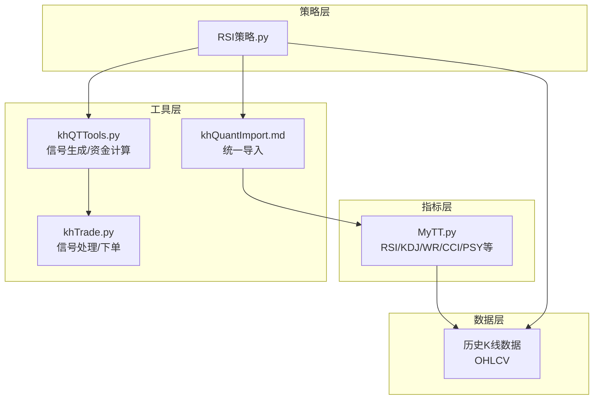
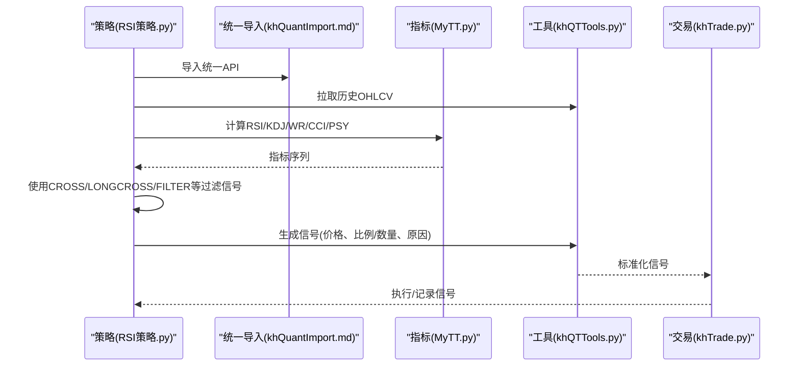
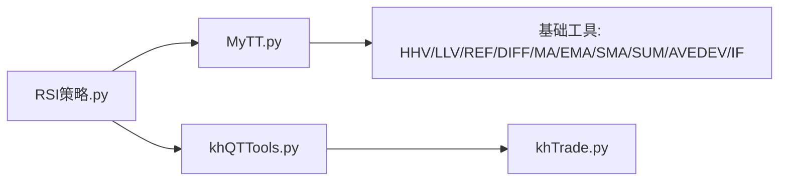

# 震荡类技术指标

<cite>
**本文引用的文件**
- [MyTT.py](file://MyTT.py)
- [RSI策略.py](file://strategies/RSI策略.py)
- [khQuantImport.md](file://modules/khQuantImport.md)
- [khQTTools.py](file://khQTTools.py)
- [khTrade.py](file://khTrade.py)
- [README.md](file://README.md)
</cite>

## 目录
1. [简介](#简介)
2. [项目结构](#项目结构)
3. [核心组件](#核心组件)
4. [架构总览](#架构总览)
5. [详细组件分析](#详细组件分析)
6. [依赖分析](#依赖分析)
7. [性能考量](#性能考量)
8. [故障排查指南](#故障排查指南)
9. [结论](#结论)
10. [附录](#附录)

## 简介
本文件聚焦于震荡类技术指标，系统性梳理并讲解以下指标的计算方法、参数配置、信号解读与在震荡行情中的应用策略：RSI（相对强弱指数）、KDJ（随机指标）、WR（威廉指标）、CCI（顺势指标）与 PSY（心理线）。文档还结合价格走势进行信号过滤，并解释这些指标与趋势类指标的互补关系，帮助读者在震荡行情中构建稳健的交易信号与过滤逻辑。

## 项目结构
本项目采用“指标库 + 策略示例 + 统一导入”的结构：
- 指标库：MyTT.py 提供RSI、KDJ、WR、CCI、PSY等指标函数，以及大量通用技术分析与信号过滤函数。
- 策略示例：strategies/RSI策略.py 展示如何在策略中调用RSI并生成买卖信号。
- 统一导入：khQuantImport.md 提供统一导入入口，策略只需一行导入即可使用MyTT与工具函数。
- 交易执行：khQTTools.py 与 khTrade.py 提供信号生成与处理流程，确保策略信号可被系统执行。

**图表来源**
- [MyTT.py](file://MyTT.py#L202-L245)
- [RSI策略.py](file://strategies/RSI策略.py#L12-L24)
- [khQuantImport.md](file://modules/khQuantImport.md#L1-L30)
- [khQTTools.py](file://khQTTools.py#L635-L715)
- [khTrade.py](file://khTrade.py#L198-L223)

**章节来源**
- [MyTT.py](file://MyTT.py#L202-L245)
- [RSI策略.py](file://strategies/RSI策略.py#L12-L24)
- [khQuantImport.md](file://modules/khQuantImport.md#L1-L30)

## 核心组件
- 指标函数族（MyTT.py）
  - RSI：相对强弱指数，衡量超买超卖强度。
  - KDJ：随机指标，反映价格在周期内的相对位置。
  - WR：威廉指标，衡量价格距离周期高位的幅度。
  - CCI：商品通道指标，衡量价格偏离典型价格的程度。
  - PSY：心理线，衡量上涨天数占比，反映市场情绪。
- 信号过滤与辅助函数（MyTT.py）
  - CROSS/LONGCROSS：交叉信号检测。
  - FILTER：交叉后屏蔽后续N周期，避免重复提示。
  - COUNT/EVERY/EXIST：条件计数与存在性判断。
  - HHV/LLV/REF/DIFF/MA/EMA/SMA等：基础计算工具。
- 策略示例（RSI策略.py）
  - 展示如何拉取历史收盘价、计算RSI、生成金叉/死叉信号并过滤已有持仓。

**章节来源**
- [MyTT.py](file://MyTT.py#L121-L151)
- [MyTT.py](file://MyTT.py#L202-L245)
- [RSI策略.py](file://strategies/RSI策略.py#L12-L24)

## 架构总览
下图展示了从策略到指标再到交易执行的调用链路，以及信号过滤与价格走势结合的典型流程。

**图表来源**
- [RSI策略.py](file://strategies/RSI策略.py#L12-L24)
- [MyTT.py](file://MyTT.py#L202-L245)
- [khQuantImport.md](file://modules/khQuantImport.md#L686-L727)
- [khQTTools.py](file://khQTTools.py#L635-L715)
- [khTrade.py](file://khTrade.py#L198-L223)

## 详细组件分析

### RSI（相对强弱指数）
- 计算方法
  - 基于收盘价的涨跌差分，分别计算上涨与下跌的N日平均，再求比值并乘以100。
  - 公式要点：RSI = 上涨平均 / (上涨平均 + 下跌平均) × 100。
- 参数配置
  - N：通常取14或24，周期越短越敏感，越长越平滑。
- 取值范围与临界值
  - 取值范围：0–100。
  - 常用阈值：超买=70，超卖=30。也可根据市场波动性调整。
- 交叉信号与过滤
  - 金叉：RSI从下向上穿过阈值线（如30）视为买入信号。
  - 死叉：RSI从上向下穿过阈值线（如70）视为卖出信号。
  - 过滤：使用CROSS/LONGCROSS检测交叉，使用FILTER屏蔽交叉后N周期的重复提示。
- 与趋势指标的互补
  - RSI在震荡行情中表现较好，但在明显趋势中可能出现钝化。可叠加趋势指标（如均线、MACD）进行确认，避免逆势交易。
- 代码示例路径
  - 计算RSI：[RSI函数](file://MyTT.py#L211-L215)
  - 策略调用与信号生成：[RSI策略](file://strategies/RSI策略.py#L12-L24)

**章节来源**
- [MyTT.py](file://MyTT.py#L211-L215)
- [RSI策略.py](file://strategies/RSI策略.py#L12-L24)

### KDJ（随机指标）
- 计算方法
  - RSV = (收盘 - 最低N) / (最高N - 最低N) × 100；
  - K = EMA(RSV, 平滑系数)，D = EMA(K, 平滑系数)，J = 3K - 2D。
- 参数配置
  - N：常用9；
  - M1/M2：K与D的平滑系数，常用3。
- 取值范围与临界值
  - 取值范围：0–100；
  - 超买/超卖：K、D通常在80/20附近形成背离。
- 交叉信号与过滤
  - 金叉：K上穿D；
  - 死叉：K下穿D；
  - 过滤：配合CROSS/LONGCROSS与FILTER避免重复信号。
- 与趋势指标的互补
  - KDJ对短期超买超卖敏感，适合震荡区间内的高抛低吸；与趋势指标结合可过滤假突破。
- 代码示例路径
  - 计算KDJ：[KDJ函数](file://MyTT.py#L202-L208)

**章节来源**
- [MyTT.py](file://MyTT.py#L202-L208)

### WR（威廉指标）
- 计算方法
  - WR = (最高N - 收盘) / (最高N - 最低N) × 100；
  - 支持双周期WR（如N与N1），用于短期与中线背离判断。
- 参数配置
  - N/N1：常用10/6。
- 取值范围与临界值
  - 取值范围：0–100；
  - 超买/超卖：WR通常在80/20附近作为阈值。
- 交叉信号与过滤
  - 金叉/死叉：WR上穿/下穿阈值；
  - 过滤：使用CROSS/LONGCROSS与FILTER。
- 与趋势指标的互补
  - WR对价格距离周期高位的敏感度较高，适合捕捉短期顶部/底部。
- 代码示例路径
  - 计算WR：[WR函数](file://MyTT.py#L217-L221)

**章节来源**
- [MyTT.py](file://MyTT.py#L217-L221)

### CCI（顺势指标）
- 计算方法
  - TP = (最高 + 最低 + 收盘)/3；
  - CCI = (TP - MA(TP, N)) / (0.015 × AVEDEV(TP, N))；
  - 0.015为常数缩放因子。
- 参数配置
  - N：常用14。
- 取值范围与临界值
  - 无严格上限/下限，但常用±100/±150作为超买/超卖阈值。
- 交叉信号与过滤
  - 金叉/死叉：CCI穿越阈值；
  - 过滤：CROSS/LONGCROSS/FILTER。
- 与趋势指标的互补
  - CCI对趋势转折敏感，适合捕捉趋势反转；与趋势指标结合可避免逆势。
- 代码示例路径
  - 计算CCI：[CCI函数](file://MyTT.py#L247-L251)

**章节来源**
- [MyTT.py](file://MyTT.py#L247-L251)

### PSY（心理线）
- 计算方法
  - PSY = N日内上涨天数 / N × 100；
  - 可叠加PSYMA（如M=6）进行平滑。
- 参数配置
  - N：常用12；
  - M：PSYMA周期，常用6。
- 取值范围与临界值
  - 取值范围：0–100；
  - 超买/超卖：PSY通常在75/25附近作为阈值。
- 交叉信号与过滤
  - 金叉/死叉：PSY穿越阈值；
  - 过滤：CROSS/LONGCROSS/FILTER。
- 与趋势指标的互补
  - PSY反映市场情绪，适合在震荡区间内捕捉极端超买/超卖。
- 代码示例路径
  - 计算PSY：[PSY函数](file://MyTT.py#L240-L244)

**章节来源**
- [MyTT.py](file://MyTT.py#L240-L244)

### 信号过滤与价格走势结合
- 交叉信号检测
  - 使用CROSS检测两条序列的上穿/下穿；
  - 使用LONGCROSS检测持续N周期后交叉，提高信号稳定性。
- 信号抑制
  - 使用FILTER在交叉成立后屏蔽后续N周期，避免重复提示。
- 价格走势过滤
  - 可叠加趋势指标（如均线、MACD）进行确认，仅在趋势方向一致时执行信号；
  - 可结合成交量（如MFI/VR）进行量价确认。
- 代码示例路径
  - 交叉与过滤函数：[CROSS/LONGCROSS/FILTER](file://MyTT.py#L165-L171)
  - 交叉与过滤函数：[FILTER](file://MyTT.py#L142-L145)
  - 信号生成与执行：[generate_signal](file://khQTTools.py#L635-L715)
  - 信号处理与下单：[process_signals](file://khTrade.py#L198-L223)

**章节来源**
- [MyTT.py](file://MyTT.py#L142-L171)
- [khQTTools.py](file://khQTTools.py#L635-L715)
- [khTrade.py](file://khTrade.py#L198-L223)

## 依赖分析
- 指标函数依赖的基础工具
  - HHV/LLV：滚动最高/最低；
  - REF/DIFF：滞后与差分；
  - MA/EMA/SMA：均线与平滑；
  - SUM/AVEDEV：累计与平均绝对偏差；
  - IF/逻辑判断：布尔条件分支。
- 策略与指标的耦合
  - 策略通过统一导入模块使用MyTT指标；
  - 信号生成与执行通过khQTTools与khTrade完成，降低策略与执行层的耦合。

**图表来源**
- [MyTT.py](file://MyTT.py#L71-L120)
- [RSI策略.py](file://strategies/RSI策略.py#L12-L24)
- [khQTTools.py](file://khQTTools.py#L635-L715)
- [khTrade.py](file://khTrade.py#L198-L223)

**章节来源**
- [MyTT.py](file://MyTT.py#L71-L120)
- [RSI策略.py](file://strategies/RSI策略.py#L12-L24)

## 性能考量
- 计算复杂度
  - 指标多为滚动窗口计算（如MA/EMA/HHV/LLV/SUM），时间复杂度与窗口长度N呈线性关系；
  - SMA/EMA使用pandas/numpy向量化实现，具备良好性能。
- 优化建议
  - 合理选择N，避免过大窗口导致计算与内存压力；
  - 对多只股票并行计算时，尽量复用历史数据与中间结果；
  - 使用COUNT/EVERY/EXIST等条件计数函数减少循环与条件判断次数。
- 代码示例路径
  - 指标计算与向量化实现：[MyTT.py](file://MyTT.py#L71-L120)

**章节来源**
- [MyTT.py](file://MyTT.py#L71-L120)

## 故障排查指南
- 常见问题
  - 指标返回NaN/异常值：检查输入序列长度是否足够、是否存在空值；
  - 信号未触发：确认交叉阈值设置、过滤周期是否合理；
  - 信号重复：检查FILTER屏蔽周期是否过短或未生效。
- 排查步骤
  - 核对输入数据字段（OHLC）与周期；
  - 核对参数N/M设置；
  - 使用COUNT/EXIST/EVERY验证条件是否满足；
  - 检查信号生成与执行链路（generate_signal/process_signals）。
- 代码示例路径
  - 条件计数与存在性判断：[COUNT/EXIST/EVERY](file://MyTT.py#L130-L140)
  - 信号生成与执行：[generate_signal](file://khQTTools.py#L635-L715)
  - 信号处理与下单：[process_signals](file://khTrade.py#L198-L223)

**章节来源**
- [MyTT.py](file://MyTT.py#L130-L140)
- [khQTTools.py](file://khQTTools.py#L635-L715)
- [khTrade.py](file://khTrade.py#L198-L223)

## 结论
- RSI、KDJ、WR、CCI、PSY均为震荡行情中的经典指标，各有侧重：RSI衡量相对强弱、KDJ反映短期动向、WR衡量相对高位距离、CCI捕捉价格偏离、PSY反映市场情绪。
- 通过CROSS/LONGCROSS/FILTER等信号过滤函数，可有效提升信号稳定性并避免重复提示。
- 将震荡指标与趋势指标（均线、MACD）结合，可在震荡区间内实现更稳健的高抛低吸策略。
- 实战中建议根据市场波动性调整阈值与周期，并结合成交量与价格走势进行过滤，以降低假信号风险。

## 附录
- 使用建议
  - 参数调优：以回测方式在样本外验证不同N与阈值组合；
  - 多周期确认：在日线/周线趋势确认后再执行震荡信号；
  - 风险控制：设置止损止盈与最大回撤限制，避免单次信号导致重大损失。
- 参考文档
  - 系统定位与使用说明：[README.md](file://README.md#L160-L176)

**章节来源**
- [README.md](file://README.md#L160-L176)