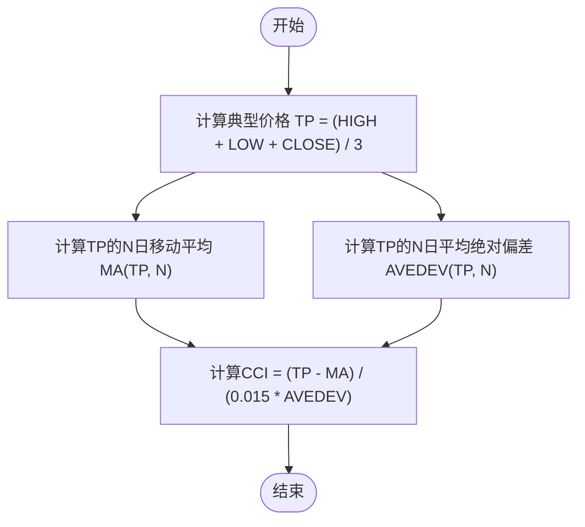
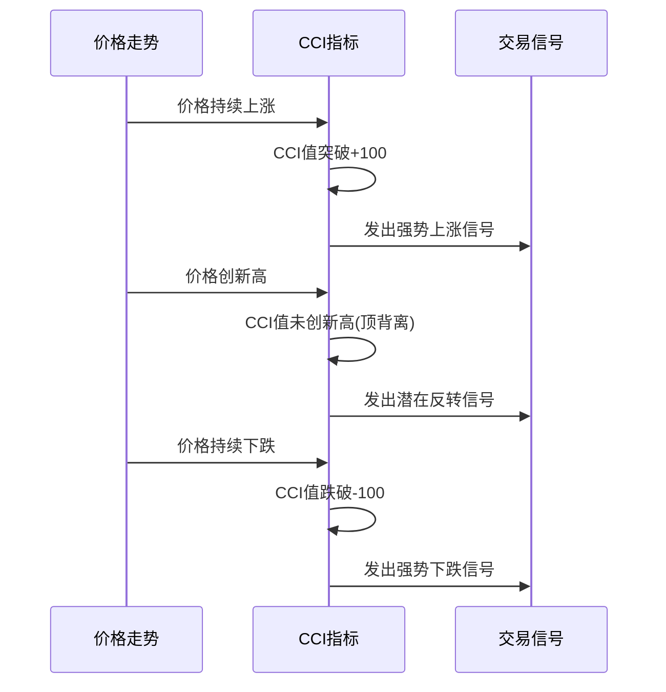

# 顺势指标 (CCI)

<cite>
**本文档引用的文件**
- [MyTT.py](file://MyTT.py#L247-L251)
</cite>

## 目录
1. [引言](#引言)
2. [CCI指标计算模型](#cci指标计算模型)
3. [信号含义与交易策略](#信号含义与交易策略)
4. [指标特性与使用建议](#指标特性与使用建议)

## 引言
顺势指标（Commodity Channel Index, CCI）是一种衡量价格偏离其统计平均值程度的技术分析工具。该指标通过计算典型价格（Typical Price）与其移动平均线的偏离度，来判断市场是否处于超买或超卖状态。正常情况下，CCI值在-100至+100之间波动，当指标突破这一范围时，通常预示着强烈的市场趋势。

**Section sources**
- [MyTT.py](file://MyTT.py#L247-L251)

## CCI指标计算模型
CCI指标的计算基于典型价格（Typical Price），即最高价、最低价和收盘价的平均值。其核心思想是衡量当前价格与历史平均价格的偏离程度，并通过标准化处理，使得不同品种的价格波动具有可比性。

计算公式如下：
1.  **典型价格 (TP)**: TP = (HIGH + LOW + CLOSE) / 3
2.  **TP的N日简单移动平均 (MA)**: MA(TP, N)
3.  **TP的N日平均绝对偏差 (AVEDEV)**: AVEDEV(TP, N)，表示TP序列与其均值的平均偏离程度。
4.  **CCI值**: CCI = (TP - MA(TP, N)) / (0.015 * AVEDEV(TP, N))

其中，N为计算周期，通常默认为14。常数0.015用于将大部分CCI值限制在-100至+100的区间内。

**Diagram sources**
- [MyTT.py](file://MyTT.py#L249-L250)

**Section sources**
- [MyTT.py](file://MyTT.py#L247-L251)

## 信号含义与交易策略
CCI指标的信号解读主要基于其数值范围和趋势方向。

### 信号含义
*   **突破+100**: 当CCI值上穿+100时，表明价格已显著高于其统计平均值，市场处于强势上涨状态，可能预示着新一轮上升趋势的开始。
*   **跌破-100**: 当CCI值下穿-100时，表明价格已显著低于其统计平均值，市场处于强势下跌状态，可能预示着新一轮下降趋势的开始。

### 交易策略
为了提高交易信号的可靠性，可以结合其他技术分析工具进行确认。

#### 1. 结合MA均线确认趋势方向
*   **策略**: 在CCI发出信号的同时，观察价格与移动平均线（MA）的位置关系。
*   **多头信号**: 当CCI突破+100 **且** 价格位于其长期MA（如MA20）之上时，确认为强势多头信号，可考虑买入。
*   **空头信号**: 当CCI跌破-100 **且** 价格位于其长期MA之下时，确认为强势空头信号，可考虑卖出。

#### 2. 利用CCI顶底背离捕捉反转机会
*   **顶背离**: 价格创新高，但CCI指标未能创新高，形成顶背离，预示上涨动能减弱，可能出现反转下跌。
*   **底背离**: 价格创新低，但CCI指标未能创新低，形成底背离，预示下跌动能减弱，可能出现反转上涨。

**Diagram sources**
- [MyTT.py](file://MyTT.py#L247-L251)

**Section sources**
- [MyTT.py](file://MyTT.py#L247-L251)

## 指标特性与使用建议
CCI指标在趋势行情中表现优异，能够有效捕捉到价格的强劲波动。然而，在震荡市中，由于价格在均值附近反复波动，CCI指标容易在+100和-100之间频繁穿越，产生大量假信号，导致交易者频繁进出市场，造成亏损。

**使用建议**:
1.  **趋势确认**: 在使用CCI信号前，应先判断市场整体处于趋势行情还是震荡行情。可结合趋势线、通道或ADX指标进行判断。
2.  **多重验证**: 不要仅依赖CCI指标进行交易决策，应结合MA均线、成交量、K线形态等其他技术分析工具进行综合判断。
3.  **参数调整**: 默认的N=14周期适用于大多数情况，但交易者可根据不同品种和交易周期适当调整N值，以优化指标表现。

**Section sources**
- [MyTT.py](file://MyTT.py#L247-L251)