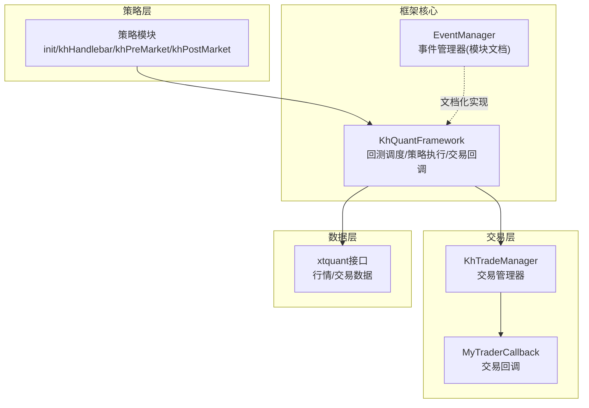
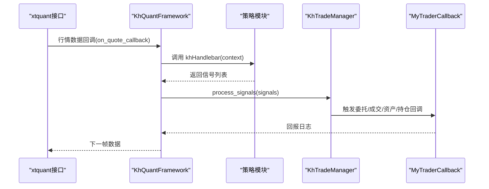
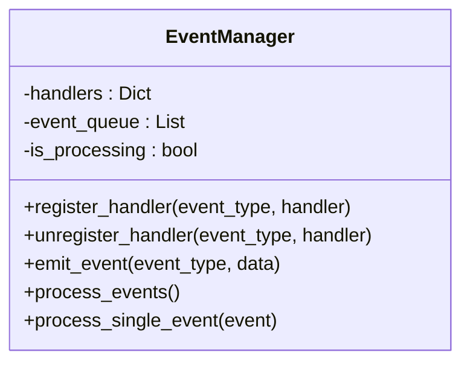
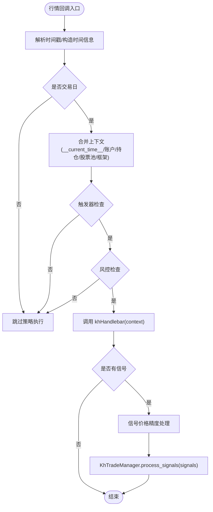
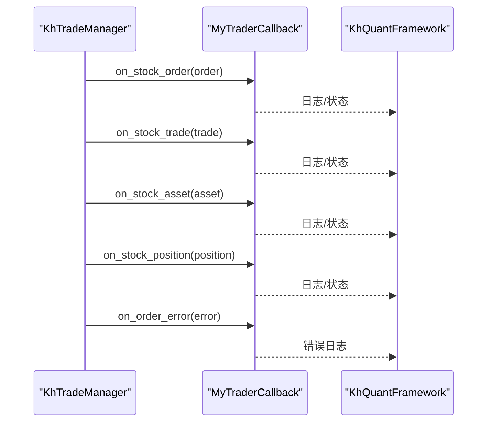
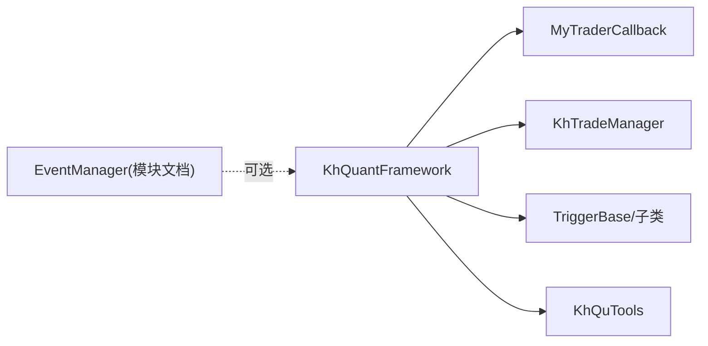

# 事件管理

<cite>
**本文引用的文件**
- [khFrame.py](file://khFrame.py)
- [modules/khFrame.md](file://modules/khFrame.md)
- [README.md](file://README.md)
- [khTrade.py](file://khTrade.py)
</cite>

## 目录
1. [简介](#简介)
2. [项目结构](#项目结构)
3. [核心组件](#核心组件)
4. [架构总览](#架构总览)
5. [详细组件分析](#详细组件分析)
6. [依赖分析](#依赖分析)
7. [性能考虑](#性能考虑)
8. [故障排查指南](#故障排查指南)
9. [结论](#结论)
10. [附录](#附录)

## 简介
本文件围绕 khFrame.py 中的事件管理与事件驱动机制展开，系统性解析事件队列的创建、事件的发布（emit）与订阅（register）机制、事件处理器的调用流程；阐述事件类型（如 ON_QUOTE、ON_ORDER、ON_TRADE 等）的定义与使用场景；解释事件数据的封装格式与传递方式；结合策略侧的回调与交易回报处理，说明事件循环的运行机制与实时性、顺序性保障；并提供性能优化建议与异常捕获、日志记录的最佳实践。

## 项目结构
- khFrame.py：量化框架核心，包含事件驱动的回测调度、策略执行、交易回报处理、日志与进度信号等。
- modules/khFrame.md：事件驱动架构与事件管理器的文档化实现示例。
- README.md：策略接口与上下文结构说明，便于理解事件数据的封装与传递。
- khTrade.py：交易管理器，负责将策略信号转化为交易指令，并触发交易回报回调。

**图表来源**
- [khFrame.py](file://khFrame.py#L745-L911)
- [modules/khFrame.md](file://modules/khFrame.md#L860-L921)
- [khTrade.py](file://khTrade.py#L535-L595)

**章节来源**
- [khFrame.py](file://khFrame.py#L745-L911)
- [modules/khFrame.md](file://modules/khFrame.md#L860-L921)

## 核心组件
- 事件管理器（EventManager）：模块文档中提供了事件管理器的实现示例，包含注册处理器、发布事件、处理队列与单事件分发、异常捕获等。
- 框架事件入口：KhQuantFramework 中的行情回调 on_quote_callback 会将行情数据封装为上下文并触发策略执行；交易回报通过 MyTraderCallback 的多个回调方法触发。
- 交易管理器（KhTradeManager）：接收策略信号，生成委托与成交对象，触发交易回报回调。
- 策略接口：init、khHandlebar、khPreMarket、khPostMarket，策略通过返回信号列表驱动交易。

**章节来源**
- [modules/khFrame.md](file://modules/khFrame.md#L860-L921)
- [khFrame.py](file://khFrame.py#L745-L911)
- [khTrade.py](file://khTrade.py#L535-L595)

## 架构总览
事件驱动在框架中的体现：
- 事件发布：行情数据到达时，on_quote_callback 构造上下文并调用策略主函数 khHandlebar；交易回报通过 MyTraderCallback 的回调触发。
- 事件订阅：策略模块通过框架提供的上下文与回调接口参与事件处理；交易管理器在执行信号时触发交易回报回调。
- 事件处理：事件处理器（策略函数与交易回调）在框架的调度循环中被调用，保证顺序性与实时性（回测场景下按时间序列推进）。

**图表来源**
- [khFrame.py](file://khFrame.py#L745-L911)
- [khTrade.py](file://khTrade.py#L535-L595)

## 详细组件分析

### 事件管理器（EventManager）
- 注册与注销：按事件类型维护处理器列表，支持注册与注销。
- 发布事件：将事件封装为字典（类型、数据、时间戳），入队并触发处理。
- 处理队列：串行处理，避免并发竞争；处理完成后重置状态。
- 单事件处理：遍历同类型处理器，逐个调用，异常被捕获并记录。

**图表来源**
- [modules/khFrame.md](file://modules/khFrame.md#L860-L921)

**章节来源**
- [modules/khFrame.md](file://modules/khFrame.md#L860-L921)

### 框架事件入口：行情回调与策略执行
- on_quote_callback：解析时间戳、构造时间信息、交易日校验、合并账户/持仓/股票池/框架实例等上下文，调用策略主函数 khHandlebar，处理信号价格精度与交易指令。
- 触发器与风控：在策略执行前，通过触发器判断是否触发，风控检查通过后才执行策略。
- 事件数据封装：上下文包含 __current_time__、__account__、__positions__、__stock_list__、__framework__ 以及各股票的行情 Series。

**图表来源**
- [khFrame.py](file://khFrame.py#L745-L911)

**章节来源**
- [khFrame.py](file://khFrame.py#L745-L911)
- [README.md](file://README.md#L1677-L1735)

### 交易回报事件与处理器
- MyTraderCallback：提供委托回报、成交回报、委托错误、撤单错误、连接状态、资产变动、持仓变动等回调方法。
- 交易管理器：将策略信号转化为委托与成交对象，触发相应回调；异常时触发委托错误回调。
- 事件数据封装：委托/成交/资产/持仓对象以命名空间形式传入回调，包含必要字段（如股票代码、委托编号、成交金额、时间戳等）。

**图表来源**
- [khFrame.py](file://khFrame.py#L277-L494)
- [khTrade.py](file://khTrade.py#L535-L595)

**章节来源**
- [khFrame.py](file://khFrame.py#L277-L494)
- [khTrade.py](file://khTrade.py#L535-L595)

### 事件类型与使用场景
- ON_QUOTE：行情数据到达时触发，框架在 on_quote_callback 中封装上下文并调用策略主函数。
- ON_ORDER：委托回报触发，交易管理器在生成委托后触发委托回报回调。
- ON_TRADE：成交回报触发，交易管理器在成交后触发成交回报回调。
- ON_CANCEL_ERROR/ON_ORDER_ERROR：撤单/委托错误触发，交易管理器在异常时触发错误回调。
- ON_ACCOUNT_STATUS/ON_POSITION：账户状态与持仓变动触发，交易管理器在资产/持仓变化时触发相应回调。

说明：上述事件类型在框架中通过回调方法体现，策略侧通过框架上下文与交易回调参与事件处理。

**章节来源**
- [khFrame.py](file://khFrame.py#L277-L494)
- [khFrame.py](file://khFrame.py#L745-L911)
- [khTrade.py](file://khTrade.py#L535-L595)

### 事件数据封装与传递
- 上下文结构：包含时间信息、账户信息、持仓信息、股票池、框架实例以及各股票的行情 Series。
- 交易回报数据：委托/成交/资产/持仓对象字段完整，便于策略侧与 GUI 层消费。
- 信号格式：策略返回信号列表，包含股票代码、动作、价格、数量、备注等字段，框架在执行前进行价格精度处理与时间戳补充。

**章节来源**
- [README.md](file://README.md#L1677-L1735)
- [khFrame.py](file://khFrame.py#L745-L911)
- [khTrade.py](file://khTrade.py#L535-L595)

### 事件循环与实时性、顺序性
- 回测循环：按时间点顺序推进，先构造数据与时间信息，再触发器检查、风控检查，最后调用策略与处理信号。
- 顺序性：回测按时间序列严格推进，确保事件处理顺序与数据到达顺序一致。
- 实时性：回测场景下，事件处理在单线程循环中进行，避免并发竞争；交易回报通过回调在主线程中触发，保证 GUI 与日志的实时显示。

**章节来源**
- [khFrame.py](file://khFrame.py#L1600-L2399)

## 依赖分析
- KhQuantFramework 依赖：
  - 交易回调：MyTraderCallback，用于交易回报日志与状态更新。
  - 交易管理器：KhTradeManager，用于信号处理与交易指令生成。
  - 触发器：Tick/K线/自定义定时触发器，决定策略执行频率。
  - 工具类：KhQuTools，用于交易日判断与价格精度设置。
- 事件管理器（模块文档）：提供事件注册/发布/处理的通用实现，策略侧可按需扩展。

**图表来源**
- [khFrame.py](file://khFrame.py#L277-L494)
- [khFrame.py](file://khFrame.py#L745-L911)
- [modules/khFrame.md](file://modules/khFrame.md#L860-L921)

**章节来源**
- [khFrame.py](file://khFrame.py#L277-L494)
- [khFrame.py](file://khFrame.py#L745-L911)
- [modules/khFrame.md](file://modules/khFrame.md#L860-L921)

## 性能考虑
- 事件队列串行处理：避免并发竞争，保证顺序性；在事件处理器中避免耗时操作，必要时将耗时任务放入后台线程。
- 数据缓存与预处理：框架在回测中对历史数据、时间字段、基准指数等进行缓存，减少重复计算与 IO。
- 交易日与触发点优化：使用缓存判断交易日、缓存当天触发时间点，减少重复计算。
- 日志与进度：降低日志输出频率，重要节点强制输出，避免频繁 I/O 影响性能。

[本节为通用性能建议，不直接分析具体文件]

## 故障排查指南
- 事件处理器异常：事件管理器与交易回调均包含异常捕获与日志记录，定位失败原因。
- 交易回报异常：检查委托/成交对象字段完整性，确认价格精度与时间戳转换。
- 回测进度与状态：通过进度信号与日志输出，确认回测是否卡顿或提前结束。
- 连接与重连：框架提供连接检查与重连逻辑，出现断开时及时重连并记录日志。

**章节来源**
- [modules/khFrame.md](file://modules/khFrame.md#L860-L921)
- [khFrame.py](file://khFrame.py#L277-L494)
- [khFrame.py](file://khFrame.py#L3029-L3152)

## 结论
khFrame.py 通过事件驱动架构将行情数据、策略执行与交易回报有机串联：事件发布由框架入口负责，事件订阅由策略与交易回调承担，事件处理在严格的回测循环中顺序执行。事件数据采用结构化上下文与命名空间对象封装，既满足策略侧的灵活性，又保证 GUI 与日志层的可观测性。通过缓存、触发器与风控检查等机制，框架在保证实时性与顺序性的前提下，兼顾性能与稳定性。

## 附录
- 策略接口与上下文结构：详见 README 中对 khHandlebar、khPreMarket、khPostMarket 的说明。
- 事件管理器实现示例：见 modules/khFrame.md 中的 EventManager 类。

**章节来源**
- [README.md](file://README.md#L1677-L1735)
- [modules/khFrame.md](file://modules/khFrame.md#L860-L921)