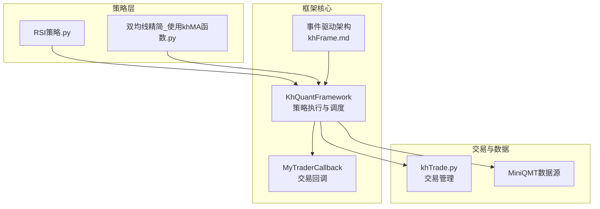
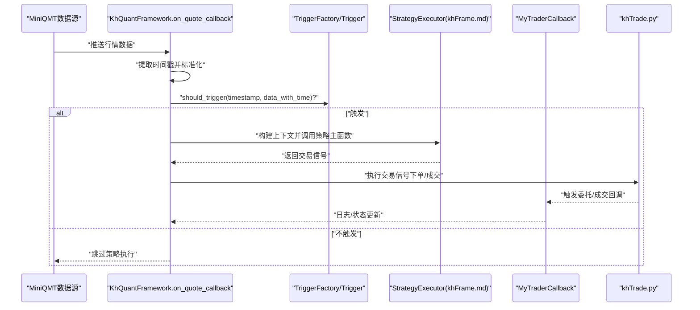
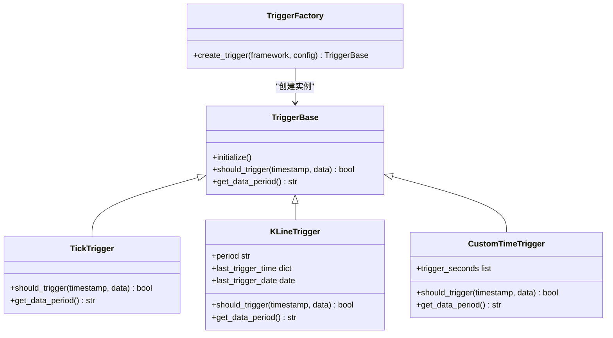
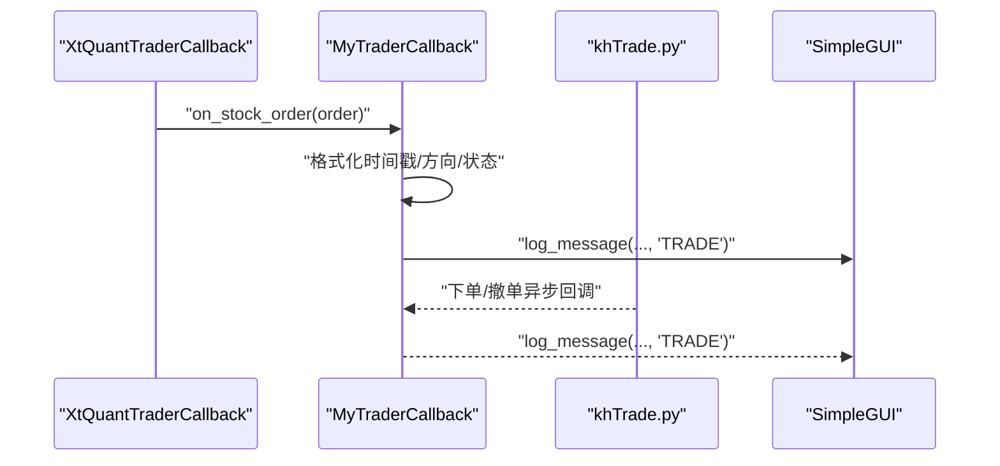
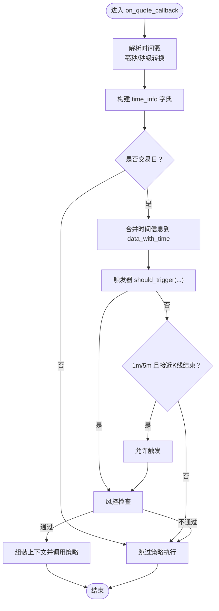
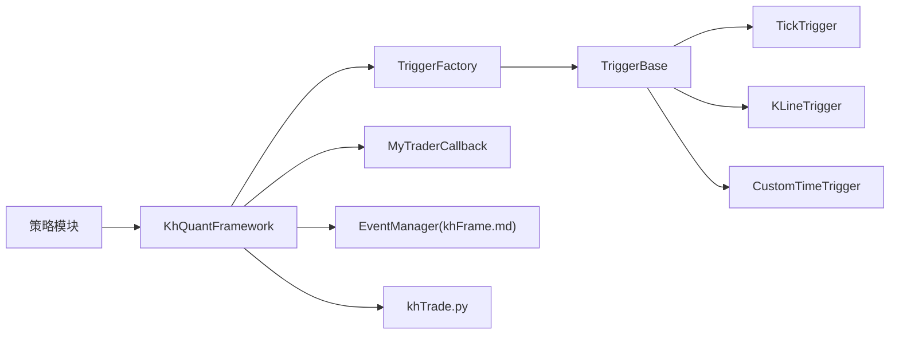

# 事件驱动架构

<cite>
**本文引用的文件**
- [khFrame.py](file://khFrame.py)
- [modules/khFrame.md](file://modules/khFrame.md)
- [khTrade.py](file://khTrade.py)
- [strategies/RSI策略.py](file://strategies/RSI策略.py)
- [strategies/双均线精简_使用khMA函数.py](file://strategies/双均线精简_使用khMA函数.py)
</cite>

## 目录
1. [引言](#引言)
2. [项目结构](#项目结构)
3. [核心组件](#核心组件)
4. [架构总览](#架构总览)
5. [详细组件分析](#详细组件分析)
6. [依赖关系分析](#依赖关系分析)
7. [性能考量](#性能考量)
8. [故障排查指南](#故障排查指南)
9. [结论](#结论)
10. [附录](#附录)

## 引言
本文件围绕事件驱动架构，深入解析 khFrame.py 中的事件与触发器系统，重点说明以下内容：
- MyTraderCallback 如何继承 XtQuantTraderCallback 并实现 on_stock_order、on_stock_trade 等回调方法，处理来自 MiniQMT 客户端的委托、成交与账户变动等事件；
- on_quote_callback 如何作为行情数据入口，将原始数据转换为包含时间信息的标准化格式并通过事件系统分发；
- TriggerFactory 如何根据配置创建不同类型的触发器（TickTrigger、KLineTrigger、CustomTimeTrigger），以及 should_trigger 如何决定策略执行时机；
- KLineTrigger 如何通过检查分钟数和秒数判断 K 线是否形成；
- CustomTimeTrigger 如何通过计算从午夜开始的秒数匹配自定义时间点；
- 提供事件队列处理流程与回调注册/调用机制的示例路径。

## 项目结构
khFrame.py 是框架的核心，承担策略生命周期管理、事件驱动、数据处理与交易执行职责。modules/khFrame.md 提供了 khFrame 的整体设计说明，包括事件驱动架构、策略执行器、回测引擎等模块。

图表来源
- [khFrame.py](file://khFrame.py#L494-L831)
- [modules/khFrame.md](file://modules/khFrame.md#L861-L921)
- [khTrade.py](file://khTrade.py#L535-L567)
- [strategies/RSI策略.py](file://strategies/RSI策略.py#L1-L26)
- [strategies/双均线精简_使用khMA函数.py](file://strategies/双均线精简_使用khMA函数.py#L1-L31)

章节来源
- [khFrame.py](file://khFrame.py#L494-L831)
- [modules/khFrame.md](file://modules/khFrame.md#L861-L921)

## 核心组件
- 触发器体系
  - TriggerBase：触发器基类，定义 should_trigger 与 get_data_period 接口。
  - TickTrigger：每个 Tick 都触发策略。
  - KLineTrigger：在 K 线形成时触发策略，支持“1m”、“5m”、“1d”周期。
  - CustomTimeTrigger：在指定时间点触发策略，使用秒级时间差容差。
  - TriggerFactory：根据配置创建对应触发器。
- 交易回调系统
  - MyTraderCallback：继承 XtQuantTraderCallback，实现 on_stock_order、on_stock_trade、on_order_error、on_cancel_error、on_account_status、on_stock_position、on_connected、on_stock_asset 等回调。
- 行情入口与事件分发
  - on_quote_callback：提取时间信息，构造标准化数据，结合触发器决定是否触发策略，并在必要时进行风控检查与上下文组装。

章节来源
- [khFrame.py](file://khFrame.py#L52-L244)
- [khFrame.py](file://khFrame.py#L277-L722)
- [khFrame.py](file://khFrame.py#L744-L831)

## 架构总览
事件驱动架构由 khFrame.md 中的 EventManager 实现，采用“事件队列 + 处理器注册”的模式。KhQuantFramework 在 on_quote_callback 中将行情数据标准化后，通过触发器判定是否执行策略；策略执行器在 khFrame.md 中定义，负责调用策略主函数并执行交易信号。

图表来源
- [khFrame.py](file://khFrame.py#L744-L831)
- [modules/khFrame.md](file://modules/khFrame.md#L143-L300)
- [khTrade.py](file://khTrade.py#L535-L567)

## 详细组件分析

### 触发器系统（TriggerBase/TickTrigger/KLineTrigger/CustomTimeTrigger/TriggerFactory）
- 触发器基类
  - 提供 should_trigger(timestamp, data) 与 get_data_period() 接口，子类需覆盖以实现具体触发逻辑。
- TickTrigger
  - 每个 Tick 都返回 True，适合高频策略或实时回测。
- KLineTrigger
  - 支持“1m”、“5m”、“1d”三种周期：
    - “1m”：当秒数为 0 时触发；
    - “5m”：当分钟数对 5 取模为 0 且秒数为 0 时触发；
    - “1d”：按日期变化触发，避免重复触发同一天。
- CustomTimeTrigger
  - 将配置中的时间字符串解析为从午夜起的秒数，当前时间与目标时间的秒差小于阈值（示例中为 5 秒）时触发。
- TriggerFactory
  - 依据配置 backtest.trigger.type 创建对应触发器；默认返回 TickTrigger。

图表来源
- [khFrame.py](file://khFrame.py#L52-L244)

章节来源
- [khFrame.py](file://khFrame.py#L52-L244)

### 交易回调系统（MyTraderCallback）
- 继承 XtQuantTraderCallback，实现如下回调：
  - on_stock_order：委托回报，格式化时间戳、方向映射与状态映射，输出日志；
  - on_stock_trade：成交回报，提取实际成交价，格式化时间戳，输出日志；
  - on_order_error：委托错误回报；
  - on_cancel_error：撤单错误回报；
  - on_account_status：账户状态变动；
  - on_stock_position：持仓变动；
  - on_connected/on_disconnected：连接状态；
  - on_stock_asset：资金变动（当前版本被注释）。
- 价格精度通过 set_price_decimals 设置，默认两位小数。

图表来源
- [khFrame.py](file://khFrame.py#L277-L722)
- [khTrade.py](file://khTrade.py#L535-L567)

章节来源
- [khFrame.py](file://khFrame.py#L277-L722)
- [khTrade.py](file://khTrade.py#L535-L567)

### 行情入口与事件分发（on_quote_callback）
- 输入：MiniQMT 推送的行情数据字典，包含时间戳等字段。
- 处理步骤：
  - 提取时间戳，支持毫秒/秒级，转换为 datetime；
  - 构造 time_info 字典，包含 timestamp、datetime、date、time；
  - 检查是否为交易日，非交易日直接跳过；
  - 将原始数据与时间信息合并为 data_with_time；
  - 调用触发器 should_trigger 判断是否触发策略；
  - 对于“1m/5m”周期，允许在接近 K 线结束（秒数≥57）时触发；
  - 进行风控检查；
  - 组装上下文（含账户、持仓、框架信息），交由策略执行器处理。

图表来源
- [khFrame.py](file://khFrame.py#L744-L831)

章节来源
- [khFrame.py](file://khFrame.py#L744-L831)

### 策略执行与信号生成（策略示例）
- RSI策略：遍历股票池，计算 RSI(14)，在金叉/死叉时生成买卖信号。
- 双均线策略：使用 khMA 计算短期与长期均线，交叉时生成信号。

章节来源
- [strategies/RSI策略.py](file://strategies/RSI策略.py#L1-L26)
- [strategies/双均线精简_使用khMA函数.py](file://strategies/双均线精简_使用khMA函数.py#L1-L31)

## 依赖关系分析
- KhQuantFramework 依赖 TriggerFactory/TriggerBase 族实现触发逻辑；
- KhQuantFramework 通过 create_callback 生成 MyTraderCallback，并将其注入交易管理器；
- on_quote_callback 与策略执行器（khFrame.md）协作，策略主函数返回信号后由交易管理器执行；
- 事件驱动架构（EventManager）在 khFrame.md 中定义，提供事件注册与队列处理能力。

图表来源
- [khFrame.py](file://khFrame.py#L52-L244)
- [modules/khFrame.md](file://modules/khFrame.md#L861-L921)
- [khTrade.py](file://khTrade.py#L535-L567)

章节来源
- [khFrame.py](file://khFrame.py#L52-L244)
- [modules/khFrame.md](file://modules/khFrame.md#L861-L921)
- [khTrade.py](file://khTrade.py#L535-L567)

## 性能考量
- 触发器选择
  - TickTrigger 每 Tick 触发，适合高频策略但会增加计算压力；
  - KLineTrigger 仅在 K 线形成或接近结束时触发，降低策略执行频率；
  - CustomTimeTrigger 仅在设定时间点附近触发，适合定时任务型策略。
- 时间戳处理
  - on_quote_callback 对毫秒/秒级时间戳进行统一转换，避免异常导致的性能问题；
  - KLineTrigger 使用秒级判断，减少不必要的触发。
- 日志与 GUI
  - SimpleGUI 提供轻量日志输出，避免阻塞主线程；在非 GUI 模式下仍可工作。

[本节为通用建议，不直接分析具体文件]

## 故障排查指南
- 委托/成交回调异常
  - 检查 MyTraderCallback 的时间戳解析逻辑，确认 order/trade 对象的字段是否存在；
  - 关注毫秒/秒级时间戳转换分支，避免异常抛出。
- 触发器不触发
  - 核对配置 backtest.trigger.type 与参数；
  - 对于 KLineTrigger，“1m/5m”周期在秒数≥57 时才触发，确认当前时间是否满足条件；
  - 对于 CustomTimeTrigger，确认时间字符串格式与容差阈值。
- 非交易日跳过
  - on_quote_callback 会对非交易日直接返回，确认日期是否正确。
- 交易执行失败
  - 检查 khTrade.py 中 process_trade_signal 的下单/成交回调触发链路；
  - 关注账户资金、持仓数量与订单量的校验。

章节来源
- [khFrame.py](file://khFrame.py#L277-L722)
- [khFrame.py](file://khFrame.py#L744-L831)
- [khTrade.py](file://khTrade.py#L535-L567)

## 结论
本事件驱动架构通过 TriggerFactory/TriggerBase 族实现灵活的触发策略，结合 MyTraderCallback 的交易回调与 on_quote_callback 的行情入口，形成从数据到策略再到交易的闭环。KLineTrigger 与 CustomTimeTrigger 分别针对 K 线形成与时序点触发场景提供高效实现，配合 khFrame.md 的事件驱动与策略执行器，使框架具备良好的扩展性与可维护性。

[本节为总结性内容，不直接分析具体文件]

## 附录
- 事件队列处理流程与回调注册/调用机制示例路径
  - 事件管理器定义与处理流程：[事件管理器](file://modules/khFrame.md#L861-L921)
  - 行情入口与触发器决策：[on_quote_callback](file://khFrame.py#L744-L831)
  - 回调注册与调用链路（下单/成交）：[MyTraderCallback](file://khFrame.py#L277-L722)、[khTrade.py](file://khTrade.py#L535-L567)