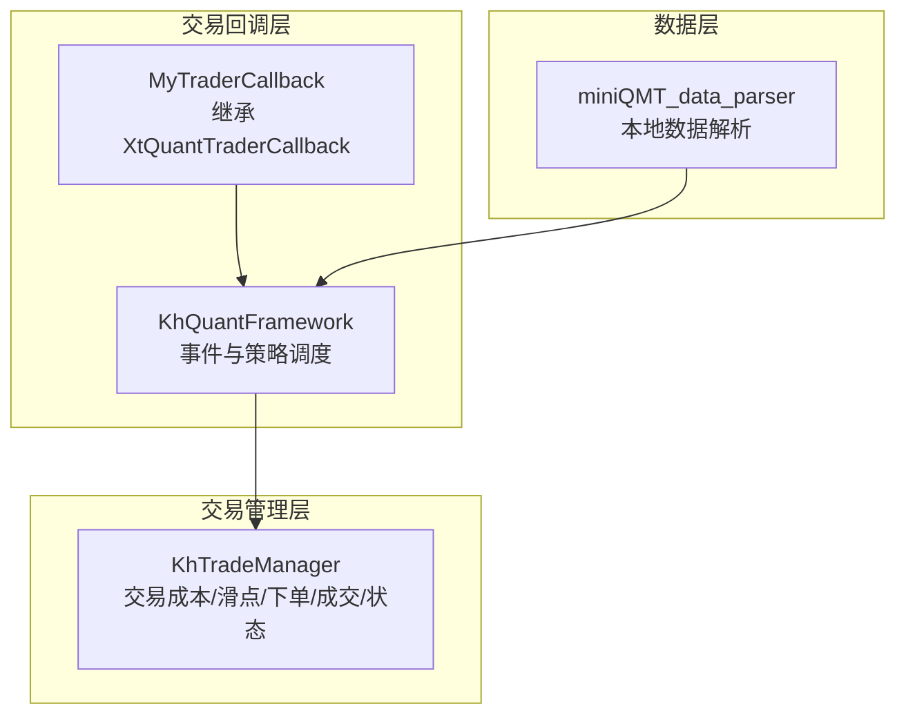
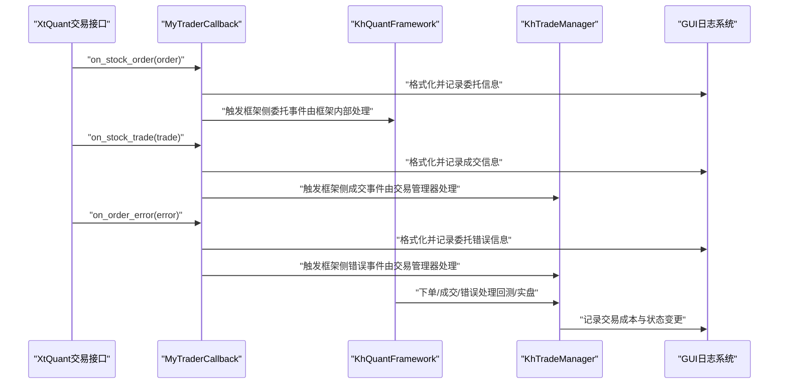
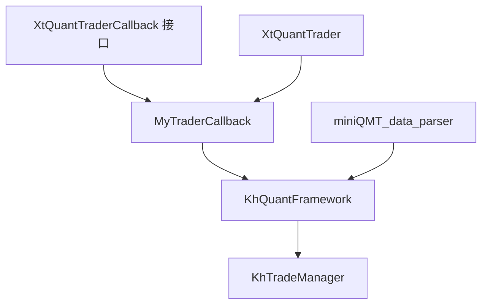

# 回调处理

<cite>
**本文引用的文件**
- [khFrame.py](file://khFrame.py)
- [khTrade.py](file://khTrade.py)
- [khFrame.md](file://modules/khFrame.md)
- [miniQMT_data_parser.py](file://miniQMT_data_parser.py)
</cite>

## 目录
1. [简介](#简介)
2. [项目结构](#项目结构)
3. [核心组件](#核心组件)
4. [架构总览](#架构总览)
5. [详细组件分析](#详细组件分析)
6. [依赖分析](#依赖分析)
7. [性能考量](#性能考量)
8. [故障排查指南](#故障排查指南)
9. [结论](#结论)
10. [附录](#附录)

## 简介
本文件聚焦于框架内的回调处理机制，尤其是 MyTraderCallback 类如何继承 XtQuantTraderCallback 并实现 on_stock_order、on_stock_trade、on_order_error 等核心回调方法。文档将详细说明各回调的触发条件、输入参数结构、处理逻辑与错误处理策略；阐述回调如何将 MiniQMT 交易回报数据转换为框架内部的标准化格式，并通过日志系统与事件系统进行分发；结合 khFrame.md 中的技术文档，解释回调与 KhTradeManager 的交互关系，以及如何更新账户、持仓与委托状态；最后提供错误处理与异常捕获的最佳实践示例路径，确保系统稳定性。

## 项目结构
围绕回调处理的核心文件与职责如下：
- khFrame.py：定义 MyTraderCallback（继承 XtQuantTraderCallback）、KhQuantFramework、以及与交易相关的事件回调（如 on_stock_order、on_stock_trade、on_order_error 等）。同时包含框架主流程、数据加载、策略执行与回测引擎等。
- khTrade.py：定义 KhTradeManager，负责交易成本计算、滑点模拟、下单与成交处理、账户与持仓状态维护，并在关键节点触发回调。
- khFrame.md：框架设计与模块说明文档，涵盖策略生命周期、数据管理、回测引擎、成本与滑点模拟等。
- miniQMT_data_parser.py：MiniQMT 数据解析器，用于解析本地 tick/K 线数据，为回测提供数据基础。

图表来源
- [khFrame.py](file://khFrame.py#L277-L480)
- [khTrade.py](file://khTrade.py#L1-L200)
- [miniQMT_data_parser.py](file://miniQMT_data_parser.py#L1-L120)

章节来源
- [khFrame.py](file://khFrame.py#L277-L480)
- [khTrade.py](file://khTrade.py#L1-L200)
- [khFrame.md](file://modules/khFrame.md#L1-L120)

## 核心组件
- MyTraderCallback：实现 XtQuantTraderCallback 的回调方法，负责将底层交易回报标准化为统一的消息格式并通过 GUI 日志系统输出，同时在回测/实盘中触发框架侧的资产、持仓、委托等事件。
- KhTradeManager：封装交易成本计算、滑点模拟、下单与成交处理、账户与持仓状态维护，并在关键节点触发回调，驱动框架侧状态更新。
- KhQuantFramework：框架主类，负责策略生命周期、数据加载、回测执行与事件分发，回调通过其上的 trader_callback 字段与 GUI 日志系统对接。

章节来源
- [khFrame.py](file://khFrame.py#L277-L480)
- [khTrade.py](file://khTrade.py#L1-L200)
- [khFrame.md](file://modules/khFrame.md#L1-L120)

## 架构总览
回调处理在框架中的位置与交互如下：

图表来源
- [khFrame.py](file://khFrame.py#L277-L480)
- [khFrame.py](file://khFrame.py#L3080-L3152)
- [khTrade.py](file://khTrade.py#L522-L595)

## 详细组件分析

### MyTraderCallback 类与 XtQuantTraderCallback 继承关系
- MyTraderCallback 继承自 XtQuantTraderCallback，重写并扩展了多种回调方法，包括 on_stock_order、on_stock_trade、on_order_error、on_cancel_error、on_disconnected、on_order_stock_async_response、on_cancel_order_stock_async_response、on_account_status、on_stock_position、on_connected、on_stock_asset 等。
- 该类持有 gui 属性，用于统一的日志输出；同时维护 price_decimals 以保证价格显示精度一致。

章节来源
- [khFrame.py](file://khFrame.py#L277-L480)

### on_stock_order 回调
- 触发条件：当底层交易接口返回委托回报时触发。
- 输入参数结构：order 对象包含但不限于 stock_code、order_type（买入/卖出）、price、order_volume、order_id、order_time、status_msg 等字段。
- 处理逻辑：
  - 将 order_type 映射为中文方向描述；
  - 将 order_status 映射为中文状态描述；
  - 统一时间戳格式（支持秒/毫秒时间戳与字符串格式）；
  - 使用 price_decimals 控制价格精度；
  - 通过 gui.log_message 输出标准化消息。
- 错误处理：在 try-except 中捕获异常并输出错误日志，避免影响主流程。

章节来源
- [khFrame.py](file://khFrame.py#L288-L341)

### on_stock_trade 回调
- 触发条件：当底层交易接口返回成交回报时触发。
- 输入参数结构：trade 对象包含但不限于 stock_code、order_type、traded_price、traded_volume、traded_amount、traded_id、traded_time、order_remark 等字段；若存在 actual_price 则优先使用。
- 处理逻辑：
  - 选择 actual_price 或 traded_price 作为成交价格；
  - 统一时间戳格式；
  - 使用 price_decimals 控制价格精度；
  - 通过 gui.log_message 输出标准化消息。
- 错误处理：在 try-except 中捕获异常并输出错误日志。

章节来源
- [khFrame.py](file://khFrame.py#L342-L390)

### on_order_error 回调
- 触发条件：当委托发生错误（如资金不足、数量非法、系统错误等）时触发。
- 输入参数结构：order_error 对象包含 stock_code、error_id、error_msg、order_remark 等字段。
- 处理逻辑：
  - 组装错误信息并输出；
  - 便于上层（如 KhTradeManager）进行错误统计与告警。
- 错误处理：在 try-except 中捕获异常并输出错误日志。

章节来源
- [khFrame.py](file://khFrame.py#L391-L407)

### 其他相关回调
- on_cancel_error：撤单错误回报，格式化并输出错误信息。
- on_disconnected/on_connected：交易连接断开/连接成功通知。
- on_order_stock_async_response/on_cancel_order_stock_async_response：异步下单/撤单回报。
- on_account_status：账户状态变动通知。
- on_stock_position/on_stock_asset：框架侧的持仓与资产变动回调（KhQuantFramework 内部实现）。

章节来源
- [khFrame.py](file://khFrame.py#L408-L480)
- [khFrame.py](file://khFrame.py#L3080-L3152)

### 回调与 KhTradeManager 的交互关系
- KhTradeManager 在下单与成交处理过程中，会根据运行模式（live/simulate/backtest）执行不同逻辑，并在关键节点触发回调：
  - 资金/持仓检查失败时，通过 self.callback.on_order_error(...) 触发委托错误回调；
  - 回测模式下，创建订单与成交字典后，使用 SimpleNamespace 包装并触发 on_stock_order/on_stock_trade；
  - 持仓变化时触发 on_stock_position；
  - 资产变化时触发 on_stock_asset（框架侧实现）。
- 回调的作用是将底层 MiniQMT 交易回报转换为框架内部的标准化消息，通过日志系统与事件系统进行分发，从而驱动账户、持仓与委托状态的更新。

章节来源
- [khTrade.py](file://khTrade.py#L240-L507)
- [khTrade.py](file://khTrade.py#L522-L595)
- [khFrame.py](file://khFrame.py#L3080-L3152)

### MiniQMT 交易回报数据的标准化转换
- 回调方法通过统一的字段映射与时间戳格式化，将底层回报转换为框架内部一致的消息格式；
- 价格精度通过 price_decimals 控制，确保日志与 GUI 显示的一致性；
- 对于回测场景，KhTradeManager 会预先计算交易成本与滑点，并在触发回调前完成资产与持仓的更新，确保回调输出的信息与当前状态一致。

章节来源
- [khFrame.py](file://khFrame.py#L288-L390)
- [khTrade.py](file://khTrade.py#L161-L196)
- [khTrade.py](file://khTrade.py#L226-L327)

### 日志系统与事件系统分发
- MyTraderCallback 通过 gui.log_message 将标准化消息输出到日志系统；
- KhQuantFramework 在内部也实现了 on_stock_order/on_stock_trade/on_order_error 等回调，用于框架侧的事件处理与状态更新；
- 交易成本与状态变更信息通过日志系统进行可视化输出，便于用户监控与审计。

章节来源
- [khFrame.py](file://khFrame.py#L3080-L3152)
- [khFrame.py](file://khFrame.py#L277-L480)

## 依赖分析
- MyTraderCallback 依赖 XtQuantTraderCallback 接口，接收底层交易回报；
- KhTradeManager 依赖 xtquant.xttrader/XtQuantTraderCallback 与 xtquant.xtconstant 常量；
- KhQuantFramework 依赖 khTrade.KhTradeManager、khRisk.KhRiskManager、khQTTools 等模块；
- 数据层依赖 miniQMT_data_parser，用于解析本地 tick/K 线数据，支撑回测与策略执行。

图表来源
- [khFrame.py](file://khFrame.py#L277-L480)
- [khTrade.py](file://khTrade.py#L1-L200)
- [miniQMT_data_parser.py](file://miniQMT_data_parser.py#L1-L120)

章节来源
- [khFrame.py](file://khFrame.py#L277-L480)
- [khTrade.py](file://khTrade.py#L1-L200)
- [miniQMT_data_parser.py](file://miniQMT_data_parser.py#L1-L120)

## 性能考量
- 回调处理采用 try-except 包裹，避免异常传播影响主流程；
- 价格精度与时间戳格式化在回调中集中处理，减少重复计算；
- 回测模式下，KhTradeManager 在下单前进行资金与持仓检查，提前失败可减少无效回调；
- 日志输出采用统一的 gui.log_message，便于批量输出与性能优化。

[本节为一般性指导，不涉及具体文件分析]

## 故障排查指南
- 委托错误回调：当出现资金不足、持仓不足、数量非法等情况时，KhTradeManager 会通过 on_order_error 触发错误回调。建议检查交易成本配置、滑点设置与账户可用资金。
- 成交回报异常：若成交回报字段缺失或格式异常，回调会进行容错处理并输出错误日志。建议核对 MiniQMT 数据字段与时间戳格式。
- 连接断开/恢复：on_disconnected/on_connected 回调用于提示交易连接状态变化，便于定位网络或服务端问题。
- 日志定位：所有回调均通过 gui.log_message 输出，可在日志中快速定位委托、成交与错误信息。

章节来源
- [khTrade.py](file://khTrade.py#L288-L327)
- [khFrame.py](file://khFrame.py#L391-L407)
- [khFrame.py](file://khFrame.py#L424-L428)

## 结论
MyTraderCallback 通过标准化底层交易回报，将委托、成交与错误信息转化为框架内部一致的消息格式，并借助日志系统与事件系统实现稳定分发。KhTradeManager 在下单与成交处理中承担核心职责，结合交易成本与滑点模拟，确保回测与实盘的一致性。通过完善的错误处理与日志输出，系统在复杂交易场景下仍能保持可观测性与稳定性。

[本节为总结性内容，不涉及具体文件分析]

## 附录

### 回调方法触发条件与输入参数要点
- on_stock_order：委托回报；关键字段 stock_code、order_type、price、order_volume、order_id、order_time、status_msg。
- on_stock_trade：成交回报；关键字段 stock_code、order_type、traded_price/traded_amount、traded_volume、traded_id、traded_time、order_remark；优先使用 actual_price。
- on_order_error：委托错误；关键字段 stock_code、error_id、error_msg、order_remark。

章节来源
- [khFrame.py](file://khFrame.py#L288-L390)
- [khFrame.py](file://khFrame.py#L391-L407)

### 代码示例路径（错误处理与异常捕获）
- 委托错误触发示例路径：[khTrade.py](file://khTrade.py#L290-L327)
- 成交回报异常捕获示例路径：[khFrame.py](file://khFrame.py#L342-L390)
- 委托错误异常捕获示例路径：[khFrame.py](file://khFrame.py#L391-L407)

章节来源
- [khTrade.py](file://khTrade.py#L290-L327)
- [khFrame.py](file://khFrame.py#L342-L407)