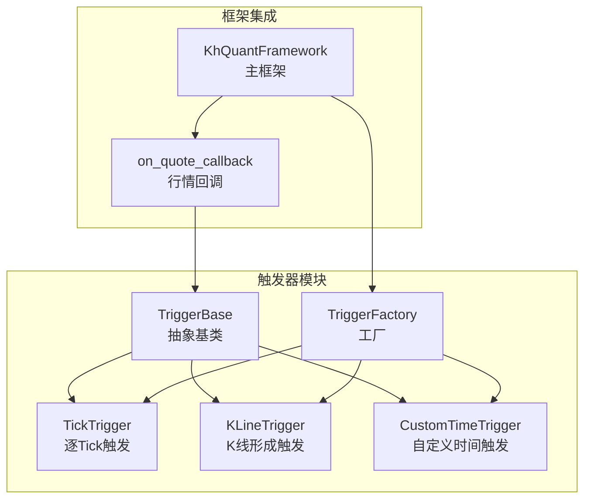
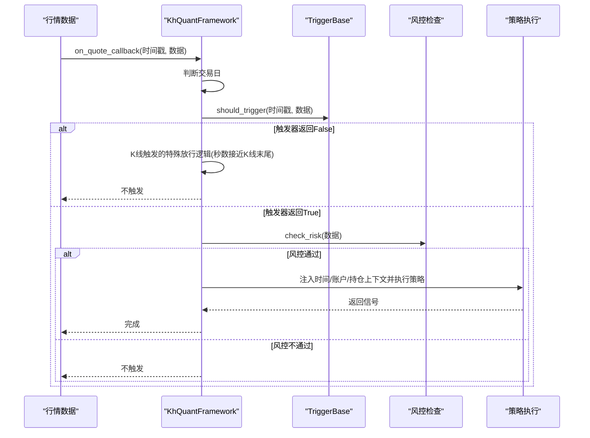
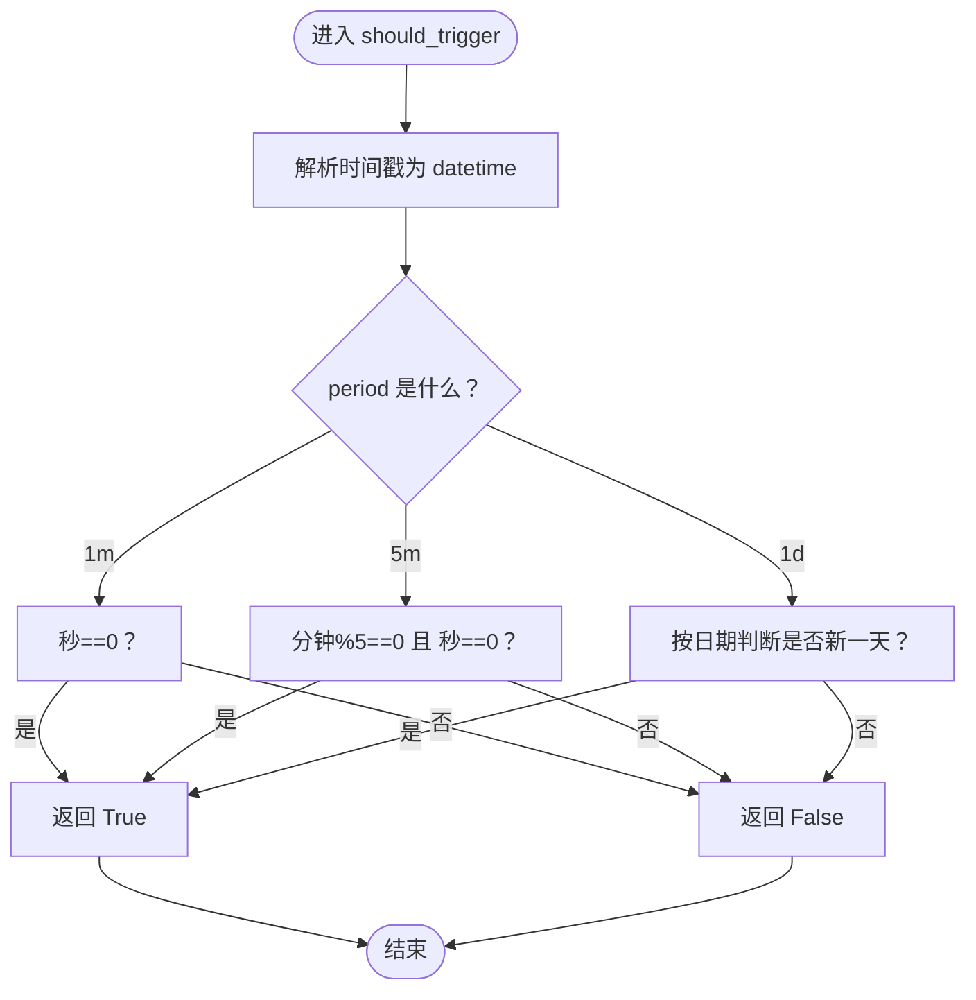
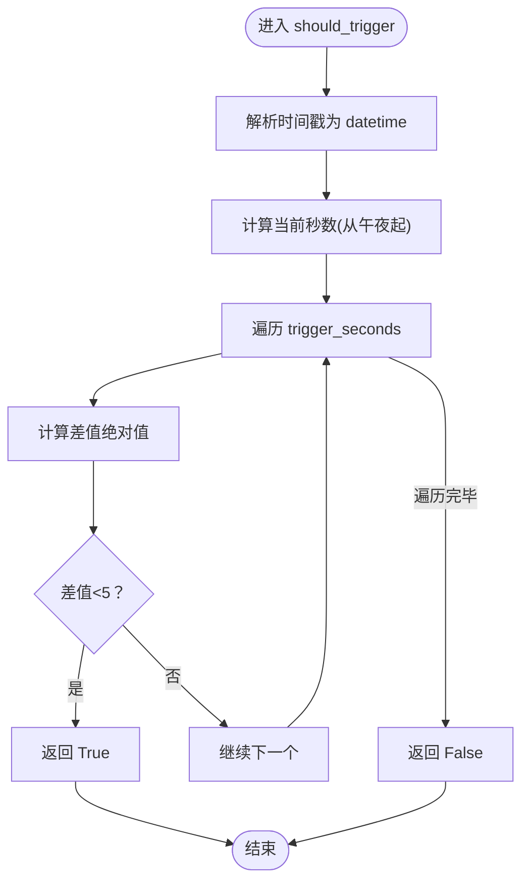
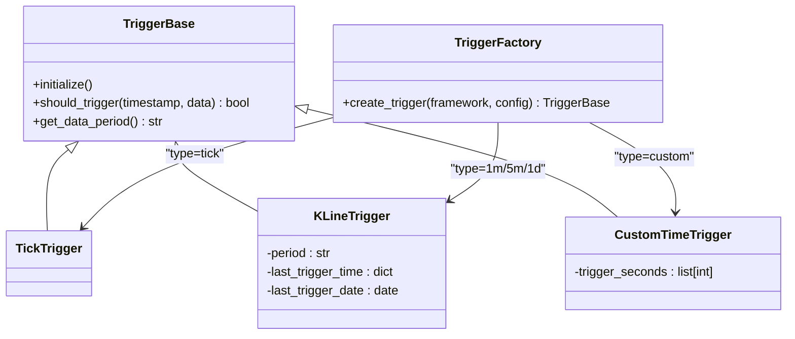
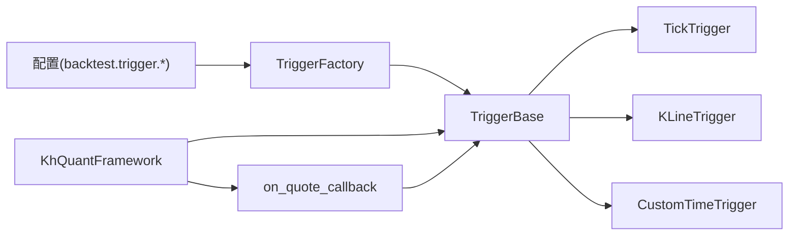

# 触发机制

<cite>
**本文引用的文件**
- [khFrame.py](file://khFrame.py)
- [khConfig.py](file://khConfig.py)
- [README.md](file://README.md)
- [GUIkhQuant.py](file://GUIkhQuant.py)
- [modules/khFrame.md](file://modules/khFrame.md)
- [RSI策略.py](file://strategies/RSI策略.py)
- [双均线精简_使用khMA函数.py](file://strategies/双均线精简_使用khMA函数.py)
</cite>

## 目录
1. [引言](#引言)
2. [项目结构](#项目结构)
3. [核心组件](#核心组件)
4. [架构总览](#架构总览)
5. [详细组件分析](#详细组件分析)
6. [依赖关系分析](#依赖关系分析)
7. [性能考量](#性能考量)
8. [故障排查指南](#故障排查指南)
9. [结论](#结论)
10. [附录](#附录)

## 引言
本文件系统性梳理触发机制的设计与实现，围绕 TriggerBase、TickTrigger、KLineTrigger、CustomTimeTrigger 四个核心类展开，并详解 TriggerFactory 的动态创建流程。重点剖析 should_trigger 方法的实现逻辑，尤其是 KLineTrigger 如何通过检查分钟数和秒数判断 K 线是否形成，以及 CustomTimeTrigger 如何通过计算从午夜开始的秒数匹配自定义时间点。结合 modules/khFrame.md 与 README.md 中的技术文档，说明不同触发模式（Tick、K 线、自定义时间）对回测性能与策略逻辑的影响，并提供配置示例与最佳实践，帮助用户根据策略需求选择合适的触发器。

## 项目结构
触发机制位于 khFrame.py 中，由 TriggerBase 抽象基类与三个具体触发器实现组成，并通过 TriggerFactory 工厂根据配置动态创建。KhQuantFramework 在运行时注入触发器实例，on_quote_callback 中调用触发器判断是否执行策略。

图表来源
- [khFrame.py](file://khFrame.py#L52-L244)
- [khFrame.py](file://khFrame.py#L245-L276)
- [khFrame.py](file://khFrame.py#L745-L831)

章节来源
- [khFrame.py](file://khFrame.py#L52-L244)
- [khFrame.py](file://khFrame.py#L245-L276)
- [khFrame.py](file://khFrame.py#L745-L831)

## 核心组件
- TriggerBase：定义触发器通用接口，包括 should_trigger 与 get_data_period。
- TickTrigger：每个 Tick 都触发策略，适合高频策略与需要细粒度控制的场景。
- KLineTrigger：在 K 线形成时触发，支持“1m”、“5m”、“1d”，并维护每股票上次触发时间与日期。
- CustomTimeTrigger：在指定时间点触发，解析自定义时间列表为从午夜起的秒数，允许 5 秒容差。
- TriggerFactory：依据配置 backtest.trigger.type 创建对应触发器实例，支持 tick、1m、5m、1d、custom。

章节来源
- [khFrame.py](file://khFrame.py#L52-L244)
- [khFrame.py](file://khFrame.py#L245-L276)

## 架构总览
触发器在框架中的工作流如下：KhQuantFramework 初始化时通过 TriggerFactory 读取配置创建触发器；行情回调 on_quote_callback 接收数据后，先判断交易日，再用触发器 should_trigger 判定是否执行策略；对于 K 线触发，还存在“接近K线末尾秒数”的特殊放行逻辑；最后风控检查通过后，将时间信息与账户/持仓等上下文注入策略执行。

图表来源
- [khFrame.py](file://khFrame.py#L745-L831)
- [khFrame.py](file://khFrame.py#L814-L831)

章节来源
- [khFrame.py](file://khFrame.py#L745-L831)

## 详细组件分析

### TriggerBase 抽象基类
- 职责：定义触发器统一接口，提供 should_trigger 与 get_data_period 的默认实现。
- 设计要点：get_data_period 用于提示数据周期，便于框架在启动时校验数据周期与触发类型是否匹配。

章节来源
- [khFrame.py](file://khFrame.py#L52-L86)

### TickTrigger 实现
- should_trigger 行为：始终返回 True，即每个 Tick 都触发策略。
- get_data_period：返回 "tick"，提示使用逐 Tick 数据。
- 适用场景：需要高频响应、策略中自行做二次过滤的场景；回测数据量大，性能压力较高。

章节来源
- [khFrame.py](file://khFrame.py#L88-L111)

### KLineTrigger 实现
- 关键字段：
  - period：K 线周期，支持 "1m"、"5m"、"1d"。
  - last_trigger_time：按股票记录上次触发时间，避免重复触发。
  - last_trigger_date：按日期记录上次触发，用于日 K 线去重。
- should_trigger 逻辑：
  - 解析时间戳（支持字符串与毫秒/秒级），统一转为 datetime。
  - 1 分钟 K 线：当秒数为 0 时触发。
  - 5 分钟 K 线：当分钟数对 5 取余为 0 且秒数为 0 时触发。
  - 日 K 线：按日期变化触发，避免同日重复。
- 特殊放行逻辑（K 线触发）：
  - 当触发器返回 False 时，框架仍允许在接近 K 线末尾（秒数≥57）时放行，确保策略能在 K 线形成后及时执行。
- get_data_period：返回 period，提示使用相应周期数据。

图表来源
- [khFrame.py](file://khFrame.py#L128-L178)

章节来源
- [khFrame.py](file://khFrame.py#L112-L178)
- [khFrame.py](file://khFrame.py#L786-L812)

### CustomTimeTrigger 实现
- 关键字段：
  - trigger_seconds：将自定义时间点列表解析为从午夜起的秒数，并排序。
- should_trigger 逻辑：
  - 解析当前时间，计算当前秒数（从午夜起）。
  - 遍历 trigger_seconds，若当前秒数与任一触发秒数的差值小于 5 秒，则触发。
- get_data_period：返回 "1s"，提示使用 1 秒级数据。
- 注意事项：
  - README 指出，自定义时间触发不会自动向策略 khHandlebar 传入当前数据，策略需自行调用数据接口获取所需数据。
  - 框架会根据时间点特征智能选择数据周期：若均为整分钟点则使用 1 分钟 K 线，否则使用 Tick 数据。

图表来源
- [khFrame.py](file://khFrame.py#L182-L244)
- [README.md](file://README.md#L943-L967)

章节来源
- [khFrame.py](file://khFrame.py#L182-L244)
- [README.md](file://README.md#L943-L967)

### TriggerFactory 工厂
- create_trigger 逻辑：
  - 读取配置 backtest.trigger.type，默认 "tick"。
  - 支持 "tick"、"1m"、"5m"、"1d"、"custom"。
  - custom 模式需提供 backtest.trigger.custom_times 列表。
  - 其他类型默认返回 TickTrigger。
- 与 KhQuantFramework 的集成：
  - KhQuantFramework 在初始化时调用 TriggerFactory.create_trigger(self, self.config.config_dict) 创建触发器实例。

图表来源
- [khFrame.py](file://khFrame.py#L245-L276)
- [khFrame.py](file://khFrame.py#L52-L244)

章节来源
- [khFrame.py](file://khFrame.py#L245-L276)
- [khFrame.py](file://khFrame.py#L52-L244)

## 依赖关系分析
- KhQuantFramework 依赖 TriggerFactory 创建触发器实例，并在 on_quote_callback 中调用触发器的 should_trigger 判断策略执行时机。
- KLineTrigger 依赖 last_trigger_time 与 last_trigger_date 实现去重与日 K 线触发。
- CustomTimeTrigger 依赖 trigger_seconds 列表与当前时间秒数计算实现触发。
- 框架在启动时会对比 get_data_period 与配置的数据周期，给出不匹配警告，提示用户调整配置以获得更佳性能与精度。

图表来源
- [khFrame.py](file://khFrame.py#L245-L276)
- [khFrame.py](file://khFrame.py#L52-L244)
- [khFrame.py](file://khFrame.py#L745-L831)
- [khFrame.py](file://khFrame.py#L1160-L1243)

章节来源
- [khFrame.py](file://khFrame.py#L745-L831)
- [khFrame.py](file://khFrame.py#L1160-L1243)

## 性能考量
- Tick 触发：理论上最灵活，但回测数据量大，系统资源消耗高，回测速度慢。适合需要精细过滤与高频响应的策略。
- K 线触发：数据量小，资源消耗低，回测速度快，适合中长期趋势与技术分析策略。README 指出实盘与回测在 K 线触发上的差异（实盘推送频率通常为 3 秒一次，回测严格在 K 线结束后执行）。
- 自定义时间触发：README 指出会自动智能适配数据周期：若均为整分钟点使用 1 分钟 K 线，否则使用 Tick 数据，兼顾精度与性能。

章节来源
- [README.md](file://README.md#L924-L967)

## 故障排查指南
- 触发器未按预期触发
  - 检查配置 backtest.trigger.type 与 backtest.trigger.custom_times 是否正确。
  - 对于 K 线触发，确认数据周期与触发类型匹配（框架会在不匹配时给出警告）。
  - 对于 CustomTimeTrigger，确认时间点列表格式为 HH:MM:SS，且秒数差值在 5 秒容差内。
- 回测性能异常
  - 若使用 Tick 触发，考虑切换为 K 线或自定义时间触发以降低数据量与执行频率。
  - 自定义时间触发时，尽量使用整分钟点以启用 1 分钟 K 线数据，减少 Tick 数据带来的开销。
- 策略未获取到数据
  - 自定义时间触发不会自动传入当前数据，需在策略内部自行调用数据接口获取所需数据。

章节来源
- [khFrame.py](file://khFrame.py#L1160-L1243)
- [README.md](file://README.md#L943-L967)

## 结论
触发机制通过 TriggerBase 抽象与 TriggerFactory 工厂实现了高度可配置的策略执行节奏控制。TickTrigger 提供最大灵活性，KLineTrigger 与 CustomTimeTrigger 则分别满足周期性与精准时间点的策略需求。框架在运行时对触发器与数据周期进行一致性检查，并在 README 中明确了不同触发模式对性能与策略逻辑的影响。用户应根据策略特性选择合适的触发器，并合理配置时间点与数据周期，以获得更优的回测性能与策略表现。

## 附录

### 配置示例与最佳实践
- Tick 触发
  - 配置键：backtest.trigger.type = "tick"
  - 适用：需要逐 Tick 响应的策略，或策略内部做复杂过滤。
  - 性能：数据量大，回测较慢。
- K 线触发
  - 配置键：backtest.trigger.type = "1m" 或 "5m" 或 "1d"
  - 适用：趋势策略、技术分析策略。
  - 性能：数据量小，回测快。
- 自定义时间触发
  - 配置键：
    - backtest.trigger.type = "custom"
    - backtest.trigger.custom_times = ["09:30:00", "11:30:00", "15:00:00"]
  - 适用：开盘集合竞价、收盘前交易等定时策略。
  - 性能：框架会智能选择 1 分钟 K 线或 Tick 数据；尽量使用整分钟点以提升性能。
- 数据周期与触发类型匹配
  - 框架会在启动时检测不匹配并给出警告，建议按提示调整配置。

章节来源
- [khFrame.py](file://khFrame.py#L245-L276)
- [khFrame.py](file://khFrame.py#L1160-L1243)
- [README.md](file://README.md#L924-L967)
- [GUIkhQuant.py](file://GUIkhQuant.py#L2026-L2033)
- [GUIkhQuant.py](file://GUIkhQuant.py#L2566-L2586)

### 策略中使用触发器的注意事项
- 自定义时间触发不会自动传入当前数据，策略需自行获取所需数据。
- K 线触发在接近 K 线末尾秒数时会被框架放行，确保策略在 K 线形成后及时执行。
- Tick 触发适合高频策略，但需注意回测性能与资源消耗。

章节来源
- [README.md](file://README.md#L943-L967)
- [khFrame.py](file://khFrame.py#L786-L812)