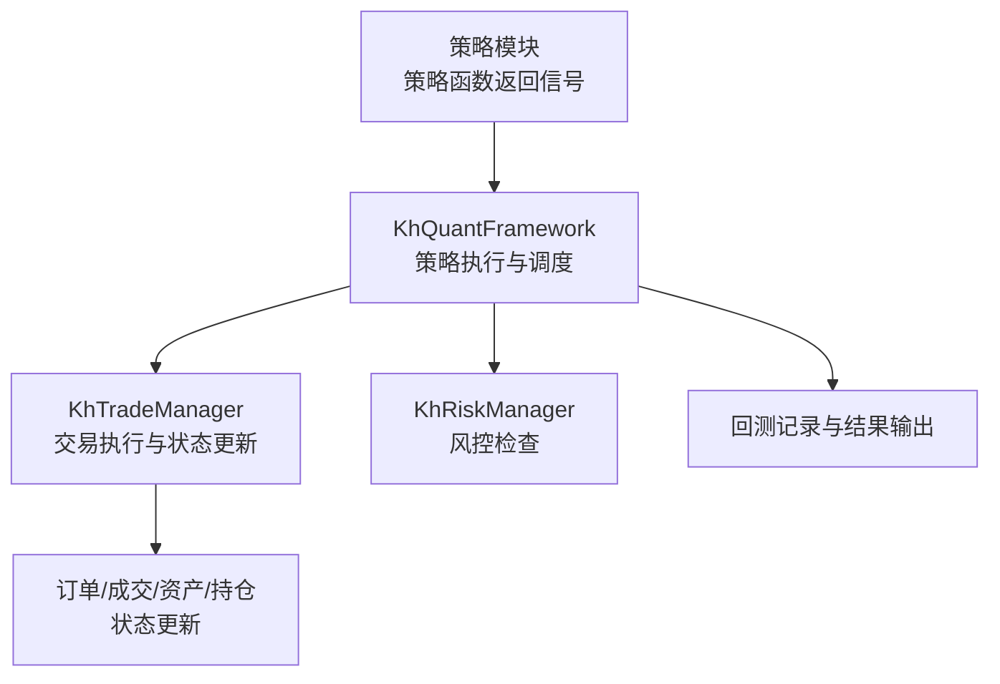
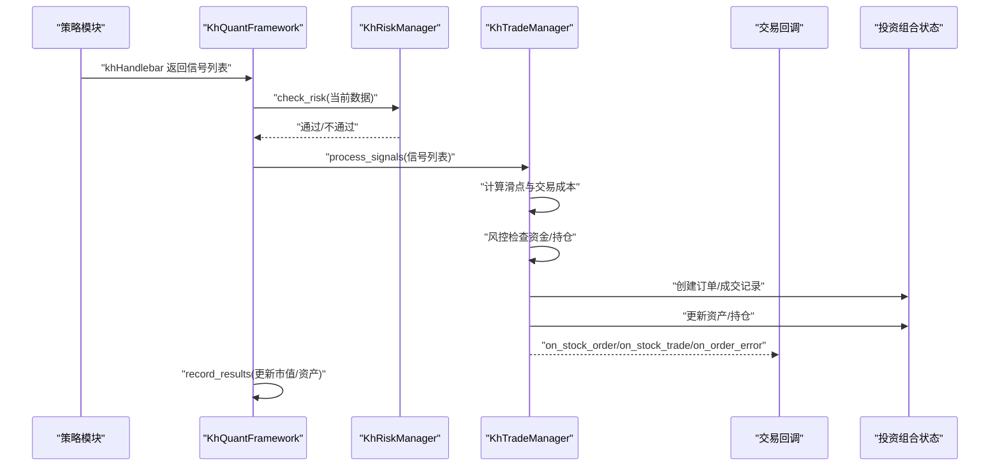
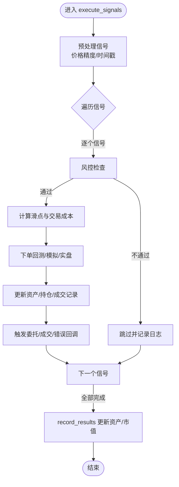
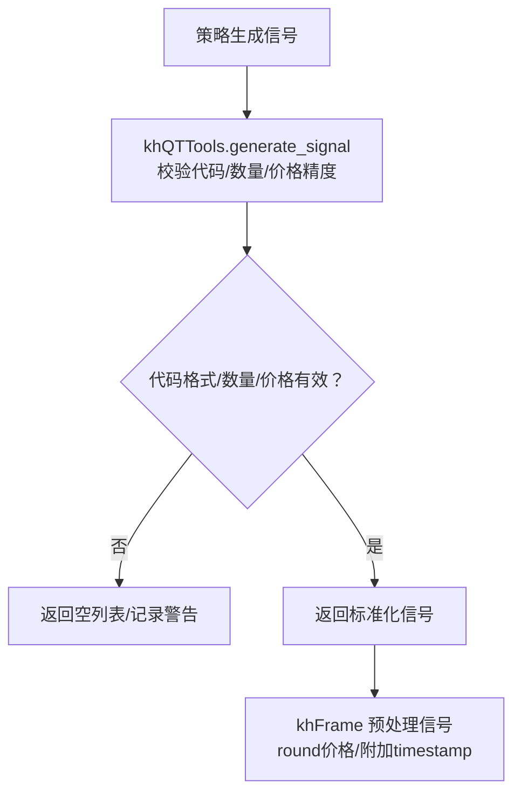
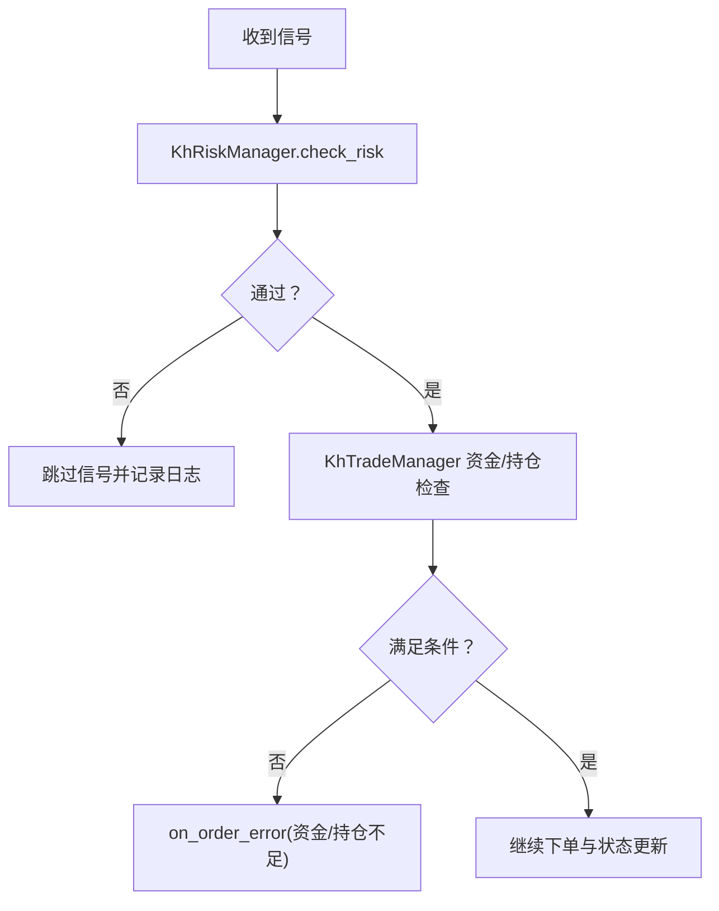
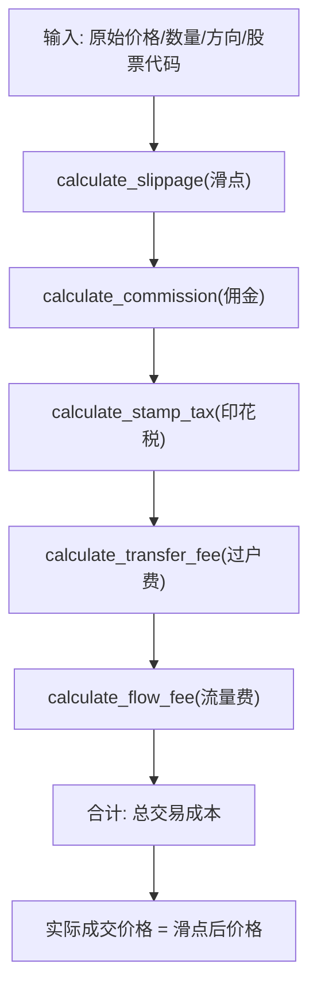
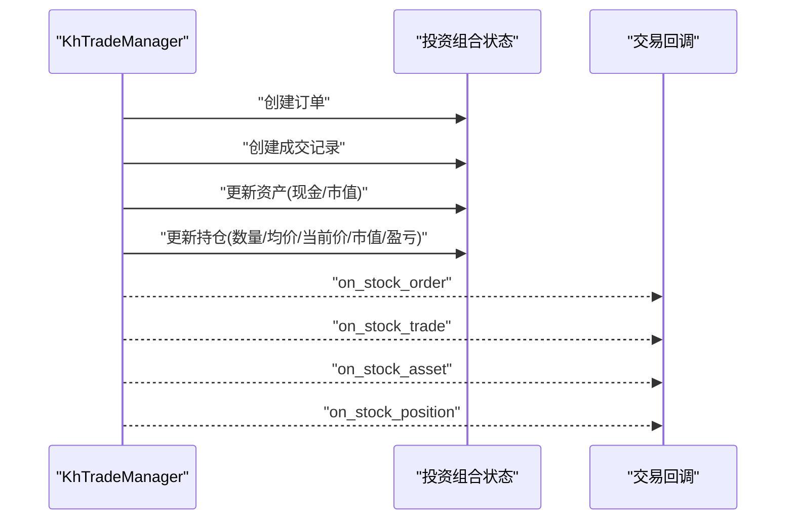
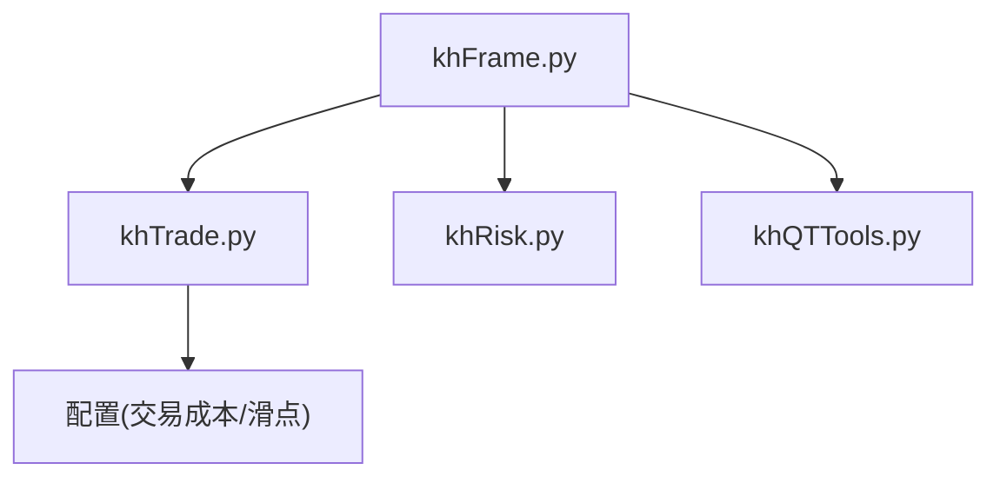

# 交易执行

<cite>
**本文引用的文件**
- [khFrame.py](file://khFrame.py)
- [khTrade.py](file://khTrade.py)
- [khRisk.py](file://khRisk.py)
- [khFrame.md](file://modules/khFrame.md)
- [khQTTools.py](file://khQTTools.py)
</cite>

## 目录
1. [简介](#简介)
2. [项目结构](#项目结构)
3. [核心组件](#核心组件)
4. [架构总览](#架构总览)
5. [详细组件分析](#详细组件分析)
6. [依赖关系分析](#依赖关系分析)
7. [性能考量](#性能考量)
8. [故障排查指南](#故障排查指南)
9. [结论](#结论)
10. [附录](#附录)

## 简介
本文件聚焦于交易执行流程，围绕 khFrame.py 中交易信号的验证、执行与记录，以及 khTrade.py 中 KhTradeManager 的协同工作机制展开。结合 modules/khFrame.md 的流程图，系统梳理从策略信号到最终投资组合变更的完整数据流，重点覆盖风控检查、成本计算、滑点应用、订单/成交/资产/持仓更新等环节，并提供代码示例路径以定位验证逻辑与失败处理机制。

## 项目结构
- khFrame.py：策略执行引擎核心，负责策略生命周期、事件驱动、数据处理与交易执行；包含 execute_signals 的调用链与回测主循环。
- khTrade.py：交易管理器，封装交易成本计算、滑点、下单与投资组合状态更新。
- khRisk.py：风险管理器，提供风控检查入口。
- khFrame.md：模块文档，包含策略执行流程、信号验证规则与回测引擎说明。
- khQTTools.py：工具模块，提供信号生成与验证逻辑（如股票代码格式、交易数量为100的整数倍等）。

图表来源
- [khFrame.py](file://khFrame.py#L2132-L2156)
- [khTrade.py](file://khTrade.py#L198-L595)
- [khRisk.py](file://khRisk.py#L1-L51)

章节来源
- [khFrame.py](file://khFrame.py#L2132-L2156)
- [khTrade.py](file://khTrade.py#L198-L595)
- [khRisk.py](file://khRisk.py#L1-L51)

## 核心组件
- KhQuantFramework：策略执行引擎，负责加载策略、构建上下文、触发策略、执行信号、记录结果。
- KhTradeManager：交易管理器，负责信号处理、成本计算、滑点应用、下单、成交、资产与持仓更新。
- KhRiskManager：风险管理器，提供风控检查入口（在 khFrame 中调用）。
- khQTTools：信号生成与验证工具，包含股票代码格式、交易数量为100的整数倍等规则。

章节来源
- [khFrame.py](file://khFrame.py#L2132-L2156)
- [khTrade.py](file://khTrade.py#L198-L595)
- [khRisk.py](file://khRisk.py#L1-L51)
- [khQTTools.py](file://khQTTools.py#L631-L752)

## 架构总览
从策略信号到最终投资组合变更的端到端流程如下：

图表来源
- [khFrame.py](file://khFrame.py#L2074-L2156)
- [khTrade.py](file://khTrade.py#L198-L595)
- [khRisk.py](file://khRisk.py#L1-L51)

## 详细组件分析

### 1) execute_signals 与信号处理主流程
- khFrame 在策略执行后，对信号进行预处理（价格精度、时间戳），然后调用 trade_mgr.process_signals 批量执行。
- 在回测主循环中，execute_signals 会依次对每个信号进行风控检查、成本计算、滑点应用、下单与成交、资产与持仓更新，并记录交易明细。

图表来源
- [khFrame.py](file://khFrame.py#L2132-L2156)
- [khFrame.py](file://khFrame.py#L2600-L2799)
- [khTrade.py](file://khTrade.py#L198-L595)

章节来源
- [khFrame.py](file://khFrame.py#L2132-L2156)
- [khFrame.py](file://khFrame.py#L2600-L2799)
- [khTrade.py](file://khTrade.py#L198-L595)

### 2) 信号验证与生成（股票代码格式、数量为100的整数倍）
- 信号生成与验证由 khQTTools 提供，确保：
  - 股票代码格式符合要求（例如正则匹配）。
  - 交易数量必须为100的整数倍（买入/卖出均如此）。
  - 价格精度按股票池类型动态设置。
- khFrame 在策略返回信号后，也会对价格进行统一精度处理并附加时间戳。

图表来源
- [khQTTools.py](file://khQTTools.py#L631-L752)
- [khFrame.py](file://khFrame.py#L2136-L2145)

章节来源
- [khQTTools.py](file://khQTTools.py#L631-L752)
- [khFrame.py](file://khFrame.py#L2136-L2145)

### 3) 风控检查与失败处理
- khFrame 在执行信号前调用 KhRiskManager.check_risk，若不通过则跳过该信号。
- khTrade 在回测下单阶段还会进行资金/持仓检查，若不满足条件则触发委托错误回调并记录日志。

图表来源
- [khFrame.py](file://khFrame.py#L2074-L2086)
- [khRisk.py](file://khRisk.py#L1-L51)
- [khTrade.py](file://khTrade.py#L288-L339)

章节来源
- [khFrame.py](file://khFrame.py#L2074-L2086)
- [khRisk.py](file://khRisk.py#L1-L51)
- [khTrade.py](file://khTrade.py#L288-L339)

### 4) 成本计算与滑点应用
- KhTradeManager 提供滑点与交易成本计算接口，支持“tick”和“ratio”两种模式。
- 回测下单时，先计算滑点后的实际成交价格，再计算佣金、印花税、过户费、流量费等总成本，随后据此更新资产与持仓。

图表来源
- [khTrade.py](file://khTrade.py#L81-L196)

章节来源
- [khTrade.py](file://khTrade.py#L81-L196)

### 5) 订单、成交、资产与持仓更新
- 回测下单阶段，KhTradeManager 创建订单与成交记录，更新资产（现金、冻结/在途资金简化处理）、持仓（数量、均价、当前价、市值、盈亏）。
- 持仓更新遵循 T+0/T+1 模式：T+0 下单可当天卖出，T+1 下单不可当天卖出。
- 成交回报后，触发 on_stock_order、on_stock_trade、on_stock_asset、on_stock_position 等回调。

图表来源
- [khTrade.py](file://khTrade.py#L330-L496)

章节来源
- [khTrade.py](file://khTrade.py#L330-L496)

### 6) 与 khFrame.md 的流程对照
- khFrame.md 描述了策略执行引擎的回测主循环、信号验证、成本计算与滑点模拟、投资组合管理等模块。
- khFrame.py 的实现与之对应：execute_signals 调用风险检查、交易执行与记录；KhTradeManager 完成成本计算与状态更新；KhRiskManager 提供风控入口。

章节来源
- [khFrame.md](file://modules/khFrame.md#L456-L585)
- [khFrame.md](file://modules/khFrame.md#L586-L666)
- [khFrame.md](file://modules/khFrame.md#L667-L800)
- [khFrame.py](file://khFrame.py#L2074-L2156)
- [khTrade.py](file://khTrade.py#L198-L595)

## 依赖关系分析
- khFrame 依赖 khTrade 与 khRisk，通过 trade_mgr 与 risk_mgr 协同完成交易执行与风控。
- khTrade 依赖配置（交易成本、滑点参数）与价格精度设置。
- khQTTools 为信号生成与验证提供前置保障，确保策略返回的信号满足基本约束。

图表来源
- [khFrame.py](file://khFrame.py#L510-L580)
- [khTrade.py](file://khTrade.py#L12-L44)
- [khQTTools.py](file://khQTTools.py#L631-L752)

章节来源
- [khFrame.py](file://khFrame.py#L510-L580)
- [khTrade.py](file://khTrade.py#L12-L44)
- [khQTTools.py](file://khQTTools.py#L631-L752)

## 性能考量
- 批量处理与缓存：khFrame 在记录阶段采用列表推导式批量构造交易记录，减少多次 append 的开销；对自定义时间触发与每日时间点进行缓存，降低重复计算。
- 市值计算优化：交易日时一次性批量获取价格并更新所有持仓的市值与盈亏，避免重复查询。
- 回调触发节流：仅当资产变化显著时触发资产回调，减少不必要的 UI 更新。

章节来源
- [khFrame.py](file://khFrame.py#L2670-L2732)
- [khFrame.py](file://khFrame.py#L2600-L2669)

## 故障排查指南
- 资金不足：当买入所需总资金（含成本）超过可用现金时，回测下单阶段会记录错误并触发委托错误回调。
- 持仓不足：卖出时可用持仓小于委托数量，触发委托错误回调并记录日志。
- 信号无效：数量为0或负数、股票代码格式不合法、数量非100的整数倍等，会被忽略并记录警告。
- 异常处理：下单过程抛出异常时，触发通用委托错误回调，便于定位问题。

章节来源
- [khTrade.py](file://khTrade.py#L288-L339)
- [khTrade.py](file://khTrade.py#L497-L507)
- [khQTTools.py](file://khQTTools.py#L631-L752)

## 结论
本文件系统性梳理了从策略信号到投资组合变更的交易执行全流程，明确了 khFrame 与 khTrade 的职责边界与协作关系，强调了风控检查、成本计算、滑点应用与状态更新的关键步骤，并提供了与 khFrame.md 流程图的对应关系。通过信号验证与失败处理机制，系统能够在回测阶段稳定地模拟真实交易行为，为策略开发与评估提供可靠支撑。

## 附录
- 代码示例路径（不直接展示代码内容，仅提供定位）：
  - execute_signals 调用链与回测主循环：[khFrame.py](file://khFrame.py#L2132-L2156)
  - 信号预处理（价格精度/时间戳）：[khFrame.py](file://khFrame.py#L2136-L2145)
  - 风控检查入口：[khFrame.py](file://khFrame.py#L2074-L2086)，[khRisk.py](file://khRisk.py#L1-L51)
  - 交易成本与滑点计算：[khTrade.py](file://khTrade.py#L81-L196)
  - 回测下单与状态更新：[khTrade.py](file://khTrade.py#L270-L496)
  - 信号验证（股票代码格式/数量为100的整数倍）：[khQTTools.py](file://khQTTools.py#L631-L752)
  - 记录与结果输出（每日统计/汇总指标）：[khFrame.py](file://khFrame.py#L2275-L2471)