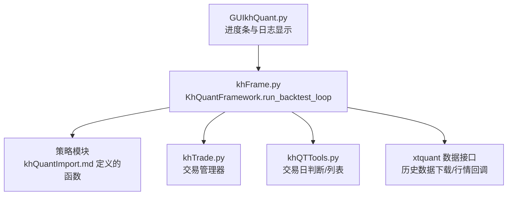
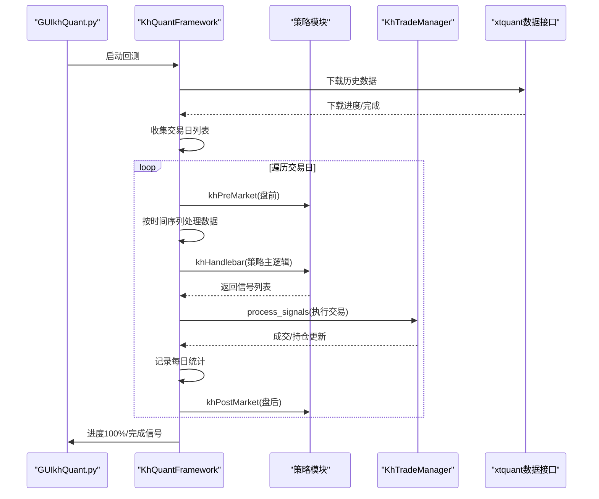
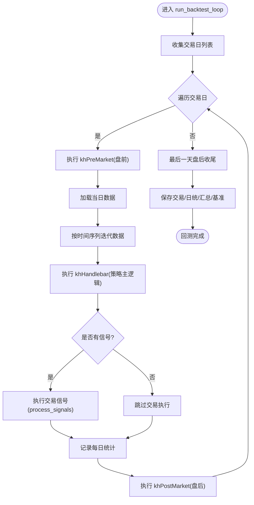
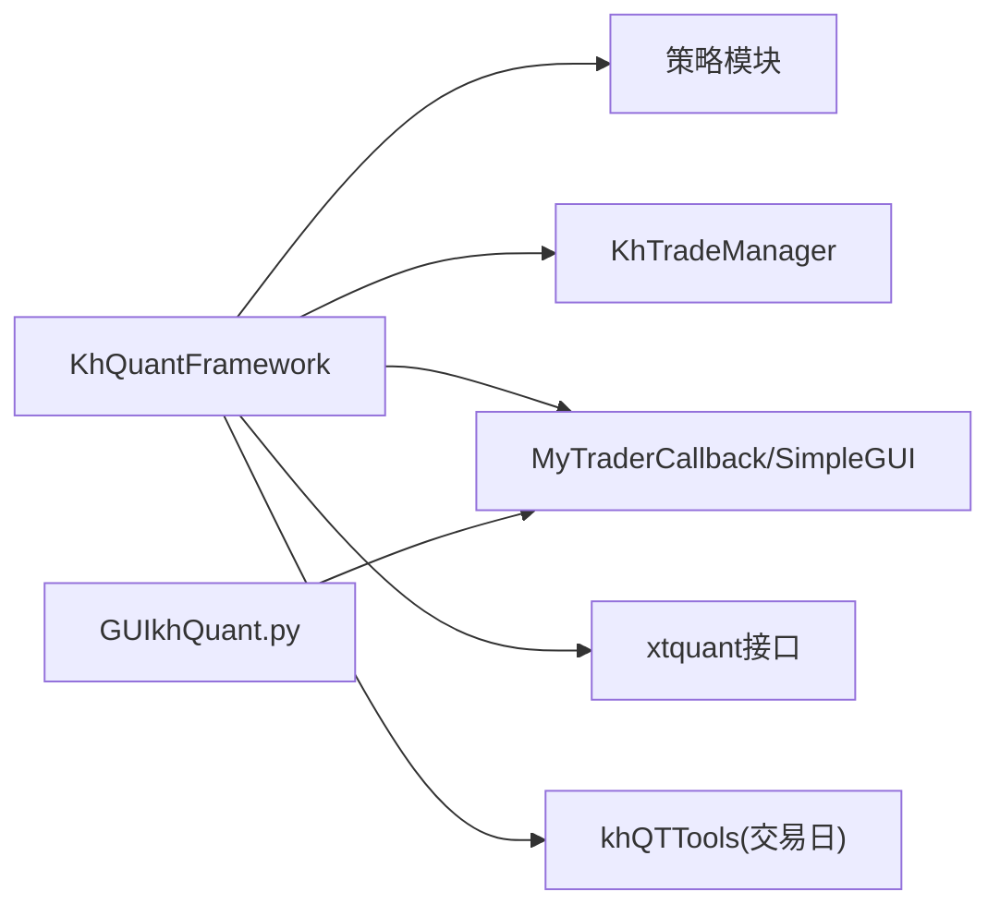

# 回测主循环

<cite>
**本文引用的文件**
- [khFrame.py](file://khFrame.py)
- [khFrame.md](file://modules/khFrame.md)
- [khTrade.py](file://khTrade.py)
- [khQuantImport.md](file://modules/khQuantImport.md)
- [README.md](file://README.md)
- [GUIkhQuant.py](file://GUIkhQuant.py)
- [khQTTools.py](file://khQTTools.py)
</cite>

## 目录
1. [简介](#简介)
2. [项目结构](#项目结构)
3. [核心组件](#核心组件)
4. [架构总览](#架构总览)
5. [详细组件分析](#详细组件分析)
6. [依赖关系分析](#依赖关系分析)
7. [性能考量](#性能考量)
8. [故障排查指南](#故障排查指南)
9. [结论](#结论)

## 简介
本文围绕回测主循环展开，聚焦 khFrame.py 中的 run_backtest_loop 方法，系统梳理其执行流程：如何获取交易日列表、按日处理数据、在每个时间点协调策略执行（khPreMarket/khHandlebar/khPostMarket）、交易信号执行与投资组合状态更新。同时结合 modules/khFrame.md 的技术文档，解释主循环如何整合盘前处理、策略主逻辑与盘后处理三个阶段，并给出进度更新与异常处理的实现要点及 GUI 回调机制。

## 项目结构
- khFrame.py：量化框架核心，包含 KhQuantFramework、交易回调、触发器、回测主循环等。
- modules/khFrame.md：策略执行引擎的技术文档，描述策略生命周期、数据管理、回测执行引擎与交易成本/滑点模拟。
- khTrade.py：交易管理器，负责交易成本、滑点、订单/成交/持仓管理。
- khQuantImport.md：策略模板与 API 说明，包含 khPreMarket/khHandlebar/khPostMarket 的约定。
- README.md：策略信号字典规范与盘前盘后回调说明。
- GUIkhQuant.py：GUI 进度条与日志显示，接收来自框架的日志并通过信号更新进度。
- khQTTools.py：交易日判断与交易日列表工具。

图表来源
- [GUIkhQuant.py](file://GUIkhQuant.py#L3171-L3283)
- [khFrame.py](file://khFrame.py#L1775-L2172)
- [khTrade.py](file://khTrade.py#L1-L200)
- [khQuantImport.md](file://modules/khQuantImport.md#L575-L649)
- [khQTTools.py](file://khQTTools.py#L296-L335)

章节来源
- [khFrame.py](file://khFrame.py#L1775-L2172)
- [khFrame.md](file://modules/khFrame.md#L456-L585)

## 核心组件
- KhQuantFramework：回测主循环主体，负责数据初始化、交易日收集、逐日推进、策略与交易协调、结果记录与保存。
- 交易管理器（KhTradeManager）：负责交易成本、滑点、订单/成交/持仓状态维护。
- 触发器体系：Tick/K线/自定义时间触发器，决定策略执行频率与数据周期。
- GUI 回调：通过 SimpleGUI/MyTraderCallback 将日志与进度上报至 GUI。

章节来源
- [khFrame.py](file://khFrame.py#L495-L703)
- [khTrade.py](file://khTrade.py#L1-L200)
- [khFrame.md](file://modules/khFrame.md#L142-L300)

## 架构总览
回测主循环在 KhQuantFramework 中执行，整体流程如下：
- 初始化与准备：加载策略、初始化交易接口、下载历史数据、构建触发器。
- 交易日收集：根据回测起止日期与交易日判断，生成交易日列表。
- 主循环推进：遍历交易日，执行盘前处理、按时间序列处理数据、执行策略主逻辑、执行交易信号、执行盘后处理。
- 结果记录与保存：保存交易记录、每日统计、汇总指标、基准数据。

图表来源
- [khFrame.py](file://khFrame.py#L1775-L2172)
- [khFrame.md](file://modules/khFrame.md#L456-L585)
- [khTrade.py](file://khTrade.py#L198-L200)
- [GUIkhQuant.py](file://GUIkhQuant.py#L3171-L3283)

## 详细组件分析

### 回测主循环 run_backtest_loop 执行流程
- 交易日收集与统计
  - 通过历史数据时间戳集合去重并排序，得到交易日列表；记录交易日总数用于进度计算。
  - 在循环开始前输出“共有 X 个交易日”的统计信息。
- 循环推进与时间统计
  - 每个时间点进入循环，累计各阶段耗时（构造数据、构造时间信息、触发器检查、风控检查、策略处理、处理信号、交易指令、记录结果、总时间）。
  - 在循环末尾输出各阶段耗时占比，便于性能分析。
- 进度更新与异常处理
  - 在循环中按固定增量显示进度，前若干次强制显示，确保用户感知。
  - 若 is_running 标志为 False，提前退出回测。
  - 每日处理异常被捕获并继续下一日，避免中断整个回测。
- 盘后处理收尾
  - 在最后一天结束后，若启用盘后回调，构造盘后时间点数据，注入账户/持仓/股票池/框架实例，调用 khPostMarket 并处理其返回信号。
  - 回测完成后，通过 Qt 的队列机制向 GUI 发送“策略完成”信号，并输出 100% 进度与完成日志。
- 结果保存
  - 保存交易记录、每日统计数据、汇总指标（初始/最终资产、总收益、年化收益、最大回撤、交易天数）、基准指数数据。

图表来源
- [khFrame.py](file://khFrame.py#L1775-L2172)
- [khFrame.md](file://modules/khFrame.md#L456-L585)

章节来源
- [khFrame.py](file://khFrame.py#L1775-L2172)

### 交易日列表获取与时间点推进
- 交易日列表来源于历史数据时间戳集合，去重后排序，确保跨股票数据对齐。
- 时间推进采用 all_times（由历史数据拼接生成），逐时间点迭代，配合触发器决定策略执行频率。
- 交易日判断依赖 khQTTools.is_trade_day，确保跳过非交易日。

章节来源
- [khFrame.py](file://khFrame.py#L1775-L1782)
- [khQTTools.py](file://khQTTools.py#L296-L335)

### 策略执行阶段协调
- 盘前处理（khPreMarket）
  - 在每个交易日开始时调用，注入账户、持仓、股票池、框架实例等上下文。
  - 返回信号将被统一处理并执行。
- 策略主逻辑（khHandlebar）
  - 根据触发器类型（tick/1m/5m/1d/custom）决定执行频率。
  - 每个时间点调用策略主逻辑，返回信号列表。
- 盘后处理（khPostMarket）
  - 在每个交易日结束时调用，注入当日最后一个时间点的完整上下文。
  - 可用于当日统计、状态清理、数据保存等。

章节来源
- [khFrame.md](file://modules/khFrame.md#L142-L300)
- [khQuantImport.md](file://modules/khQuantImport.md#L575-L649)
- [README.md](file://README.md#L1716-L1748)

### 交易信号执行与投资组合状态更新
- 信号处理
  - 对信号进行价格精度修正与时间戳填充，随后调用交易管理器的 process_signals 执行交易。
- 交易成本与滑点
  - 交易成本由 KhTradeManager 计算（佣金、印花税、过户费、流量费），滑点支持 tick/ratio 两种模式。
- 资产与持仓更新
  - 买入/卖出后更新可用资金、冻结资金、持仓数量与平均成本、成交记录等。

章节来源
- [khFrame.py](file://khFrame.py#L2147-L2156)
- [khTrade.py](file://khTrade.py#L1-L200)

### 进度更新机制与 GUI 报告
- 进度上报
  - 框架在回测过程中输出“进度 X.XX%”的日志；GUI 接收到后通过 progress_signal 发射进度值，更新状态栏进度条与文本。
- GUI 层实现
  - GUIkhQuant.py 中对“进度”日志进行识别与解析，将百分比映射到进度条，并在回测模式下自动显示进度条容器。
- 完成通知
  - 回测完成后，通过 Qt 的队列机制调用 on_strategy_finished，确保线程安全地通知界面。

章节来源
- [GUIkhQuant.py](file://GUIkhQuant.py#L3171-L3283)
- [GUIkhQuant.py](file://GUIkhQuant.py#L4326-L4356)
- [khFrame.py](file://khFrame.py#L2220-L2238)

### 异常处理策略
- 循环内异常
  - 每日处理异常被捕获并继续下一日，避免中断整个回测。
- 最后一天盘后回调异常
  - 对盘后回调过程进行 try-except 包裹，记录错误日志但不影响回测收尾。
- 全局异常钩子
  - GUI 层提供全局异常钩子，记录未捕获异常并输出到日志文件，便于问题定位。

章节来源
- [khFrame.py](file://khFrame.py#L2172-L2219)
- [GUIkhQuant.py](file://GUIkhQuant.py#L5366-L5393)

## 依赖关系分析
- 模块耦合
  - KhQuantFramework 依赖策略模块（动态加载）、交易管理器、触发器、GUI 回调、xtquant 数据接口。
  - 交易管理器独立负责成本/滑点与订单/成交/持仓状态，降低主循环复杂度。
- 外部依赖
  - xtquant：历史数据下载、行情回调、交易接口。
  - PyQt5：GUI 进度条与日志显示，信号槽通信。
- 数据流
  - 历史数据下载完成后，按时间点推进；策略模块返回信号，交易管理器执行交易并更新状态；每日统计与汇总指标在回测结束后生成。

图表来源
- [khFrame.py](file://khFrame.py#L495-L703)
- [khTrade.py](file://khTrade.py#L1-L200)
- [GUIkhQuant.py](file://GUIkhQuant.py#L3171-L3283)
- [khQTTools.py](file://khQTTools.py#L296-L335)

章节来源
- [khFrame.py](file://khFrame.py#L495-L703)
- [khTrade.py](file://khTrade.py#L1-L200)

## 性能考量
- 时间统计
  - 主循环对各阶段耗时进行统计与占比输出，便于定位瓶颈（如策略处理、信号处理、交易指令等）。
- 触发器与数据周期
  - 根据触发器类型选择合适的数据周期（tick/1m/5m/1d/custom），减少不必要的策略调用次数。
- 缓存与IO
  - 建议在策略侧合理使用缓存与批量操作，避免频繁 IO 与重复计算。
- GUI 线程安全
  - 使用 Qt 的队列机制发送完成信号，避免跨线程直接调用 GUI 导致崩溃。

章节来源
- [khFrame.py](file://khFrame.py#L1783-L1796)
- [khFrame.py](file://khFrame.py#L2162-L2171)
- [GUIkhQuant.py](file://GUIkhQuant.py#L4326-L4356)

## 故障排查指南
- 回测中途退出
  - 检查 is_running 标志是否被置为 False；查看日志中“回测被中止”的提示。
- 交易日为空
  - 确认股票池非空，检查历史数据下载是否成功；查看下载进度回调与完成标志。
- 信号未执行
  - 检查触发器类型与 should_trigger 判定；确认信号字段（code/action/price/volume）符合规范。
- 盘后回调异常
  - 查看盘后回调日志，确认上下文完整性（账户、持仓、股票池、框架实例）。
- GUI 进度不更新
  - 确认日志中包含“进度 X%”字样；检查 GUI 的进度识别逻辑与信号发射。

章节来源
- [khFrame.py](file://khFrame.py#L1775-L1782)
- [khFrame.py](file://khFrame.py#L2147-L2156)
- [khFrame.py](file://khFrame.py#L2172-L2219)
- [GUIkhQuant.py](file://GUIkhQuant.py#L3171-L3283)

## 结论
回测主循环以 KhQuantFramework.run_backtest_loop 为核心，通过交易日收集、逐日推进、盘前/主逻辑/盘后三阶段协同、信号执行与状态更新，形成完整的回测流水线。结合触发器与 GUI 进度上报机制，既保证了执行效率，又提供了良好的可视化反馈。建议在策略侧遵循信号规范与上下文注入约定，配合交易成本/滑点配置，获得更贴近实盘的回测结果。