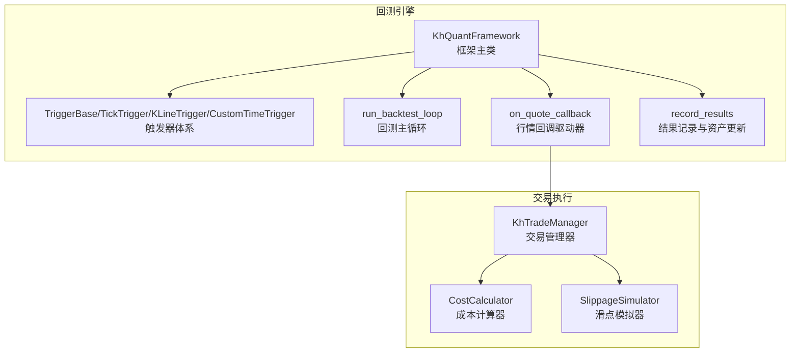
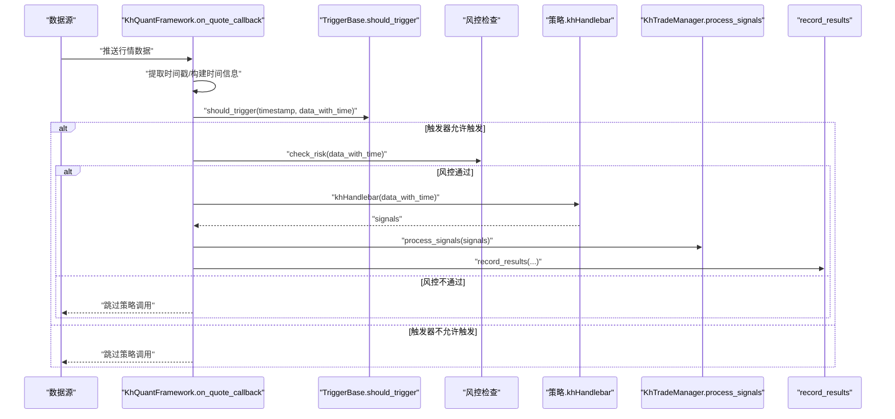
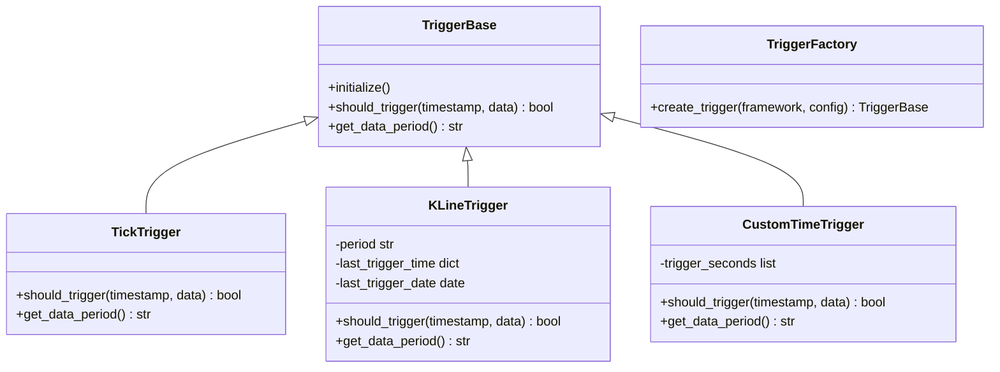
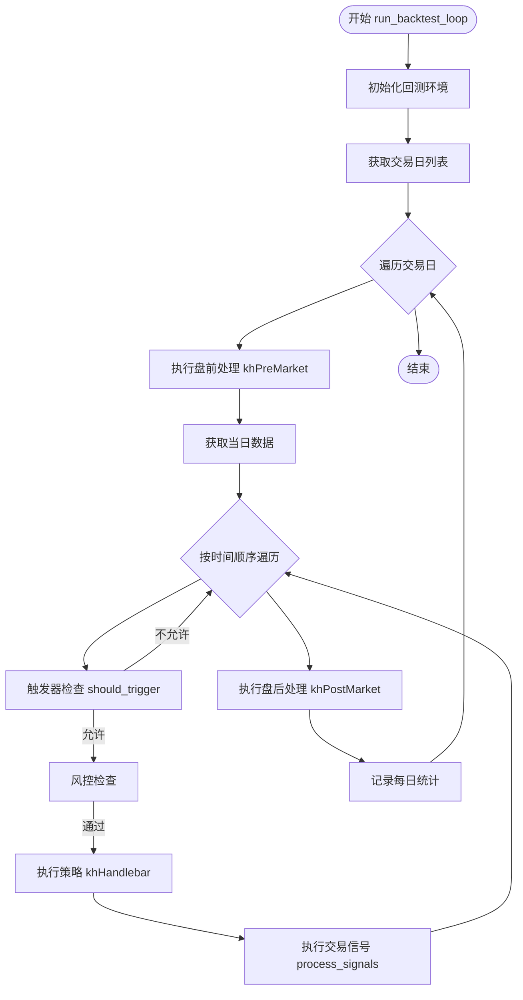
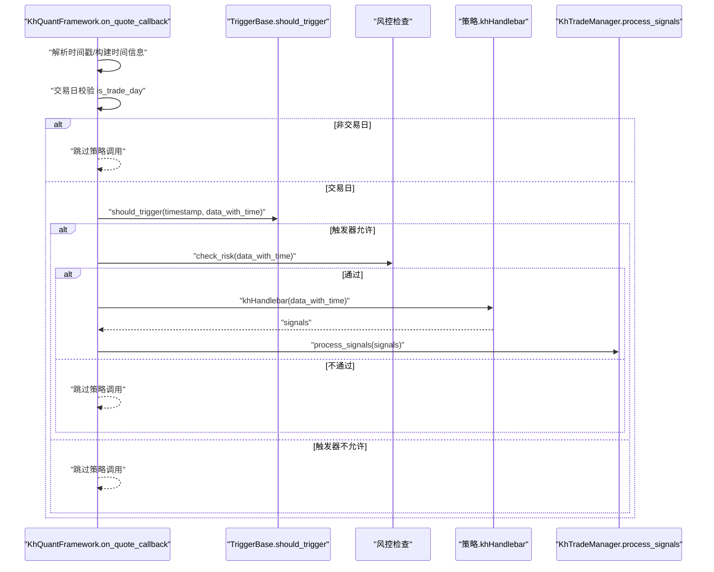
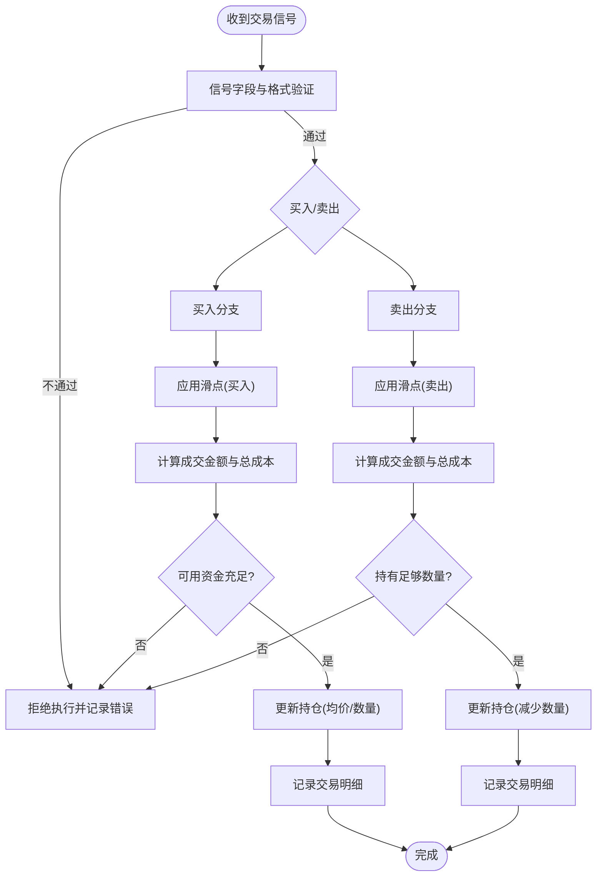
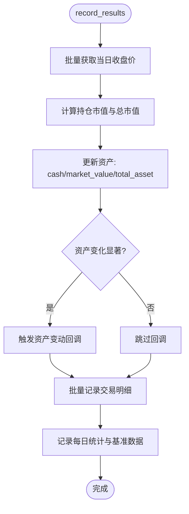
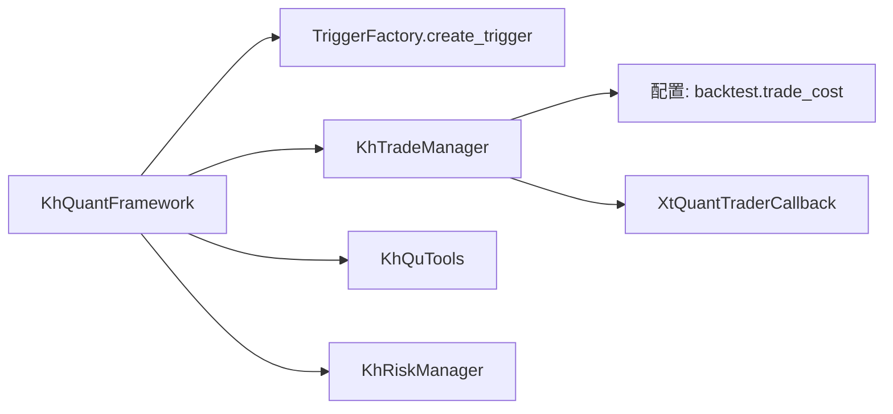

# 回测执行引擎

<cite>
**本文引用的文件**
- [khFrame.py](file://khFrame.py)
- [khTrade.py](file://khTrade.py)
- [modules/khFrame.md](file://modules/khFrame.md)
</cite>

## 目录
1. [简介](#简介)
2. [项目结构](#项目结构)
3. [核心组件](#核心组件)
4. [架构总览](#架构总览)
5. [详细组件分析](#详细组件分析)
6. [依赖分析](#依赖分析)
7. [性能考量](#性能考量)
8. [故障排查指南](#故障排查指南)
9. [结论](#结论)
10. [附录](#附录)

## 简介
本文件围绕回测执行引擎展开，聚焦于 khFrame.py 中的 BacktestEngine 与 KhQuantFramework 的协作机制，系统阐释回测主循环的执行流程、触发器驱动策略调用的机制、盘前/盘后处理、交易信号验证与执行、以及成本与滑点模拟在交易执行中的作用。同时结合 modules/khFrame.md 中的技术文档，对 run_backtest_loop 的阶段划分、交易成本与滑点模拟器的职责进行深入解读，并提供交易信号验证与投资组合状态更新的流程图与序列图，帮助读者快速掌握回测引擎的内部机制与最佳实践。

## 项目结构
回测执行引擎主要由以下模块构成：
- khFrame.py：包含触发器体系、框架主类、回测主循环、结果记录与持久化等核心逻辑
- khTrade.py：交易管理器，负责交易成本计算、滑点模拟、订单/成交/资产/持仓的维护与回调
- modules/khFrame.md：框架与回测引擎的官方技术文档，涵盖策略生命周期、数据管理、回测执行引擎、成本与滑点模拟、投资组合管理等

图表来源
- [khFrame.py](file://khFrame.py#L744-L1097)
- [khTrade.py](file://khTrade.py#L1-L200)

章节来源
- [khFrame.py](file://khFrame.py#L744-L1097)
- [khTrade.py](file://khTrade.py#L1-L200)
- [modules/khFrame.md](file://modules/khFrame.md#L456-L584)

## 核心组件
- 触发器体系：TickTrigger、KLineTrigger、CustomTimeTrigger 三种触发器，分别对应逐Tick触发、K线周期触发与自定义时间点触发；TriggerFactory 负责按配置创建触发器。
- KhQuantFramework：框架主类，负责策略加载、初始化、数据准备、回测主循环驱动、盘前/盘后回调、交易信号处理与结果记录。
- 回测主循环 run_backtest_loop：按交易日推进，依次执行盘前处理、按时间顺序处理数据、执行策略、执行交易信号、盘后处理与每日统计。
- 交易管理器 KhTradeManager：负责交易成本计算、滑点模拟、订单/成交/资产/持仓的维护与回调。
- 成本计算器 CostCalculator 与滑点模拟器 SlippageSimulator：分别负责佣金、印花税、过户费、流量费等成本计算与滑点模拟。

章节来源
- [khFrame.py](file://khFrame.py#L52-L244)
- [khFrame.py](file://khFrame.py#L744-L1097)
- [modules/khFrame.md](file://modules/khFrame.md#L456-L584)
- [khTrade.py](file://khTrade.py#L1-L200)

## 架构总览
回测执行引擎采用“事件驱动 + 触发器驱动”的双轨机制：
- 事件驱动：KhQuantFramework.on_quote_callback 接收行情数据，统一注入时间信息、账户与持仓，经风控检查后调用策略的 khHandlebar，产出交易信号。
- 触发器驱动：TriggerFactory 根据配置创建触发器，on_quote_callback 依据触发器判定是否触发策略；K线周期触发在特定时间点（如每分钟/每5分钟末尾）允许触发；自定义时间触发按配置生成每日触发点。

图表来源
- [khFrame.py](file://khFrame.py#L744-L1097)
- [khFrame.py](file://khFrame.py#L2145-L2171)

章节来源
- [khFrame.py](file://khFrame.py#L744-L1097)
- [khFrame.py](file://khFrame.py#L2145-L2171)

## 详细组件分析

### 触发器体系与驱动机制
- 触发器基类 TriggerBase 定义 should_trigger 与 get_data_period 接口；TickTrigger 每Tick触发；KLineTrigger 支持 1m/5m/1d 周期，1m/5m 在接近周期末尾（秒数≥57）允许触发；CustomTimeTrigger 支持自定义时间点列表，按秒数差阈值触发。
- TriggerFactory 根据配置的 backtest.trigger.type 创建对应触发器；KhQuantFramework 在初始化时创建触发器并注入框架实例。

图表来源
- [khFrame.py](file://khFrame.py#L52-L244)

章节来源
- [khFrame.py](file://khFrame.py#L52-L244)

### 回测主循环 run_backtest_loop
- 阶段划分：
  - 盘前处理：在每个交易日开盘前执行 khPreMarket（若策略实现），用于初始化或盘前扫描。
  - 数据遍历：按时间顺序处理当日数据，触发策略执行与交易信号执行。
  - 盘后处理：在每个交易日收盘后执行 khPostMarket（若策略实现），用于结算或收尾。
  - 每日统计：在最后时间点记录每日资产、持仓快照与基准收益等。
- 触发器与数据周期：根据触发器类型与数据周期一致性进行检查，避免不匹配导致的误触发或漏触发。

图表来源
- [modules/khFrame.md](file://modules/khFrame.md#L456-L584)

章节来源
- [modules/khFrame.md](file://modules/khFrame.md#L456-L584)

### on_quote_callback 作为回测引擎驱动器
- on_quote_callback 是回测引擎的核心驱动器，负责：
  - 解析时间戳，构建时间信息字典（timestamp/datetime/date/time）。
  - 交易日校验：若非交易日则跳过策略调用。
  - 触发器判定：若触发器返回 False 且为 K线周期触发，允许在接近周期末尾（秒数≥57）触发；否则跳过。
  - 风控检查：通过后将账户、持仓、股票池等上下文注入数据字典，调用策略 khHandlebar。
  - 信号处理：对策略返回的信号进行价格精度处理，随后调用交易管理器 process_signals 执行交易。

图表来源
- [khFrame.py](file://khFrame.py#L744-L1097)

章节来源
- [khFrame.py](file://khFrame.py#L744-L1097)

### 交易信号验证与执行流程
- 信号验证：KhTradeManager.process_signals 对信号进行基础校验（如 code/action/price/volume 等字段与格式），确保符合交易要求。
- 执行流程：
  - 买入：应用滑点，计算成交金额与总成本，检查可用资金，冻结/解冻资金，更新持仓（含均价与首次买入时间）。
  - 卖出：检查持仓数量，应用滑点，计算成交金额与总成本，更新持仓与可用资金，记录交易明细。
- 成本与滑点：
  - 滑点类型：ratio（比例）与 tick（最小变动价位）。ratio 按买入上浮、卖出下浮；tick 按跳数增减。
  - 成本构成：佣金（最低收费）、印花税（卖出收取）、过户费（沪市股票）、流量费（每笔固定）。

图表来源
- [khTrade.py](file://khTrade.py#L1-L200)
- [khTrade.py](file://khTrade.py#L360-L595)

章节来源
- [khTrade.py](file://khTrade.py#L1-L200)
- [khTrade.py](file://khTrade.py#L360-L595)

### 投资组合状态更新逻辑
- 每日统计：在最后时间点（或自定义时间触发的最后时刻）计算当日收盘价，更新持仓市值、总权益、基准收益与每日回报率，并记录持仓快照。
- 资产更新：在 record_results 中根据最新价格批量更新持仓市值与总资产，仅在资产变化显著时触发资产变动回调，减少冗余日志与UI刷新。

图表来源
- [khFrame.py](file://khFrame.py#L2506-L3019)

章节来源
- [khFrame.py](file://khFrame.py#L2506-L3019)

## 依赖分析
- KhQuantFramework 依赖：
  - 触发器体系：TriggerFactory.create_trigger
  - 交易管理器：KhTradeManager（成本与滑点、订单/成交/资产/持仓维护）
  - 工具类：KhQuTools（交易日判断）
  - 风控管理器：KhRiskManager（风控检查）
- KhTradeManager 依赖：
  - 配置：backtest.trade_cost（佣金、印花税、过户费、流量费、滑点类型与参数）
  - 回调：XtQuantTraderCallback（委托/成交/资产/持仓等回调）

图表来源
- [khFrame.py](file://khFrame.py#L52-L244)
- [khFrame.py](file://khFrame.py#L744-L1097)
- [khTrade.py](file://khTrade.py#L1-L200)

章节来源
- [khFrame.py](file://khFrame.py#L52-L244)
- [khFrame.py](file://khFrame.py#L744-L1097)
- [khTrade.py](file://khTrade.py#L1-L200)

## 性能考量
- 触发器与数据周期一致性：当触发器类型为 K线周期时，应确保数据周期与之匹配，避免不必要的下载与处理。
- 交易日缓存：对 is_trade_day 的结果进行缓存，减少重复查询。
- 时间戳与日期缓存：对时间戳解析与日期判断进行缓存，避免重复计算。
- 批量价格获取与市值计算：在每日统计时一次性批量获取收盘价并计算持仓市值，降低多次数据请求与循环开销。
- 回测时间统计：框架内置时间统计，便于定位瓶颈环节（构造数据、触发器检查、风控检查、策略处理、处理信号、交易指令、记录结果等）。

章节来源
- [khFrame.py](file://khFrame.py#L1783-L2171)
- [khFrame.py](file://khFrame.py#L2506-L3019)

## 故障排查指南
- 策略未触发：
  - 检查触发器类型与数据周期是否一致；K线周期触发仅在接近周期末尾允许触发。
  - 检查交易日判断与风控检查是否通过。
- 交易未成交：
  - 检查信号字段与格式是否满足验证要求（code/action/price/volume）。
  - 检查可用资金是否充足（买入时需覆盖成交金额与总成本）。
  - 检查持仓数量是否足够（卖出时）。
- 成本与滑点异常：
  - 检查 backtest.trade_cost 配置（佣金、印花税、过户费、流量费、滑点类型与参数）。
  - 检查滑点类型（ratio/tick）与参数设置是否合理。
- 回测结果缺失：
  - 确认 record_results 是否在最后时间点被调用（自定义时间触发需确保最后触发点）。
  - 检查回测结果保存逻辑（trades/daily_stats/summary/benchmark 等文件生成）。

章节来源
- [khFrame.py](file://khFrame.py#L744-L1097)
- [khFrame.py](file://khFrame.py#L2145-L2171)
- [khFrame.py](file://khFrame.py#L2506-L3019)
- [khTrade.py](file://khTrade.py#L1-L200)
- [khTrade.py](file://khTrade.py#L360-L595)

## 结论
回测执行引擎通过触发器与事件驱动相结合的方式，实现了对策略的高效回测：on_quote_callback 作为驱动器，依据触发器与风控检查决定是否调用策略；KhTradeManager 负责交易成本与滑点模拟，确保回测结果贴近真实市场；KhQuantFramework 的 run_backtest_loop 将盘前/盘后处理、策略执行、交易信号执行与每日统计整合为完整的回测闭环。通过模块化的成本与滑点模拟器，用户可以灵活配置交易成本与滑点模型，从而获得更贴近实盘的回测体验。

## 附录
- 交易信号字段与验证要点（来自 khTrade.py 的验证逻辑）：
  - 必填字段：code、action、price、volume
  - 校验规则：股票代码格式、交易动作（buy/sell）、价格与数量有效性（>0、数量为100的整数倍等）
- 成本与滑点配置参考：
  - 佣金：最低收费与比例
  - 印花税：仅卖出收取
  - 过户费：沪市股票收取
  - 流量费：每笔固定费用
  - 滑点：ratio（比例）或 tick（最小变动价位）

章节来源
- [khTrade.py](file://khTrade.py#L1-L200)
- [khTrade.py](file://khTrade.py#L360-L595)