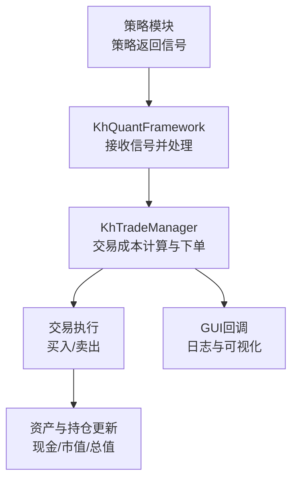
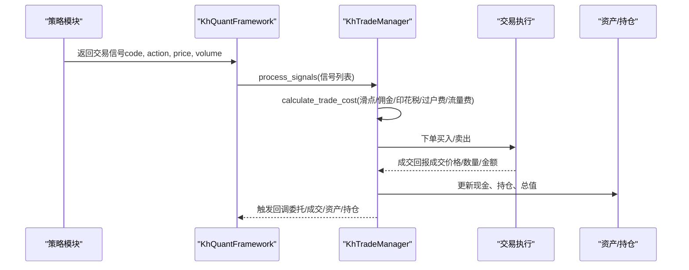
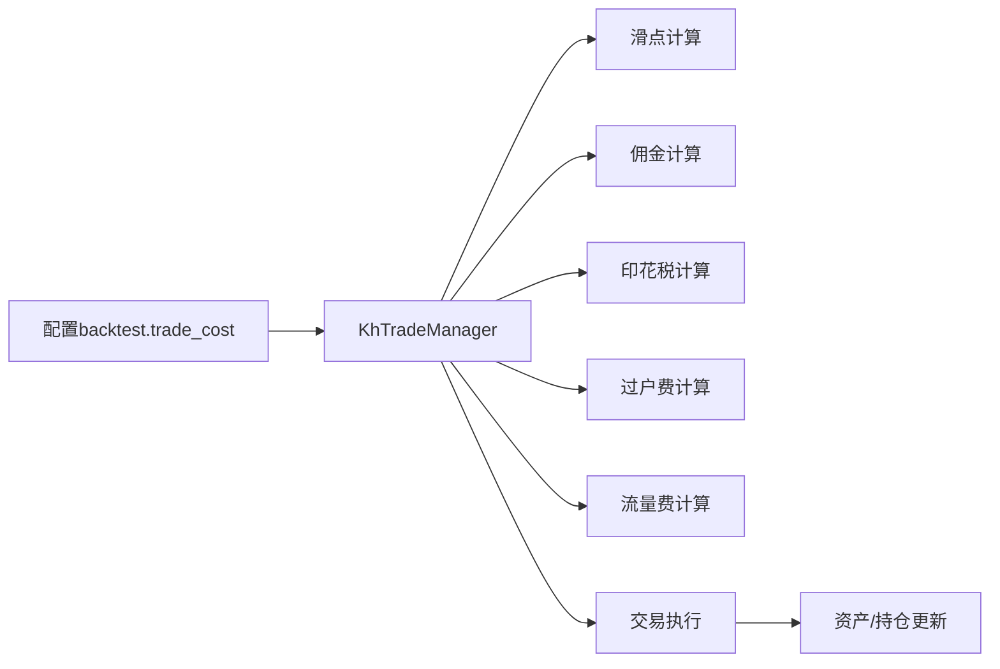
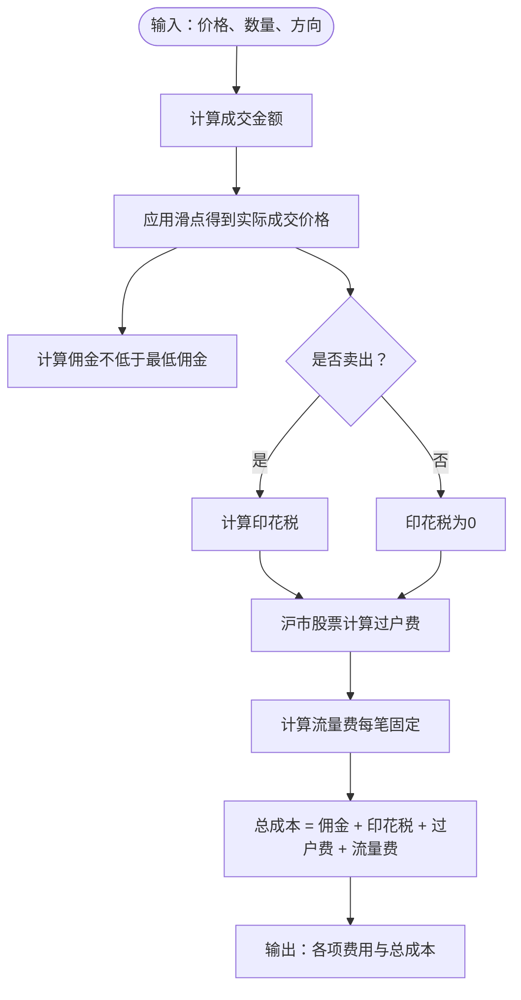
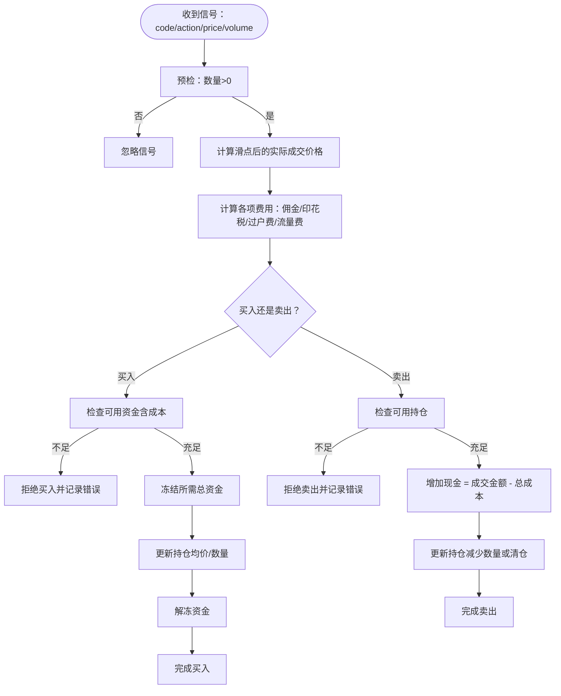

# 成本计算

<cite>
**本文引用的文件**
- [khFrame.py](file://khFrame.py)
- [khTrade.py](file://khTrade.py)
- [khFrame.md](file://modules/khFrame.md)
- [khQTTools.py](file://khQTTools.py)
- [GUIkhQuant.py](file://GUIkhQuant.py)
</cite>

## 目录
1. [简介](#简介)
2. [项目结构](#项目结构)
3. [核心组件](#核心组件)
4. [架构总览](#架构总览)
5. [详细组件分析](#详细组件分析)
6. [依赖分析](#依赖分析)
7. [性能考量](#性能考量)
8. [故障排查指南](#故障排查指南)
9. [结论](#结论)
10. [附录](#附录)

## 简介
本文件聚焦于交易成本计算，围绕 khFrame.py 中的 CostCalculator 类与 khTrade.py 中的交易管理器实现，系统阐述：
- 如何根据配置的佣金率、最低佣金、印花税率、过户费与流量费计算总交易成本；
- 买入与卖出在成本构成上的差异（印花税仅在卖出时收取）；
- 成本计算在交易执行流程中的位置与作用；
- 如何通过交易金额与方向计算各项费用；
- 成本计算结果如何影响投资组合的现金与持仓更新。

## 项目结构
围绕成本计算的相关文件与职责如下：
- khFrame.py：包含策略执行引擎、回测主循环、资产与持仓更新、以及交易信号处理与记录。其中涉及交易成本的拆分与记录逻辑。
- khTrade.py：交易管理器，负责滑点、佣金、印花税、过户费、流量费的统一计算与下单执行；同时负责资金与持仓的实时更新。
- modules/khFrame.md：提供 CostCalculator 的设计说明与算法流程，便于对照理解。
- khQTTools.py：提供基于交易成本的“最大可买入量”估算工具，体现成本对下单决策的影响。
- GUIkhQuant.py：提供交易成本与滑点的图形化配置入口。

图表来源
- [khFrame.py](file://khFrame.py#L895-L907)
- [khTrade.py](file://khTrade.py#L161-L196)

章节来源
- [khFrame.py](file://khFrame.py#L895-L907)
- [khTrade.py](file://khTrade.py#L161-L196)

## 核心组件
- CostCalculator（khFrame.md 中定义）：面向回测/模拟场景的成本计算器，提供佣金、印花税、总成本计算能力。
- KhTradeManager（khTrade.py 中实现）：面向实盘/回测的交易管理器，统一计算滑点、佣金、印花税、过户费、流量费，并据此更新资产与持仓。

章节来源
- [khFrame.md](file://modules/khFrame.md#L587-L665)
- [khTrade.py](file://khTrade.py#L117-L196)

## 架构总览
成本计算贯穿“策略信号—交易成本计算—下单执行—资产/持仓更新”的闭环。下图展示了关键交互：

图表来源
- [khFrame.py](file://khFrame.py#L895-L907)
- [khTrade.py](file://khTrade.py#L198-L374)

章节来源
- [khFrame.py](file://khFrame.py#L895-L907)
- [khTrade.py](file://khTrade.py#L198-L374)

## 详细组件分析

### CostCalculator 类（回测/模拟场景）
- 关键配置
  - 最低佣金、佣金比例、印花税率、流量费
- 计算要点
  - 佣金：按成交金额乘以佣金比例，不低于最低佣金
  - 印花税：仅在卖出时按成交金额乘以印花税率
  - 过户费：在 khTrade.py 中由交易管理器统一处理（A股仅沪市收取）
  - 总成本：佣金 + 印花税 + 流量费
- 方法路径
  - calculate_total_cost(price, volume, is_sell=False)：返回明细与总成本
  - calculate_commission(amount)、calculate_stamp_tax(amount, is_sell)

章节来源
- [khFrame.md](file://modules/khFrame.md#L587-L665)

### KhTradeManager（实盘/回测场景）
- 统一成本计算
  - calculate_slippage(price, direction)：按比例或最小变动价跳数计算滑点
  - calculate_commission(actual_price, volume)：按成交金额乘以佣金比例，不低于最低佣金
  - calculate_stamp_tax(actual_price, volume, direction)：仅卖出收取印花税
  - calculate_transfer_fee(stock_code, actual_price, volume)：仅沪市股票收取过户费
  - calculate_flow_fee()：每笔交易固定收取流量费
  - calculate_trade_cost(price, volume, direction, stock_code)：返回实际成交价格与总成本
- 交易执行与资金/持仓更新
  - 买入：检查可用资金（含成本）是否充足；冻结/解冻资金；更新持仓均价与数量；触发回调
  - 卖出：检查可用持仓是否足够；按成交金额减去总成本增加现金；更新剩余持仓；触发回调
- GUI 日志：输出佣金、印花税、过户费、流量费与总成本

章节来源
- [khTrade.py](file://khTrade.py#L81-L196)
- [khTrade.py](file://khTrade.py#L270-L476)

### 交易执行流程中的成本计算位置
- 策略返回信号后，框架调用交易管理器的 process_signals，提前计算交易成本与实际成交价格
- 回测下单时，买入前检查“所需总资金（含成本）”，卖出前检查“可用持仓”
- 成交后，资产与持仓即时更新，总值 = 现金 + 持仓市值

章节来源
- [khFrame.py](file://khFrame.py#L895-L907)
- [khTrade.py](file://khTrade.py#L270-L476)

### 买入与卖出的成本差异
- 买入
  - 成本构成：佣金 + 流量费（若配置）
  - 影响：冻结资金（所需总资金 = 实际成交金额 + 成本）；成交后解冻
- 卖出
  - 成本构成：佣金 + 印花税 + 过户费（沪市） + 流量费（若配置）
  - 影响：按成交金额减去总成本增加可用现金；更新剩余持仓

章节来源
- [khTrade.py](file://khTrade.py#L270-L476)
- [khFrame.md](file://modules/khFrame.md#L587-L665)

### 成本计算对投资组合的影响
- 现金：买入时减少“所需总资金”，卖出时增加“成交金额 - 总成本”
- 持仓：买入更新均价与数量；卖出减少数量或清仓
- 总资产：每日统计时以“现金 + 持仓市值”计算

章节来源
- [khTrade.py](file://khTrade.py#L378-L476)
- [khFrame.py](file://khFrame.py#L2653-L2669)

### 代码示例（路径指引）
以下为关键实现的路径，便于查阅具体实现细节：
- CostCalculator.calculate_total_cost
  - [modules/khFrame.md](file://modules/khFrame.md#L609-L623)
- 交易成本统一计算（KhTradeManager.calculate_trade_cost）
  - [khTrade.py](file://khTrade.py#L161-L196)
- 买入执行与资金冻结/解冻
  - [khTrade.py](file://khTrade.py#L378-L427)
- 卖出执行与现金增加
  - [khTrade.py](file://khTrade.py#L427-L456)
- 回测记录中按比例拆分各项费用
  - [khFrame.py](file://khFrame.py#L2691-L2724)

章节来源
- [modules/khFrame.md](file://modules/khFrame.md#L587-L665)
- [khTrade.py](file://khTrade.py#L161-L196)
- [khTrade.py](file://khTrade.py#L378-L456)
- [khFrame.py](file://khFrame.py#L2691-L2724)

## 依赖分析
- 模块耦合
  - 策略模块仅需返回标准化信号；框架通过交易管理器统一处理成本与下单
  - 交易管理器依赖配置中的成本参数与滑点设置
- 外部依赖
  - GUI 回调用于日志输出与可视化
  - 数据缓存与基准数据用于每日统计

图表来源
- [khTrade.py](file://khTrade.py#L65-L196)
- [khFrame.py](file://khFrame.py#L2691-L2724)

章节来源
- [khTrade.py](file://khTrade.py#L65-L196)
- [khFrame.py](file://khFrame.py#L2691-L2724)

## 性能考量
- 成本计算在下单前完成，避免重复计算
- 回测记录中按比例拆分各项费用，减少多次调用
- 每日统计采用批量价格获取与向量化处理，降低数据访问开销

章节来源
- [khFrame.py](file://khFrame.py#L2611-L2652)
- [khFrame.py](file://khFrame.py#L2869-L2898)

## 故障排查指南
- 资金不足（买入）
  - 现象：下单被拒绝，日志提示所需资金与可用资金
  - 排查：确认滑点与成本叠加后的总花费是否超出可用现金
  - 参考路径：[khTrade.py](file://khTrade.py#L283-L308)
- 持仓不足（卖出）
  - 现象：下单被拒绝，日志提示可用持仓不足
  - 排查：确认可用持仓与委托数量
  - 参考路径：[khTrade.py](file://khTrade.py#L309-L327)
- 印花税未计费
  - 现象：卖出未扣印花税
  - 排查：确认方向为“卖出”，且交易管理器的印花税计算逻辑生效
  - 参考路径：[khTrade.py](file://khTrade.py#L128-L137)
- 过户费未计费
  - 现象：沪市股票未扣过户费
  - 排查：确认股票代码以“sh.”开头
  - 参考路径：[khTrade.py](file://khTrade.py#L138-L156)
- GUI 日志未显示
  - 现象：交易成本未在日志中显示
  - 排查：确认回调对象存在且日志级别允许
  - 参考路径：[khTrade.py](file://khTrade.py#L463-L489)

章节来源
- [khTrade.py](file://khTrade.py#L283-L327)
- [khTrade.py](file://khTrade.py#L128-L156)
- [khTrade.py](file://khTrade.py#L463-L489)

## 结论
- CostCalculator 与 KhTradeManager 分别服务于回测/模拟与实盘/回测场景，前者强调简洁的成本拆分，后者强调完整的交易成本与资金/持仓更新。
- 买入与卖出在成本构成上的差异清晰：印花税仅在卖出时收取，沪市股票额外收取过户费。
- 成本计算贯穿交易执行全流程，直接影响投资组合的现金与持仓，并通过每日统计反映到总资产变化。

## 附录

### 成本计算流程图（回测/模拟）

图表来源
- [modules/khFrame.md](file://modules/khFrame.md#L587-L665)
- [khTrade.py](file://khTrade.py#L117-L196)

### 成本计算流程图（实盘/回测）

图表来源
- [khTrade.py](file://khTrade.py#L198-L374)
- [khTrade.py](file://khTrade.py#L378-L476)

### 交易成本配置入口（GUI）
- GUI 提供“卖出印花税”、“流量费（元/笔）”、“滑点类型/滑点值”等配置项，便于在回测前设定成本参数
- 参考路径：[GUIkhQuant.py](file://GUIkhQuant.py#L1401-L1425)

章节来源
- [GUIkhQuant.py](file://GUIkhQuant.py#L1401-L1425)