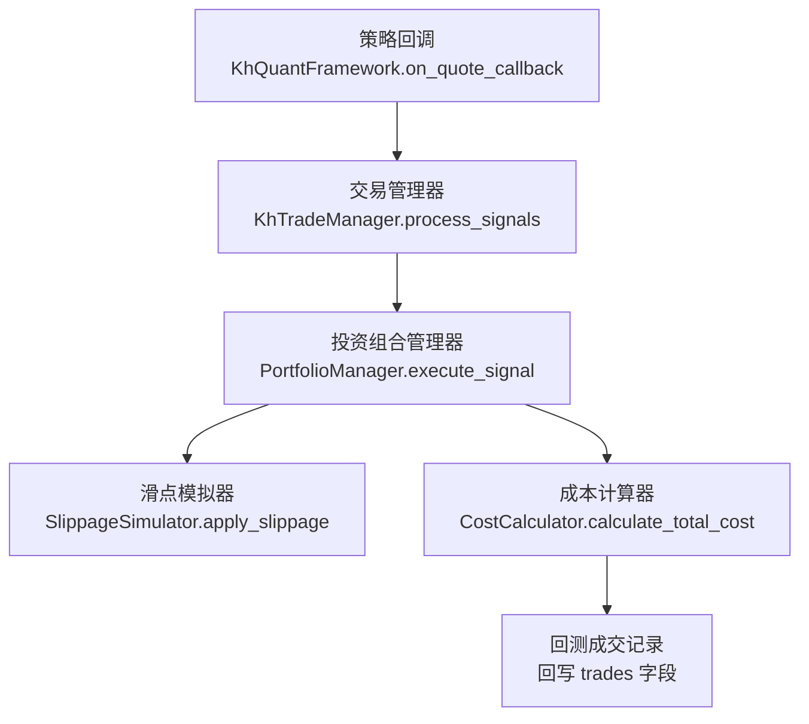
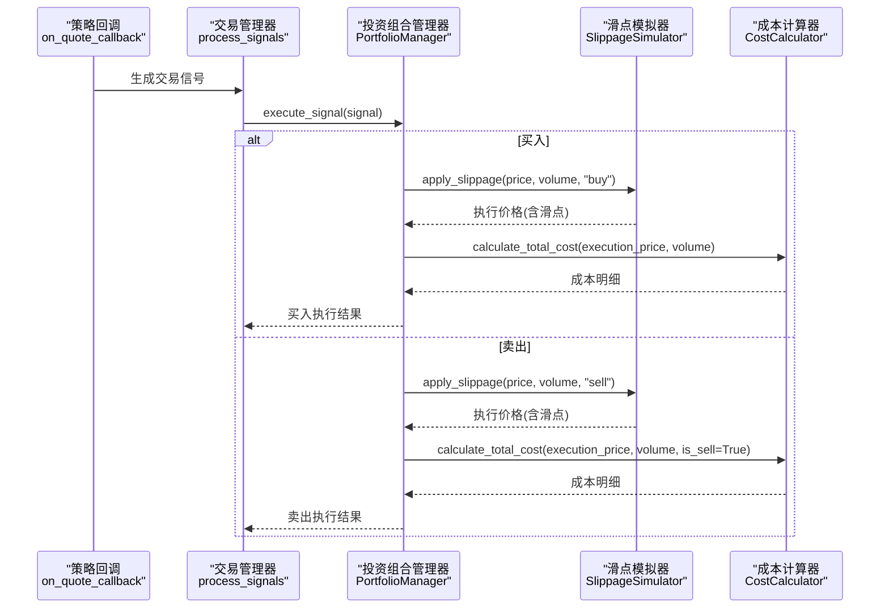
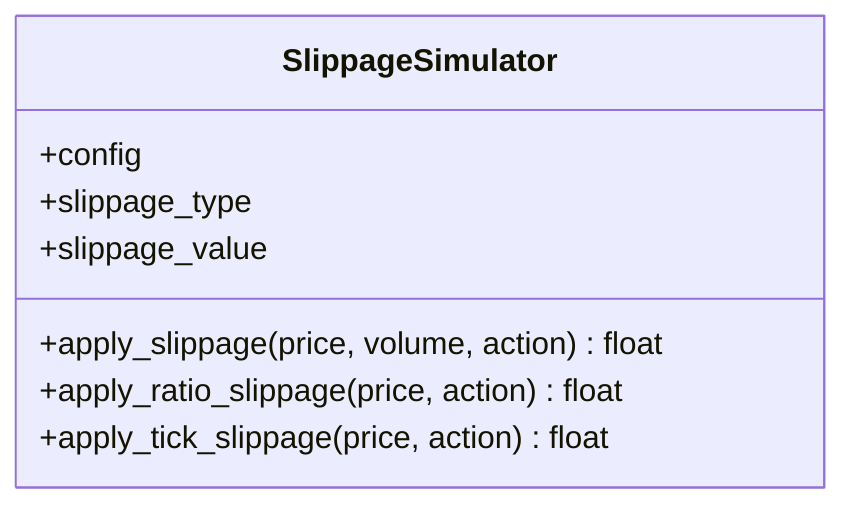
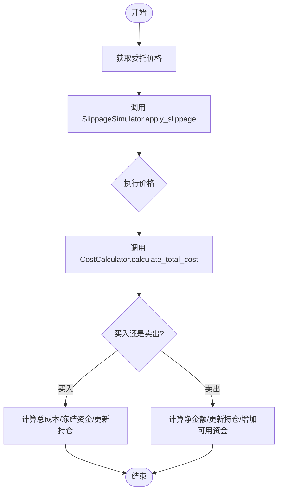
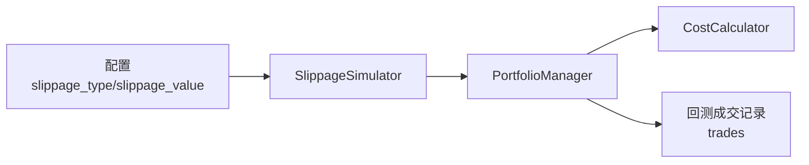

# 滑点模拟

<cite>
**本文引用的文件**
- [khFrame.py](file://khFrame.py)
- [modules/khFrame.md](file://modules/khFrame.md)
- [khTrade.py](file://khTrade.py)
- [README.md](file://README.md)
- [GUIkhQuant.py](file://GUIkhQuant.py)
</cite>

## 目录
1. [简介](#简介)
2. [项目结构](#项目结构)
3. [核心组件](#核心组件)
4. [架构概览](#架构概览)
5. [详细组件分析](#详细组件分析)
6. [依赖分析](#依赖分析)
7. [性能考量](#性能考量)
8. [故障排查指南](#故障排查指南)
9. [结论](#结论)
10. [附录](#附录)

## 简介
本文件围绕 khFrame.py 中的 SlippageSimulator 类展开，系统性解析其在交易执行流程中的作用与实现细节。重点说明 apply_slippage 方法如何依据配置的滑点类型（比例滑点或最小变动价位滑点）调整成交价格，并结合模块设计文档与交易成本计算协同工作，从而在回测中更真实地反映真实市场的流动性与冲击成本。同时提供不同滑点类型下的价格调整逻辑示意，帮助读者快速理解与应用。

## 项目结构
围绕滑点模拟的相关文件与职责如下：
- khFrame.py：框架主入口与交易执行链路，包含策略回调、交易管理器、回测主循环等，交易执行时会调用 SlippageSimulator。
- modules/khFrame.md：模块设计文档，明确 SlippageSimulator 的职责、与 CostCalculator 和 PortfolioManager 的协作关系。
- khTrade.py：交易管理模块，包含 calculate_slippage 方法与回测成交记录更新逻辑，体现滑点在回测中的落地方式。
- README.md：用户文档，解释滑点设置与两种模式的原理及示例，便于正确配置。
- GUIkhQuant.py：图形界面逻辑，负责滑点类型切换与输入校验，确保用户输入符合 Tick/Ratio 模式要求。

图表来源
- [khFrame.py](file://khFrame.py#L894-L907)
- [modules/khFrame.md](file://modules/khFrame.md#L625-L665)
- [modules/khFrame.md](file://modules/khFrame.md#L588-L624)
- [modules/khFrame.md](file://modules/khFrame.md#L669-L859)

章节来源
- [khFrame.py](file://khFrame.py#L894-L907)
- [modules/khFrame.md](file://modules/khFrame.md#L587-L859)

## 核心组件
- SlippageSimulator：根据配置的滑点类型与数值，对买入/卖出价格施加滑点，返回考虑滑点后的执行价格。
- CostCalculator：计算佣金、印花税、总成本等，配合滑点后的成交价格进行成本核算。
- PortfolioManager：在执行买入/卖出信号时，先应用滑点，再计算交易金额与成本，更新账户与持仓。
- GUIkhQuant：提供滑点类型切换与输入校验，保证 Tick 模式为整数跳数、Ratio 模式为百分比。

章节来源
- [modules/khFrame.md](file://modules/khFrame.md#L587-L859)
- [GUIkhQuant.py](file://GUIkhQuant.py#L3079-L3119)

## 架构概览
滑点模拟在交易执行流程中的位置如下：
- 策略回调 on_quote_callback 接收行情数据，调用策略主逻辑生成交易信号；
- 交易管理器 process_signals 将信号交给 PortfolioManager；
- PortfolioManager 在执行 buy/sell 前调用 SlippageSimulator.apply_slippage 获取执行价格；
- 随后调用 CostCalculator.calculate_total_cost 计算交易成本；
- 最终更新回测成交记录与账户/持仓状态。

图表来源
- [khFrame.py](file://khFrame.py#L894-L907)
- [modules/khFrame.md](file://modules/khFrame.md#L625-L665)
- [modules/khFrame.md](file://modules/khFrame.md#L588-L624)
- [modules/khFrame.md](file://modules/khFrame.md#L669-L859)

## 详细组件分析

### SlippageSimulator 类与 apply_slippage 方法
- 职责：根据配置的滑点类型与数值，对买入/卖出价格施加滑点，返回考虑滑点后的执行价格。
- 关键配置：
  - slippage_type：滑点类型，支持 "ratio"（比例）与 "tick"（最小变动价位）。
  - slippage_value：滑点数值，ratio 模式下为总滑点比例（系统按双边各一半应用），tick 模式下为跳数。
- 价格取整：ratio 模式下统一取整到分（两位小数），tick 模式下按最小变动价位累加/减。

图表来源
- [modules/khFrame.md](file://modules/khFrame.md#L625-L665)

章节来源
- [modules/khFrame.md](file://modules/khFrame.md#L625-L665)

### 比例滑点（Ratio）逻辑
- 双边滑点模型：配置的 slippage_value 为买卖双边总滑点，系统按一半应用于买入价格上浮、一半应用于卖出价格下浮。
- 价格取整：ratio 模式下统一取整到分（两位小数）。
- 示例（来自用户文档）：
  - slippage_value=0.001（0.1%）时，买入上浮 0.05%，卖出下浮 0.05%。
  - 计算后按分取整，模拟真实报价机制。

章节来源
- [modules/khFrame.md](file://modules/khFrame.md#L642-L655)
- [README.md](file://README.md#L814-L819)

### 最小变动价位滑点（Tick）逻辑
- A股最小变动价位为 0.01 元。
- slippage_value 为跳数（整数），买入价上浮跳数×0.01，卖出价下浮跳数×0.01。
- 价格取整：tick 模式下按最小变动价位累加/减，最终按价格精度取整。

章节来源
- [modules/khFrame.md](file://modules/khFrame.md#L656-L665)
- [README.md](file://README.md#L811-L813)

### 与成本计算的协同
- PortfolioManager 在执行信号时，先应用滑点得到 execution_price，再调用 CostCalculator.calculate_total_cost 计算佣金、印花税与总成本。
- 买入：总成本 = 成交金额 + 成本；资金冻结与解冻在回测中简化处理。
- 卖出：净金额 = 成交金额 - 总成本；增加可用资金并更新持仓。

图表来源
- [modules/khFrame.md](file://modules/khFrame.md#L669-L859)
- [modules/khFrame.md](file://modules/khFrame.md#L588-L624)
- [modules/khFrame.md](file://modules/khFrame.md#L625-L665)

章节来源
- [modules/khFrame.md](file://modules/khFrame.md#L588-L624)
- [modules/khFrame.md](file://modules/khFrame.md#L669-L859)

### 在回测中的落地（khTrade.py）
- 回测成交记录中使用考虑了滑点的实际成交价格与成交金额，确保回测结果更贴近真实市场。
- 回测成交字典更新时，traded_price 使用实际成交价格（已考虑滑点），traded_amount 使用实际成交价格与成交量计算。

章节来源
- [khTrade.py](file://khTrade.py#L360-L373)

### 用户界面与滑点配置（GUIkhQuant.py）
- 滑点类型切换逻辑：
  - Tick 模式：输入验证器限制为整数（1-100），默认值为 2 跳。
  - Ratio 模式：输入验证器限制为浮点数（0.00-10.00，2 位小数），默认值为 0.1%。
- 切换时根据当前值进行合理转换，避免用户输入不符合模式要求。

章节来源
- [GUIkhQuant.py](file://GUIkhQuant.py#L3079-L3119)

## 依赖分析
- SlippageSimulator 依赖：
  - 配置字典（slippage_type、slippage_value）。
  - 价格精度（由框架在运行时设置，Tick/Ratio 模式下均按分取整）。
- 与 PortfolioManager 的耦合：
  - PortfolioManager 在执行 buy/sell 前调用 SlippageSimulator.apply_slippage，确保成交价格受滑点影响。
- 与 CostCalculator 的耦合：
  - PortfolioManager 在计算成本时使用 SlippageSimulator 返回的执行价格，使成本与滑点一致。

图表来源
- [modules/khFrame.md](file://modules/khFrame.md#L625-L665)
- [modules/khFrame.md](file://modules/khFrame.md#L588-L624)
- [modules/khFrame.md](file://modules/khFrame.md#L669-L859)

章节来源
- [modules/khFrame.md](file://modules/khFrame.md#L587-L859)

## 性能考量
- 滑点计算为纯数值运算，开销极低，对整体回测性能影响可忽略。
- 取整操作在 ratio/tick 模式下均发生，避免浮点精度累积带来的偏差。
- 在高频回测场景中，滑点与成本计算的组合不会成为瓶颈。

## 故障排查指南
- 滑点类型与数值不匹配：
  - Tick 模式应输入整数跳数；Ratio 模式应输入百分比（如 0.1 表示 0.1%）。界面已提供输入校验，若仍出现异常，检查配置项是否被正确写入。
- 价格精度异常：
  - ratio 模式按分取整；tick 模式按最小变动价位累加/减。若发现价格不符合预期，核对 slippage_value 是否为整数（tick）或合理百分比（ratio）。
- 回测资金不足：
  - 买入时总成本 = 成交金额 + 成本；若可用资金不足，回测会返回失败。检查滑点与成本设置是否过高。
- 卖出无持仓：
  - 卖出前需检查持仓数量是否满足订单量，否则回测会返回失败。

章节来源
- [GUIkhQuant.py](file://GUIkhQuant.py#L3079-L3119)
- [modules/khFrame.md](file://modules/khFrame.md#L669-L859)

## 结论
SlippageSimulator 通过“双边滑点”模型与“最小变动价位”两种方式，为回测提供了贴近真实市场的成交价格修正。配合 CostCalculator 的成本核算与 PortfolioManager 的交易执行，形成了完整的滑点-成本闭环。用户可通过 GUIkhQuant 的输入校验与默认值设置，快速正确地配置滑点参数，从而获得更稳健的回测结果。

## 附录
- 代码片段路径参考（不展示具体代码内容）：
  - SlippageSimulator.apply_slippage 与子方法：[modules/khFrame.md](file://modules/khFrame.md#L625-L665)
  - PortfolioManager 执行买入/卖出与滑点应用：[modules/khFrame.md](file://modules/khFrame.md#L669-L859)
  - 回测成交记录更新（使用实际成交价格）：[khTrade.py](file://khTrade.py#L360-L373)
  - 比例滑点与最小变动价位说明（用户文档）：[README.md](file://README.md#L811-L819)
  - 滑点类型切换与输入校验（GUI）：[GUIkhQuant.py](file://GUIkhQuant.py#L3079-L3119)