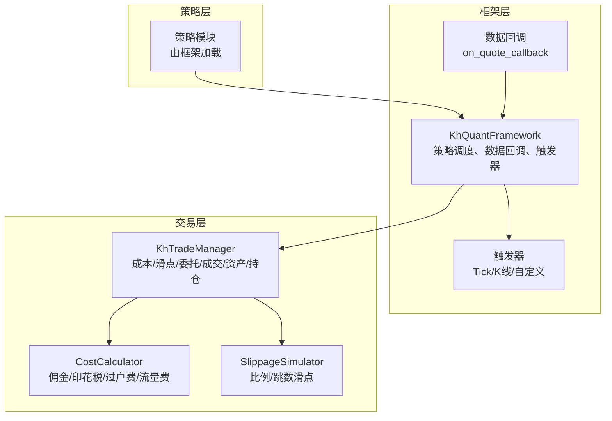
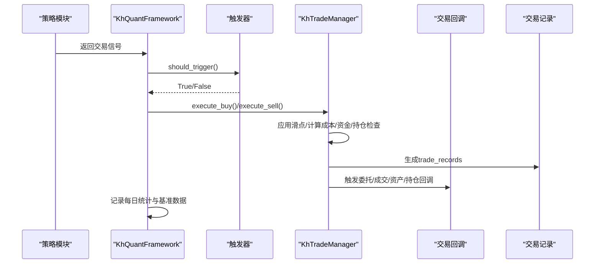
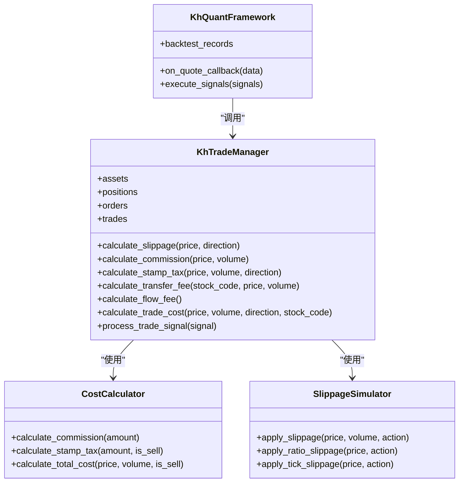

# 交易执行

<cite>
**本文引用的文件**
- [khFrame.py](file://khFrame.py)
- [khTrade.py](file://khTrade.py)
- [khQTTools.py](file://khQTTools.py)
- [modules/khFrame.md](file://modules/khFrame.md)
</cite>

## 目录
1. [引言](#引言)
2. [项目结构](#项目结构)
3. [核心组件](#核心组件)
4. [架构总览](#架构总览)
5. [详细组件分析](#详细组件分析)
6. [依赖关系分析](#依赖关系分析)
7. [性能考量](#性能考量)
8. [故障排查指南](#故障排查指南)
9. [结论](#结论)

## 引言
本文件围绕策略信号到实际交易的完整执行流程，系统梳理 khFrame 中的交易执行路径，重点覆盖以下主题：
- execute_buy 与 execute_sell 的内部执行步骤：滑点应用、资金/持仓检查、交易成本（佣金、印花税、过户费、流量费）计算、交易记录生成
- frozen_cash（冻结资金）在防止资金重复使用中的关键作用及其生命周期（买入冻结、结算后释放）
- 结合 modules/khFrame.md 的技术文档，说明 CostCalculator 与 SlippageSimulator 如何被集成到交易执行流程
- trade_records（交易记录）的生成过程，包括成交价格、数量、金额、各项成本与状态等关键字段
- calculate_realized_pnl 的计算依据与在交易记录中的体现

## 项目结构
khFrame.py 是策略执行引擎的核心，负责策略生命周期管理、事件驱动、数据处理与交易执行；khTrade.py 提供交易成本与滑点计算、委托/成交模拟与资产/持仓更新；khQTTools.py 提供工具函数，辅助生成交易信号与计算最大可买入量；modules/khFrame.md 提供模块化设计与核心算法的说明。

图表来源
- [khFrame.py](file://khFrame.py#L495-L800)
- [khTrade.py](file://khTrade.py#L1-L200)
- [modules/khFrame.md](file://modules/khFrame.md#L586-L859)

章节来源
- [khFrame.py](file://khFrame.py#L495-L800)
- [khTrade.py](file://khTrade.py#L1-L200)
- [modules/khFrame.md](file://modules/khFrame.md#L586-L859)

## 核心组件
- KhQuantFramework：策略生命周期管理、数据回调、触发器、交易执行入口
- KhTradeManager：交易成本与滑点计算、委托/成交模拟、资产与持仓更新
- CostCalculator：交易成本计算（佣金、印花税、过户费、流量费）
- SlippageSimulator：滑点模拟（比例/跳数）
- Trade Records：交易记录生成与归档

章节来源
- [khFrame.py](file://khFrame.py#L495-L800)
- [khTrade.py](file://khTrade.py#L1-L200)
- [modules/khFrame.md](file://modules/khFrame.md#L586-L859)

## 架构总览
从策略信号到交易执行的关键路径如下：
1. 策略模块返回信号（包含 code、action、price、volume 等）
2. 框架层 on_quote_callback 根据触发器判定是否执行策略
3. 执行 execute_signals，进入 KhTradeManager 的 execute_buy 或 execute_sell
4. 交易层应用滑点、计算成本、检查资金/持仓、更新资产与持仓
5. 生成 trade_records 并触发回调
6. 后续在记录每日结果时，对交易记录中的成本字段进行拆分与归集

图表来源
- [khFrame.py](file://khFrame.py#L745-L800)
- [khTrade.py](file://khTrade.py#L535-L595)
- [modules/khFrame.md](file://modules/khFrame.md#L586-L859)

## 详细组件分析

### 交易执行入口与触发器
- 触发器类型：tick、1m、5m、1d、custom
- on_quote_callback 中根据触发器类型决定是否触发策略，并在 K 线周期下做特殊处理（临近K线末尾允许触发）
- 框架层维护资产、持仓、订单、成交等状态，并在交易回调中更新

章节来源
- [khFrame.py](file://khFrame.py#L88-L179)
- [khFrame.py](file://khFrame.py#L745-L800)

### execute_buy 执行步骤
- 滑点应用：买入时价格上浮（比例/跳数）
- 成本计算：佣金、印花税、过户费、流量费
- 资金检查：可用资金需覆盖成交金额与成本
- 冻结资金：在资金检查通过后冻结 total_cost，随后在结算后释放
- 持仓更新：已有持仓则累加数量并更新加权平均成本；新仓则记录首次买入时间
- 交易记录：记录 timestamp、stock_code、action、price、volume、amount、cost、status

章节来源
- [modules/khFrame.md](file://modules/khFrame.md#L670-L764)

### execute_sell 执行步骤
- 持仓检查：必须存在且数量足够
- 滑点应用：卖出时价格下浮（比例/跳数）
- 成本计算：佣金、印花税（仅卖出）、过户费、流量费
- 持仓更新：剩余数量为0则删除该持仓，否则更新剩余数量
- 现金增加：增加 net_amount = 成交金额 - 总成本
- 交易记录：记录 timestamp、stock_code、action、price、volume、amount、cost、status，并计算 realized_pnl

章节来源
- [modules/khFrame.md](file://modules/khFrame.md#L765-L821)

### frozen_cash（冻结资金）的作用与生命周期
- 作用：在买入交易中，当资金检查通过后立即冻结 total_cost，防止同一笔资金被重复使用
- 生命周期：
  - 买入阶段：资金检查通过后冻结 total_cost，cash 减去 total_cost
  - 结算阶段：在买入流程中，冻结的资金在结算后释放（frozen_cash 归零）
  - 卖出阶段：不涉及冻结，直接按 net_amount 增加可用资金

章节来源
- [modules/khFrame.md](file://modules/khFrame.md#L670-L764)

### 交易成本与滑点计算
- 滑点模拟：
  - 比例模式：买入上浮、卖出下浮，取整到价格精度
  - 跳数模式：按最小变动价跳数计算滑点
- 成本构成：
  - 佣金：按成交金额乘以佣金比例，最低收费约束
  - 印花税：仅卖出收取
  - 过户费：沪市股票按成交金额的万分之一收取
  - 流量费：每笔交易固定收取
- KhTradeManager 提供 calculate_slippage、calculate_commission、calculate_stamp_tax、calculate_transfer_fee、calculate_flow_fee、calculate_trade_cost 等方法

章节来源
- [khTrade.py](file://khTrade.py#L81-L196)
- [khTrade.py](file://khTrade.py#L198-L385)

### 交易记录（trade_records）生成
- 字段内容：timestamp、stock_code、action、price、volume、amount、cost、status
- 卖出记录额外包含 realized_pnl
- KhTradeManager 在执行完成后将交易记录追加到 trade_records
- 框架层在记录每日结果时，会从 trade_records 中提取并拆分佣金、印花税、过户费等字段，用于统计

章节来源
- [modules/khFrame.md](file://modules/khFrame.md#L765-L821)
- [khFrame.py](file://khFrame.py#L2678-L2708)

### calculate_realized_pnl 的计算与记录
- realized_pnl 由卖出交易记录生成，表示已实现盈亏
- 计算依据：以成交金额减去总成本（佣金、印花税、过户费、流量费）
- 由于 KhTradeManager 的 execute_sell 会计算 realized_pnl 并写入交易记录，因此在后续统计与回测结果中可直接使用

章节来源
- [modules/khFrame.md](file://modules/khFrame.md#L765-L821)

### 交易信号生成与最大可买量计算
- khQTTools 提供工具函数，支持按资金比例或固定股数生成买入信号，并校验 100 股的整数倍要求
- 通过 calculate_max_buy_volume 与 calculate_trade_cost 精确估算最大可买入量，考虑滑点与成本

章节来源
- [khQTTools.py](file://khQTTools.py#L604-L710)

## 依赖关系分析
- KhQuantFramework 依赖触发器与数据回调，负责策略执行时机与上下文构建
- KhTradeManager 依赖 CostCalculator 与 SlippageSimulator 完成成本与滑点计算
- 交易记录在 KhTradeManager 中生成，框架层在每日统计时汇总成本与收益

图表来源
- [khFrame.py](file://khFrame.py#L495-L800)
- [khTrade.py](file://khTrade.py#L1-L200)
- [modules/khFrame.md](file://modules/khFrame.md#L586-L859)

章节来源
- [khFrame.py](file://khFrame.py#L495-L800)
- [khTrade.py](file://khTrade.py#L1-L200)
- [modules/khFrame.md](file://modules/khFrame.md#L586-L859)

## 性能考量
- 触发器类型选择：tick 触发频率高，1m/5m/1d 触发可降低策略调用次数
- 数据缓存：框架层对日线价格与基准指数进行缓存，减少重复查询
- 交易成本与滑点计算：在交易层集中处理，避免重复计算
- 回测记录：批量处理交易记录与每日统计，减少 I/O 操作

[本节为通用建议，不直接分析具体文件]

## 故障排查指南
- 委托/成交/资产/持仓回调：框架层提供统一的回调处理，便于定位问题
- 常见错误：
  - 可用资金不足：execute_buy 返回失败，检查 frozen_cash 与 total_cost
  - 持仓不足：execute_sell 返回失败，检查 positions 中的 volume
  - 滑点与成本异常：核对滑点类型与参数、成本参数配置
- 日志输出：框架层通过 SimpleGUI 输出日志，便于定位问题

章节来源
- [khFrame.py](file://khFrame.py#L277-L472)
- [khFrame.py](file://khFrame.py#L3029-L3152)
- [khTrade.py](file://khTrade.py#L535-L595)

## 结论
khFrame 与 khTrade 的协作实现了从策略信号到真实交易的闭环：策略生成信号，框架按触发器调度，交易层完成滑点与成本计算、资金与持仓检查、交易记录生成，并通过回调反馈交易状态。frozen_cash 在买入阶段有效防止资金重复使用，交易记录承载了完整的成本与盈亏信息，为后续统计与回测提供了可靠基础。CostCalculator 与 SlippageSimulator 的模块化设计提升了可配置性与可维护性。