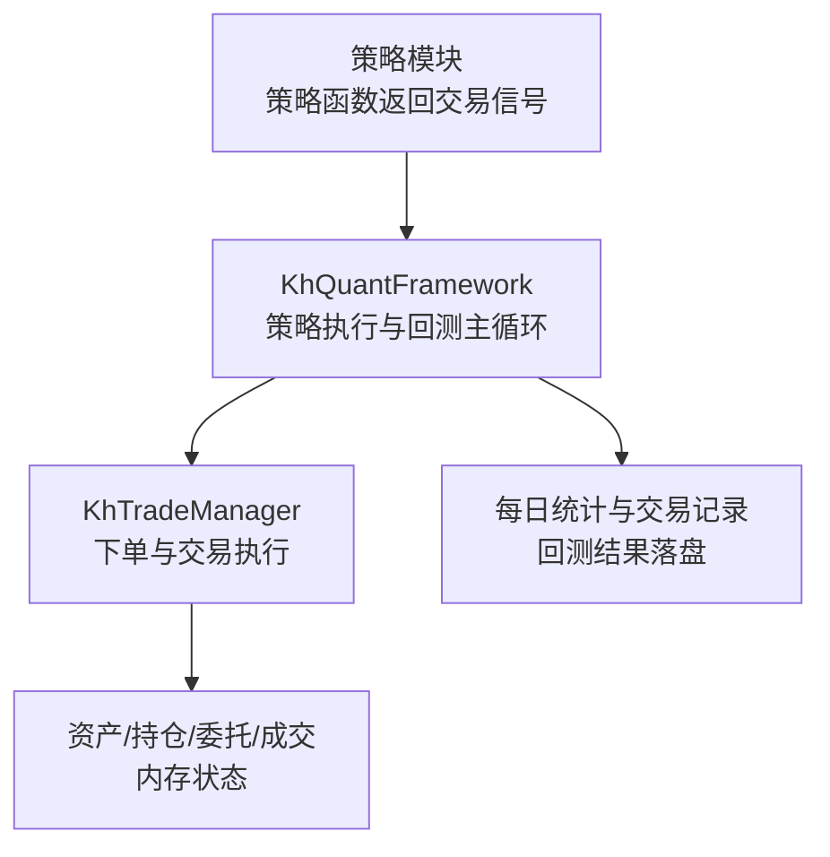
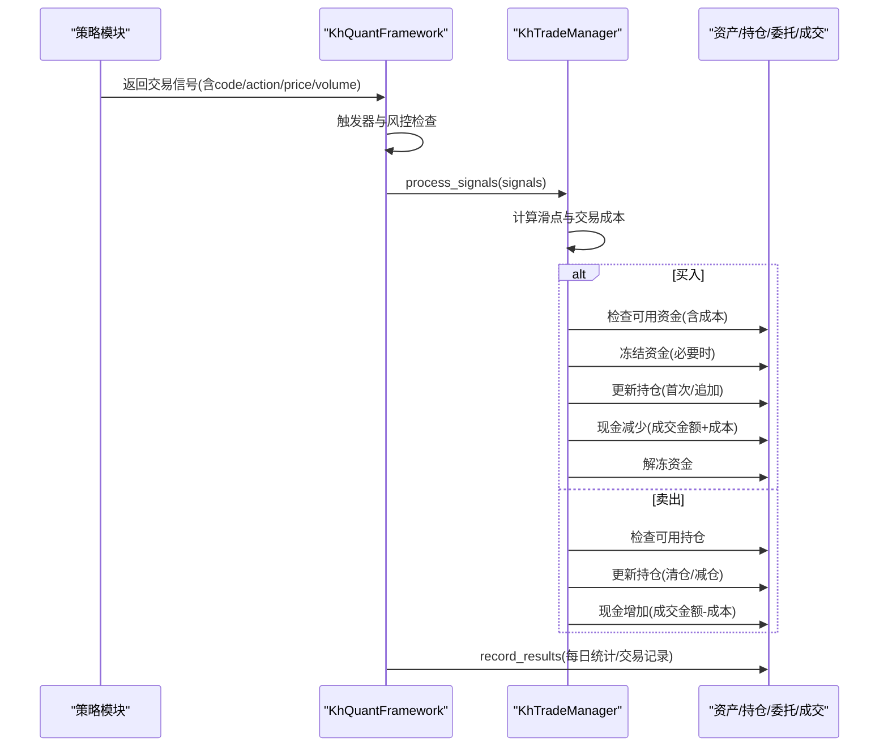
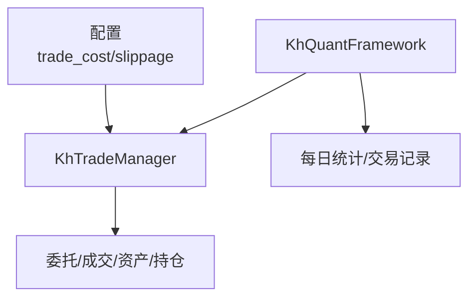

# 投资组合管理

<cite>
**本文引用的文件**
- [khFrame.py](file://khFrame.py)
- [khTrade.py](file://khTrade.py)
- [modules/khFrame.md](file://modules/khFrame.md)
- [README.md](file://README.md)
</cite>

## 目录
1. [简介](#简介)
2. [项目结构](#项目结构)
3. [核心组件](#核心组件)
4. [架构总览](#架构总览)
5. [详细组件分析](#详细组件分析)
6. [依赖关系分析](#依赖关系分析)
7. [性能考量](#性能考量)
8. [故障排查指南](#故障排查指南)
9. [结论](#结论)
10. [附录](#附录)

## 简介
本文件围绕投资组合管理主题，聚焦 khFrame.py 中的交易执行与资产/持仓管理机制，系统阐述以下要点：
- 交易执行流程：买入与卖出的完整步骤，包括资金检查、滑点应用、成本计算、持仓更新与现金变动。
- 平均持仓成本计算：首次买入与追加买入的差异处理。
- 账户与持仓统计：账户总市值与总资产的计算，每只股票未实现盈亏与收益率的计算。
- 冻结资金（frozen_cash）概念与作用：防止资金重复使用。
- 交易记录（trade_records）生成：成交价格、数量、金额、成本与状态等关键信息。
- 已实现盈亏（calculate_realized_pnl）的计算思路与落地位置。

## 项目结构
本项目采用“策略执行引擎 + 交易管理 + 数据与风控”的分层设计。与投资组合管理直接相关的核心文件如下：
- khFrame.py：策略执行主框架、回测主循环、资产/持仓更新、每日统计与交易记录落盘。
- khTrade.py：交易管理器，负责下单、成本与滑点计算、委托/成交/资产/持仓回调。
- modules/khFrame.md：框架模块说明，包含策略执行、交易信号、成本与滑点、投资组合管理等章节。
- README.md：账户数据说明，明确 __account__ 中 cash、market_value、total_asset、frozen_cash 的含义。

图表来源
- [khFrame.py](file://khFrame.py#L1900-L2399)
- [khTrade.py](file://khTrade.py#L198-L377)

章节来源
- [khFrame.py](file://khFrame.py#L1900-L2399)
- [khTrade.py](file://khTrade.py#L198-L377)

## 核心组件
- KhQuantFramework：策略生命周期管理、回测主循环、资产/持仓更新、每日统计与交易记录落盘。
- KhTradeManager：交易执行、成本与滑点计算、委托/成交/资产/持仓回调。
- 资产与持仓字典：assets、positions、orders、trades；其中 assets 包含 cash、market_value、total_asset、frozen_cash。
- 交易信号：由策略函数返回，包含 code、action、price、volume 等字段。

章节来源
- [khFrame.py](file://khFrame.py#L1900-L2399)
- [khTrade.py](file://khTrade.py#L1-L120)
- [README.md](file://README.md#L1780-L1817)

## 架构总览
下面的序列图展示了从策略返回信号到交易执行与资产/持仓更新的端到端流程。

图表来源
- [khFrame.py](file://khFrame.py#L2132-L2156)
- [khTrade.py](file://khTrade.py#L240-L377)

## 详细组件分析

### 交易执行：execute_buy 与 execute_sell（回测视角）
在回测模式下，KhTradeManager 的 _place_order_backtest 方法承担了买入与卖出的完整执行逻辑。虽然 khFrame.py 中未直接暴露名为 execute_buy/execute_sell 的方法，但其行为与 khFrame.md 中描述的 PortfolioManager 的执行流程一致，区别在于 khFrame.py 使用 KhTradeManager 统一处理下单与状态更新。

- 买入执行要点
  - 计算滑点与交易成本：根据配置的滑点类型（tick/ratio）与交易成本参数（佣金、印花税、过户费、流量费）计算实际成交价格与总成本。
  - 资金检查：比较可用资金与买入所需总资金（成交金额+成本）。若不足，记录错误并触发委托错误回调。
  - 冻结与解冻资金：在资金检查通过后，执行买入。回测中通常不模拟冻结/在途资金，简化处理。
  - 持仓更新：首次买入创建持仓记录；追加买入则累加数量并重新计算平均持仓成本。
  - 现金变动：资产现金减少（成交金额+成本）。
  - 回调触发：委托回报、成交回报、持仓变动回调。

- 卖出执行要点
  - 持仓检查：比较可用持仓与卖出数量。不足则记录错误并触发委托错误回调。
  - 持仓更新：减仓或清仓；T+0 模式下当天买入可当天卖出，T+1 模式下当天买入不可卖。
  - 现金变动：资产现金增加（成交金额-成本）。
  - 回调触发：委托回报、成交回报、持仓变动回调。

章节来源
- [khTrade.py](file://khTrade.py#L240-L377)

### 平均持仓成本计算（首次/追加）
- 首次买入：创建新持仓，avg_price 设为实际成交价格。
- 追加买入：累计成本价值与数量，重新计算 avg_price = (旧均价×旧数量 + 成交金额) / 新数量。
- 回测中，KhTradeManager 在买入后更新 positions 中的 avg_price 与 volume，并在 T+0/T+1 模式下调整 can_use_volume。

章节来源
- [khTrade.py](file://khTrade.py#L386-L426)

### 账户总市值与总资产（get_account_info）
- 账户总资产 = 现金 + 持仓市值。KhQuantFramework 在 record_results 中按交易日批量计算持仓市值与总资产，并更新 assets['market_value'] 与 assets['total_asset']。
- 未实现盈亏（unrealized PnL）与收益率：对每只持仓，按当前价格计算 profit = (current_price - avg_price) × volume，profit_ratio = (current_price - avg_price) / avg_price。
- 以上逻辑在 khFrame.py 的 record_results 与 _record_daily_stats 中实现。

章节来源
- [khFrame.py](file://khFrame.py#L2611-L2669)
- [khFrame.py](file://khFrame.py#L2850-L3010)

### 每只股票未实现盈亏与收益率（get_positions）
- 未实现盈亏：基于 positions 中的 avg_price 与当前价格计算。
- 收益率：基于 avg_price 与当前价格计算。
- 该逻辑在 khFrame.py 的 record_results 与 _record_daily_stats 中逐只计算并更新。

章节来源
- [khFrame.py](file://khFrame.py#L2636-L2652)
- [khFrame.py](file://khFrame.py#L2921-L2934)

### 冻结资金（frozen_cash）概念与作用
- 概念：冻结资金指因已下单但尚未成交或结算完成而暂时不可用的资金。用于防止同一笔资金被重复使用。
- 实践：在回测中，KhTradeManager 的 _place_order_backtest 未显式维护 frozen_cash 字段，而是通过“资金检查”与“现金变动”保证一致性。在 live/simulate 模式中，KhTradeManager 会维护 frozen_cash 字段并在成交后更新。
- 在 khFrame.md 的“投资组合管理”章节中，PortfolioManager 的 frozen_cash 字段用于冻结与解冻资金，确保资金不被重复使用。

章节来源
- [khTrade.py](file://khTrade.py#L12-L28)
- [khTrade.py](file://khTrade.py#L378-L463)
- [modules/khFrame.md](file://modules/khFrame.md#L667-L800)

### 交易记录（trade_records）生成
- 生成位置：KhQuantFramework.record_results 会将每笔交易的 datetime、code、action、price、volume、amount、commission、stamp_tax、transfer_fee、flow_fee、total_asset、cash、market_value 等字段写入 backtest_records['trades']。
- 交易记录落盘：回测结束后，框架将 trades.csv 与 daily_stats.csv 等结果保存至 backtest_results/<dir> 目录。

章节来源
- [khFrame.py](file://khFrame.py#L2682-L2732)
- [khFrame.py](file://khFrame.py#L2276-L2332)

### 已实现盈亏（calculate_realized_pnl）
- 计算思路：已实现盈亏通常指历史平仓产生的收益，等于卖出成交金额之和减去买入成交金额之和，再减去卖出相关的交易成本（如印花税）。
- 落地位置：在回测记录落盘阶段，框架会将每笔交易的成本拆分（佣金、印花税、过户费、流量费）并写入 trades.csv，从而为后续统计已实现盈亏提供数据基础。
- 注意：khFrame.py 中未直接提供 calculate_realized_pnl 方法，但通过交易记录的字段组合即可计算。

章节来源
- [khFrame.py](file://khFrame.py#L2682-L2732)

## 依赖关系分析
- KhQuantFramework 依赖 KhTradeManager 完成交易执行与状态更新。
- 资产与持仓状态由 KhTradeManager 维护，KhQuantFramework 在 record_results 中读取并汇总。
- 交易成本与滑点参数来自配置，KhTradeManager 在下单前统一计算。

图表来源
- [khTrade.py](file://khTrade.py#L12-L44)
- [khTrade.py](file://khTrade.py#L198-L377)
- [khFrame.py](file://khFrame.py#L2506-L2828)

章节来源
- [khTrade.py](file://khTrade.py#L12-L44)
- [khTrade.py](file://khTrade.py#L198-L377)
- [khFrame.py](file://khFrame.py#L2506-L2828)

## 性能考量
- 批量价格与市值计算：在 record_results 中一次性提取所有持仓的当前价格并批量计算市值与盈亏，避免重复查询与多次遍历。
- 缓存与去重：对交易日、时间点、基准指数收盘价等进行缓存，减少重复 IO。
- 交易日判断与时间戳处理：使用缓存与类型检查优化，降低重复计算与字符串转换开销。
- 回测结果落盘：采用容错写入策略，避免文件占用导致的失败。

章节来源
- [khFrame.py](file://khFrame.py#L2611-L2669)
- [khFrame.py](file://khFrame.py#L2695-L2732)
- [khFrame.py](file://khFrame.py#L2276-L2332)

## 故障排查指南
- 资金不足：当可用资金小于买入所需总资金（成交金额+成本）时，回测下单会记录错误并触发委托错误回调。请检查滑点与交易成本配置。
- 持仓不足：当可用持仓小于卖出数量时，会触发委托错误回调。请确认策略信号与 T+0/T+1 模式设置。
- 交易日与时间点：若某时间点所有股票数据为空，框架会跳过策略调用并记录警告。请检查数据周期与触发周期配置一致性。
- 回测结果缺失：若 trades.csv 为空，可能是回测期间未产生交易信号或触发器未触发。请检查策略返回信号与触发器类型。

章节来源
- [khTrade.py](file://khTrade.py#L288-L327)
- [khFrame.py](file://khFrame.py#L2090-L2130)
- [khFrame.py](file://khFrame.py#L1248-L1247)

## 结论
- khFrame.py 通过 KhTradeManager 实现了统一的交易执行与状态管理，回测模式下简化了冻结资金处理，但通过“资金检查”与“现金变动”保证了资金使用的正确性。
- 账户总市值与总资产、未实现盈亏与收益率在每日统计阶段批量计算，确保了回测结果的准确性与时效性。
- 交易记录落盘提供了完整的成本拆分信息，为计算已实现盈亏与后续分析奠定基础。
- 建议在策略中充分利用 __account__ 与 __positions__ 上下文，结合 T+0/T+1 模式合理规划交易时机与资金分配。

## 附录
- 账户数据字段说明（来自 README）：cash、market_value、total_asset、frozen_cash。
- 投资组合管理（khFrame.md）：包含 PortfolioManager 的 execute_signal、execute_buy、execute_sell、get_account_info、get_positions 等方法的说明与示例。

章节来源
- [README.md](file://README.md#L1780-L1817)
- [modules/khFrame.md](file://modules/khFrame.md#L667-L800)