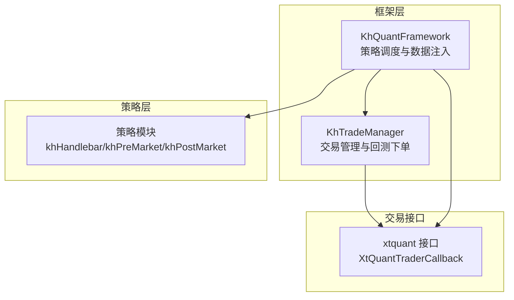
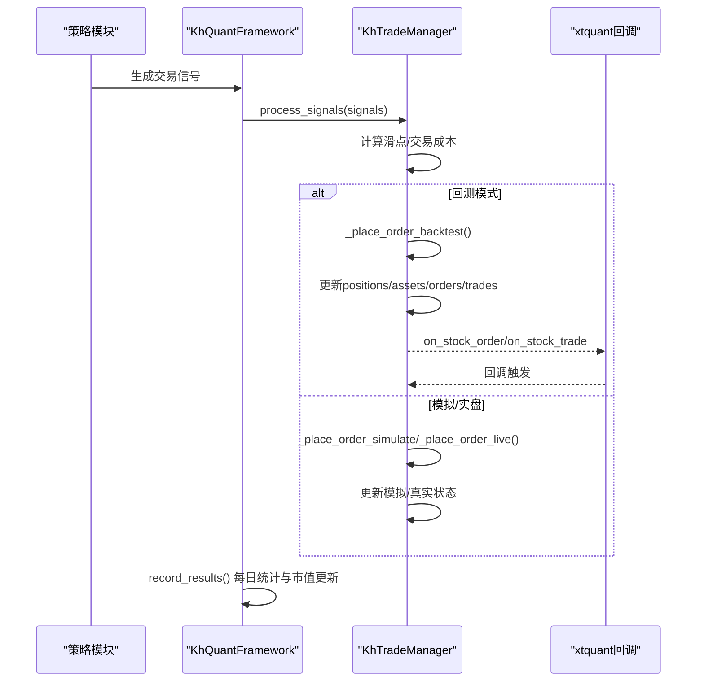
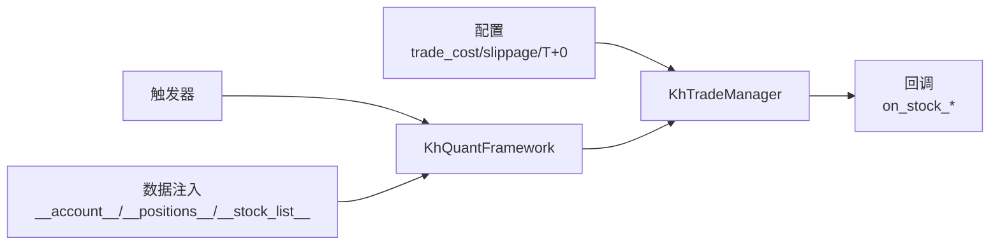

# 持仓管理

<cite>
**本文引用的文件**
- [khFrame.py](file://khFrame.py)
- [khTrade.py](file://khTrade.py)
- [modules/khFrame.md](file://modules/khFrame.md)
</cite>

## 目录
1. [简介](#简介)
2. [项目结构](#项目结构)
3. [核心组件](#核心组件)
4. [架构总览](#架构总览)
5. [详细组件分析](#详细组件分析)
6. [依赖分析](#依赖分析)
7. [性能考量](#性能考量)
8. [故障排查指南](#故障排查指南)
9. [结论](#结论)
10. [附录](#附录)

## 简介
本文件围绕 khFrame.py 中的 KhTradeManager 对持仓的处理逻辑展开，重点解释：
- execute_buy 与 execute_sell 如何更新 trade_mgr.positions 字典，覆盖首次买入、追加买入与部分卖出等场景下的数量与平均成本计算；
- get_positions 如何计算每只股票的未实现盈亏（unrealized PnL），及其在回测结果分析中的作用；
- 结合 modules/khFrame.md 的技术文档，说明持仓信息与账户信息的联动，以及在 T+0 交易模式下的特殊处理逻辑；
- 提供代码示例路径，帮助读者定位到具体的字段与实现位置，如 volume（数量）、avg_price（平均价格）与 cost（成本）等。

## 项目结构
khFrame.py 是量化交易框架的核心，负责策略生命周期管理、事件驱动、数据处理与交易执行；khTrade.py 提供交易管理器，封装交易成本、滑点、下单与回测下单流程，并维护 positions、assets、orders、trades 等状态。

图表来源
- [khFrame.py](file://khFrame.py#L557-L600)
- [khTrade.py](file://khTrade.py#L1-L120)

章节来源
- [khFrame.py](file://khFrame.py#L557-L600)
- [khTrade.py](file://khTrade.py#L1-L120)

## 核心组件
- KhTradeManager：负责交易成本与滑点计算、下单（回测/模拟/实盘）、交易信号处理、以及对 positions、assets、orders、trades 的更新与联动。
- KhQuantFramework：负责策略生命周期、数据注入（账户、持仓、股票池）、触发器与风控检查，并在回测中调用 KhTradeManager.process_signals 执行交易。

章节来源
- [khTrade.py](file://khTrade.py#L1-L120)
- [khFrame.py](file://khFrame.py#L800-L920)

## 架构总览
KhQuantFramework 在每次触发时，会将当前时间、账户资产与持仓注入到策略上下文中，策略据此生成交易信号；框架随后调用 KhTradeManager.process_signals，后者根据运行模式（回测/模拟/实盘）执行下单与持仓更新，并通过回调输出委托、成交、资产与持仓变动信息。

图表来源
- [khFrame.py](file://khFrame.py#L895-L920)
- [khFrame.py](file://khFrame.py#L2506-L2732)
- [khTrade.py](file://khTrade.py#L198-L377)

章节来源
- [khFrame.py](file://khFrame.py#L895-L920)
- [khFrame.py](file://khFrame.py#L2506-L2732)
- [khTrade.py](file://khTrade.py#L198-L377)

## 详细组件分析

### KhTradeManager 持仓更新逻辑（回测下单）
本节聚焦回测下单流程中 execute_buy/execute_sell 的等效实现，以及 positions 字典的更新规则。

- 首次买入
  - 若 positions 中不存在该股票，则新建持仓条目，字段包括 volume、avg_price、open_price、market_value、current_price、direction 等；同时根据 T+0 模式设置 can_use_volume。
  - 该逻辑在回测下单分支中体现为：当信号 code 未在 positions 中时，创建新仓位并设置 can_use_volume（T+0 模式下为当日买入量，T+1 模式为 0）。

- 追加买入
  - 若 positions 中已存在该股票，则更新 avg_price 与 volume：
    - avg_price = (旧 avg_price × 旧 volume + 成交金额) / (旧 volume + 新增 volume)
    - volume += 新增 volume
    - T+0 模式下还可更新 can_use_volume；T+1 模式下不增加可用量。
  - 该逻辑在回测下单分支中体现为：若已存在仓位，累加 volume 并按成交金额重算 avg_price，同时更新 market_value/current_price。

- 部分卖出
  - 检查可用持仓（回测中使用 can_use_volume 字段）；若不足则返回错误；否则减少 volume 与 can_use_volume，并增加 cash（成交金额 - 交易成本）。
  - 若 volume 归零则删除该股票的持仓记录。

- 交易成本与滑点
  - calculate_slippage：按 tick/ratio 模式计算滑点后的实际成交价；
  - calculate_trade_cost：汇总佣金、印花税、过户费、流量费，返回实际成交价与总成本；
  - 回测下单时，使用 actual_price 与 trade_cost 更新资产与成交记录。

- T+0 模式特殊处理
  - set_t0_mode 控制是否启用 T+0；
  - 回测下单时，若启用 T+0，当日买入可当天卖出（can_use_volume += 买入量）；否则不增加可用量。

- 回测下单关键路径（示例路径）
  - 回测下单入口与下单对象创建：[khTrade.py](file://khTrade.py#L269-L377)
  - 买入时的持仓更新与均价重算：[khTrade.py](file://khTrade.py#L387-L426)
  - 卖出时的持仓减少与可用量扣减：[khTrade.py](file://khTrade.py#L427-L457)
  - 交易成本与滑点计算：[khTrade.py](file://khTrade.py#L81-L197)

章节来源
- [khTrade.py](file://khTrade.py#L81-L197)
- [khTrade.py](file://khTrade.py#L198-L377)
- [khTrade.py](file://khTrade.py#L387-L457)

### 未实现盈亏（unrealized PnL）计算与回测分析
- get_positions（modules/khFrame.md 中的 PortfolioManager 版本）
  - 通过当前价格计算每只持仓的市值与未实现盈亏：unrealized_pnl = market_value - cost_basis；
  - 返回字段包含 volume、avg_price、current_price、market_value、cost_basis、unrealized_pnl、unrealized_pnl_ratio 等。

- khFrame.py 中的 record_results（回测记录）
  - 每日统计时，批量计算 positions 的 market_value、profit、profit_ratio，并更新 assets 的 market_value 与 total_asset；
  - 该过程为回测结果分析提供每日净值、收益曲线与基准对比的基础。

- 回测记录关键路径（示例路径）
  - 每日统计与市值更新：[khFrame.py](file://khFrame.py#L2611-L2669)
  - 每日统计写入与基准对比：[khFrame.py](file://khFrame.py#L2829-L3022)

章节来源
- [modules/khFrame.md](file://modules/khFrame.md#L670-L859)
- [khFrame.py](file://khFrame.py#L2611-L2669)
- [khFrame.py](file://khFrame.py#L2829-L3022)

### 持仓与账户信息联动
- KhQuantFramework 在每次行情回调中，将 __account__ 与 __positions__ 注入策略上下文，供策略读取与决策；
- 回测记录阶段，框架根据 positions 与资产计算每日统计，并通过 on_stock_asset/on_stock_position 回调输出。

- 关键路径（示例路径）
  - 上下文注入账户与持仓：[khFrame.py](file://khFrame.py#L831-L849)
  - 资产与持仓回调触发：[khFrame.py](file://khFrame.py#L3072-L3152)

章节来源
- [khFrame.py](file://khFrame.py#L831-L849)
- [khFrame.py](file://khFrame.py#L3072-L3152)

### T+0 交易模式下的特殊处理
- 框架在运行前根据股票池类型自动判定是否启用 T+0，并将模式传递给 KhTradeManager；
- 回测下单时，若启用 T+0，当日买入的 can_use_volume 立即增加；否则不可卖出；
- GUI 层也会根据 T+0 模式更新显示。

- 关键路径（示例路径）
  - T+0 模式判定与设置：[khFrame.py](file://khFrame.py#L984-L1026)
  - T+0 模式下单影响：[khTrade.py](file://khTrade.py#L387-L426)

章节来源
- [khFrame.py](file://khFrame.py#L984-L1026)
- [khTrade.py](file://khTrade.py#L387-L426)

### 代码示例路径（字段与实现）
- execute_buy（回测）：[khTrade.py](file://khTrade.py#L387-L426)
- execute_sell（回测）：[khTrade.py](file://khTrade.py#L427-L457)
- 交易成本与滑点：[khTrade.py](file://khTrade.py#L81-L197)
- get_positions（PortfolioManager 版本）：[modules/khFrame.md](file://modules/khFrame.md#L836-L859)
- 每日统计与未实现盈亏：[khFrame.py](file://khFrame.py#L2611-L2669)

章节来源
- [khTrade.py](file://khTrade.py#L81-L197)
- [khTrade.py](file://khTrade.py#L387-L457)
- [modules/khFrame.md](file://modules/khFrame.md#L836-L859)
- [khFrame.py](file://khFrame.py#L2611-L2669)

## 依赖分析
- KhTradeManager 依赖：
  - 配置（交易成本、滑点、T+0 模式）；
  - 回测下单分支中的资产与持仓更新；
  - 回调接口（on_stock_order、on_stock_trade、on_stock_asset、on_stock_position）。

- KhQuantFramework 依赖：
  - 触发器（Tick/K线/自定义时间）；
  - 数据注入（账户、持仓、股票池）；
  - 回测记录（每日统计、基准数据）。

图表来源
- [khTrade.py](file://khTrade.py#L1-L120)
- [khFrame.py](file://khFrame.py#L831-L849)
- [khFrame.py](file://khFrame.py#L2506-L2732)

章节来源
- [khTrade.py](file://khTrade.py#L1-L120)
- [khFrame.py](file://khFrame.py#L831-L849)
- [khFrame.py](file://khFrame.py#L2506-L2732)

## 性能考量
- 批量价格获取与一次性更新：record_results 中对 positions 的市值与盈亏采用批量计算，减少重复查询与循环次数；
- 交易日缓存：对交易日判断、基准数据、日线价格等进行缓存，降低重复 IO；
- 回测时间点缓存：对自定义时间触发与每日时间点进行缓存，避免重复计算；
- 回调触发频率控制：仅在资产显著变化时触发资产回调，减少回调噪声。

章节来源
- [khFrame.py](file://khFrame.py#L2611-L2669)
- [khFrame.py](file://khFrame.py#L2733-L2823)

## 故障排查指南
- 资金不足（买入）：回测下单时若可用资金不足，会记录错误并触发 on_order_error 回调；检查 trade_cost 与 required_cash 的计算是否符合预期。
- 持仓不足（卖出）：若可用持仓小于卖出量，同样触发错误回调；检查 can_use_volume 的来源与 T+0 模式设置。
- 价格精度：框架会根据股票池类型设置价格精度（股票2位、ETF3位），确保滑点与成交价取整一致。
- T+0 模式提示：若股票池包含混合品种，系统会提示 T+0 模式未启用；请确保股票池仅包含 T0 型 ETF。

章节来源
- [khTrade.py](file://khTrade.py#L289-L327)
- [khFrame.py](file://khFrame.py#L984-L1026)

## 结论
- KhTradeManager 在回测下单中严格遵循“先计算成本与滑点、再检查资金/持仓、最后更新 positions 与资产”的流程；
- 首次买入、追加买入与部分卖出的逻辑清晰，平均成本与可用量（T+0）均得到正确维护；
- get_positions 与 record_results 提供了完整的未实现盈亏与每日统计能力，支撑回测结果分析；
- T+0 模式与价格精度设置进一步提升了回测的真实性与可读性。

## 附录
- 代码示例路径（便于定位）：
  - execute_buy（回测）：[khTrade.py](file://khTrade.py#L387-L426)
  - execute_sell（回测）：[khTrade.py](file://khTrade.py#L427-L457)
  - 交易成本与滑点：[khTrade.py](file://khTrade.py#L81-L197)
  - get_positions（PortfolioManager 版本）：[modules/khFrame.md](file://modules/khFrame.md#L836-L859)
  - 每日统计与未实现盈亏：[khFrame.py](file://khFrame.py#L2611-L2669)