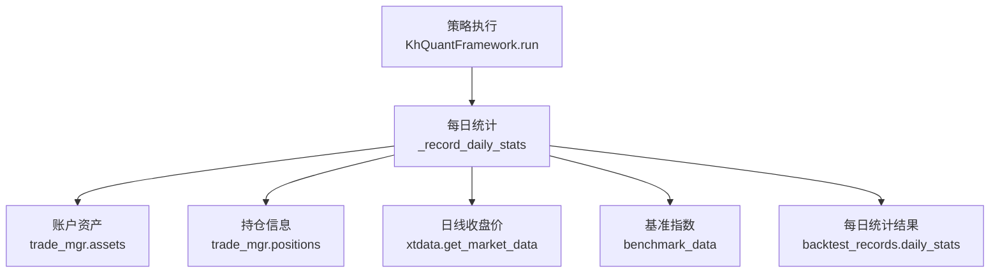
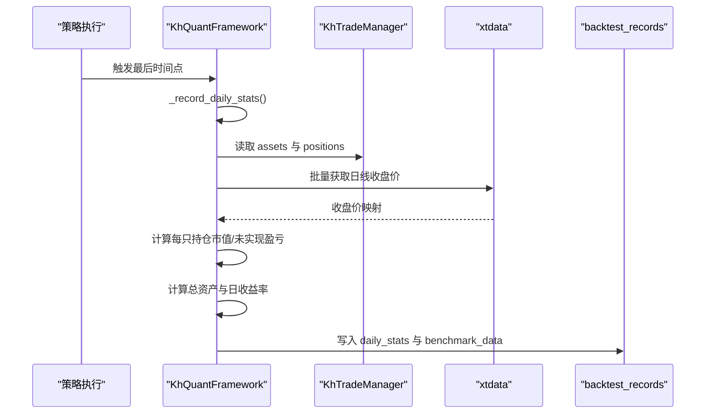
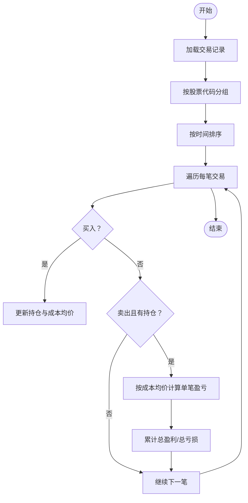
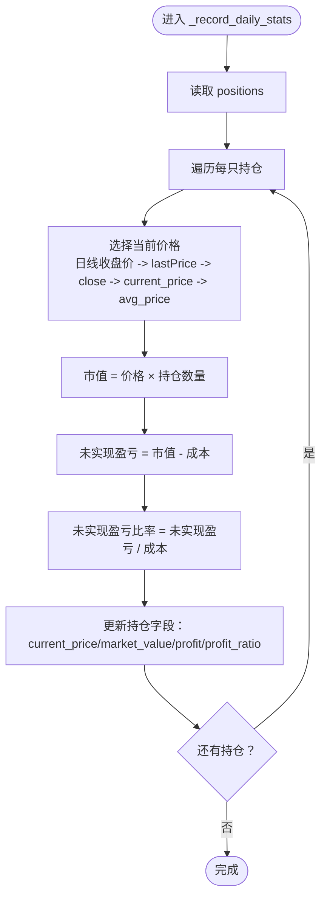
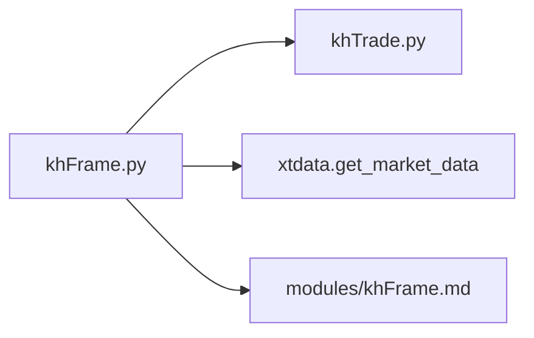

# 盈亏计算

<cite>
**本文引用的文件**
- [khFrame.py](file://khFrame.py)
- [khTrade.py](file://khTrade.py)
- [modules/khFrame.md](file://modules/khFrame.md)
- [backtest_result_window.py](file://backtest_result_window.py)
</cite>

## 目录
1. [引言](#引言)
2. [项目结构](#项目结构)
3. [核心组件](#核心组件)
4. [架构总览](#架构总览)
5. [详细组件分析](#详细组件分析)
6. [依赖关系分析](#依赖关系分析)
7. [性能考量](#性能考量)
8. [故障排查指南](#故障排查指南)
9. [结论](#结论)
10. [附录](#附录)

## 引言
本文件围绕 khFrame.py 中的“已实现盈亏”和“未实现盈亏”计算展开，系统梳理以下内容：
- 已实现盈亏（realized PnL）：通过匹配买入与卖出成交对，逐笔计算卖出交易产生的已实现收益/损失。
- 未实现盈亏（unrealized PnL）：基于当前市场价格与持仓平均成本，计算每只股票的浮动盈亏。
- 账户总盈亏：汇总所有持仓的未实现盈亏，得到账户层面的总浮动盈亏。
- 每日状态记录（_record_daily_stats）：在回测末尾时间点，批量获取日线收盘价，计算当日总资产、日收益率，并形成回测报告中的收益率曲线基础数据。

同时结合 modules/khFrame.md 中的说明，解释 get_positions 与 get_account_info 的职责边界，以及它们在每日统计中的应用。

## 项目结构
khFrame.py 是回测框架的核心，负责策略执行、数据驱动、交易执行与每日统计。与盈亏计算直接相关的模块包括：
- khFrame.py：回测主循环、每日统计记录、账户与持仓信息维护。
- khTrade.py：交易成本计算（佣金、印花税、过户费、流量费）、滑点模拟、交易执行。
- modules/khFrame.md：对 get_positions、get_account_info 等接口的说明。
- backtest_result_window.py：回测结果窗口，包含对交易记录的二次统计（胜率、盈亏比等），可作为已实现盈亏计算的参考实现思路。

图表来源
- [khFrame.py](file://khFrame.py#L2829-L3021)

章节来源
- [khFrame.py](file://khFrame.py#L2829-L3021)

## 核心组件
- 已实现盈亏（Realized PnL）：在卖出成交发生时，依据“先进先出”或“同批次成交对”匹配买入与卖出，逐笔计算卖出收益/损失。khFrame.py 中未直接提供 calculate_realized_pnl 方法，但回测记录中保存了每笔成交的明细，可在外部工具中按交易记录进行匹配计算。
- 未实现盈亏（Unrealized PnL）：在每日统计时，对每只持仓按当前价格（优先使用日线收盘价，其次使用触发数据中的 lastPrice/close，再退回到持仓记录的 current_price 或 avg_price）计算市值，进而得到未实现盈亏。
- 账户总未实现盈亏（Account Unrealized PnL）：将所有持仓的未实现盈亏求和，得到账户层面的总浮动盈亏。

章节来源
- [khFrame.py](file://khFrame.py#L2829-L3021)
- [modules/khFrame.md](file://modules/khFrame.md#L820-L859)

## 架构总览
回测主循环在最后时间点触发每日统计，_record_daily_stats 会：
- 读取 trade_mgr.assets 与 trade_mgr.positions。
- 批量获取当日日线收盘价，计算每只持仓的当前价格、市值、未实现盈亏。
- 计算总资产、日收益率，并写入 backtest_records.daily_stats。
- 同时记录基准指数收盘价，用于后续对比分析。

图表来源
- [khFrame.py](file://khFrame.py#L2829-L3021)

## 详细组件分析

### 已实现盈亏（Realized PnL）计算
- khFrame.py 中未直接提供 calculate_realized_pnl 方法，但回测记录中保存了每笔成交的明细（含方向、价格、数量、手续费等）。可在外部工具中按交易记录进行匹配计算。
- 参考 backtest_result_window.py 中的实现思路：按股票代码分组，按时间顺序遍历交易，买入时更新持仓与成本，卖出时按成本与卖出价格计算单笔盈亏并累计统计。

图表来源
- [backtest_result_window.py](file://backtest_result_window.py#L2414-L2569)

章节来源
- [backtest_result_window.py](file://backtest_result_window.py#L2414-L2569)

### 未实现盈亏（Unrealized PnL）计算
- 在 _record_daily_stats 中，对每只持仓：
  - 优先使用日线收盘价作为当前价格；若无日线数据，则使用触发数据中的 lastPrice（tick）或 close（k线）；若仍无，则使用持仓记录中的 current_price，最后退回到 avg_price。
  - 计算市值 = current_price × volume。
  - 计算未实现盈亏 = 市值 − 成本 = (current_price − avg_price) × volume。
  - 计算未实现盈亏比率 = 未实现盈亏 / 成本。
  - 更新 positions 中的 current_price、market_value、profit、profit_ratio。

图表来源
- [khFrame.py](file://khFrame.py#L2829-L3021)

章节来源
- [khFrame.py](file://khFrame.py#L2829-L3021)

### 账户总未实现盈亏（Account Unrealized PnL）
- 在 _record_daily_stats 中，对所有持仓的未实现盈亏求和，得到账户层面的总浮动盈亏。
- 同时计算总资产 = 现金 + 持仓市值，日收益率 = (总资产 − 上一日总资产) / 上一日总资产（或期初资产）。

章节来源
- [khFrame.py](file://khFrame.py#L2829-L3021)

### get_positions 与 get_account_info 的职责
- get_positions：返回每只持仓的详细信息，包括当前价格、平均成本、市值、未实现盈亏及比率。该接口用于策略上下文中展示当前持仓状态。
- get_account_info：返回账户层面的资产快照，包括可用资金、冻结资金、市值、总资产与持仓数量。该接口用于策略上下文中展示账户整体情况。

章节来源
- [modules/khFrame.md](file://modules/khFrame.md#L820-L859)

### 每日状态记录（_record_daily_stats）与回测报告
- _record_daily_stats 在最后时间点被调用，批量获取日线收盘价，计算当日未实现盈亏、总资产与日收益率，并写入 backtest_records.daily_stats。
- 基准指数收盘价也被记录，用于后续对比分析。
- 回测报告中的收益率曲线通常由 daily_stats 中的 total_asset 或 daily_return 推导而来。

章节来源
- [khFrame.py](file://khFrame.py#L2829-L3021)

## 依赖关系分析
- khFrame.py 依赖 khTrade.py 提供的成本计算与滑点模拟能力，用于交易执行阶段的成本核算。
- khFrame.py 通过 xtdata.get_market_data 获取日线收盘价，用于每日统计时的未实现盈亏计算。
- modules/khFrame.md 定义了 get_positions 与 get_account_info 的返回结构，指导策略侧如何消费这些数据。

图表来源
- [khFrame.py](file://khFrame.py#L2829-L3021)
- [khTrade.py](file://khTrade.py#L1-L200)
- [modules/khFrame.md](file://modules/khFrame.md#L820-L859)

章节来源
- [khFrame.py](file://khFrame.py#L2829-L3021)
- [khTrade.py](file://khTrade.py#L1-L200)
- [modules/khFrame.md](file://modules/khFrame.md#L820-L859)

## 性能考量
- 批量日线数据获取：_record_daily_stats 中对日线收盘价采用批量获取并缓存，避免重复请求，提升性能。
- 交易日判断与缓存：对交易日的判断结果进行缓存，减少重复计算。
- 向量化操作：在计算市值与未实现盈亏时，尽量使用向量化或列表推导，降低循环开销。

章节来源
- [khFrame.py](file://khFrame.py#L2829-L3021)

## 故障排查指南
- 日线数据获取失败：当 _record_daily_stats 无法从 xtdata 获取日线收盘价时，会记录错误并回退到触发数据中的 lastPrice/close 或持仓记录中的价格。建议检查数据源配置与交易日设置。
- 未实现盈亏为零：若当前价格与平均成本相同或持仓数量为零，未实现盈亏将为零。请确认是否正确设置了 avg_price 与 current_price。
- 账户资产异常：若 cash 与 market_value 之和与 total_asset 不一致，检查是否有未结算的冻结资金或交易成本未计入。

章节来源
- [khFrame.py](file://khFrame.py#L2829-L3021)

## 结论
- 已实现盈亏：khFrame.py 未直接提供 calculate_realized_pnl，但回测记录中保存了完整的成交明细，可在外部工具中按交易记录进行匹配计算。
- 未实现盈亏：khFrame.py 在每日统计中实现了基于日线收盘价的未实现盈亏计算，并将结果写入每日统计。
- 账户总未实现盈亏：通过对所有持仓未实现盈亏求和得到账户层面的总浮动盈亏。
- 回测报告：每日统计中的 total_asset/daily_return 为回测报告中的收益率曲线提供基础数据。

## 附录
- 代码示例路径（不展示具体代码内容）：
  - 已实现盈亏计算参考实现：[backtest_result_window.py](file://backtest_result_window.py#L2414-L2569)
  - 未实现盈亏计算与每日统计：[khFrame.py](file://khFrame.py#L2829-L3021)
  - 账户与持仓接口说明：[modules/khFrame.md](file://modules/khFrame.md#L820-L859)
  - 交易成本与滑点计算：[khTrade.py](file://khTrade.py#L1-L200)