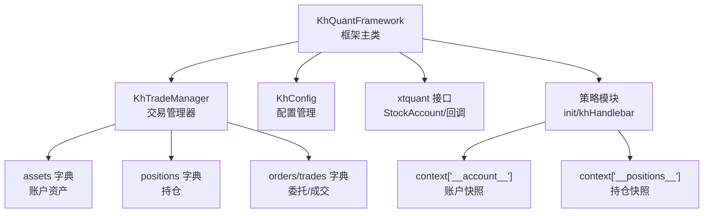
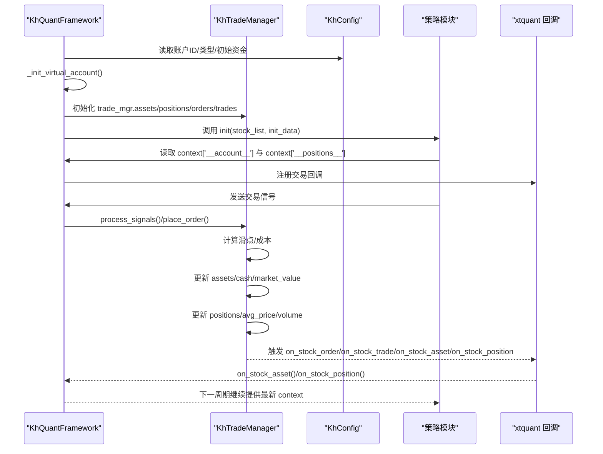
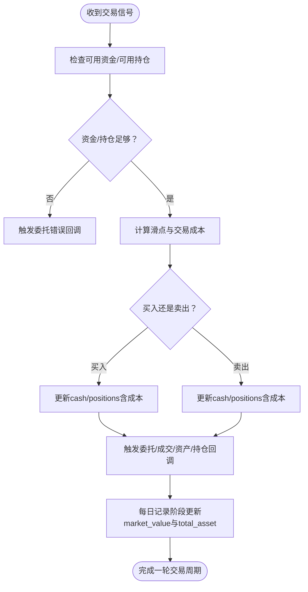
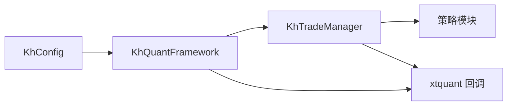

# 账户管理

<cite>
**本文引用的文件**
- [khFrame.py](file://khFrame.py)
- [khTrade.py](file://khTrade.py)
- [khConfig.py](file://khConfig.py)
- [modules/khFrame.md](file://modules/khFrame.md)
- [README.md](file://README.md)
</cite>

## 目录
1. [简介](#简介)
2. [项目结构](#项目结构)
3. [核心组件](#核心组件)
4. [架构总览](#架构总览)
5. [详细组件分析](#详细组件分析)
6. [依赖分析](#依赖分析)
7. [性能考量](#性能考量)
8. [故障排查指南](#故障排查指南)
9. [结论](#结论)
10. [附录](#附录)

## 简介
本文件聚焦于账户管理，围绕 khFrame.py 中的 KhQuantFramework 类，深入解析其虚拟账户初始化机制、交易管理器对账户资产字典的维护方式，以及策略如何通过上下文获取实时账户状态。重点覆盖：
- 虚拟账户初始化流程与关键字段含义
- trade_mgr.assets 字典结构与各字段计算逻辑
- 资金变动的完整流程（从交易执行到资金冻结、成本计算与最终结算）
- 回测过程中的账户信息更新与维护
- get_account_info 的使用方式与策略侧获取账户状态的方法

## 项目结构
围绕账户管理的相关文件与职责：
- khFrame.py：框架主类，负责策略生命周期、回测调度、行情回调、交易接口与账户初始化
- khTrade.py：交易管理器，负责交易信号处理、下单、成交、成本与滑点计算、资产与持仓更新
- khConfig.py：配置管理，提供账户ID、账户类型、初始资金、回测起止时间等配置
- modules/khFrame.md：框架模块文档，包含策略上下文结构说明
- README.md：策略接口文档，明确 context 中账户字段语义

图表来源
- [khFrame.py](file://khFrame.py#L494-L1199)
- [khTrade.py](file://khTrade.py#L1-L120)
- [khConfig.py](file://khConfig.py#L1-L105)

章节来源
- [khFrame.py](file://khFrame.py#L494-L1199)
- [khTrade.py](file://khTrade.py#L1-L120)
- [khConfig.py](file://khConfig.py#L1-L105)

## 核心组件
- KhQuantFramework：框架主类，负责初始化、回测调度、行情回调、交易接口与账户初始化
- KhTradeManager：交易管理器，负责交易信号处理、下单、成交、成本与滑点计算、资产与持仓更新
- KhConfig：配置管理，提供账户ID、账户类型、初始资金、回测起止时间等配置

章节来源
- [khFrame.py](file://khFrame.py#L494-L740)
- [khTrade.py](file://khTrade.py#L1-L120)
- [khConfig.py](file://khConfig.py#L1-L105)

## 架构总览
账户管理在框架中的位置与交互如下：

图表来源
- [khFrame.py](file://khFrame.py#L651-L703)
- [khFrame.py](file://khFrame.py#L1000-L1050)
- [khFrame.py](file://khFrame.py#L3100-L3152)
- [khTrade.py](file://khTrade.py#L198-L507)

章节来源
- [khFrame.py](file://khFrame.py#L651-L703)
- [khFrame.py](file://khFrame.py#L1000-L1050)
- [khFrame.py](file://khFrame.py#L3100-L3152)
- [khTrade.py](file://khTrade.py#L198-L507)

## 详细组件分析

### 虚拟账户初始化：_init_virtual_account
- 初始化 StockAccount 对象，使用配置中的 account_id 与 account_type
- 读取回测配置中的基准指数与初始资金 init_capital
- 初始化 trade_mgr.assets 字典，字段包括：
  - account_type：账户类型常量
  - account_id：账户ID
  - cash：可用资金（初始等于 init_capital）
  - frozen_cash：冻结资金（初始为0）
  - market_value：持仓市值（初始为0）
  - total_asset：总资产（初始等于 init_capital）
  - benchmark：基准指数代码
- 同时初始化 trade_mgr.positions、orders、trades 字典为空

章节来源
- [khFrame.py](file://khFrame.py#L651-L703)
- [khConfig.py](file://khConfig.py#L1-L105)

### trade_mgr.assets 字典结构与字段含义
- account_type：账户类型（常量）
- account_id：账户ID
- cash：可用资金（float）
- frozen_cash：冻结资金（float）
- market_value：持仓市值（float）
- total_asset：总资产（float）
- benchmark：基准指数代码（str）

字段计算逻辑与更新点：
- 初始值：由 _init_virtual_account 设置
- 回测过程中，交易完成后由交易管理器更新：
  - 买入：减少 cash（含交易成本），更新 positions 并在记录阶段统一更新 market_value
  - 卖出：增加 cash（成交金额-交易成本），更新 positions
- 市值与总资产：
  - market_value 在每日记录阶段根据最新价格汇总更新
  - total_asset = cash + market_value（在记录阶段统一计算）

章节来源
- [khFrame.py](file://khFrame.py#L651-L703)
- [khTrade.py](file://khTrade.py#L378-L462)

### 资金变动完整流程（从交易执行到结算）
- 交易信号到达：策略通过上下文获取账户状态后发出 buy/sell 信号
- 交易管理器处理：
  - 计算滑点与交易成本（佣金、印花税、过户费、流量费）
  - 买入时检查资金是否足够（含成本），不足则触发委托错误回调
  - 卖出时检查可用持仓是否足够
- 资产与持仓更新：
  - 买入：cash 减少（含成本），positions 增加或更新均价与数量；回测中通常不模拟冻结资金，简化处理
  - 卖出：cash 增加（成交金额-成本），positions 减少或清仓
- 回调触发：
  - on_stock_order/on_stock_trade/on_stock_asset/on_stock_position
- 每日统计：
  - 在记录阶段根据最新价格更新 market_value，再计算 total_asset

图表来源
- [khTrade.py](file://khTrade.py#L240-L507)
- [khFrame.py](file://khFrame.py#L3100-L3152)
- [khFrame.py](file://khFrame.py#L2828-L2880)

章节来源
- [khTrade.py](file://khTrade.py#L240-L507)
- [khFrame.py](file://khFrame.py#L3100-L3152)
- [khFrame.py](file://khFrame.py#L2828-L2880)

### 回测过程中的账户信息更新与维护
- 策略初始化时，框架将 trade_mgr.assets 与 trade_mgr.positions 作为上下文的一部分注入策略 init 的上下文中，供策略读取
- 回测主循环中，每日记录阶段会根据最新价格汇总持仓市值并更新总资产
- 交易回调（on_stock_asset/on_stock_position）用于向 GUI 或外部观察者推送账户状态变化

章节来源
- [khFrame.py](file://khFrame.py#L1000-L1050)
- [khFrame.py](file://khFrame.py#L2828-L2880)
- [khFrame.py](file://khFrame.py#L3139-L3152)

### 策略侧获取账户状态：context['__account__'] 与 context['__positions__']
- 策略在 init 阶段接收的上下文包含：
  - __account__：账户资产快照，字段与 trade_mgr.assets 一致
  - __positions__：持仓快照，字段与 trade_mgr.positions 一致
- README 文档明确指出：
  - cash：当前可用于交易的现金
  - market_value：所有持仓按当前市价计算的总市值
  - total_asset：总资产，即 cash + market_value
  - frozen_cash：因挂单而冻结的资金

章节来源
- [modules/khFrame.md](file://modules/khFrame.md#L1654-L1674)
- [README.md](file://README.md#L1780-L1817)

## 依赖分析
- KhQuantFramework 依赖 KhTradeManager 提供交易执行与账户资产维护
- KhTradeManager 依赖 KhConfig 提供账户ID、账户类型、初始资金等配置
- 策略模块通过框架提供的上下文读取账户与持仓信息
- 交易回调（on_stock_asset/on_stock_position）用于外部观察者订阅账户状态变化

图表来源
- [khConfig.py](file://khConfig.py#L1-L105)
- [khFrame.py](file://khFrame.py#L494-L740)
- [khTrade.py](file://khTrade.py#L1-L120)

章节来源
- [khConfig.py](file://khConfig.py#L1-L105)
- [khFrame.py](file://khFrame.py#L494-L740)
- [khTrade.py](file://khTrade.py#L1-L120)

## 性能考量
- 回测阶段对资产与持仓的更新采用“延迟计算”策略：在交易发生时仅更新 cash 与 positions，每日记录阶段统一计算 market_value 与 total_asset，避免重复计算带来的开销
- 交易成本与滑点在下单前计算，减少交易执行时的分支判断
- 交易管理器对委托、成交、持仓字典采用字典结构，便于 O(1) 查找与更新

[本节为一般性指导，不涉及具体文件分析]

## 故障排查指南
- 资金不足导致委托失败：
  - 现象：下单时触发委托错误回调，提示所需资金与可用资金
  - 排查：确认信号 volume 与 price，以及交易成本（佣金、印花税、过户费、流量费）
- 持仓不足导致委托失败：
  - 现象：卖出时触发委托错误回调，提示可用持仓不足
  - 排查：确认 positions 中的 can_use_volume 与 volume
- 资产与市值不一致：
  - 现象：total_asset 与 cash + market_value 不相等
  - 排查：检查每日记录阶段是否已更新 market_value；确认策略是否在回测中正确使用上下文

章节来源
- [khTrade.py](file://khTrade.py#L288-L327)
- [khTrade.py](file://khTrade.py#L310-L327)
- [khFrame.py](file://khFrame.py#L2828-L2880)

## 结论
- 虚拟账户初始化在框架启动时完成，trade_mgr.assets 作为账户状态的核心载体贯穿回测全流程
- 交易管理器负责交易成本与滑点计算、资金与持仓的实时更新，并通过回调对外发布账户状态
- 策略通过上下文获取账户与持仓快照，结合 README 中的字段语义，可实现基于资金动态的交易决策
- 回测阶段采用“交易即时更新 + 每日汇总”的方式平衡准确性与性能

[本节为总结性内容，不涉及具体文件分析]

## 附录
- 关键字段语义（来自 README 与框架上下文）：
  - cash：当前可用于交易的现金
  - market_value：所有持仓按当前市价计算的总市值
  - total_asset：总资产，即 cash + market_value
  - frozen_cash：因挂单而冻结的资金

章节来源
- [README.md](file://README.md#L1780-L1817)
- [modules/khFrame.md](file://modules/khFrame.md#L1654-L1674)