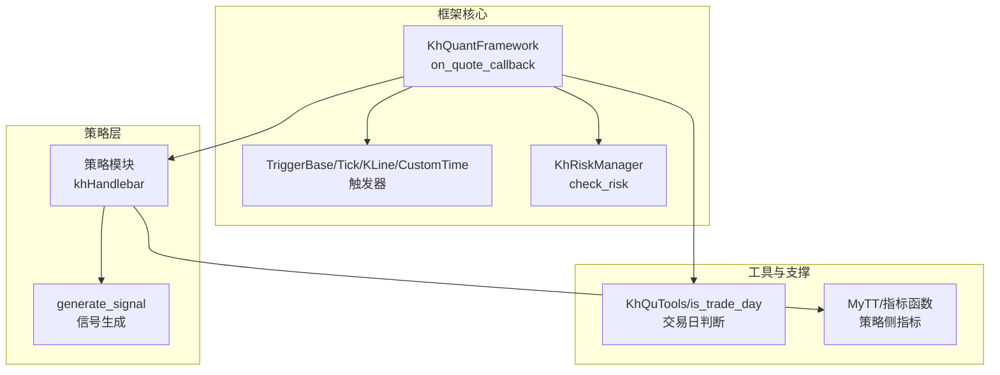
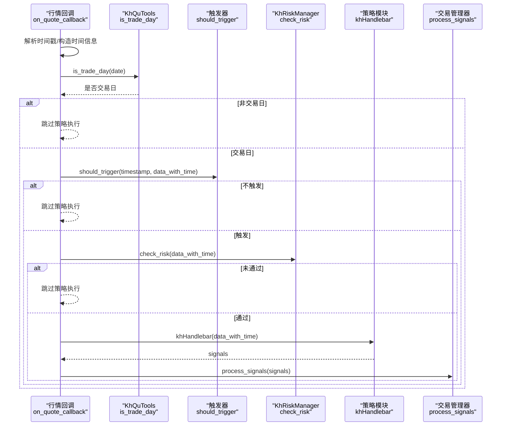
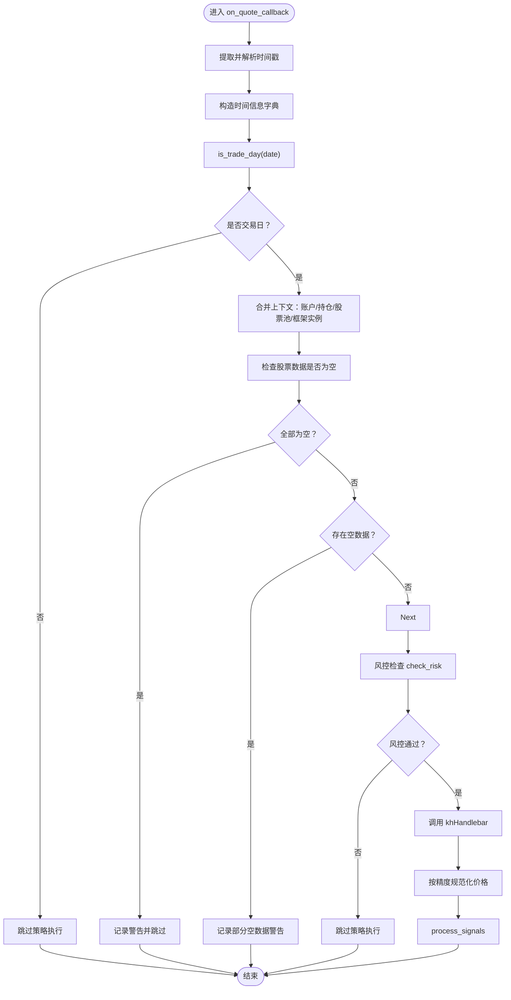
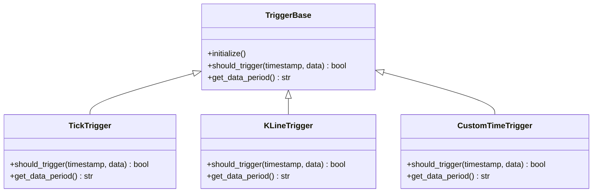
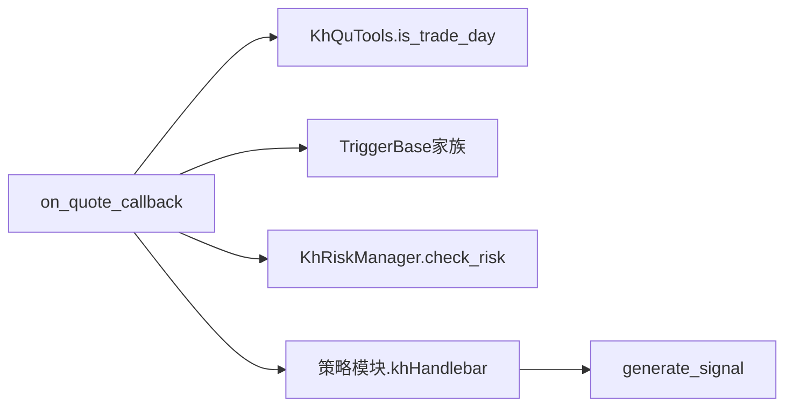

# 数据处理

<cite>
**本文引用的文件**
- [khFrame.py](file://khFrame.py)
- [khQTTools.py](file://khQTTools.py)
- [khRisk.py](file://khRisk.py)
- [modules/khFrame.md](file://modules/khFrame.md)
- [README.md](file://README.md)
- [strategies/RSI策略.py](file://strategies/RSI策略.py)
</cite>

## 目录
1. [简介](#简介)
2. [项目结构](#项目结构)
3. [核心组件](#核心组件)
4. [架构总览](#架构总览)
5. [详细组件分析](#详细组件分析)
6. [依赖关系分析](#依赖关系分析)
7. [性能考量](#性能考量)
8. [故障排查指南](#故障排查指南)
9. [结论](#结论)
10. [附录](#附录)

## 简介
本文件围绕 khFrame.py 中的 on_quote_callback 方法，系统性解析实时行情数据流的处理流程，重点覆盖：
- 时间戳解析与标准化
- 交易日判断与跳过逻辑
- 将时间信息注入数据字典的机制
- 将原始行情数据转换为策略可处理格式
- 异常数据与缺失值的处理策略
- 数据处理管道的设计理念与一致性保障
- 如何扩展数据处理能力（如添加自定义指标计算）
- 在不同回测模式下的数据处理一致性

## 项目结构
khFrame.py 是框架的核心执行引擎，负责策略生命周期管理、事件驱动、数据处理与交易执行。与之协同的关键模块包括：
- khQTTools.py：提供交易日判断、价格精度、T+0 支持、信号生成等工具函数
- khRisk.py：提供风控检查接口
- modules/khFrame.md：策略执行引擎与数据管理的高层设计文档
- README.md：策略接口规范与上下文结构说明
- strategies/RSI策略.py：策略示例，展示如何在 khHandlebar 中消费数据字典

图表来源
- [khFrame.py](file://khFrame.py#L744-L911)
- [khQTTools.py](file://khQTTools.py#L296-L375)
- [khRisk.py](file://khRisk.py#L1-L51)
- [modules/khFrame.md](file://modules/khFrame.md#L143-L300)
- [README.md](file://README.md#L1677-L1726)

章节来源
- [khFrame.py](file://khFrame.py#L744-L911)
- [khQTTools.py](file://khQTTools.py#L296-L375)
- [khRisk.py](file://khRisk.py#L1-L51)
- [modules/khFrame.md](file://modules/khFrame.md#L143-L300)
- [README.md](file://README.md#L1677-L1726)

## 核心组件
- on_quote_callback：实时/回测行情回调入口，负责时间戳解析、交易日判断、数据字典注入、风控校验、信号生成与交易执行。
- 触发器体系：TickTrigger、KLineTrigger、CustomTimeTrigger，决定策略执行频率与时机。
- KhQuTools.is_trade_day：统一的交易日判断逻辑，支持多种日期格式与节假日判定。
- KhRiskManager.check_risk：风控前置检查，保证策略执行的安全边界。
- 策略接口 khHandlebar：策略主逻辑入口，接收包含时间、账户、持仓、股票池与行情数据的上下文字典。

章节来源
- [khFrame.py](file://khFrame.py#L744-L911)
- [khFrame.py](file://khFrame.py#L87-L109)
- [khFrame.py](file://khFrame.py#L112-L177)
- [khFrame.py](file://khFrame.py#L181-L242)
- [khQTTools.py](file://khQTTools.py#L296-L375)
- [khRisk.py](file://khRisk.py#L1-L51)
- [README.md](file://README.md#L1677-L1726)

## 架构总览
on_quote_callback 的执行路径如下：
- 提取并标准化时间戳（秒/毫秒）
- 构造时间信息字典（timestamp/datetime/date/time）
- 交易日判断：非交易日直接跳过
- 合并时间信息与账户/持仓/股票池/框架实例到数据字典
- 数据完整性检查：空数据警告与跳过
- 风控检查：不通过则跳过
- 调用策略 khHandlebar，得到信号列表
- 信号价格精度规范化与交易执行

图表来源
- [khFrame.py](file://khFrame.py#L744-L911)
- [khQTTools.py](file://khQTTools.py#L296-L375)
- [khRisk.py](file://khRisk.py#L1-L51)

## 详细组件分析

### on_quote_callback 方法深度解析
- 时间戳解析与标准化
  - 从 data["timestamp"] 获取时间戳，支持字符串与整数；毫秒级与秒级自动区分
  - 构造 datetime 对象并生成统一的字典结构（timestamp/datetime/date/time）
- 交易日判断
  - 使用 KhQuTools.is_trade_day 对日期进行判断，非交易日直接返回，避免策略在非交易日执行
- 数据字典注入
  - 将时间信息注入到 data_with_time["__current_time__"]
  - 合并账户资产、持仓、股票池、框架实例等上下文信息
- 数据完整性检查
  - 遍历 data_with_time，检测各股票数据是否为空或Series为空
  - 若全部为空，记录警告并跳过；若部分为空，记录警告但继续执行
- 风控检查
  - 调用 KhRiskManager.check_risk，不通过则跳过
- 策略执行与信号处理
  - 调用策略模块的 khHandlebar，得到信号列表
  - 对信号中的价格按框架动态精度进行四舍五入
  - 交由交易管理器执行

图表来源
- [khFrame.py](file://khFrame.py#L744-L911)
- [khQTTools.py](file://khQTTools.py#L296-L375)
- [khRisk.py](file://khRisk.py#L1-L51)

章节来源
- [khFrame.py](file://khFrame.py#L744-L911)

### 触发器体系与回测模式一致性
- TickTrigger：每个Tick都触发，适合高频策略与实时回测
- KLineTrigger：按分钟/日K线形成触发，适合基于K线的策略
- CustomTimeTrigger：在指定时间点触发，适合盘前/盘后策略
- 触发器工厂根据配置创建对应触发器，保证不同回测模式下策略执行频率一致

图表来源
- [khFrame.py](file://khFrame.py#L51-L109)
- [khFrame.py](file://khFrame.py#L112-L177)
- [khFrame.py](file://khFrame.py#L181-L242)

章节来源
- [khFrame.py](file://khFrame.py#L51-L109)
- [khFrame.py](file://khFrame.py#L112-L177)
- [khFrame.py](file://khFrame.py#L181-L242)

### 交易日判断与节假日处理
- 支持多种日期格式输入（如 "YYYY-MM-DD"、"YYYYMMDD" 等）
- 排除周末与法定节假日，返回是否为交易日
- 异常情况下提供降级处理，保证鲁棒性

章节来源
- [khQTTools.py](file://khQTTools.py#L296-L375)

### 数据完整性与异常处理
- 对空数据进行分类统计与告警，避免策略在无数据时误执行
- 对毫秒/秒级时间戳进行自动转换，提升兼容性
- 对价格精度进行动态规范化，确保策略侧信号与交易端一致

章节来源
- [khFrame.py](file://khFrame.py#L853-L911)
- [khFrame.py](file://khFrame.py#L900-L907)

### 策略接口与上下文结构
- README 对 khHandlebar 的上下文结构进行了详细说明，包括 __current_time__、__account__、__positions__、__framework__ 与各股票的行情数据
- 策略侧通过 generate_signal 等工具函数生成标准信号，统一遵循价格精度与数量单位规则

章节来源
- [README.md](file://README.md#L1677-L1726)
- [khQTTools.py](file://khQTTools.py#L635-L740)

### 示例：在策略中扩展指标计算
- 策略示例展示了如何在 khHandlebar 中拉取历史数据、计算指标（如 RSI）、并生成买卖信号
- 策略侧可直接使用 khHistory、khGet、khPrice 等工具函数，结合 generate_signal 输出标准信号

章节来源
- [strategies/RSI策略.py](file://strategies/RSI策略.py#L1-L26)
- [README.md](file://README.md#L1677-L1726)

## 依赖关系分析
- on_quote_callback 依赖 KhQuTools.is_trade_day 进行交易日判断
- 依赖 TriggerBase 家族进行触发时机控制
- 依赖 KhRiskManager.check_risk 进行风控前置检查
- 依赖策略模块的 khHandlebar 与 generate_signal 等工具函数

图表来源
- [khFrame.py](file://khFrame.py#L744-L911)
- [khQTTools.py](file://khQTTools.py#L296-L375)
- [khRisk.py](file://khRisk.py#L1-L51)
- [README.md](file://README.md#L1677-L1726)

章节来源
- [khFrame.py](file://khFrame.py#L744-L911)
- [khQTTools.py](file://khQTTools.py#L296-L375)
- [khRisk.py](file://khRisk.py#L1-L51)
- [README.md](file://README.md#L1677-L1726)

## 性能考量
- on_quote_callback 中对毫秒/秒级时间戳的自动转换与格式化，避免重复解析
- 对空数据的快速检测与告警，减少无效策略调用
- 价格精度动态设置，避免频繁格式化开销
- 触发器按周期选择（tick/min/day/custom）降低策略执行频率，平衡回测效率与策略响应

[本节为通用指导，无需特定文件引用]

## 故障排查指南
- 非交易日跳过：确认日期格式与节假日库配置是否正确
- 空数据跳过：检查数据源与下载进度，关注告警日志
- 风控未通过：检查 KhRiskManager 的参数配置与策略侧信号合法性
- 价格精度异常：确认股票池类型与精度设置是否匹配

章节来源
- [khFrame.py](file://khFrame.py#L744-L911)
- [khRisk.py](file://khRisk.py#L1-L51)

## 结论
on_quote_callback 通过统一的时间戳解析、交易日判断、上下文注入与风控检查，构建了稳定可靠的数据处理管道。配合触发器体系与工具函数，能够在不同回测模式下保持策略执行的一致性与可扩展性。策略侧只需专注于信号生成与指标计算，即可无缝对接框架的数据处理与交易执行链路。

[本节为总结，无需特定文件引用]

## 附录

### 数据处理管道设计要点
- 统一时间信息：在数据字典中注入 __current_time__，确保策略侧对时间的访问一致性
- 交易日过滤：在进入策略执行前进行交易日判断，避免无效执行
- 上下文完备：账户、持仓、股票池、框架实例的注入，满足策略侧对上下文的需求
- 异常与缺失值处理：对空数据进行分类处理与告警，保证策略稳定性
- 风控前置：在策略执行前进行风控检查，降低策略执行风险

章节来源
- [khFrame.py](file://khFrame.py#L744-L911)
- [khQTTools.py](file://khQTTools.py#L296-L375)
- [README.md](file://README.md#L1677-L1726)