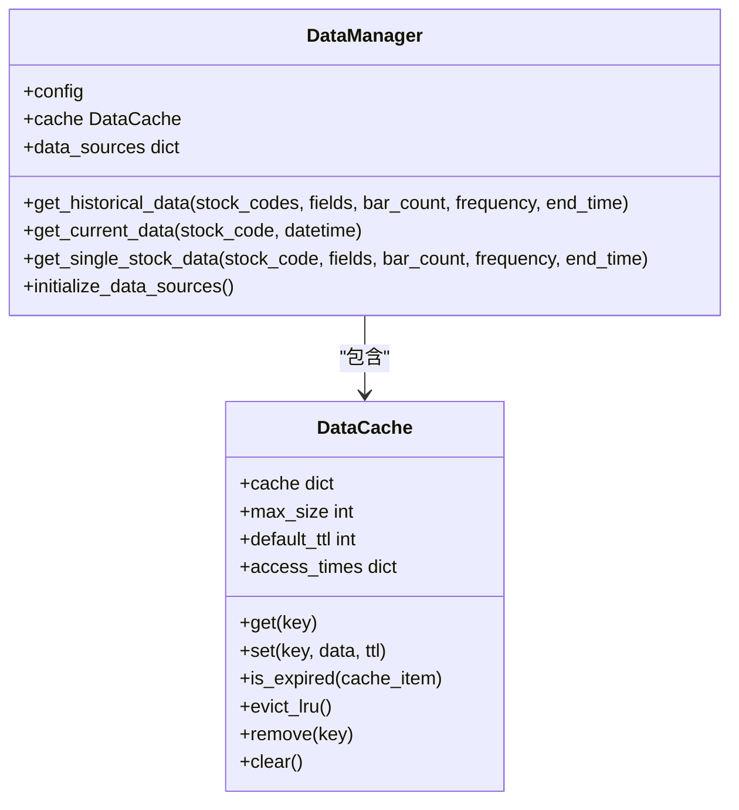

# 数据管理引擎

<cite>
**本文档引用的文件**   
- [khFrame.py](file://khFrame.py)
- [modules/khFrame.md](file://modules/khFrame.md)
</cite>

## 目录
1. [引言](#引言)
2. [数据获取与初始化](#数据获取与初始化)
3. [实时行情数据处理](#实时行情数据处理)
4. [数据管理器设计](#数据管理器设计)
5. [缓存机制详解](#缓存机制详解)
6. [结论](#结论)

## 引言
本项目中的数据管理引擎是量化交易框架的核心组件，负责处理历史数据下载、实时行情处理以及数据缓存等关键功能。通过`khFrame.py`文件中的`DataManager`和`DataCache`类，系统实现了高效的数据访问和处理机制，为策略执行提供了可靠的数据支持。

## 数据获取与初始化
数据管理引擎通过`init_data`方法实现历史数据的批量下载和初始化。该方法利用`xtdata.download_history_data2`函数从MiniQMT客户端获取数据，支持增量下载模式以提高效率。

`init_data`方法首先检查股票列表是否为空，若不为空则开始下载过程。下载进度通过回调函数实时更新，确保用户可以监控下载状态。下载完成后，系统会等待所有数据下载完毕才继续执行后续操作。

该方法支持配置化的数据周期、起止时间等参数，使得数据获取过程灵活且可配置。通过增量下载模式，系统能够避免重复下载已存在的数据，从而节省时间和网络资源。

**Section sources**
- [khFrame.py](file://khFrame.py#L707-L742)

## 实时行情数据处理
`on_quote_callback`方法负责处理实时行情数据流。该方法接收来自MiniQMT客户端的行情数据，并进行一系列处理后传递给策略模块。

首先，方法解析时间戳信息，将其转换为标准的时间格式。然后，通过`KhQuTools`的`is_trade_day`方法判断当前日期是否为交易日，如果不是则跳过策略执行。

处理过程中，系统会将时间信息注入到数据字典中，形成包含`__current_time__`键的完整数据结构。这个时间信息包含了时间戳、日期时间、日期和时间等多个维度，为策略分析提供全面的时间参考。

此外，方法还会添加账户信息、持仓信息和股票池信息到数据字典中，确保策略模块能够获取到完整的上下文信息。在调用策略处理之前，还会进行风控检查，确保交易安全。

**Section sources**
- [khFrame.py](file://khFrame.py#L744-L906)

## 数据管理器设计
根据`modules/khFrame.md`文档，`DataManager`类的设计理念是统一访问不同数据源。该类通过组合模式管理多个数据源，包括MiniQMT数据源和本地数据源。



**Diagram sources **
- [modules/khFrame.md](file://modules/khFrame.md#L305-L392)

`DataManager`提供了`get_historical_data`和`get_current_data`两个主要方法，分别用于获取历史数据和当前数据。这些方法首先检查缓存，如果缓存中存在有效数据则直接返回，否则从数据源获取数据并存入缓存。

数据源的优先级顺序为MiniQMT数据源优先，本地数据源作为备选。这种设计确保了数据的实时性和可靠性，同时提供了数据获取的容错能力。

**Section sources**
- [modules/khFrame.md](file://modules/khFrame.md#L305-L392)

## 缓存机制详解
`DataCache`类实现了LRU（最近最少使用）缓存策略，通过`get`、`set`、`is_expired`和`evict_lru`等方法管理缓存数据。

```mermaid
classDiagram
class DataCache {
+cache dict
+max_size int
+default_ttl int
+access_times dict
+get(key)
+set(key, data, ttl)
+is_expired(cache_item)
+evict_lru()
+remove(key)
+clear()
}
DataCache : cache : dict
DataCache : max_size : int
DataCache : default_ttl : int
DataCache : access_times : dict
DataCache : get(key)
DataCache : set(key, data, ttl)
DataCache : is_expired(cache_item)
DataCache : evict_lru()
DataCache : remove(key)
DataCache : clear()
```

**Diagram sources **
- [modules/khFrame.md](file://modules/khFrame.md#L393-L454)

缓存键（cache key）的构建通常基于股票代码、字段列表、K线数量、频率和结束时间等参数的组合，确保数据的唯一性。通过`access_times`字典跟踪每个缓存项的访问时间，系统能够准确判断哪些数据是最少使用的。

当缓存达到最大容量时，`evict_lru`方法会删除最久未访问的缓存项，为新数据腾出空间。缓存的TTL（生存时间）机制设置为1小时，默认情况下数据在1小时后过期，这有助于提高回测性能，避免频繁重复获取相同数据。

**Section sources**
- [modules/khFrame.md](file://modules/khFrame.md#L393-L454)

## 结论
数据管理引擎通过精心设计的架构和高效的缓存机制，为量化交易系统提供了稳定可靠的数据支持。`init_data`方法的增量下载模式和`on_quote_callback`方法的实时处理能力，结合`DataManager`的统一数据访问接口和`DataCache`的LRU缓存策略，共同构成了一个高性能的数据处理系统。这些设计不仅提高了数据获取和处理的效率，也为策略的稳定运行提供了保障。