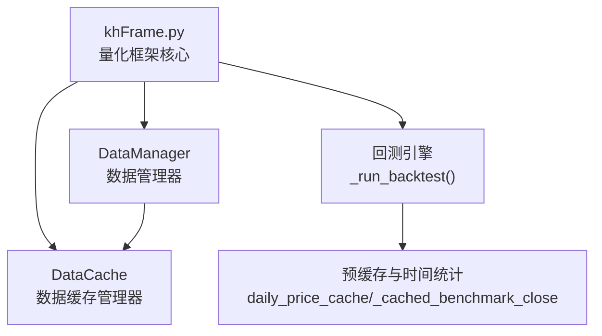
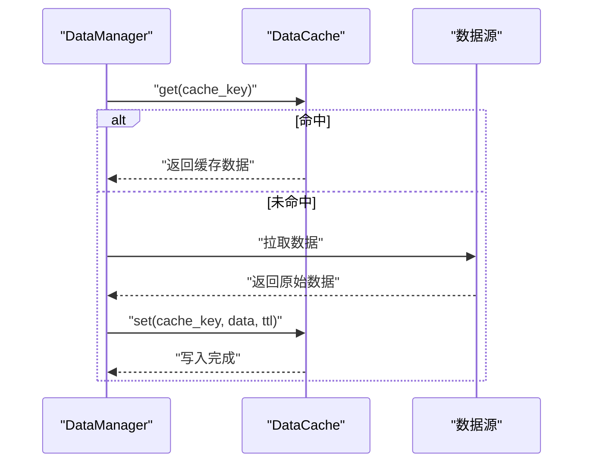
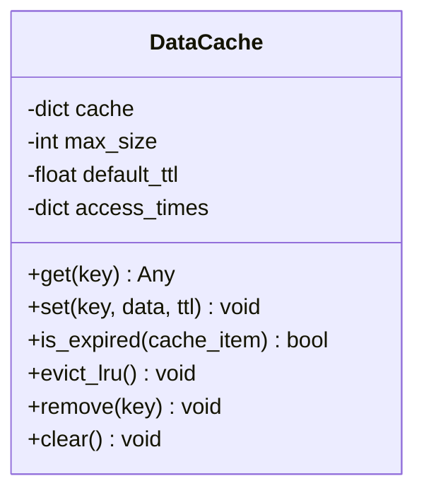
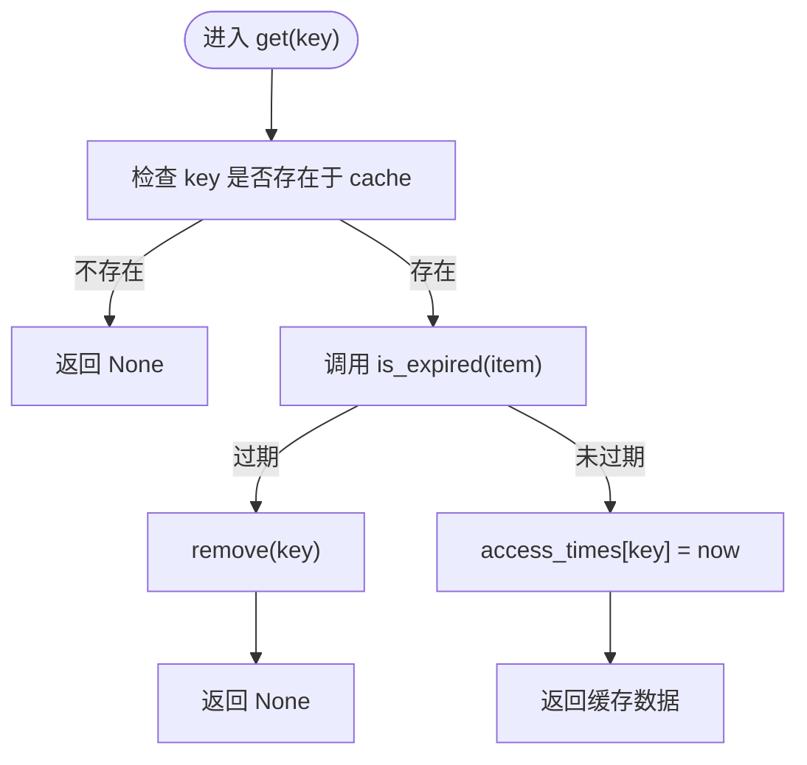
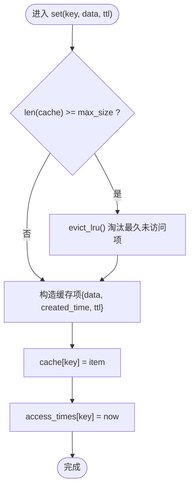
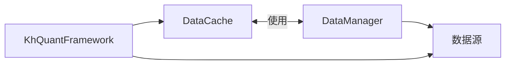

# 数据缓存

<cite>
**本文引用的文件**
- [khFrame.py](file://khFrame.py)
- [modules/khFrame.md](file://modules/khFrame.md)
</cite>

## 目录
1. [简介](#简介)
2. [项目结构](#项目结构)
3. [核心组件](#核心组件)
4. [架构总览](#架构总览)
5. [详细组件分析](#详细组件分析)
6. [依赖分析](#依赖分析)
7. [性能考量](#性能考量)
8. [故障排查指南](#故障排查指南)
9. [结论](#结论)
10. [附录](#附录)

## 简介
本文件围绕 khFrame.py 中的数据缓存机制展开，重点解析 DataCache 类的 LRU（最近最少使用）缓存策略，涵盖 get、set、is_expired 和 evict_lru 方法的实现细节，以及 access_times 字典如何跟踪访问频率；同时说明缓存键（cache key）的构建原则、TTL（生存时间）机制对回测性能的提升，以及与模块文档中“数据缓存管理”的设计理念（内存使用优化与命中率监控）的关联。此外，提供配置缓存大小与 TTL 参数的方法指引，并讨论在分布式环境下的扩展思路。

## 项目结构
- khFrame.py 是量化框架的核心文件，包含策略执行引擎、回测主循环、数据缓存与预缓存、交易执行等关键逻辑。
- modules/khFrame.md 提供模块级文档，其中明确包含 DataCache 类的定义与使用场景，以及 DataManager 中对 DataCache 的集成方式。

图表来源
- [khFrame.py](file://khFrame.py#L1200-L1999)
- [modules/khFrame.md](file://modules/khFrame.md#L392-L465)

章节来源
- [khFrame.py](file://khFrame.py#L1200-L1999)
- [modules/khFrame.md](file://modules/khFrame.md#L392-L465)

## 核心组件
- DataCache：提供 LRU 缓存能力，支持最大容量限制、TTL 过期控制、LRU 淘汰与访问时间追踪。
- DataManager：在数据获取流程中使用 DataCache，通过 generate_cache_key 生成缓存键，实现历史数据与单只股票数据的缓存。
- KhQuantFramework：在回测主循环中对日线数据、基准指数收盘价进行预缓存，配合 DataCache 提升整体性能。

章节来源
- [modules/khFrame.md](file://modules/khFrame.md#L392-L465)
- [khFrame.py](file://khFrame.py#L1200-L1999)

## 架构总览
DataCache 作为 DataManager 的内部缓存组件，贯穿数据获取链路：当 DataManager 请求历史数据时，先以缓存键查询 DataCache；若命中则直接返回；否则从数据源拉取并写入 DataCache（带 TTL）。同时，框架在回测阶段对日线与基准数据进行预缓存，进一步降低重复请求带来的开销。

图表来源
- [modules/khFrame.md](file://modules/khFrame.md#L392-L465)

## 详细组件分析

### DataCache 类设计与实现
DataCache 提供以下关键能力：
- get(key)：命中检查、过期判断、访问时间更新。
- set(key, data, ttl)：容量检查、LRU 淘汰、写入缓存与访问时间更新。
- is_expired(item)：基于 created_time 与 ttl 的过期判定。
- evict_lru()：基于 access_times 的最久未访问淘汰。
- remove(key)/clear()：删除单个或清空缓存。

图表来源
- [modules/khFrame.md](file://modules/khFrame.md#L392-L465)

章节来源
- [modules/khFrame.md](file://modules/khFrame.md#L392-L465)

#### get 方法流程
- 若 key 不存在，直接返回 None。
- 若存在，检查 is_expired(item)，过期则 remove(key) 并返回 None。
- 未过期则更新 access_times[key] 为当前时间，返回缓存数据。

图表来源
- [modules/khFrame.md](file://modules/khFrame.md#L392-L465)

章节来源
- [modules/khFrame.md](file://modules/khFrame.md#L392-L465)

#### set 方法流程
- 若缓存已满（长度达到 max_size），先 evict_lru() 淘汰最久未访问项。
- 构造缓存项：包含 data、created_time、ttl（默认 default_ttl 或传入 ttl）。
- 写入 cache[key] 与 access_times[key]。

图表来源
- [modules/khFrame.md](file://modules/khFrame.md#L392-L465)

章节来源
- [modules/khFrame.md](file://modules/khFrame.md#L392-L465)

#### is_expired 方法
- 基于当前时间与 created_time 的差值与 ttl 比较，判断是否过期。

章节来源
- [modules/khFrame.md](file://modules/khFrame.md#L392-L465)

#### evict_lru 方法
- 从 access_times 中选取最小值对应的 key，调用 remove(key) 删除该项。
- 若 access_times 为空，直接返回。

章节来源
- [modules/khFrame.md](file://modules/khFrame.md#L392-L465)

#### 访问频率跟踪与 LRU 策略
- access_times 字典记录每个 key 的最近访问时间。
- evict_lru 通过 min(access_times, key=lambda k: access_times[k]) 选出最久未访问项，实现 LRU 淘汰。

章节来源
- [modules/khFrame.md](file://modules/khFrame.md#L392-L465)

### 缓存键（cache key）构建机制
- DataManager 在获取历史数据时会调用 generate_cache_key(...) 生成缓存键，该键由“股票集合、字段列表、条数、频率、结束时间”等维度构成，确保数据唯一性与可复用性。
- 该键用于 DataCache.get/set 的 key，保证相同查询条件的数据共享同一缓存项。

章节来源
- [modules/khFrame.md](file://modules/khFrame.md#L306-L391)

### TTL（生存时间）机制与性能提升
- set 默认使用 default_ttl，也可传入自定义 ttl。
- get 在命中时会检查过期，过期即移除并返回 None，避免返回陈旧数据。
- 在回测阶段，框架对日线数据与基准指数收盘价进行预缓存，显著减少重复请求与网络 IO，从而提升回测速度。

章节来源
- [modules/khFrame.md](file://modules/khFrame.md#L392-L465)
- [khFrame.py](file://khFrame.py#L1200-L1999)

### 框架中的缓存集成与预缓存
- DataManager.get_historical_data(...) 在获取历史数据后，使用 cache.set(...) 写入缓存（示例中默认 ttl=3600）。
- 回测主循环中，KhQuantFramework 对基准指数收盘价与日线价格分别建立缓存，避免重复下载与解析。

章节来源
- [modules/khFrame.md](file://modules/khFrame.md#L306-L391)
- [khFrame.py](file://khFrame.py#L1200-L1999)

## 依赖分析
- DataCache 依赖 Python 标准库 time 与内置 dict，不引入第三方缓存库，便于部署与维护。
- DataManager 依赖 DataCache，形成“数据管理—缓存”的组合关系。
- KhQuantFramework 在回测阶段对日线与基准数据进行预缓存，与 DataCache 形成互补：前者解决“重复请求”，后者解决“重复计算”。

图表来源
- [modules/khFrame.md](file://modules/khFrame.md#L306-L391)
- [khFrame.py](file://khFrame.py#L1200-L1999)

章节来源
- [modules/khFrame.md](file://modules/khFrame.md#L306-L391)
- [khFrame.py](file://khFrame.py#L1200-L1999)

## 性能考量
- LRU 淘汰：通过 access_times 与 evict_lru，避免缓存无限增长，保障内存可控。
- TTL 过期：防止陈旧数据影响回测结果，同时降低缓存命中率波动带来的不确定性。
- 预缓存策略：在回测前一次性加载并缓存日线与基准数据，显著减少重复 IO。
- 访问路径优化：DataManager.get_historical_data(...) 与框架中的预缓存逻辑共同作用，减少重复拉取与解析。

章节来源
- [modules/khFrame.md](file://modules/khFrame.md#L306-L391)
- [khFrame.py](file://khFrame.py#L1200-L1999)

## 故障排查指南
- 缓存未命中：检查 generate_cache_key(...) 的输入参数是否与查询一致；确认 DataCache.set(...) 是否被调用。
- 缓存过期频繁：适当增大 default_ttl 或传入更大的 ttl；评估业务对时效性的需求。
- 内存占用过高：检查 max_size 是否过小导致频繁淘汰；或是否存在大量不同查询维度导致缓存项过多。
- 分布式扩展：在多进程或多节点环境下，建议采用集中式缓存（如 Redis/Memcached）或共享存储，避免各节点各自维护独立缓存导致的数据不一致。

章节来源
- [modules/khFrame.md](file://modules/khFrame.md#L392-L465)
- [khFrame.py](file://khFrame.py#L1200-L1999)

## 结论
DataCache 通过 LRU 淘汰与 TTL 控制，为量化回测提供了稳定、高效的缓存层；结合 DataManager 的键构建与框架的预缓存策略，显著降低了重复 IO 与计算开销。在保证数据一致性的同时，兼顾了内存使用与性能表现。对于分布式场景，建议引入集中式缓存以实现跨节点共享与一致性。

## 附录

### 配置缓存大小与 TTL 参数
- DataCache 默认构造参数：
  - max_size：默认 1000
  - default_ttl：默认 3600（秒）
- 在 DataManager.get_historical_data(...) 中，可显式传入 ttl=... 覆盖默认 TTL。
- 在框架回测阶段，日线与基准数据的预缓存可减少重复请求，建议根据回测规模与数据体量调整 max_size 与 default_ttl。

章节来源
- [modules/khFrame.md](file://modules/khFrame.md#L392-L465)
- [modules/khFrame.md](file://modules/khFrame.md#L306-L391)
- [khFrame.py](file://khFrame.py#L1200-L1999)

### 分布式环境扩展建议
- 使用集中式缓存（Redis/Memcached）统一管理缓存键空间，避免多节点各自维护缓存。
- 对缓存键进行规范化命名，确保跨节点查询一致。
- 在多进程/多实例部署中，注意并发写入与过期清理的幂等性，必要时引入分布式锁或原子操作。
- 对热点数据（如基准指数、常用日线）进行预热，缩短冷启动时间。

章节来源
- [modules/khFrame.md](file://modules/khFrame.md#L392-L465)
- [khFrame.py](file://khFrame.py#L1200-L1999)