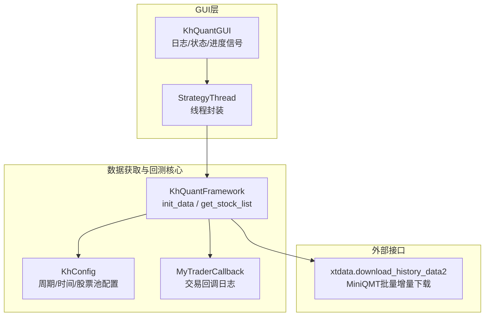
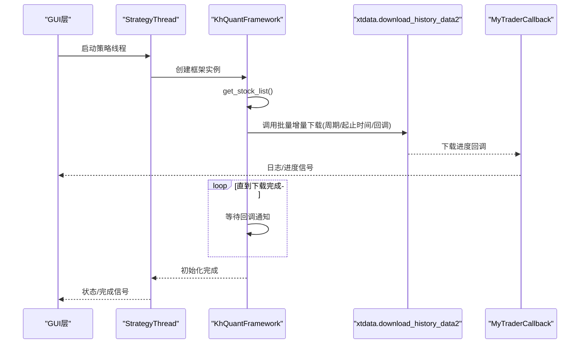
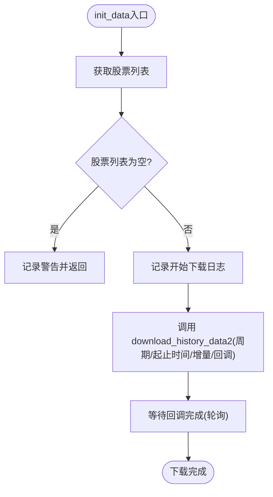
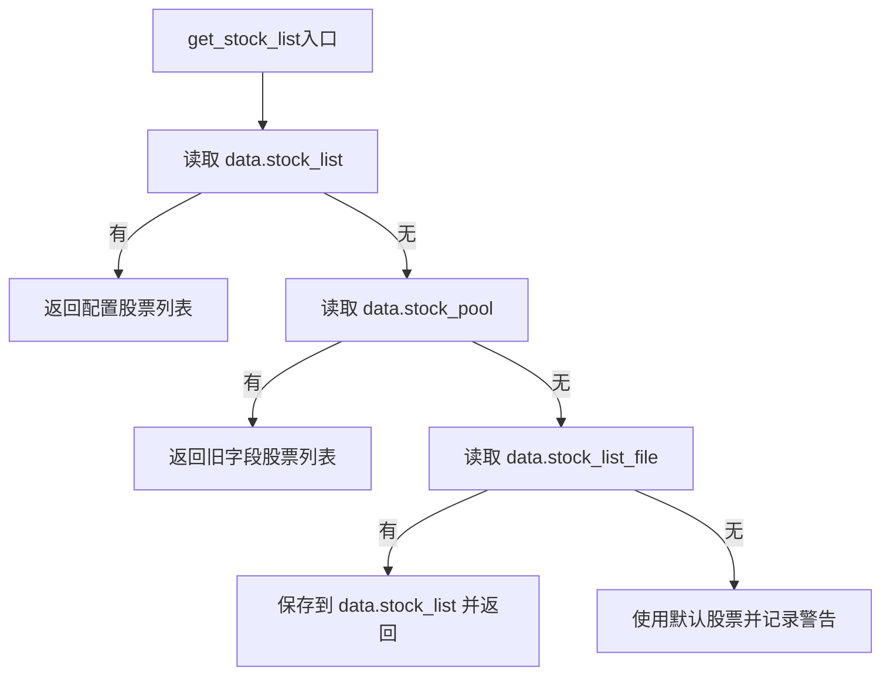
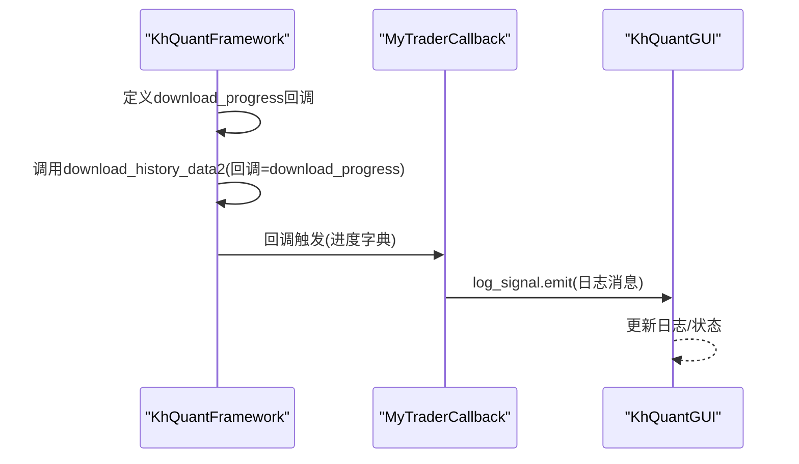
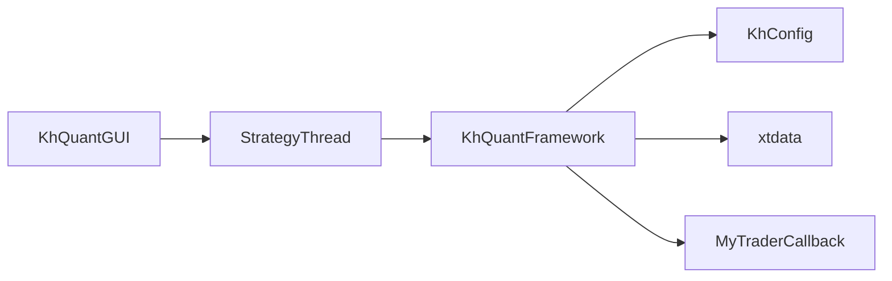

# 数据获取

<cite>
**本文引用的文件**
- [khFrame.py](file://khFrame.py)
- [khConfig.py](file://khConfig.py)
- [GUIkhQuant.py](file://GUIkhQuant.py)
- [modules/khFrame.md](file://modules/khFrame.md)
- [README.md](file://README.md)
</cite>

## 目录
1. [简介](#简介)
2. [项目结构](#项目结构)
3. [核心组件](#核心组件)
4. [架构总览](#架构总览)
5. [详细组件分析](#详细组件分析)
6. [依赖关系分析](#依赖关系分析)
7. [性能与可靠性](#性能与可靠性)
8. [故障排查指南](#故障排查指南)
9. [结论](#结论)
10. [附录](#附录)

## 简介
本文件聚焦于数据获取模块，特别是 khFrame.py 中的 init_data 方法，系统性解析其如何通过 xtdata.download_history_data2 从 MiniQMT 客户端批量下载历史数据，并支持增量下载模式；如何通过 get_stock_list 获取股票列表；如何在下载过程中通过回调函数报告进度；并结合 modules/khFrame.md 的技术文档说明设计理念与异常处理策略。同时提供配置参数示例与 GUI 集成方式，帮助读者在实际项目中正确使用与扩展。

## 项目结构
围绕“数据获取”的关键文件与职责如下：
- khFrame.py：量化框架核心，包含 init_data、get_stock_list 等与数据获取直接相关的逻辑，以及行情回调、触发器、交易回调等配套组件。
- khConfig.py：配置管理，提供周期、起止时间、股票池等参数来源。
- GUIkhQuant.py：GUI 层，负责策略线程、日志、状态与进度信号的桥接，便于在图形界面中集成数据下载与回测。
- modules/khFrame.md：khFrame 模块的架构与功能说明，涵盖数据管理、回测引擎、缓存等模块化设计。
- README.md：系统背景、MiniQMT 依赖、数据补充与下载差异等说明，为数据获取提供上下文。

**图表来源**
- [khFrame.py](file://khFrame.py#L708-L742)
- [khConfig.py](file://khConfig.py#L33-L45)
- [GUIkhQuant.py](file://GUIkhQuant.py#L132-L179)

**章节来源**
- [khFrame.py](file://khFrame.py#L708-L742)
- [khConfig.py](file://khConfig.py#L33-L45)
- [GUIkhQuant.py](file://GUIkhQuant.py#L132-L179)

## 核心组件
- init_data：批量增量下载历史数据的入口，负责获取股票列表、调用 MiniQMT 下载接口、等待完成并记录进度。
- get_stock_list：从配置中读取股票池，兼容旧字段与默认值，确保数据下载的股票范围可控。
- MyTraderCallback：交易回调日志桥接，init_data 通过回调将进度与状态写入 GUI 日志。
- StrategyThread/KhQuantGUI：GUI 线程与信号，将 init_data 的进度与日志在界面中可视化。

**章节来源**
- [khFrame.py](file://khFrame.py#L708-L742)
- [khFrame.py](file://khFrame.py#L1101-L1133)
- [GUIkhQuant.py](file://GUIkhQuant.py#L132-L179)

## 架构总览
数据获取的端到端流程如下：
- GUI 层通过 StrategyThread 创建 KhQuantFramework 实例；
- 框架在 init_data 中获取股票列表；
- 调用 xtdata.download_history_data2 进行批量增量下载；
- 通过回调函数上报进度，GUI 层接收并更新界面；
- 下载完成后进入回测主循环。

**图表来源**
- [khFrame.py](file://khFrame.py#L708-L742)
- [khFrame.py](file://khFrame.py#L1101-L1133)
- [GUIkhQuant.py](file://GUIkhQuant.py#L132-L179)

## 详细组件分析

### init_data 方法：批量增量下载历史数据
- 股票列表获取：优先从配置读取 stock_list，若为空则尝试兼容字段 stock_pool 或 stock_list_file 文件，最后降级为默认股票。
- 下载参数：
  - 周期：来自配置的 kline_period（如 tick/1m/5m/1d）。
  - 起止时间：来自 backtest_start/backtest_end。
  - 增量模式：incrementally=True，支持断点续传与增量更新。
  - 回调：download_progress，接收进度字典，当 finished >= total 时标记完成。
- 等待完成：通过轮询 download_complete 标志，避免阻塞 GUI 线程。

**图表来源**
- [khFrame.py](file://khFrame.py#L708-L742)

**章节来源**
- [khFrame.py](file://khFrame.py#L708-L742)

### get_stock_list：股票池来源与兼容性
- 优先从 data.stock_list 读取；
- 若为空，回退到 data.stock_pool（兼容旧字段）；
- 若仍为空，尝试 data.stock_list_file 文件（若存在）；
- 最终为空时使用默认股票并记录警告。

**图表来源**
- [khFrame.py](file://khFrame.py#L1101-L1133)
- [khConfig.py](file://khConfig.py#L57-L80)

**章节来源**
- [khFrame.py](file://khFrame.py#L1101-L1133)
- [khConfig.py](file://khConfig.py#L57-L80)

### 回调与进度上报：MyTraderCallback 与 GUI
- init_data 内部定义 download_progress 回调，接收进度字典并在完成时设置标志；
- 通过 trader_callback.gui.log_message 输出日志，GUI 层订阅日志信号并显示；
- GUI 层还提供进度条信号 progress_signal，可在下载线程中更新界面进度。

**图表来源**
- [khFrame.py](file://khFrame.py#L708-L742)
- [GUIkhQuant.py](file://GUIkhQuant.py#L132-L179)

**章节来源**
- [khFrame.py](file://khFrame.py#L708-L742)
- [GUIkhQuant.py](file://GUIkhQuant.py#L132-L179)

### 设计理念与异常处理（结合 khFrame.md）
- 模块化设计：数据管理、回测引擎、缓存等模块清晰分离，便于扩展与维护。
- 数据源优先级：优先 MiniQMT，其次本地，失败时记录警告并继续流程。
- 周期一致性检查：init_data 与回测阶段均进行数据周期与触发周期的匹配检查，避免策略执行异常。
- 错误与中断：在数据下载与补充过程中，对中断与异常进行捕获与日志记录，保证流程可控。

**章节来源**
- [modules/khFrame.md](file://modules/khFrame.md#L302-L390)
- [modules/khFrame.md](file://modules/khFrame.md#L456-L585)
- [khFrame.py](file://khFrame.py#L1135-L1247)

## 依赖关系分析
- KhQuantFramework 依赖：
  - xtdata：MiniQMT 数据接口，提供批量增量下载与行情数据获取。
  - khConfig：提供周期、起止时间、股票池等配置。
  - MyTraderCallback：提供日志与交易回报的 GUI 显示。
- GUI 层依赖：
  - StrategyThread：封装框架实例与线程生命周期，避免阻塞 UI。
  - Qt 信号槽：log_signal/progress_signal，用于跨线程更新界面。

**图表来源**
- [khFrame.py](file://khFrame.py#L708-L742)
- [GUIkhQuant.py](file://GUIkhQuant.py#L132-L179)

**章节来源**
- [khFrame.py](file://khFrame.py#L708-L742)
- [GUIkhQuant.py](file://GUIkhQuant.py#L132-L179)

## 性能与可靠性
- 增量下载：通过 incrementally=True 支持断点续传与增量更新，减少重复下载，提升效率。
- 轮询等待：init_data 使用轻量轮询等待完成，避免阻塞主线程；GUI 层通过回调与信号实现非阻塞更新。
- 数据源降级：当 MiniQMT 数据不可用时，框架记录警告并继续流程，保证系统稳健性。
- 周期一致性：在回测前进行周期检查，避免因数据粒度过高或过低导致的性能与精度问题。

**章节来源**
- [khFrame.py](file://khFrame.py#L708-L742)
- [khFrame.py](file://khFrame.py#L1135-L1247)
- [modules/khFrame.md](file://modules/khFrame.md#L302-L390)

## 故障排查指南
- 股票池为空
  - 现象：init_data 直接返回并记录警告。
  - 处理：检查 data.stock_list 与 data.stock_pool 字段，或确认 stock_list_file 文件是否存在并可读。
- MiniQMT 未启动或路径错误
  - 现象：下载接口不可用或返回异常。
  - 处理：先启动并登录 MiniQMT，确认 GUI 设置中的 MiniQMT 路径配置正确。
- 网络异常/下载中断
  - 现象：下载进度停滞或回调未触发。
  - 处理：检查网络与 MiniQMT 客户端状态；在 GUI 中查看日志与错误提示；必要时重启 MiniQMT 与软件。
- 周期不匹配
  - 现象：回测前弹窗提示或记录警告。
  - 处理：统一数据周期与触发周期，避免策略执行异常。

**章节来源**
- [khFrame.py](file://khFrame.py#L1101-L1133)
- [README.md](file://README.md#L391-L436)

## 结论
init_data 通过清晰的参数来源（配置）、可靠的增量下载（xtdata）、可控的进度回调（MyTraderCallback）与 GUI 集成（StrategyThread/KhQuantGUI），实现了从 MiniQMT 批量获取历史数据的完整闭环。结合 khFrame.md 的模块化设计与周期一致性检查，系统在易用性与稳健性之间取得良好平衡。建议在实际使用中：
- 明确配置周期与时间范围；
- 确保 MiniQMT 正常运行；
- 通过回调与日志监控下载进度；
- 在回测前进行周期一致性检查。

## 附录

### 配置参数示例（路径参考）
- 周期：kline_period（如 tick/1m/5m/1d）
- 起止时间：backtest_start/backtest_end
- 股票池：data.stock_list 或 data.stock_pool，或 data.stock_list_file

**章节来源**
- [khConfig.py](file://khConfig.py#L33-L45)
- [khConfig.py](file://khConfig.py#L57-L80)

### GUI 集成要点（路径参考）
- 线程封装：StrategyThread 创建框架实例并运行 run；
- 日志与进度：log_signal/progress_signal 用于跨线程更新界面；
- 下载按钮与停止逻辑：在 GUI 中触发下载线程并处理错误。

**章节来源**
- [GUIkhQuant.py](file://GUIkhQuant.py#L132-L179)
- [GUIkhQuant.py](file://GUIkhQuant.py#L2576-L2693)