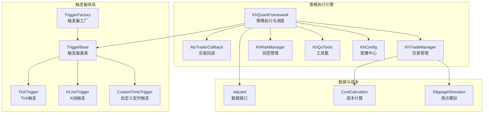
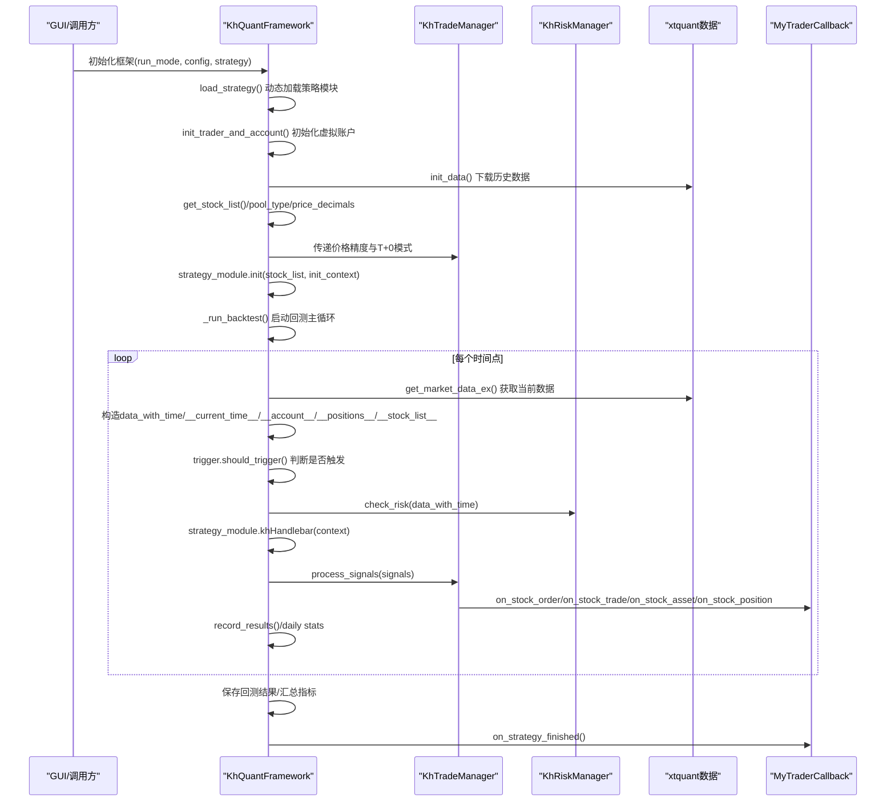
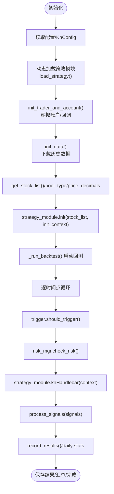
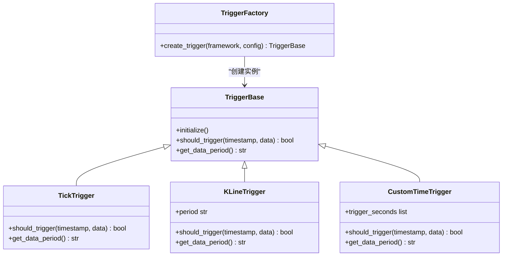
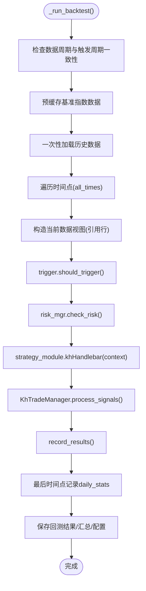
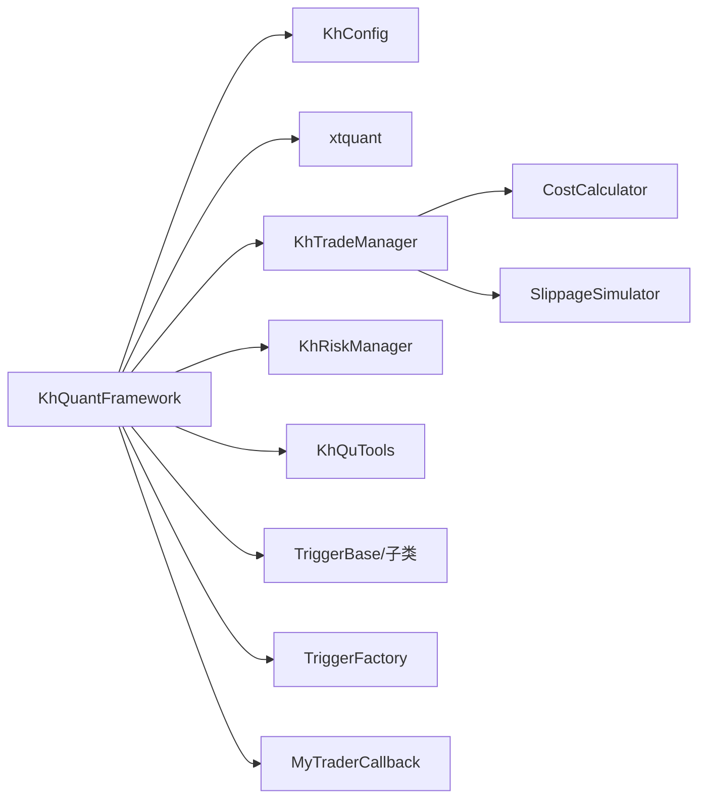

# 核心框架

<cite>
**本文引用的文件**
- [khFrame.py](file://khFrame.py)
- [khRisk.py](file://khRisk.py)
- [khTrade.py](file://khTrade.py)
- [khConfig.py](file://khConfig.py)
- [khQTTools.py](file://khQTTools.py)
- [modules/khFrame.md](file://modules/khFrame.md)
- [README.md](file://README.md)
</cite>

## 目录
1. [简介](#简介)
2. [项目结构](#项目结构)
3. [核心组件](#核心组件)
4. [架构总览](#架构总览)
5. [详细组件分析](#详细组件分析)
6. [依赖关系分析](#依赖关系分析)
7. [性能考量](#性能考量)
8. [故障排查指南](#故障排查指南)
9. [结论](#结论)
10. [附录](#附录)

## 简介
本文件围绕 khFrame.py 作为策略执行引擎的内部机制展开，系统性解析 KhQuantFramework 类的初始化流程、策略生命周期管理（加载、初始化、执行）、事件驱动架构，以及与 BacktestEngine、DataManager、CostCalculator、SlippageSimulator 的协同关系。结合 modules/khFrame.md 的技术文档，阐明 handle_bar 的调用时机、触发器（Tick、K线、自定义时间）的工作原理，以及投资组合管理器如何执行交易信号。文中提供代码示例路径与流程图，帮助读者快速定位实现细节并理解整体运行机制。

## 项目结构
khFrame.py 是策略执行引擎的核心，承载了策略生命周期、事件驱动、数据与交易处理、回测主循环等关键职责。modules/khFrame.md 提供了高层架构与模块职责说明，README.md 提供了策略接口规范与参数说明。

**图表来源**
- [khFrame.py](file://khFrame.py#L1-L120)
- [khFrame.py](file://khFrame.py#L245-L315)
- [khFrame.py](file://khFrame.py#L495-L650)
- [khRisk.py](file://khRisk.py#L1-L51)
- [khTrade.py](file://khTrade.py#L65-L115)

**章节来源**
- [khFrame.py](file://khFrame.py#L1-L120)
- [modules/khFrame.md](file://modules/khFrame.md#L1-L120)

## 核心组件
- KhQuantFramework：策略执行引擎主类，负责策略加载、初始化、回测主循环、事件驱动、交易执行与结果记录。
- 触发器体系：TickTrigger、KLineTrigger、CustomTimeTrigger 与 TriggerFactory，定义策略执行的触发节奏与数据周期。
- MyTraderCallback：交易回调封装，统一处理委托、成交、错误、资产与持仓变动等事件。
- KhTradeManager：交易管理器，负责信号处理、成交记录、资产与持仓更新、成本与滑点计算。
- KhRiskManager：风控管理器，提供风控检查入口。
- CostCalculator 与 SlippageSimulator：成本与滑点模拟，用于回测中更贴近真实交易的评估。
- KhQuTools：工具集，提供交易日判断、价格精度、T+0 支持等辅助能力。
- KhConfig：配置中心，提供策略、数据、回测、交易成本等配置读取。

**章节来源**
- [khFrame.py](file://khFrame.py#L495-L650)
- [khFrame.py](file://khFrame.py#L245-L315)
- [khRisk.py](file://khRisk.py#L1-L51)
- [khTrade.py](file://khTrade.py#L65-L115)
- [modules/khFrame.md](file://modules/khFrame.md#L587-L859)

## 架构总览
KhQuantFramework 串联“策略生命周期管理”、“事件驱动”、“数据与交易处理”、“回测主循环”，并通过触发器体系控制策略执行频率与数据周期，最终通过交易管理器与成本/滑点模拟器完成真实交易环境的近似评估。

**图表来源**
- [khFrame.py](file://khFrame.py#L912-L1100)
- [khFrame.py](file://khFrame.py#L1248-L2500)
- [khFrame.py](file://khFrame.py#L2500-L3152)
- [khTrade.py](file://khTrade.py#L360-L595)

**章节来源**
- [khFrame.py](file://khFrame.py#L912-L1100)
- [khFrame.py](file://khFrame.py#L1248-L2500)
- [khFrame.py](file://khFrame.py#L2500-L3152)

## 详细组件分析

### KhQuantFramework 初始化与策略生命周期
- 初始化阶段
  - 读取配置、创建交易管理器与风控管理器、工具集、回测记录等。
  - 动态加载策略模块，暴露 load_strategy() 以支持 VSCode 断点调试。
  - 初始化虚拟账户（StockAccount），设置基准指数、初始资金、资产字典、持仓/委托/成交字典。
  - 读取股票池，确定价格精度与T+0模式，设置交易管理器的精度与模式。
  - 初始化数据：根据配置周期下载历史数据，支持增量下载与进度回调。
- 策略生命周期
  - 策略初始化：调用策略模块的 init(stock_list, init_context)，init_context 包含 __current_time__、__account__、__positions__、__stock_list__、__framework__ 等。
  - 策略主逻辑：在回测主循环中，逐时间点调用 strategy_module.khHandlebar(context) 生成交易信号。
  - 信号处理：KhTradeManager.process_signals() 校验并执行信号，触发交易回调，更新资产与持仓。
  - 结果记录：record_results() 计算每日统计、基准数据、交易记录，并在最后时间点保存汇总指标与回测结果。

**图表来源**
- [khFrame.py](file://khFrame.py#L912-L1100)
- [khFrame.py](file://khFrame.py#L1248-L2500)
- [khFrame.py](file://khFrame.py#L2500-L3152)

**章节来源**
- [khFrame.py](file://khFrame.py#L495-L650)
- [khFrame.py](file://khFrame.py#L912-L1100)
- [README.md](file://README.md#L1654-L1675)

### 触发器体系与 handle_bar 调用时机
- 触发器类型
  - TickTrigger：每个Tick都触发策略。
  - KLineTrigger：在K线形成时触发（1分钟、5分钟、日K线），对分钟K线在末尾秒数（如57秒后）允许触发。
  - CustomTimeTrigger：在指定时间点触发，支持“整分钟”与“非整分钟”的数据周期选择。
  - TriggerFactory：根据配置创建对应触发器。
- handle_bar 调用时机
  - 在 on_quote_callback() 中，先判断交易日，再通过 trigger.should_trigger() 判断是否触发。
  - 触发后构造 data_with_time，包含 __current_time__、__account__、__positions__、__stock_list__、__framework__，然后调用 strategy_module.khHandlebar(context)。
  - 对于自定义时间触发，会在回测主循环中按“当天触发时间点”生成数据视图并触发策略。

**图表来源**
- [khFrame.py](file://khFrame.py#L52-L179)
- [khFrame.py](file://khFrame.py#L246-L315)

**章节来源**
- [khFrame.py](file://khFrame.py#L745-L911)
- [khFrame.py](file://khFrame.py#L1460-L1881)
- [khFrame.py](file://khFrame.py#L1880-L2171)

### 回测主循环（BacktestEngine）
- 回测主循环在 _run_backtest() 中实现，核心步骤：
  - 检查数据周期与触发周期一致性，必要时弹窗提示。
  - 构建回测结果目录，预缓存基准指数数据。
  - 一次性加载所有股票的历史数据，按触发器周期选择数据周期（tick/1m/5m/1d）。
  - 逐时间点：
    - 构造当前数据视图（直接引用历史DataFrame行，避免重复转换）。
    - 触发器检查与风控检查。
    - 调用 khHandlebar() 生成信号。
    - 交易管理器处理信号并触发回调。
    - 记录每日统计与交易记录。
  - 最后时间点触发盘后回调，保存回测结果与汇总指标。

**图表来源**
- [khFrame.py](file://khFrame.py#L1248-L2500)
- [khFrame.py](file://khFrame.py#L2500-L3152)

**章节来源**
- [khFrame.py](file://khFrame.py#L1248-L2500)
- [khFrame.py](file://khFrame.py#L2500-L3152)

### DataManager 数据获取与缓存策略
- khFrame.py 中的 DataManager（模块文档）提供：
  - get_historical_data()：按股票池、字段、周期、结束时间获取历史数据，支持缓存与多数据源优先级。
  - get_current_data()：获取当前时刻的行情数据。
  - DataCache：LRU缓存、TTL过期、访问时间记录与淘汰。
- khFrame.py 实现中对历史数据的处理：
  - 一次性加载所有股票的历史数据，构建时间字段到索引映射，按当前时间点直接引用行，避免重复转换。
  - 对自定义时间触发，按触发时间点过滤数据，减少无关数据量。
  - 每日收盘价缓存（daily_price_cache）与基准指数缓存（_cached_benchmark_close）提升性能。

**章节来源**
- [modules/khFrame.md](file://modules/khFrame.md#L305-L390)
- [modules/khFrame.md](file://modules/khFrame.md#L392-L454)
- [khFrame.py](file://khFrame.py#L1460-L1881)
- [khFrame.py](file://khFrame.py#L1709-L1881)

### CostCalculator 与 SlippageSimulator
- CostCalculator：计算佣金（最低5元）、印花税（卖出收取）、流量费，返回总成本与成本率。
- SlippageSimulator：支持“比例滑点”与“最小变动价位滑点”，买入上浮、卖出下浮，价格取整到分。
- 在交易执行中，交易管理器调用成本与滑点计算，更新资产与持仓，并触发成交/资产/持仓回调。

**章节来源**
- [modules/khFrame.md](file://modules/khFrame.md#L587-L665)
- [khTrade.py](file://khTrade.py#L65-L115)
- [khFrame.py](file://khFrame.py#L2500-L3152)

### 投资组合管理器（交易信号执行）
- 交易信号格式要求：code、action（buy/sell）、price、volume。
- 执行流程：
  - 买入：应用滑点，计算交易金额与总成本，冻结资金，更新持仓（均价、数量、首次买入时间），解冻资金，记录交易。
  - 卖出：校验持仓，应用滑点，计算净额（扣除印花税），更新持仓，增加可用资金，记录交易与已实现盈亏。
  - 触发回调：委托回报、成交回报、资产变动、持仓变动。
- 价格精度与T+0模式：根据股票池类型动态设置价格精度，支持T+0模式提示与显示。

**章节来源**
- [modules/khFrame.md](file://modules/khFrame.md#L667-L859)
- [khTrade.py](file://khTrade.py#L360-L595)
- [khFrame.py](file://khFrame.py#L964-L1026)

### 策略上下文构建与交易信号验证流程
- 上下文构建：在 on_quote_callback() 与回测主循环中，为每个时间点构造 data_with_time，包含 __current_time__、__account__、__positions__、__stock_list__、__framework__。
- 策略执行：调用 strategy_module.khHandlebar(context) 返回信号列表。
- 信号验证：对信号进行字段完整性与值合法性检查（股票代码格式、动作、价格与数量），并在回测中统一价格精度与时间戳。

**章节来源**
- [khFrame.py](file://khFrame.py#L745-L911)
- [khFrame.py](file://khFrame.py#L2131-L2151)
- [README.md](file://README.md#L1654-L1675)

## 依赖关系分析
- KhQuantFramework 依赖：
  - 配置：KhConfig（策略、数据、回测、交易成本、滑点等）
  - 数据：xtquant（下载/读取历史与实时数据）
  - 交易：KhTradeManager（信号处理、成交记录、资产/持仓更新）
  - 风控：KhRiskManager（风控检查）
  - 工具：KhQuTools（交易日判断、价格精度、T+0支持）
  - 触发器：TriggerBase 及其子类、TriggerFactory
  - 成本/滑点：CostCalculator、SlippageSimulator
  - 回调：MyTraderCallback（统一交易事件回调）

**图表来源**
- [khFrame.py](file://khFrame.py#L495-L650)
- [khFrame.py](file://khFrame.py#L245-L315)
- [khRisk.py](file://khRisk.py#L1-L51)
- [khTrade.py](file://khTrade.py#L65-L115)

**章节来源**
- [khFrame.py](file://khFrame.py#L495-L650)
- [khRisk.py](file://khRisk.py#L1-L51)
- [khTrade.py](file://khTrade.py#L65-L115)

## 性能考量
- 数据缓存与引用
  - 历史数据一次性加载并缓存，时间字段到索引映射预构建，按当前时间点直接引用行，避免重复转换与拷贝。
  - 日线收盘价与基准指数缓存，减少重复请求。
- 触发与风控检查
  - 触发器与风控检查前置，避免无效策略调用。
  - 交易日缓存与时间戳缓存，减少重复判断与转换。
- 交易记录与资产更新
  - 批量计算持仓市值与盈亏，仅在资产显著变化时触发资产回调，降低GUI压力。
  - 交易信号记录使用列表推导式批量处理，减少多次 append。
- I/O 与并发
  - 数据下载采用增量回调，回测主循环中尽量避免阻塞GUI线程，使用 invokeMethod 跨线程调用。

**章节来源**
- [khFrame.py](file://khFrame.py#L1709-L1881)
- [khFrame.py](file://khFrame.py#L2500-L3152)

## 故障排查指南
- 策略加载失败
  - 检查策略文件路径与模块名，确认动态加载与 sys.modules 注册。
  - 参考路径：[khFrame.py](file://khFrame.py#L604-L649)
- 回测未触发或触发异常
  - 检查触发器类型与数据周期一致性，必要时弹窗提示。
  - 参考路径：[khFrame.py](file://khFrame.py#L1135-L1247)
- 交易日判断与K线末尾触发
  - 确认交易日判断与K线末尾秒数（57秒后）触发逻辑。
  - 参考路径：[khFrame.py](file://khFrame.py#L776-L813)
- 交易回调与资产/持仓更新
  - 检查回调是否正确设置与跨线程调用。
  - 参考路径：[khFrame.py](file://khFrame.py#L3029-L3152)
- 成本与滑点
  - 核对交易成本参数与滑点类型/值，确保与A股规则一致。
  - 参考路径：[README.md](file://README.md#L797-L820)

**章节来源**
- [khFrame.py](file://khFrame.py#L604-L649)
- [khFrame.py](file://khFrame.py#L1135-L1247)
- [khFrame.py](file://khFrame.py#L776-L813)
- [khFrame.py](file://khFrame.py#L3029-L3152)
- [README.md](file://README.md#L797-L820)

## 结论
khFrame.py 通过 KhQuantFramework 将策略生命周期、事件驱动、数据与交易处理有机整合，配合触发器体系与回测主循环，实现了高效、可扩展的策略执行引擎。通过严格的上下文构建、信号验证、成本与滑点模拟，以及完善的缓存与性能优化，系统在回测环境中尽可能贴近真实交易环境，为策略研究与优化提供了可靠的基础设施。

## 附录
- 策略接口规范
  - init(stock_list, context)：全局初始化。
  - khHandlebar(context)：策略主逻辑，返回交易信号列表。
  - khPreMarket(context)/khPostMarket(context)：盘前/盘后处理（可选）。
  - 参考路径：[README.md](file://README.md#L1654-L1675)

**章节来源**
- [README.md](file://README.md#L1654-L1675)