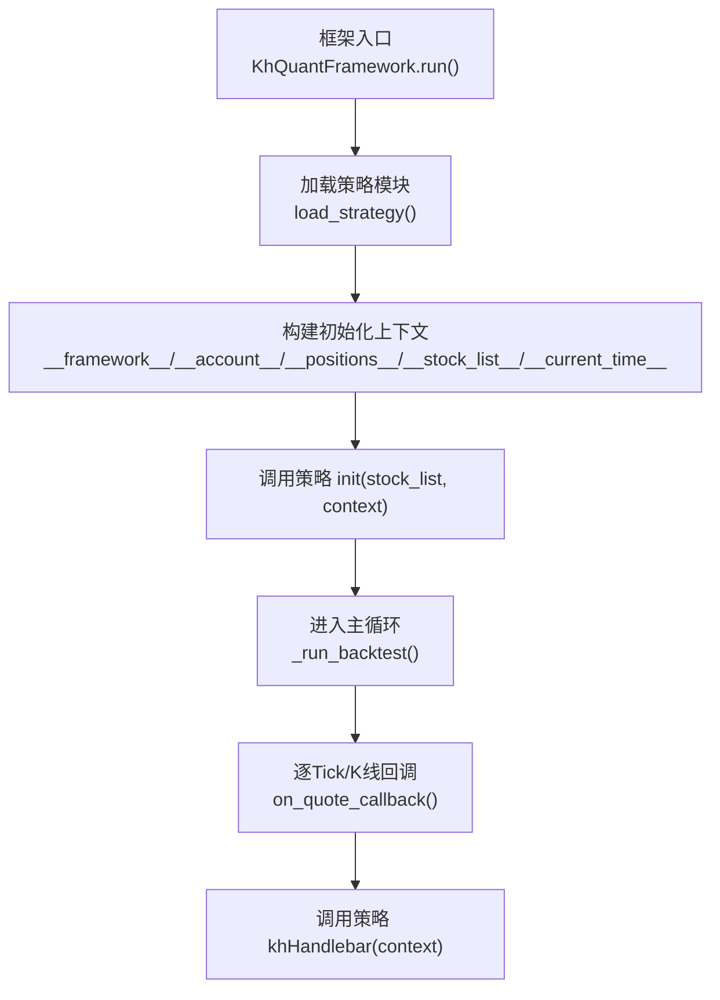
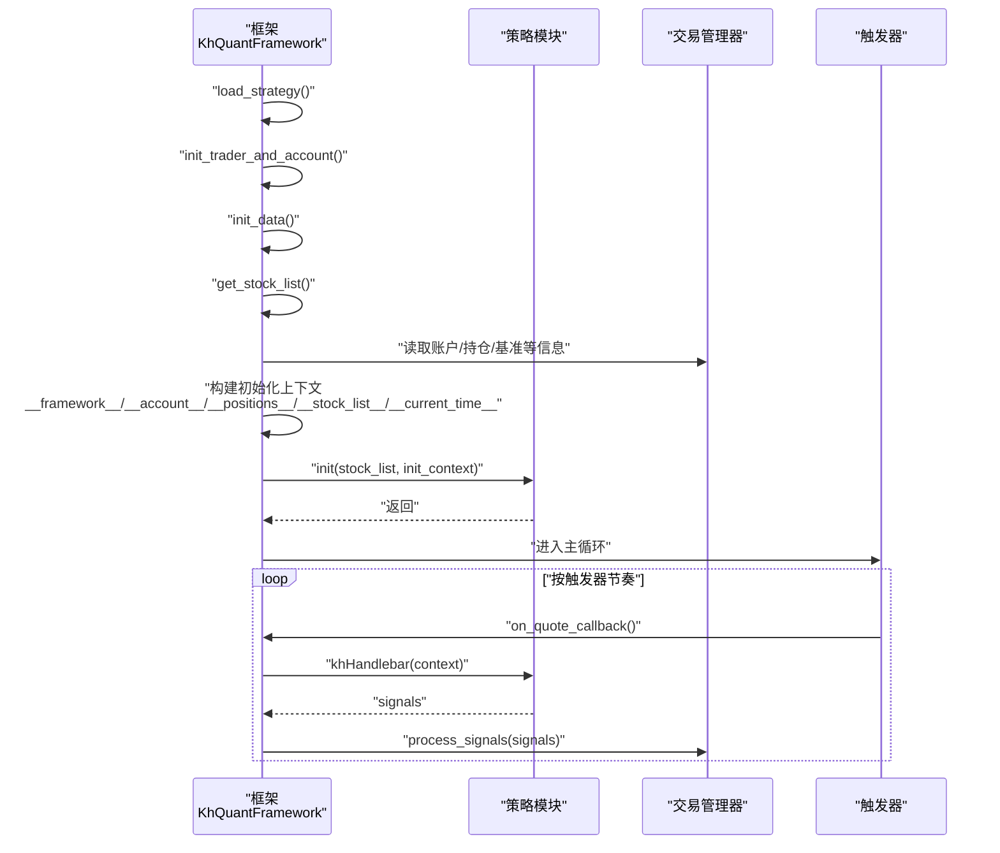
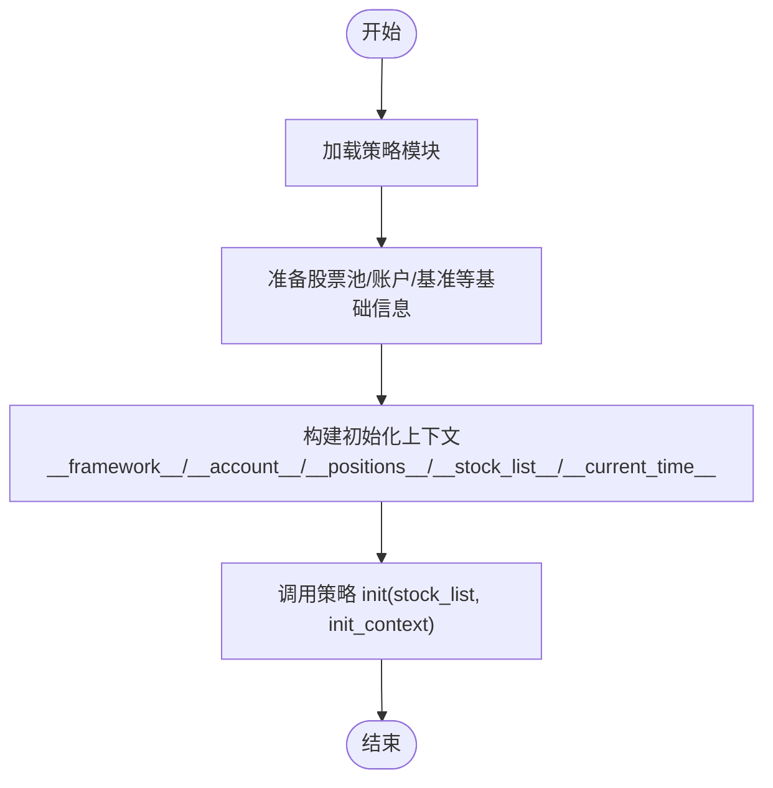
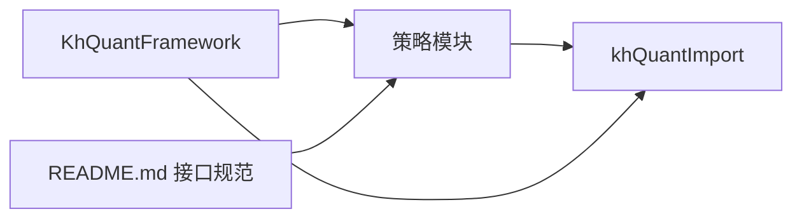

# 策略初始化

<cite>
**本文引用的文件**
- [khFrame.py](file://khFrame.py)
- [khQuantImport.py](file://khQuantImport.py)
- [README.md](file://README.md)
- [RSI策略.py](file://strategies/RSI策略.py)
- [双均线多股票_使用MA函数.py](file://strategies/双均线多股票_使用MA函数.py)
- [modules/khFrame.md](file://modules/khFrame.md)
</cite>

## 目录
1. [简介](#简介)
2. [项目结构](#项目结构)
3. [核心组件](#核心组件)
4. [架构总览](#架构总览)
5. [详细组件分析](#详细组件分析)
6. [依赖分析](#依赖分析)
7. [性能考量](#性能考量)
8. [故障排查指南](#故障排查指南)
9. [结论](#结论)
10. [附录](#附录)

## 简介
本文件围绕“策略初始化”主题，系统阐述框架如何在回测/交易启动时调用策略模块的初始化函数，并说明初始化上下文（init_context）的构建方式与字段来源，以及 init 函数在策略生命周期中的职责与最佳实践。文档还给出一个完整的策略 init 函数示例路径，以及框架对 init 执行期间异常的捕获与处理机制，帮助读者在保证回测流程稳健性的前提下，正确使用初始化上下文。

## 项目结构
- 策略模块位于 strategies/ 目录，策略文件导出 init 与 khHandlebar 等函数。
- khFrame.py 是框架主类，负责加载策略、构建初始化上下文、调用策略 init 并进入主循环。
- khQuantImport.py 提供便捷的数据访问与上下文解析工具，辅助策略在 init 与 khHandlebar 中使用。
- README.md 文档对 init 函数的参数、上下文结构与生命周期进行了权威说明。

图表来源
- [khFrame.py](file://khFrame.py#L912-L1068)
- [khFrame.py](file://khFrame.py#L1028-L1048)

章节来源
- [khFrame.py](file://khFrame.py#L912-L1068)
- [README.md](file://README.md#L1650-L1675)

## 核心组件
- 框架主类 KhQuantFramework：负责策略加载、初始化上下文构建、调用策略 init、运行主循环。
- 策略模块：包含 init 与 khHandlebar 等函数，init 接收 stock_list 与 context，khHandlebar 接收完整上下文。
- 上下文解析工具：khQuantImport 提供 khGet、khPrice、khHas 等便捷函数，以及 StrategyContext、TimeInfo、StockDataParser、PositionParser、StockPoolParser 等类，帮助策略快速访问账户、持仓、时间与股票池等信息。

章节来源
- [khFrame.py](file://khFrame.py#L496-L580)
- [khQuantImport.py](file://khQuantImport.py#L339-L379)
- [README.md](file://README.md#L1650-L1675)

## 架构总览
框架在 run() 中完成初始化阶段：加载策略、准备数据、构建初始化上下文，并调用策略 init。随后进入主循环，按触发器节奏回调策略 khHandlebar。

图表来源
- [khFrame.py](file://khFrame.py#L912-L1068)
- [khFrame.py](file://khFrame.py#L800-L912)

章节来源
- [khFrame.py](file://khFrame.py#L912-L1068)
- [khFrame.py](file://khFrame.py#L800-L912)

## 详细组件分析

### 初始化上下文（init_context）的构建与字段来源
- __framework__：框架实例对象，包含交易、风控、工具等能力，策略可通过该对象获取更全面的框架信息。
- __account__：账户资产快照，包含可用资金、冻结资金、总市值、总资产、基准指数等。
- __positions__：初始化时通常为空字典，表示尚未产生任何持仓。
- __stock_list__：股票池列表，由框架从配置读取。
- __current_time__：初始化时刻的时间信息，包含时间戳、日期时间字符串、日期字符串、时间字符串等。

构建过程与注入位置：
- 在 run() 阶段，框架先读取股票池、账户与基准等信息，然后构造包含上述字段的 init_data 字典，并调用策略模块的 init(stock_list, init_data)。
- 在主循环回调 on_quote_callback() 中，框架会再次合并时间、账户、持仓、股票池与框架实例，形成完整的 context 供 khHandlebar 使用。

章节来源
- [khFrame.py](file://khFrame.py#L1028-L1048)
- [khFrame.py](file://khFrame.py#L818-L852)
- [README.md](file://README.md#L1650-L1675)

### 初始化函数 init 的生命周期与职责
- 执行时机：回测/交易任务开始时，框架调用一次。
- 核心作用：策略全局初始化，如设置参数、加载数据、建立缓存、订阅数据等。
- 参数说明：
  - stock_list：股票池列表。
  - context：初始化时刻上下文，包含 __framework__、__account__、__positions__、__stock_list__、__current_time__ 等字段。

策略示例（路径参考）：
- RSI策略的 init 函数：[RSI策略.py](file://strategies/RSI策略.py#L8-L11)
- 双均线策略的 init 函数：[双均线多股票_使用MA函数.py](file://strategies/双均线多股票_使用MA函数.py#L9-L12)

章节来源
- [README.md](file://README.md#L1650-L1675)
- [RSI策略.py](file://strategies/RSI策略.py#L8-L11)
- [双均线多股票_使用MA函数.py](file://strategies/双均线多股票_使用MA函数.py#L9-L12)

### 初始化上下文在策略中的使用示例（路径参考）
- 使用账户资金：[README.md](file://README.md#L1780-L1816)
- 使用时间信息：[README.md](file://README.md#L1749-L1777)
- 使用持仓信息：[README.md](file://README.md#L1818-L1850)

章节来源
- [README.md](file://README.md#L1749-L1850)

### 框架如何捕获与处理 init 执行中的异常
- run() 中调用策略 init(stock_list, init_data) 时，框架会记录耗时并捕获异常，统一输出错误日志并通过回调通知 GUI，随后抛出异常以终止流程，确保回测稳健性。
- on_quote_callback() 中的异常处理同样遵循统一的日志与错误回调机制，保证异常不会中断 GUI 交互。

章节来源
- [khFrame.py](file://khFrame.py#L1041-L1048)
- [khFrame.py](file://khFrame.py#L1069-L1076)
- [khFrame.py](file://khFrame.py#L908-L911)

### 上下文解析与便捷函数
- khQuantImport 提供：
  - StrategyContext：封装 time/stocks/positions/pool 与 buy_signal/sell_signal 等便捷方法。
  - khGet：统一获取时间、账户、持仓、股票池等字段。
  - khPrice：安全获取股票价格，兼容 tick 与 k 线数据。
  - khHas：检查是否持有某股票。
- 这些工具在 init 与 khHandlebar 中均可使用，帮助策略以一致的方式访问数据。

章节来源
- [khQuantImport.py](file://khQuantImport.py#L339-L379)
- [khQuantImport.py](file://khQuantImport.py#L377-L442)
- [khQuantImport.py](file://khQuantImport.py#L443-L511)
- [khQuantImport.py](file://khQuantImport.py#L512-L528)

### 代码级流程图：初始化上下文构建

图表来源
- [khFrame.py](file://khFrame.py#L912-L1068)
- [khFrame.py](file://khFrame.py#L1028-L1048)

## 依赖分析
- 框架对策略模块的依赖：通过 importlib 动态加载策略文件，要求策略模块提供 init 与 khHandlebar。
- 策略对框架工具的依赖：通过 khQuantImport 提供的便捷函数与类访问上下文数据。
- README.md 对策略接口的约束：明确 init 与 khHandlebar 的参数与返回值规范，确保策略与框架契约一致。

图表来源
- [khFrame.py](file://khFrame.py#L604-L649)
- [khQuantImport.py](file://khQuantImport.py#L1-L60)
- [README.md](file://README.md#L1650-L1675)

章节来源
- [khFrame.py](file://khFrame.py#L604-L649)
- [README.md](file://README.md#L1650-L1675)

## 性能考量
- 初始化阶段尽量避免重型 IO 与网络请求，将昂贵计算放入 khHandlebar 的缓存逻辑中。
- 利用 khQuantImport 的解析器与便捷函数，减少重复数据访问与类型转换开销。
- 在 init 中建立必要的缓存结构，避免在主循环中重复计算。

章节来源
- [modules/khFrame.md](file://modules/khFrame.md#L59-L142)
- [khQuantImport.py](file://khQuantImport.py#L339-L379)

## 故障排查指南
- 策略加载失败：检查策略文件是否包含 init 与 khHandlebar，确认模块路径与文件名正确。
- 初始化异常：查看 run() 中的错误日志与回调输出，定位 init 执行中的异常并修复。
- 上下文字段缺失：确认框架在 run() 与 on_quote_callback() 中均正确注入 __framework__、__account__、__positions__、__stock_list__、__current_time__。
- GUI 日志：若使用 GUI，可在回调中看到详细的错误信息与运行时长统计。

章节来源
- [modules/khFrame.md](file://modules/khFrame.md#L59-L142)
- [khFrame.py](file://khFrame.py#L912-L1068)
- [khFrame.py](file://khFrame.py#L1069-L1076)

## 结论
策略初始化是回测/交易流程的起点，框架通过统一的上下文构建与调用约定，确保策略能够在启动时获得账户、持仓、股票池与时间等关键信息。init 函数应专注于全局初始化与资源准备，避免在主循环中重复执行。框架对异常的集中处理与日志输出，有助于提升回测流程的健壮性与可观测性。策略开发者可借助 khQuantImport 的便捷工具，快速、安全地访问上下文数据，编写清晰、稳定的初始化逻辑。

## 附录
- 策略 init 示例（路径参考）：
  - [RSI策略.py](file://strategies/RSI策略.py#L8-L11)
  - [双均线多股票_使用MA函数.py](file://strategies/双均线多股票_使用MA函数.py#L9-L12)
- 上下文字段权威说明（路径参考）：
  - [README.md](file://README.md#L1650-L1675)