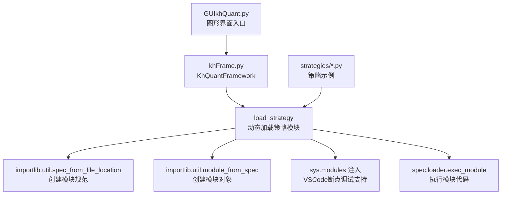
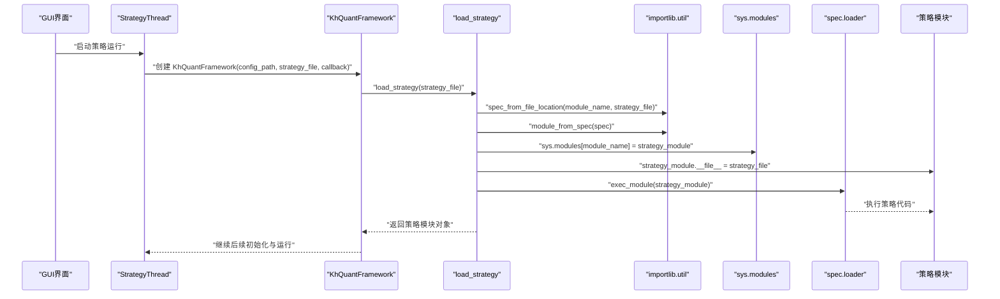
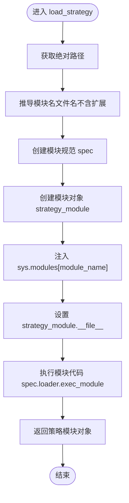
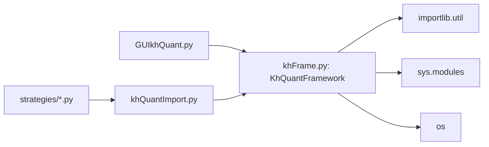

# 策略加载机制

<cite>
**本文引用的文件**
- [khFrame.py](file://khFrame.py)
- [khQuantImport.py](file://khQuantImport.py)
- [GUIkhQuant.py](file://GUIkhQuant.py)
- [RSI策略.py](file://strategies/RSI策略.py)
- [双均线多股票_使用MA函数.py](file://strategies/双均线多股票_使用MA函数.py)
</cite>

## 目录
1. [简介](#简介)
2. [项目结构](#项目结构)
3. [核心组件](#核心组件)
4. [架构总览](#架构总览)
5. [详细组件分析](#详细组件分析)
6. [依赖关系分析](#依赖关系分析)
7. [性能考量](#性能考量)
8. [故障排查指南](#故障排查指南)
9. [结论](#结论)

## 简介
本文件围绕 KhQuantFramework 类中的 load_strategy 方法，系统梳理策略模块的动态加载流程，重点阐释如何使用 importlib.util.spec_from_file_location 创建模块规范、如何通过 importlib.util.module_from_spec 创建模块对象，以及如何通过 sys.modules 注入模块以实现 VSCode 等调试器的断点调试。同时，结合策略文件示例，展示从传入策略文件路径到成功返回可执行模块对象的完整生命周期，并讨论在该过程中可能遇到的 ImportError 或 SyntaxError 等异常及其处理策略。

## 项目结构
- khFrame.py 提供 KhQuantFramework 主类及 load_strategy 实现，负责策略模块的动态加载与后续运行。
- khQuantImport.py 提供统一导入入口，便于策略文件直接使用框架工具与指标函数。
- GUIkhQuant.py 提供图形界面入口，负责创建 KhQuantFramework 并触发策略加载与运行。
- strategies 目录包含多个策略示例，展示策略函数签名与调用框架工具的方式。

图表来源
- [GUIkhQuant.py](file://GUIkhQuant.py#L139-L173)
- [khFrame.py](file://khFrame.py#L604-L649)
- [RSI策略.py](file://strategies/RSI策略.py#L1-L26)
- [双均线多股票_使用MA函数.py](file://strategies/双均线多股票_使用MA函数.py#L1-L36)

章节来源
- [GUIkhQuant.py](file://GUIkhQuant.py#L139-L173)
- [khFrame.py](file://khFrame.py#L604-L649)

## 核心组件
- KhQuantFramework.load_strategy：策略模块动态加载的核心实现，包含路径规范化、模块名推导、spec 创建、模块对象创建、sys.modules 注入、模块文件路径设置、模块执行等步骤。
- khQuantImport：策略侧统一导入入口，便于策略文件直接使用框架工具与指标函数。
- GUI 线程：通过 StrategyThread 创建 KhQuantFramework 实例并运行，间接触发 load_strategy。

章节来源
- [khFrame.py](file://khFrame.py#L604-L649)
- [khQuantImport.py](file://khQuantImport.py#L1-L60)
- [GUIkhQuant.py](file://GUIkhQuant.py#L139-L173)

## 架构总览
下面的时序图展示了从 GUI 触发到策略模块成功加载并可执行的整体流程。

图表来源
- [GUIkhQuant.py](file://GUIkhQuant.py#L139-L173)
- [khFrame.py](file://khFrame.py#L535-L549)
- [khFrame.py](file://khFrame.py#L604-L649)

## 详细组件分析

### load_strategy 方法实现细节
- 路径规范化与模块名推导
  - 使用 os.path.abspath 将传入的策略文件路径转为绝对路径，确保后续行为一致。
  - 使用 os.path.basename 与 os.path.splitext 获取文件名（不含扩展名），作为模块名，有助于调试器正确识别模块。
- 模块规范创建
  - 通过 importlib.util.spec_from_file_location(module_name, strategy_file) 创建模块规范 spec。
- 模块对象创建
  - 通过 importlib.util.module_from_spec(spec) 基于 spec 创建模块对象 strategy_module。
- sys.modules 注入与断点调试支持
  - 将 strategy_module 注入 sys.modules[module_name]，这是让 VSCode 等调试器能够识别模块并实现断点调试的关键步骤。
- 模块文件路径设置
  - 显式设置 strategy_module.__file__ = strategy_file，确保调试器显示的文件路径与策略源文件一致，提升调试体验。
- 模块执行
  - 通过 spec.loader.exec_module(strategy_module) 执行模块代码，使策略函数（如 init、khHandlebar 等）可被框架调用。

图表来源
- [khFrame.py](file://khFrame.py#L604-L649)

章节来源
- [khFrame.py](file://khFrame.py#L604-L649)

### 策略文件示例与接口约定
- 示例策略文件展示了典型的策略函数签名与调用框架工具的方式：
  - RSI策略：包含 init 与 khHandlebar 两个函数，使用 khQuantImport 提供的工具函数与指标函数。
  - 双均线策略：同样包含 init 与 khHandlebar，演示如何基于历史数据与指标生成交易信号。
- 接口约定
  - 策略模块至少应包含 init 与 khHandlebar 两个函数，框架在执行阶段会调用这些函数。
  - khHandlebar 接收一个上下文字典，返回信号列表，框架随后进行信号校验与执行。

章节来源
- [RSI策略.py](file://strategies/RSI策略.py#L1-L26)
- [双均线多股票_使用MA函数.py](file://strategies/双均线多股票_使用MA函数.py#L1-L36)

### GUI 与框架的集成
- GUI 通过 StrategyThread 创建 KhQuantFramework 实例，并在构造函数中调用 load_strategy 加载策略模块。
- 若加载失败，框架会捕获异常并打印堆栈信息，随后抛出异常，由 GUI 捕获并显示错误。

章节来源
- [GUIkhQuant.py](file://GUIkhQuant.py#L139-L173)
- [khFrame.py](file://khFrame.py#L535-L549)

## 依赖关系分析
- khFrame.KhQuantFramework 依赖 importlib.util、sys、os 等标准库完成模块加载。
- 策略文件依赖 khQuantImport 提供的统一导入入口，从而获得指标函数与工具函数。
- GUI 通过 StrategyThread 间接依赖 KhQuantFramework，形成“界面 -> 框架 -> 策略”的调用链。

图表来源
- [GUIkhQuant.py](file://GUIkhQuant.py#L139-L173)
- [khFrame.py](file://khFrame.py#L604-L649)
- [khQuantImport.py](file://khQuantImport.py#L1-L60)

章节来源
- [GUIkhQuant.py](file://GUIkhQuant.py#L139-L173)
- [khFrame.py](file://khFrame.py#L604-L649)
- [khQuantImport.py](file://khQuantImport.py#L1-L60)

## 性能考量
- 模块加载仅发生在策略启动阶段，对整体性能影响有限。
- sys.modules 注入与 __file__ 设置均为轻量级操作，不会引入额外开销。
- 建议在策略文件中避免在模块顶层执行耗时操作，将初始化逻辑放入 init 函数中，以便框架按需调用。

## 故障排查指南
- ImportError
  - 可能原因：策略文件路径无效、模块依赖缺失、Python 环境问题。
  - 排查要点：确认策略文件路径存在且可读；检查策略文件是否导入了缺失的第三方库；确认 Python 解释器环境与依赖安装正确。
  - 框架侧行为：框架在构造函数中调用 load_strategy，并在捕获异常后打印堆栈信息并重新抛出，便于 GUI 捕获并提示用户。
- SyntaxError
  - 可能原因：策略文件语法错误（如缩进、括号不匹配、关键字拼写错误等）。
  - 排查要点：使用 Python 语法检查工具或 IDE 语法高亮定位问题；逐行核对策略文件语法。
  - 框架侧行为：exec_module 执行时若出现语法错误，将抛出异常，框架捕获后交由 GUI 处理。
- 断点调试不可用
  - 可能原因：未将模块注入 sys.modules 或未正确设置 __file__。
  - 排查要点：确认 load_strategy 中已执行 sys.modules[module_name] = strategy_module 与 strategy_module.__file__ = strategy_file；确保模块名与文件名一致。
- 策略函数缺失
  - 可能原因：策略文件未提供 init 或 khHandlebar。
  - 排查要点：对照策略示例文件，确保包含必需函数；框架在执行阶段会调用这些函数，缺失会导致运行期错误。

章节来源
- [khFrame.py](file://khFrame.py#L535-L549)
- [khFrame.py](file://khFrame.py#L604-L649)

## 结论
KhQuantFramework 的 load_strategy 方法通过标准库 importlib.util 与 sys.modules 的配合，实现了策略模块的动态加载与调试支持。其关键步骤包括：路径规范化、模块名推导、spec 创建、模块对象创建、sys.modules 注入、__file__ 设置与模块执行。结合策略示例与 GUI 集成，该机制为策略开发提供了清晰、可控且易于调试的加载流程。在实际使用中，建议严格遵循策略接口约定，并在开发阶段充分利用断点调试能力以提升开发效率与问题定位速度。