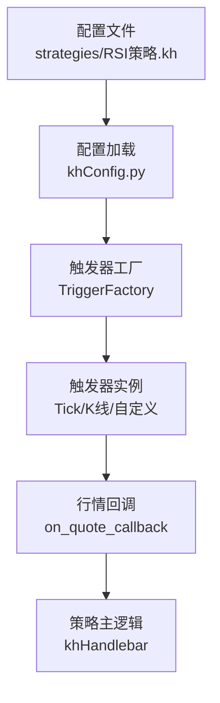
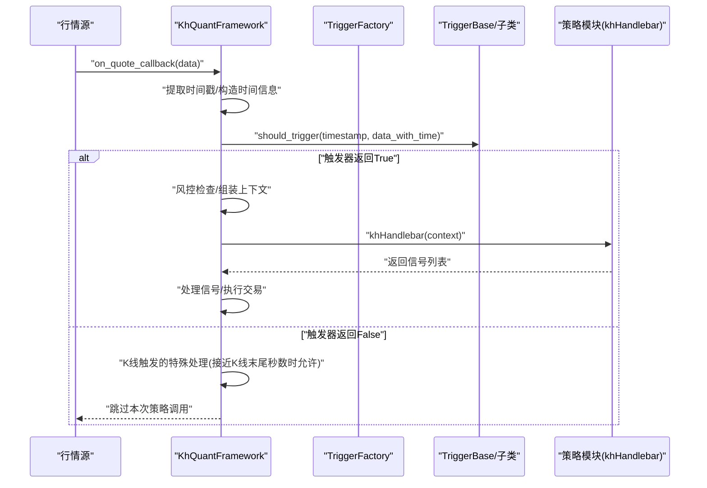
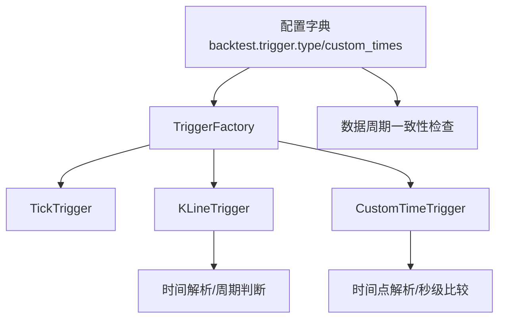

# 策略执行控制

<cite>
**本文引用的文件**
- [khFrame.py](file://khFrame.py)
- [khConfig.py](file://khConfig.py)
- [modules/khFrame.md](file://modules/khFrame.md)
- [README.md](file://README.md)
- [strategies/RSI策略.kh](file://strategies/RSI策略.kh)
</cite>

## 目录
1. [引言](#引言)
2. [项目结构](#项目结构)
3. [核心组件](#核心组件)
4. [架构总览](#架构总览)
5. [详细组件分析](#详细组件分析)
6. [依赖分析](#依赖分析)
7. [性能考量](#性能考量)
8. [故障排查指南](#故障排查指南)
9. [结论](#结论)
10. [附录](#附录)

## 引言
本文件围绕策略执行控制展开，系统性解析框架如何依据配置决定策略的执行频率与时机。重点覆盖：
- TriggerFactory 如何根据配置中的 trigger.type 创建 TickTrigger、KLineTrigger 或 CustomTimeTrigger 等不同触发器；
- KLineTrigger 中 should_trigger 的实现细节，例如如何通过检查 current_time.second == 0 来判断 1 分钟 K 线的形成；
- on_quote_callback 如何接收行情数据，并利用触发器判断是否调用策略的 khHandlebar；
- 整个控制流程：从行情数据流入、触发器判断，到最终执行策略主逻辑的完整链条；
- 不同触发模式对回测性能与结果的影响。

## 项目结构
本仓库采用“模块化 + 配置驱动”的组织方式：
- khFrame.py：核心框架、触发器体系、行情回调、策略执行入口与回测调度；
- khConfig.py：配置加载与默认值解析；
- modules/khFrame.md：策略执行器与上下文构建的补充说明；
- README.md：框架使用与触发方式的官方文档；
- strategies/RSI策略.kh：示例配置，展示 trigger.type 与数据周期的组合。

图表来源
- [khConfig.py](file://khConfig.py#L1-L105)
- [khFrame.py](file://khFrame.py#L245-L276)
- [README.md](file://README.md#L943-L967)

章节来源
- [khConfig.py](file://khConfig.py#L1-L105)
- [khFrame.py](file://khFrame.py#L245-L276)
- [README.md](file://README.md#L943-L967)

## 核心组件
- 触发器基类与派生类
  - TriggerBase：定义 should_trigger 与 get_data_period 接口；
  - TickTrigger：每个 Tick 都触发；
  - KLineTrigger：按 K 线周期判断是否形成；
  - CustomTimeTrigger：在指定时间点附近触发；
- 触发器工厂 TriggerFactory：根据配置 backtest.trigger.type 创建对应触发器；
- 框架主类 KhQuantFramework：
  - 初始化策略模块、交易与风控管理器；
  - 创建触发器；
  - on_quote_callback：接收行情数据，结合触发器与风控检查，最终调用策略 khHandlebar；
  - run/_run_backtest：回测主流程入口。

章节来源
- [khFrame.py](file://khFrame.py#L52-L276)
- [khFrame.py](file://khFrame.py#L745-L911)
- [khFrame.py](file://khFrame.py#L912-L1100)

## 架构总览
下面的序列图展示了从行情数据流入到策略主逻辑执行的完整链路，以及触发器在其中的作用。

图表来源
- [khFrame.py](file://khFrame.py#L745-L911)
- [khFrame.py](file://khFrame.py#L245-L276)

章节来源
- [khFrame.py](file://khFrame.py#L745-L911)
- [khFrame.py](file://khFrame.py#L245-L276)

## 详细组件分析

### 触发器工厂与触发器类型
- TriggerFactory.create_trigger
  - 依据配置 backtest.trigger.type 选择：
    - tick → TickTrigger；
    - 1m/5m/1d → KLineTrigger(period)；
    - custom → CustomTimeTrigger(custom_times)；
  - 默认回退到 TickTrigger。
- TriggerBase
  - should_trigger(timestamp, data)：由子类实现；
  - get_data_period()：返回数据周期字符串，供数据加载与一致性检查使用。
- TickTrigger
  - should_trigger 恒返回 True，即每个 Tick 都触发。
- KLineTrigger
  - period ∈ {"1m","5m","1d"}；
  - 1 分钟：当 current_time.second == 0 时触发；
  - 5 分钟：当 minute % 5 == 0 且 second == 0 时触发；
  - 日 K：按日期变化触发，避免重复触发。
- CustomTimeTrigger
  - 将自定义时间点解析为秒数（从午夜起），比较当前秒数与目标秒数差值是否小于阈值（允许误差）；
  - get_data_period 返回 "1s"，表示使用 1 秒级数据。

章节来源
- [khFrame.py](file://khFrame.py#L52-L276)

### KLineTrigger.should_trigger 实现要点
- 时间解析：支持字符串与数值时间戳，毫秒级自动转换为秒级；
- 1 分钟 K 线：仅在每分钟开始时触发（second == 0）；
- 5 分钟 K 线：仅在每 5 分钟开始时触发（minute % 5 == 0 且 second == 0）；
- 日 K 线：按日期变化触发，避免重复触发；
- 注意：对于 K 线触发，on_quote_callback 中还存在“接近K线末尾秒数（如≥57）”的特殊放行逻辑，以确保在 K 线形成瞬间也能被捕捉。

章节来源
- [khFrame.py](file://khFrame.py#L113-L179)
- [khFrame.py](file://khFrame.py#L786-L812)

### on_quote_callback 的执行控制链路
- 提取时间戳并标准化为 datetime；
- 构造时间信息字典并合并到数据；
- 交易日校验：若非交易日则跳过策略调用；
- 触发器判断：调用 trigger.should_trigger；
  - 若返回 False：
    - 对于 1m/5m：若当前秒数接近 K 线末尾（如 ≥57），允许触发；
    - 对于 1d：已在 K 线逻辑中处理；
    - 否则直接返回；
- 风控检查：通过风险检查后再继续；
- 组装上下文：加入账户、持仓、股票池、框架实例等；
- 股票数据有效性检查：若所有股票数据为空则警告并跳过；
- 调用策略 khHandlebar，处理信号价格精度，交由交易管理器执行。

章节来源
- [khFrame.py](file://khFrame.py#L745-L911)

### 触发器与数据周期一致性检查
- 框架在运行前检查 data.kline_period 与触发类型是否匹配：
  - tick ↔ tick；
  - 1m ↔ 1m；
  - 5m ↔ 5m；
  - 1d ↔ 1d；
- 不匹配时给出提示，可能影响性能与触发精度。

章节来源
- [khFrame.py](file://khFrame.py#L1135-L1200)

### 策略执行器与上下文构建（补充）
- StrategyExecutor.execute_handlebar：构建上下文、调用 khHandlebar、验证信号、记录日志；
- 上下文包含：当前时间、账户、持仓、股票池、框架实例以及各股票的行情数据。

章节来源
- [modules/khFrame.md](file://modules/khFrame.md#L140-L300)

## 依赖分析
- 配置驱动
  - TriggerFactory 依赖配置字典中的 backtest.trigger.type 与 custom_times；
  - 数据周期一致性检查依赖 data.kline_period 与 backtest.trigger.type。
- 触发器依赖
  - KLineTrigger 依赖时间解析与周期常量；
  - CustomTimeTrigger 依赖自定义时间点列表与秒级比较；
- 回测调度
  - README 文档指出自定义时间触发的数据处理特性：不会自动传入当时数据，策略需自行获取数据；系统会根据时间点特性智能选择 1 分钟或 Tick 数据以优化性能。

图表来源
- [khFrame.py](file://khFrame.py#L245-L276)
- [khFrame.py](file://khFrame.py#L1135-L1200)
- [README.md](file://README.md#L943-L967)

章节来源
- [khFrame.py](file://khFrame.py#L245-L276)
- [khFrame.py](file://khFrame.py#L1135-L1200)
- [README.md](file://README.md#L943-L967)

## 性能考量
- 触发频率与数据粒度
  - Tick 触发：高频，数据粒度细，适合高频策略，但回测与实盘压力大；
  - K 线触发：按周期触发，减少调用次数，适合趋势/波段策略；
  - 自定义时间触发：灵活，但需策略自行拉取数据，系统会根据时间点特性选择 1 分钟或 Tick 数据以优化性能。
- 数据周期一致性
  - 配置不一致可能导致性能问题与触发精度下降，框架会给出提示。
- K 线末尾放行
  - 对于 1m/5m，接近 K 线末尾秒数（如 ≥57）时允许触发，避免错过关键时点。

章节来源
- [khFrame.py](file://khFrame.py#L786-L812)
- [khFrame.py](file://khFrame.py#L1135-L1200)
- [README.md](file://README.md#L943-L967)

## 故障排查指南
- 策略未被调用
  - 检查 backtest.trigger.type 与 data.kline_period 是否一致；
  - 对于 K 线触发，确认当前时间是否处于 K 线形成时刻或接近末尾秒数；
  - 检查交易日判断与风控检查是否拦截。
- 自定义时间触发无数据
  - README 指出自定义触发不会自动传入当时数据，需策略自行获取数据；
  - 确认触发时间点是否在回测日期范围内。
- 信号无效
  - 策略执行器会对信号进行格式与数值校验，缺失字段或非法值会被拒绝。

章节来源
- [khFrame.py](file://khFrame.py#L745-L911)
- [modules/khFrame.md](file://modules/khFrame.md#L233-L300)
- [README.md](file://README.md#L943-L967)

## 结论
- TriggerFactory 通过配置驱动创建不同触发器，从而决定策略的执行频率与时机；
- KLineTrigger 的 should_trigger 以秒级为粒度判断 K 线形成，配合 on_quote_callback 的特殊放行逻辑，确保在 K 线形成瞬间的捕捉；
- on_quote_callback 将行情数据与触发器、风控、上下文组装整合，最终调用策略 khHandlebar；
- 不同触发模式对回测性能与结果有直接影响，需结合策略类型与数据周期进行合理配置。

## 附录
- 示例配置：strategies/RSI策略.kh 展示了 trigger.type 与数据周期的组合，便于对照理解。

章节来源
- [strategies/RSI策略.kh](file://strategies/RSI策略.kh#L1-L71)