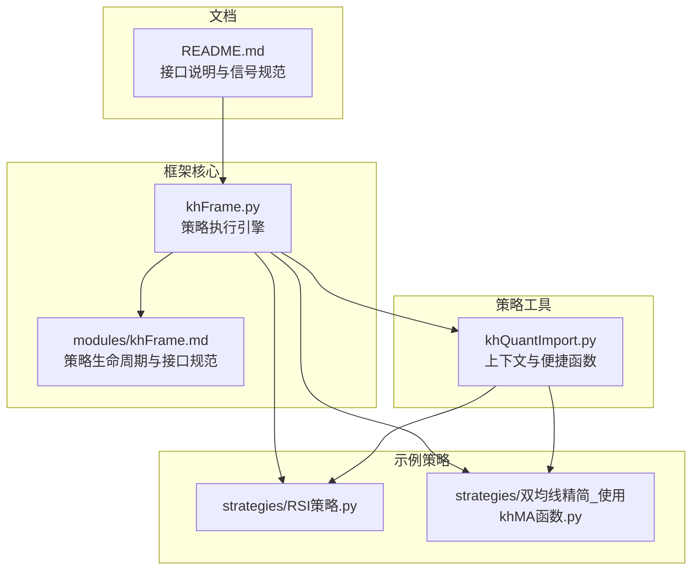
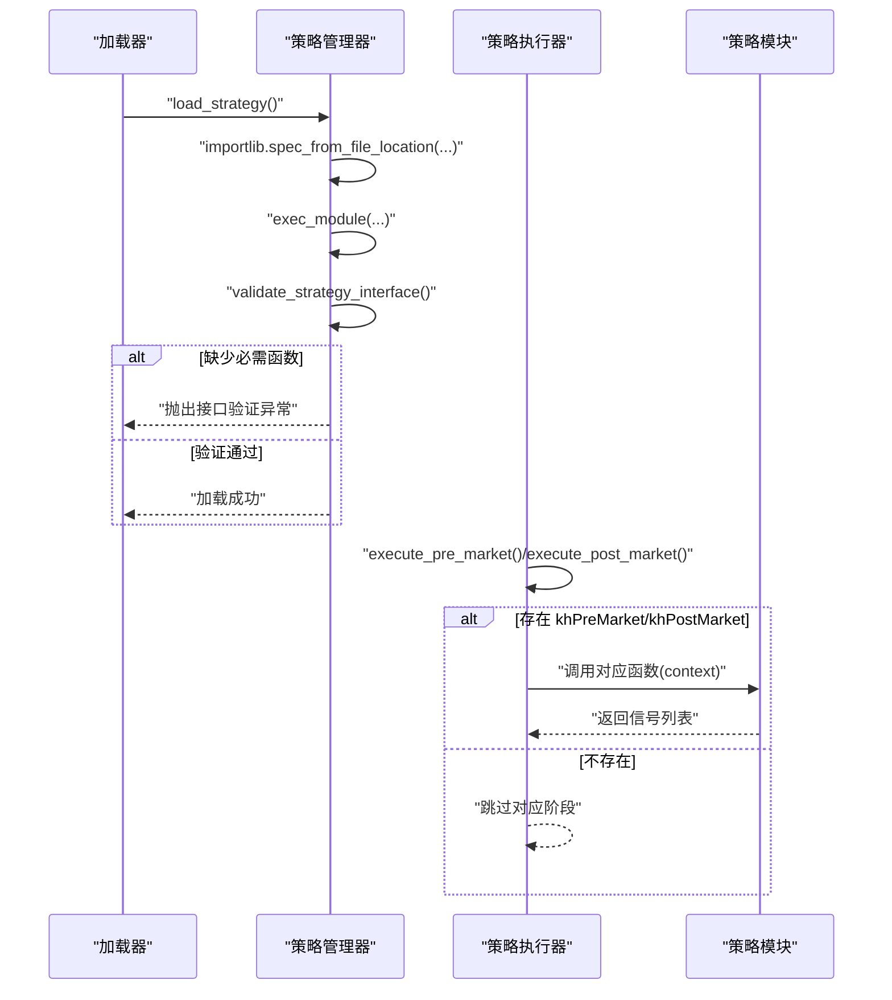
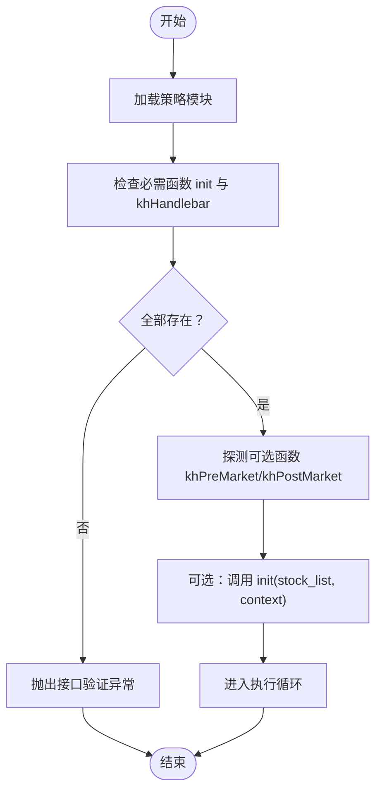
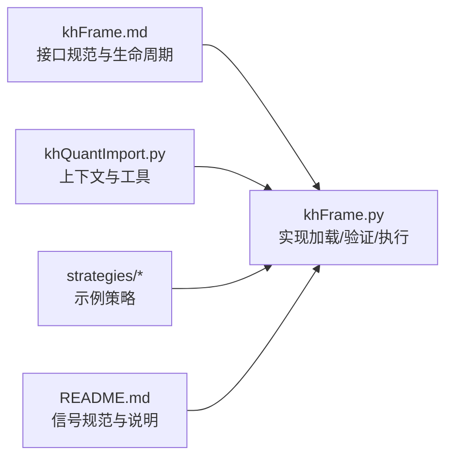

# 策略接口验证

<cite>
**本文引用的文件**
- [khFrame.md](file://modules/khFrame.md)
- [khFrame.py](file://khFrame.py)
- [khQuantImport.py](file://khQuantImport.py)
- [RSI策略.py](file://strategies/RSI策略.py)
- [双均线精简_使用khMA函数.py](file://strategies/双均线精简_使用khMA函数.py)
- [README.md](file://README.md)
</cite>

## 目录
1. [简介](#简介)
2. [项目结构](#项目结构)
3. [核心组件](#核心组件)
4. [架构总览](#架构总览)
5. [详细组件分析](#详细组件分析)
6. [依赖关系分析](#依赖关系分析)
7. [性能考量](#性能考量)
8. [故障排查指南](#故障排查指南)
9. [结论](#结论)
10. [附录](#附录)

## 简介
本文件面向策略开发者，系统阐述框架如何通过“接口验证”确保加载的策略模块满足预期规范。重点覆盖以下内容：
- 如何使用反射机制（hasattr）检查策略模块是否包含必需函数 init 与 khHandlebar
- 如何探测可选函数 khPreMarket 与 khPostMarket，并据此决定是否在盘前/盘后执行回调
- 在验证失败时抛出清晰异常，帮助快速定位问题
- 提供不符合接口规范的策略示例及典型错误日志提示
- 结合实际策略示例，说明正确实现方式

## 项目结构
围绕策略接口验证的相关文件主要分布在以下位置：
- 框架核心与策略执行引擎：khFrame.py、modules/khFrame.md
- 策略工具与上下文封装：khQuantImport.py
- 示例策略：strategies/*.py
- 文档与接口说明：README.md

图表来源
- [khFrame.py](file://khFrame.py#L1-L200)
- [khFrame.md](file://modules/khFrame.md#L59-L140)
- [khQuantImport.py](file://khQuantImport.py#L340-L572)
- [RSI策略.py](file://strategies/RSI策略.py#L1-L26)
- [双均线精简_使用khMA函数.py](file://strategies/双均线精简_使用khMA函数.py#L1-L31)
- [README.md](file://README.md#L1716-L1748)

章节来源
- [khFrame.py](file://khFrame.py#L1-L200)
- [khFrame.md](file://modules/khFrame.md#L59-L140)
- [khQuantImport.py](file://khQuantImport.py#L340-L572)
- [RSI策略.py](file://strategies/RSI策略.py#L1-L26)
- [双均线精简_使用khMA函数.py](file://strategies/双均线精简_使用khMA函数.py#L1-L31)
- [README.md](file://README.md#L1716-L1748)

## 核心组件
- 策略管理器（StrategyManager）：负责加载策略模块、执行接口验证、初始化策略
- 策略执行器（StrategyExecutor）：负责在每个数据点执行 khHandlebar，并按需执行 khPreMarket/khPostMarket
- 策略工具与上下文（khQuantImport）：提供统一的上下文解析、便捷函数与数据访问能力
- 示例策略：展示正确实现 init/khHandlebar/khPreMarket/khPostMarket 的范式

章节来源
- [khFrame.md](file://modules/khFrame.md#L59-L140)
- [khFrame.md](file://modules/khFrame.md#L144-L300)
- [khQuantImport.py](file://khQuantImport.py#L340-L572)
- [RSI策略.py](file://strategies/RSI策略.py#L1-L26)
- [双均线精简_使用khMA函数.py](file://strategies/双均线精简_使用khMA函数.py#L1-L31)

## 架构总览
策略接口验证贯穿策略生命周期：
- 加载阶段：加载策略模块后立即进行接口检查
- 初始化阶段：若存在 init，则传入上下文进行初始化
- 执行阶段：按触发条件调用 khHandlebar；若存在 khPreMarket/khPostMarket，则分别在盘前/盘后执行

图表来源
- [khFrame.md](file://modules/khFrame.md#L59-L140)
- [khFrame.md](file://modules/khFrame.md#L144-L300)

## 详细组件分析

### 接口验证流程（validate_strategy_interface）
- 必需函数检查
  - 必须包含 init 与 khHandlebar
  - 若缺失任一，立即抛出接口验证异常，阻止后续执行
- 可选函数探测
  - 检查是否存在 khPreMarket 与 khPostMarket
  - 仅当存在时，执行器才在盘前/盘后阶段调用对应函数
- 初始化与执行
  - 初始化：若存在 init，则传入股票池与上下文进行初始化
  - 执行：在每个数据点调用 khHandlebar，返回信号列表

图表来源
- [khFrame.md](file://modules/khFrame.md#L59-L140)
- [khFrame.md](file://modules/khFrame.md#L144-L300)

章节来源
- [khFrame.md](file://modules/khFrame.md#L59-L140)
- [khFrame.md](file://modules/khFrame.md#L144-L300)

### 反射检查与异常抛出
- 使用 hasattr 对策略模块进行反射检查
- 若发现缺失必需函数，抛出清晰的接口验证异常，包含缺失函数名
- 异常向上冒泡，由加载器捕获并记录错误日志，终止策略加载

章节来源
- [khFrame.md](file://modules/khFrame.md#L59-L140)

### 可选函数探测与执行决策
- 探测机制
  - 通过 hasattr 检查 khPreMarket 与 khPostMarket 是否存在
  - 将结果保存在策略管理器实例中，供执行器在对应阶段判断
- 执行决策
  - 执行器在执行前检查相应标记
  - 仅当标记为真时才调用对应函数；否则跳过

章节来源
- [khFrame.md](file://modules/khFrame.md#L144-L300)

### 策略执行器的调用链
- khHandlebar：在每个数据点被调用，返回信号列表
- khPreMarket：在盘前阶段（如每日集合竞价前）被调用
- khPostMarket：在盘后阶段（如每日收盘后）被调用

章节来源
- [khFrame.md](file://modules/khFrame.md#L144-L300)
- [README.md](file://README.md#L1716-L1748)

### 实战示例：正确实现 init/khHandlebar/khPreMarket/khPostMarket
- RSI策略：包含 init 与 khHandlebar，未实现 khPreMarket/khPostMarket
- 双均线精简策略：包含 init 与 khHandlebar，未实现 khPreMarket/khPostMarket

章节来源
- [RSI策略.py](file://strategies/RSI策略.py#L1-L26)
- [双均线精简_使用khMA函数.py](file://strategies/双均线精简_使用khMA函数.py#L1-L31)

### 不符合接口规范的策略示例与错误日志
- 示例场景
  - 策略模块缺少 init 或 khHandlebar
  - 策略模块命名不规范，导致加载失败
- 预期行为
  - 加载阶段即抛出接口验证异常
  - 错误日志明确指出缺失的函数名
- 典型错误提示（示例）
  - “策略缺少必需函数: init”
  - “策略缺少必需函数: khHandlebar”
- 建议排查步骤
  - 确认策略文件中是否定义了 init 与 khHandlebar
  - 确认函数名拼写正确、可见性为模块级函数
  - 确认策略文件路径与模块名一致，避免加载失败

章节来源
- [khFrame.md](file://modules/khFrame.md#L59-L140)

## 依赖关系分析
- khFrame.py 与 khFrame.md
  - khFrame.md 描述了策略生命周期与接口规范
  - khFrame.py 实现了加载、验证、初始化与执行的具体逻辑
- khQuantImport.py
  - 提供统一的上下文解析与便捷函数，策略通过该模块访问数据与生成信号
- 示例策略
  - RSI策略与双均线策略展示了 init/khHandlebar 的正确实现方式

图表来源
- [khFrame.md](file://modules/khFrame.md#L59-L140)
- [khFrame.py](file://khFrame.py#L1-L200)
- [khQuantImport.py](file://khQuantImport.py#L340-L572)
- [RSI策略.py](file://strategies/RSI策略.py#L1-L26)
- [双均线精简_使用khMA函数.py](file://strategies/双均线精简_使用khMA函数.py#L1-L31)
- [README.md](file://README.md#L1716-L1748)

章节来源
- [khFrame.md](file://modules/khFrame.md#L59-L140)
- [khFrame.py](file://khFrame.py#L1-L200)
- [khQuantImport.py](file://khQuantImport.py#L340-L572)
- [RSI策略.py](file://strategies/RSI策略.py#L1-L26)
- [双均线精简_使用khMA函数.py](file://strategies/双均线精简_使用khMA函数.py#L1-L31)
- [README.md](file://README.md#L1716-L1748)

## 性能考量
- 反射检查成本极低，仅在加载阶段执行一次
- 可选函数探测仅在加载阶段进行，不影响运行时性能
- 执行器在每次调用前进行简单布尔判断，开销可忽略

## 故障排查指南
- 症状：策略加载时报“缺少必需函数”
  - 排查要点：确认策略模块中是否定义了 init 与 khHandlebar
  - 处理建议：补全缺失函数，确保函数名拼写正确
- 症状：盘前/盘后阶段无回调
  - 排查要点：确认策略模块是否实现了 khPreMarket/khPostMarket
  - 处理建议：按需实现对应函数；或在界面设置中关闭对应触发
- 症状：执行器未调用 init
  - 排查要点：确认策略模块是否实现了 init
  - 处理建议：实现 init 并确保其签名与框架约定一致

章节来源
- [khFrame.md](file://modules/khFrame.md#L59-L140)
- [khFrame.md](file://modules/khFrame.md#L144-L300)
- [README.md](file://README.md#L1716-L1748)

## 结论
框架通过“加载即验证”的策略接口检查机制，确保策略模块满足最小接口要求。借助 hasattr 的反射检查与清晰的异常提示，开发者能够快速定位并修复接口缺失问题。同时，对 khPreMarket/khPostMarket 的可选探测使框架具备灵活的盘前/盘后处理能力。建议在编写策略时严格遵循接口规范，并参考示例策略的实现方式，以获得最佳的开发体验与稳定性。

## 附录
- 接口规范要点
  - 必需：init、khHandlebar
  - 可选：khPreMarket、khPostMarket
- 信号规范（来自 README）
  - 字段：code、action、price、volume、reason、timestamp
  - 约束：action 为 buy/sell；price>0；volume>0 且为100的整数倍

章节来源
- [khFrame.md](file://modules/khFrame.md#L59-L140)
- [README.md](file://README.md#L1716-L1748)