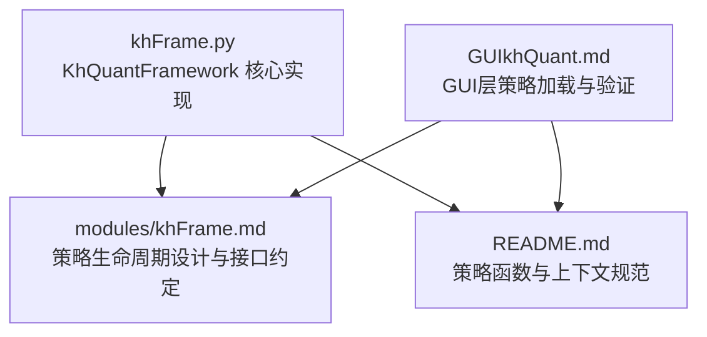
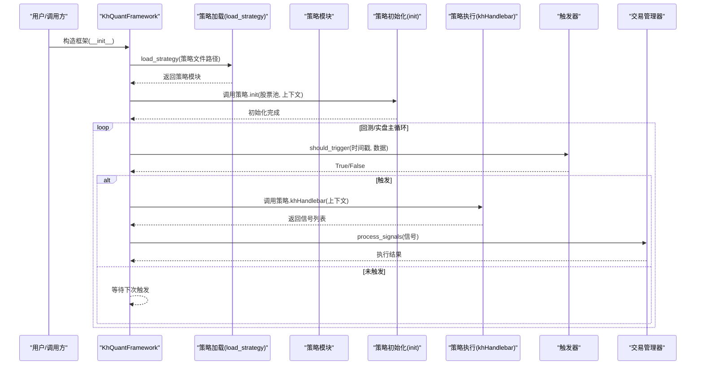
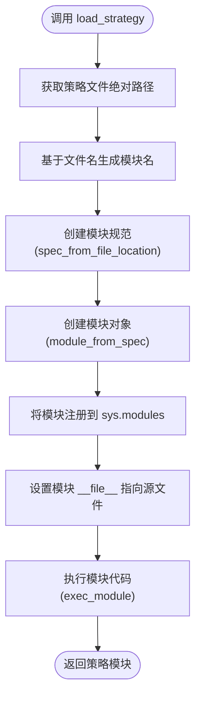
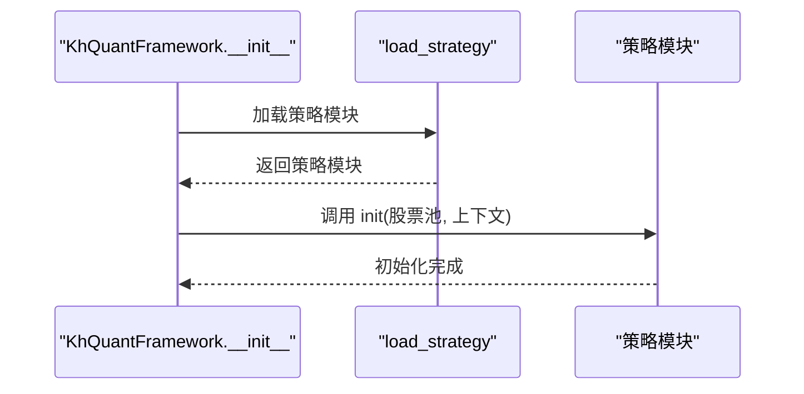
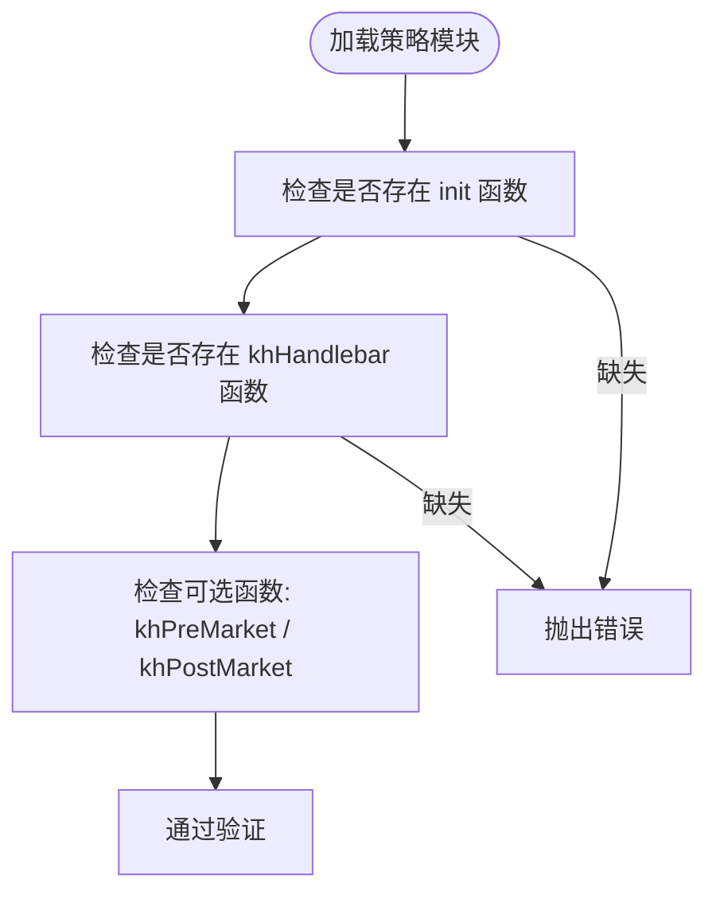
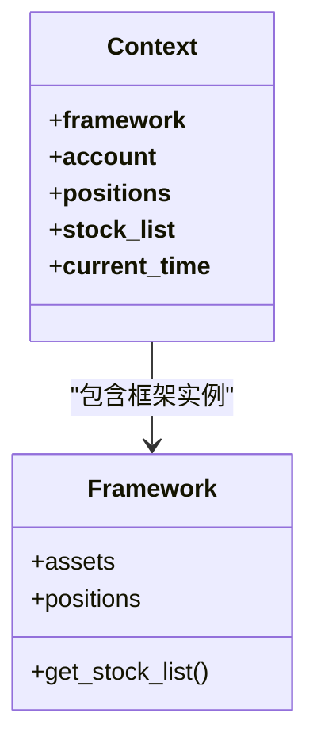
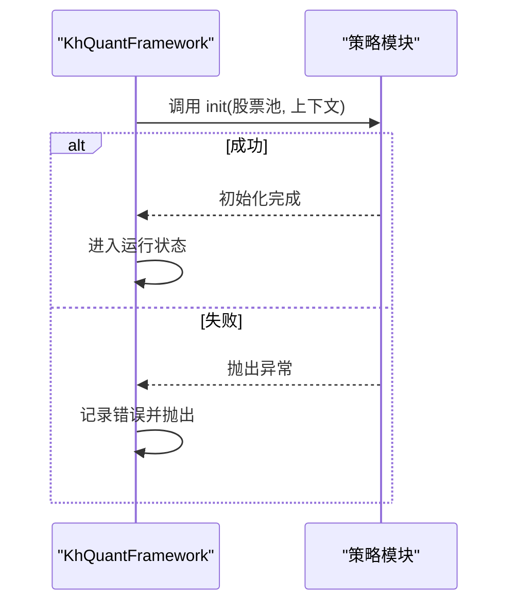
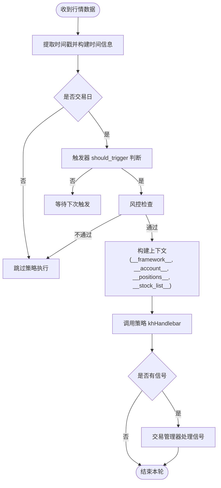
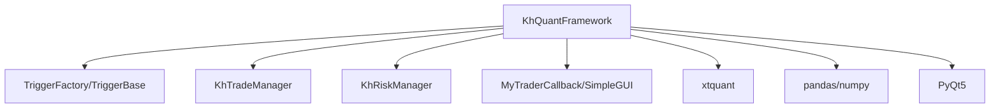

# 策略生命周期管理

<cite>
**本文引用的文件**
- [khFrame.py](file://khFrame.py)
- [modules/khFrame.md](file://modules/khFrame.md)
- [README.md](file://README.md)
- [GUIkhQuant.md](file://modules/GUIkhQuant.md)
</cite>

## 目录
1. [引言](#引言)
2. [项目结构](#项目结构)
3. [核心组件](#核心组件)
4. [架构总览](#架构总览)
5. [详细组件分析](#详细组件分析)
6. [依赖分析](#依赖分析)
7. [性能考量](#性能考量)
8. [故障排查指南](#故障排查指南)
9. [结论](#结论)
10. [附录](#附录)

## 引言
本文件围绕 KhQuantFramework 类，系统梳理策略生命周期管理的关键机制，重点覆盖策略加载、初始化与执行三个阶段。内容包括：
- load_strategy 如何使用 importlib.util 动态加载策略模块，并通过 sys.modules 保障调试器（如 debugpy）可正确识别与断点。
- __init__ 中策略模块的加载流程，包括模块名生成、规范创建与执行模块代码的完整过程。
- validate_strategy_interface 的验证职责（必需函数 init 与 khHandlebar，可选函数 khPreMarket 与 khPostMarket）。
- 策略上下文构建（__framework__、__account__、__positions__、__stock_list__ 等）。
- initialize_strategy 调用策略 init 的初始化流程及异常处理。
- 策略执行控制流与触发频率决策。

## 项目结构
KhQuantFramework 位于 khFrame.py，策略生命周期相关的核心逻辑集中在该文件中；同时，modules/khFrame.md 提供了策略生命周期管理的高层设计与接口约定；README.md 给出了策略函数签名、上下文字段与信号格式的权威说明；GUIkhQuant.md 展示了 GUI 层对策略加载与验证的补充流程。

图表来源
- [khFrame.py](file://khFrame.py#L495-L582)
- [modules/khFrame.md](file://modules/khFrame.md#L1-L142)
- [README.md](file://README.md#L1650-L1750)
- [GUIkhQuant.md](file://modules/GUIkhQuant.md#L460-L512)

章节来源
- [khFrame.py](file://khFrame.py#L495-L582)
- [modules/khFrame.md](file://modules/khFrame.md#L1-L142)
- [README.md](file://README.md#L1650-L1750)
- [GUIkhQuant.md](file://modules/GUIkhQuant.md#L460-L512)

## 核心组件
- KhQuantFramework：框架主类，负责策略加载、初始化、数据与交易接口初始化、触发器创建、回测主循环与执行控制。
- TriggerBase/TriggerFactory：触发器抽象与工厂，支持 tick、1m、5m、1d、custom 等多种触发类型。
- MyTraderCallback：交易回调封装，统一处理委托、成交、账户、持仓等事件。
- KhTradeManager/KhRiskManager：交易与风控管理器，配合框架完成下单与风控检查。
- 触发器子类：TickTrigger、KLineTrigger、CustomTimeTrigger，分别对应不同频率与时间点的触发策略。

章节来源
- [khFrame.py](file://khFrame.py#L52-L276)
- [khFrame.py](file://khFrame.py#L277-L494)
- [khFrame.py](file://khFrame.py#L495-L582)

## 架构总览
KhQuantFramework 的策略生命周期由“加载—初始化—执行”三段式构成，贯穿触发器与数据/交易接口的协同。

图表来源
- [khFrame.py](file://khFrame.py#L495-L582)
- [khFrame.py](file://khFrame.py#L604-L649)
- [khFrame.py](file://khFrame.py#L1037-L1068)
- [khFrame.py](file://khFrame.py#L1248-L1267)
- [khFrame.py](file://khFrame.py#L1596-L1615)

## 详细组件分析

### 策略加载：load_strategy 与 sys.modules 的调试支持
- 动态加载流程
  - 使用 importlib.util.spec_from_file_location 以策略文件的实际文件名为模块名（不含扩展名），确保模块名与文件名一致。
  - 通过 importlib.util.module_from_spec 创建模块对象。
  - 将模块注册到 sys.modules，使外部调试器（如 VSCode 的 debugpy）能够正确识别并命中断点。
  - 设置模块的 __file__ 属性为策略文件路径，保证调试器定位源码准确。
  - 通过 spec.loader.exec_module 执行模块代码，完成策略模块的动态加载。
- 调试器支持
  - 将模块加入 sys.modules 是让 VSCode 断点生效的关键步骤，避免调试器找不到模块符号表的问题。

图表来源
- [khFrame.py](file://khFrame.py#L604-L649)

章节来源
- [khFrame.py](file://khFrame.py#L604-L649)

### 初始化流程：__init__ 与策略模块加载
- __init__ 关键步骤
  - 读取配置并构造 KhConfig 实例。
  - 调用 load_strategy 加载策略模块，捕获异常并打印堆栈。
  - 创建触发器（TriggerFactory.create_trigger）。
  - 初始化交易管理器、风险管理器与工具类。
  - 初始化 QMT 客户端路径与交易回调。
- 与 StrategyManager 的差异
  - khFrame.md 中的 StrategyManager 提供了 validate_strategy_interface 与 build_init_context 的高层实现；而 khFrame.py 的 KhQuantFramework 在 __init__ 中直接通过策略模块的 init 函数完成初始化，二者在职责上互补：前者强调“验证与上下文构建”，后者强调“框架集成与运行时初始化”。

图表来源
- [khFrame.py](file://khFrame.py#L495-L582)
- [khFrame.py](file://khFrame.py#L1037-L1068)

章节来源
- [khFrame.py](file://khFrame.py#L495-L582)
- [khFrame.py](file://khFrame.py#L1037-L1068)

### 接口验证：validate_strategy_interface
- 必需函数
  - init：策略初始化入口，接收股票池与上下文。
  - khHandlebar：策略主逻辑入口，接收当前上下文并返回信号列表。
- 可选函数
  - khPreMarket：盘前处理（可选）。
  - khPostMarket：盘后处理（可选）。
- 验证位置
  - khFrame.py 的 __init__ 中通过策略模块的 init 函数完成初始化；validate_strategy_interface 的职责在 khFrame.md 的 StrategyManager 中给出，强调加载后对必需/可选函数的存在性检查。

图表来源
- [modules/khFrame.md](file://modules/khFrame.md#L85-L96)
- [modules/GUIkhQuant.md](file://modules/GUIkhQuant.md#L495-L512)

章节来源
- [modules/khFrame.md](file://modules/khFrame.md#L85-L96)
- [modules/GUIkhQuant.md](file://modules/GUIkhQuant.md#L495-L512)

### 策略上下文构建：__framework__、__account__、__positions__、__stock_list__
- 上下文字段
  - __framework__：框架实例，提供最全面的框架能力与接口。
  - __account__：账户资产快照，包含可用资金、冻结资金、市值、总资产、基准指数等。
  - __positions__：当前持仓字典，键为股票代码，值为持仓详情（数量、均价、浮动盈亏等）。
  - __stock_list__：股票池列表。
- 构建位置
  - khFrame.py 的 on_quote_callback 与 run 阶段会将上述字段注入到数据字典中，供策略函数 khHandlebar 使用。
  - README.md 对上下文字段的结构与含义进行了权威说明。

图表来源
- [khFrame.py](file://khFrame.py#L831-L852)
- [khFrame.py](file://khFrame.py#L1037-L1048)
- [README.md](file://README.md#L1650-L1750)

章节来源
- [khFrame.py](file://khFrame.py#L831-L852)
- [khFrame.py](file://khFrame.py#L1037-L1048)
- [README.md](file://README.md#L1650-L1750)

### 初始化策略：initialize_strategy 与异常处理
- 初始化流程
  - 通过策略模块的 init 函数完成初始化，传入股票池与上下文。
  - 初始化完成后，框架进入运行状态并开始回测主循环。
- 异常处理
  - 若初始化失败，框架记录错误并通过回调输出日志，随后抛出异常，保证问题早发现、早暴露。

图表来源
- [khFrame.py](file://khFrame.py#L1037-L1068)

章节来源
- [khFrame.py](file://khFrame.py#L1037-L1068)

### 策略执行控制：触发器与执行频率
- 触发器类型
  - tick：每个 Tick 触发。
  - 1m/5m/1d：K线形成时触发，支持日K线的日期级判断。
  - custom：自定义时间点触发，支持多时间点的批量生成。
- 执行频率决策
  - on_quote_callback 中根据触发器 should_trigger 判断是否执行策略。
  - 对于 K 线周期触发，存在“接近K线末尾（如秒数>=57）”的宽限期允许触发，避免错过关键节点。
  - README.md 指明 khHandlebar 的执行时机取决于“运行驱动区”的触发方式，支持 tick、bar、time 等多种触发类型。

图表来源
- [khFrame.py](file://khFrame.py#L745-L911)
- [khFrame.py](file://khFrame.py#L1248-L1267)
- [README.md](file://README.md#L1675-L1750)

章节来源
- [khFrame.py](file://khFrame.py#L745-L911)
- [khFrame.py](file://khFrame.py#L1248-L1267)
- [README.md](file://README.md#L1675-L1750)

## 依赖分析
- 模块耦合
  - KhQuantFramework 依赖 TriggerFactory/TriggerBase 体系以解耦触发逻辑。
  - 交易与风控通过 KhTradeManager/KhRiskManager 注入，便于替换与扩展。
  - GUI 回调通过 SimpleGUI/MyTraderCallback 统一日志与事件输出。
- 外部依赖
  - xtquant：底层交易与数据接口。
  - pandas/numpy：数据处理与数值计算。
  - PyQt5：GUI 事件与日志显示。

图表来源
- [khFrame.py](file://khFrame.py#L52-L276)
- [khFrame.py](file://khFrame.py#L277-L494)
- [khFrame.py](file://khFrame.py#L495-L582)

章节来源
- [khFrame.py](file://khFrame.py#L52-L276)
- [khFrame.py](file://khFrame.py#L277-L494)
- [khFrame.py](file://khFrame.py#L495-L582)

## 性能考量
- 触发器与数据周期一致性
  - 框架在回测主循环前进行数据周期与触发类型的匹配检查，若不一致会提示风险并允许用户选择继续或停止，避免因周期不匹配导致的性能问题与触发偏差。
- 时间统计与优化
  - 回测主循环中对各阶段（信号生成、交易指令、记录结果）进行时间统计，帮助定位瓶颈。
- 价格精度与滑点
  - 根据股票池类型动态设置价格精度，并在信号中统一处理价格四舍五入，兼顾精度与性能。

章节来源
- [khFrame.py](file://khFrame.py#L1135-L1247)
- [khFrame.py](file://khFrame.py#L2162-L2171)
- [khFrame.py](file://khFrame.py#L964-L971)

## 故障排查指南
- 策略加载失败
  - 确认策略文件路径有效且可读。
  - 检查策略模块是否满足必需函数（init、khHandlebar），可选函数 khPreMarket/khPostMarket 可按需实现。
  - 若使用 VSCode 调试，确认 sys.modules 中已注册策略模块名，断点方可命中。
- 初始化异常
  - 捕获策略 init 中的异常，查看回调日志输出，定位初始化失败原因。
- 执行无响应
  - 检查触发器类型与数据周期是否匹配，确认 should_trigger 返回值符合预期。
  - 核对风控检查是否通过，以及上下文字段是否完整注入。
- 交易未执行
  - 检查信号格式是否正确（字段齐全、价格与数量合法），并确认交易管理器已正确处理信号。

章节来源
- [khFrame.py](file://khFrame.py#L604-L649)
- [khFrame.py](file://khFrame.py#L1037-L1068)
- [khFrame.py](file://khFrame.py#L1248-L1267)
- [modules/GUIkhQuant.md](file://modules/GUIkhQuant.md#L495-L512)

## 结论
KhQuantFramework 将策略生命周期管理拆分为“加载—初始化—执行”三个清晰阶段，并通过触发器与上下文注入实现灵活的执行控制。借助 sys.modules 的调试支持、严格的接口验证与完善的异常处理，框架既保证了开发体验，又确保了运行稳定性。结合 README 与 khFrame.md 的规范约束，开发者可快速实现高质量的策略代码并高效落地到回测与实盘场景。

## 附录
- 策略函数与上下文权威说明参见 README.md 的“12.2 策略函数”与“12.3/12.4/12.5 获取时间/账户/持仓数据”章节。
- GUI 层对策略加载与验证的补充流程参见 GUIkhQuant.md 的“策略加载和验证”。

章节来源
- [README.md](file://README.md#L1650-L1849)
- [modules/GUIkhQuant.md](file://modules/GUIkhQuant.md#L460-L512)