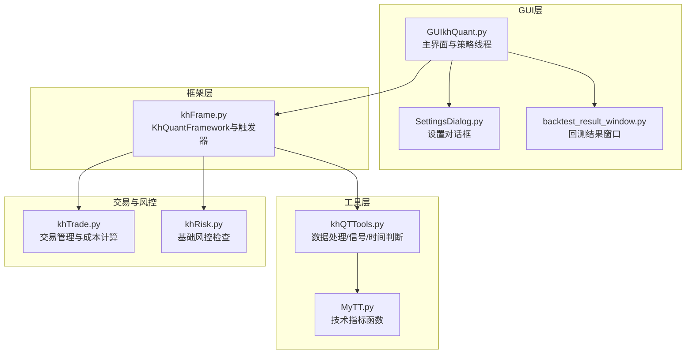
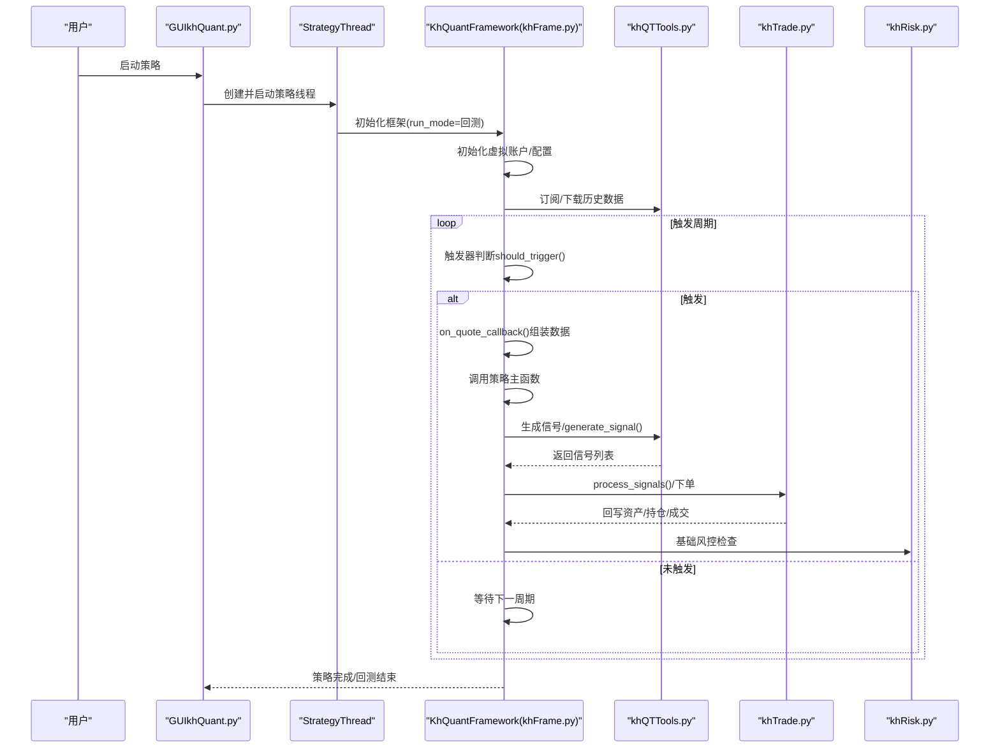
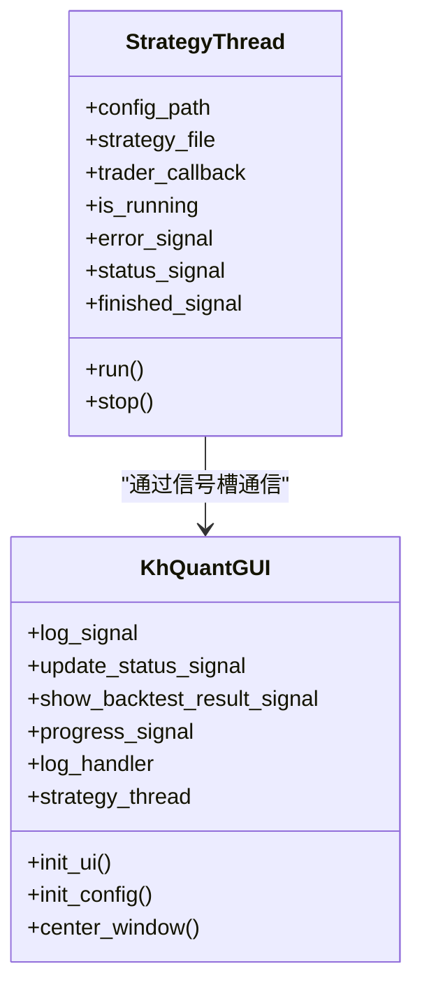
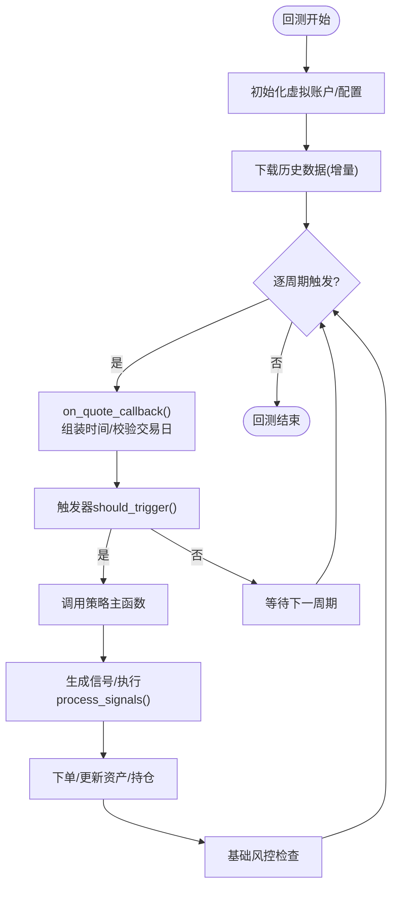
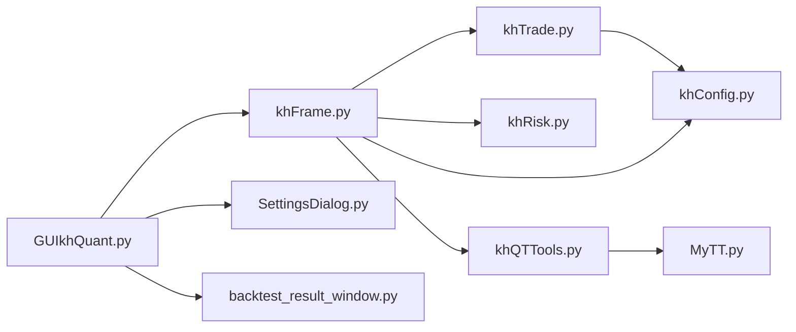

# 模块参考

<cite>
**本文档引用的文件**
- [GUIkhQuant.py](file://GUIkhQuant.py)
- [SettingsDialog.py](file://SettingsDialog.py)
- [backtest_result_window.py](file://backtest_result_window.py)
- [khFrame.py](file://khFrame.py)
- [khQTTools.py](file://khQTTools.py)
- [khTrade.py](file://khTrade.py)
- [khRisk.py](file://khRisk.py)
- [MyTT.py](file://MyTT.py)
- [modules/khFrame.md](file://modules/khFrame.md)
</cite>

## 目录
1. [简介](#简介)
2. [项目结构](#项目结构)
3. [核心组件](#核心组件)
4. [架构总览](#架构总览)
5. [详细组件分析](#详细组件分析)
6. [依赖关系分析](#依赖关系分析)
7. [性能考量](#性能考量)
8. [故障排查指南](#故障排查指南)
9. [结论](#结论)
10. [附录](#附录)

## 简介
本模块参考文档面向看海量化回测系统的核心代码模块，围绕GUI主界面、策略执行引擎、交易与风控、工具函数与技术指标等方面进行系统化梳理。文档结合仓库内模块级技术文档（如 khFrame.md）与源码实现，帮助读者快速理解各模块职责、交互关系与关键流程。

## 项目结构
系统采用“GUI主界面 + 框架引擎 + 工具与指标 + 交易与风控”的分层设计：
- GUI层：负责用户交互、策略运行线程、日志与回测结果展示
- 框架层：策略生命周期管理、事件驱动、数据订阅与回测执行
- 工具层：数据处理、信号生成、时间判断、价格精度与T+0支持
- 交易层：订单管理、交易成本计算（佣金、印花税、过户费、流量费、滑点）、持仓更新
- 风控层：基础风控检查（持仓、委托、止损）
- 指标层：常用技术指标函数（MA、EMA、MACD、KDJ等）

图表来源
- [GUIkhQuant.py](file://GUIkhQuant.py#L1-L200)
- [khFrame.py](file://khFrame.py#L495-L750)
- [khQTTools.py](file://khQTTools.py#L1-L200)
- [MyTT.py](file://MyTT.py#L1-L120)
- [khTrade.py](file://khTrade.py#L1-L120)
- [khRisk.py](file://khRisk.py#L1-L51)
- [backtest_result_window.py](file://backtest_result_window.py#L1-L120)

章节来源
- [GUIkhQuant.py](file://GUIkhQuant.py#L1-L200)
- [khFrame.py](file://khFrame.py#L495-L750)
- [khQTTools.py](file://khQTTools.py#L1-L200)
- [MyTT.py](file://MyTT.py#L1-L120)
- [khTrade.py](file://khTrade.py#L1-L120)
- [khRisk.py](file://khRisk.py#L1-L51)
- [backtest_result_window.py](file://backtest_result_window.py#L1-L120)

## 核心组件
- GUIkhQuant.py：主界面，负责策略线程管理、日志显示、与 khFrame 的集成、与 SettingsDialog 和 backtest_result_window 的交互。
- khFrame.py：策略执行引擎，包含触发器体系、行情回调、回测数据初始化与事件驱动执行。
- khQTTools.py：提供数据处理、信号生成、时间判断、价格精度与T+0支持等工具函数。
- khTrade.py：交易管理与成本计算，支持滑点、佣金、印花税、过户费、流量费与T+0模式。
- khRisk.py：基础风控检查（占位实现，预留扩展点）。
- MyTT.py：技术指标函数库，覆盖常用指标与扩展能力。

章节来源
- [GUIkhQuant.py](file://GUIkhQuant.py#L1-L200)
- [khFrame.py](file://khFrame.py#L1-L200)
- [khQTTools.py](file://khQTTools.py#L1-L200)
- [khTrade.py](file://khTrade.py#L1-L120)
- [khRisk.py](file://khRisk.py#L1-L51)
- [MyTT.py](file://MyTT.py#L1-L120)

## 架构总览
GUI主界面通过策略线程启动 khFrame，框架在回测模式下初始化虚拟账户、订阅数据、按触发器节奏调用策略并执行交易。工具层提供信号生成与数据处理，交易层负责成本与持仓更新，风控层提供基础检查入口。

图表来源
- [GUIkhQuant.py](file://GUIkhQuant.py#L130-L220)
- [khFrame.py](file://khFrame.py#L650-L820)
- [khQTTools.py](file://khQTTools.py#L630-L740)
- [khTrade.py](file://khTrade.py#L198-L320)
- [khRisk.py](file://khRisk.py#L15-L36)

章节来源
- [GUIkhQuant.py](file://GUIkhQuant.py#L130-L220)
- [khFrame.py](file://khFrame.py#L650-L820)
- [khQTTools.py](file://khQTTools.py#L630-L740)
- [khTrade.py](file://khTrade.py#L198-L320)
- [khRisk.py](file://khRisk.py#L15-L36)

## 详细组件分析

### GUIkhQuant.py：主界面与策略线程
- 角色定位
  - 主界面窗口，负责布局、菜单、日志、状态栏、进度条等。
  - 策略运行线程 StrategyThread：在独立线程中创建 KhQuantFramework 实例并运行策略，避免阻塞UI。
  - 集成 SettingsDialog：通过对话框配置账户、客户端路径、日志显示等。
  - 集成 backtest_result_window：回测结束后接收结果信号并展示回测分析窗口。
- 关键机制
  - 信号槽：log_signal/update_status_signal/show_backtest_result_signal/progress_signal，跨线程安全通信。
  - 日志延迟显示：通过延迟队列与定时刷新，降低UI压力。
  - 字体缩放与样式表：根据屏幕分辨率自适应缩放，保证高分辨率体验。
- 与 khFrame 的交互
  - 通过 StrategyThread.run() 创建框架实例并调用 run()，在框架回调中输出日志与状态。
  - 通过 show_backtest_result_signal 通知 GUI 显示回测结果窗口。

图表来源
- [GUIkhQuant.py](file://GUIkhQuant.py#L130-L220)
- [GUIkhQuant.py](file://GUIkhQuant.py#L220-L360)

章节来源
- [GUIkhQuant.py](file://GUIkhQuant.py#L130-L360)

### khFrame.py：策略执行引擎与事件循环
- 触发器体系
  - TriggerBase：抽象触发器接口，定义 should_trigger(timestamp, data) 与 get_data_period()。
  - TickTrigger：每个Tick触发。
  - KLineTrigger：按分钟/5分钟/日K线触发，维护 last_trigger_date 等状态。
  - CustomTimeTrigger：按自定义时间点触发，支持秒级误差容差。
  - TriggerFactory：根据配置创建对应触发器。
- 回测数据初始化
  - init_data()：批量下载历史数据，支持增量下载与进度回调。
  - on_quote_callback()：行情回调，组装时间信息、校验交易日、触发策略。
- 虚拟账户与交易回调
  - _init_virtual_account()：初始化虚拟账户资产、持仓、委托、成交字典。
  - MyTraderCallback：XtQuantTraderCallback实现，处理委托/成交/错误/连接状态等回调，统一通过GUI日志输出。
- 核心执行流程
  - load_strategy()：动态加载策略模块，注入 __framework__/__current_time__/__account__/__positions__ 等上下文。
  - run()：主循环（回测模式），按触发器节奏调用策略主函数，执行交易，更新资产与持仓。

图表来源
- [khFrame.py](file://khFrame.py#L650-L820)
- [khFrame.py](file://khFrame.py#L820-L1000)
- [khFrame.md](file://modules/khFrame.md#L1-L200)

章节来源
- [khFrame.py](file://khFrame.py#L1-L200)
- [khFrame.py](file://khFrame.py#L650-L1000)
- [modules/khFrame.md](file://modules/khFrame.md#L1-L200)

### khQTTools.py：工具函数与信号生成
- 价格与精度
  - is_etf()：判断ETF（区分LOF）。
  - determine_pool_type()：根据股票池类型返回精度（2/3）。
  - get_price_decimals()/round_price()/format_price()：从数据对象或默认值获取精度并格式化。
- 时间与交易日
  - is_trade_time()/is_trade_day()/get_trade_days_count()：交易时间/交易日判断与交易日计数。
- T+0支持
  - load_t0_etf_list()/is_t0_etf()/check_t0_support()/get_t0_details()：ETF T+0支持检测与明细。
- 信号与资金
  - generate_signal()：生成买入/卖出信号，自动校验价格精度、资金比例/股数、可用持仓等。
  - calculate_max_buy_volume()：考虑滑点与交易成本，计算最大可买入手数（按100股整数倍）。
- 技术指标（模块级函数）
  - khMA()：移动平均（支持日内频率与复权）。
  - 其他：khHistory（历史数据获取，供指标与信号使用）。

章节来源
- [khQTTools.py](file://khQTTools.py#L1-L200)
- [khQTTools.py](file://khQTTools.py#L418-L740)
- [khQTTools.py](file://khQTTools.py#L740-L900)

### khTrade.py：订单管理与交易成本
- 交易成本
  - 佣金（最低收费、比例）、印花税（卖出）、过户费（沪市）、流量费（每笔）。
  - 滑点：支持 ratio/tick 两种模式，按买卖方向上浮/下浮或按最小变动价跳数。
- 订单与持仓
  - process_signals()：批量处理信号，计算实际成交价格与总成本，执行下单。
  - _place_order_backtest()：回测下单，检查资金/持仓，更新 orders/trades/assets/positions。
  - set_t0_mode()：启用T+0模式，当天买入可当天卖出。
- 回调与日志
  - 通过回调输出委托/成交/错误/资产/持仓等信息，便于GUI日志展示。

章节来源
- [khTrade.py](file://khTrade.py#L1-L120)
- [khTrade.py](file://khTrade.py#L120-L320)
- [khTrade.py](file://khTrade.py#L320-L595)

### khRisk.py：基础风控检查
- 当前实现
  - 提供 check_risk(data) 接口与三个占位检查：_check_position/_check_order/_check_loss。
- 扩展建议
  - 可在占位函数中接入资金占用、最大回撤、单/多标的集中度、最大连续亏损等规则。

章节来源
- [khRisk.py](file://khRisk.py#L1-L51)

### MyTT.py：技术指标函数
- 核心工具函数（0级）
  - RD、RET、ABS、LN、POW、SQRT、SIN、COS、TAN、MAX、MIN、IF、REF、DIFF、STD、SUM、CONST、HHV、LLV、HHVBARS、LLVBARS、MA、EMA、SMA、WMA、DMA、AVEDEV、SLOPE、FORCAST、LAST。
- 应用层函数（1级）
  - COUNT、EVERY、EXIST、FILTER、BARSLAST、BARSLASTCOUNT、BARSSINCEN、CROSS、LONGCROSS、VALUEWHEN、BETWEEN、TOPRANGE、LOWRANGE。
- 技术指标（2级）
  - MACD、KDJ、RSI、WR、BIAS、BOLL、PSY、CCI、ATR、BBI、DMI、TAQ、KTN、TRIX、VR、CR、EMV、DPO、BRAR、DFMA、MTM、MASS、ROC、EXPMA、OBV、MFI、ASI、XSII。
- 扩展与高级函数
  - HHV/LLV 动态周期支持、DSMA 偏差自适应均线、SUMBARSFAST 累计周期计算、SAR/TDX_SAR 抛物转向。

章节来源
- [MyTT.py](file://MyTT.py#L1-L120)
- [MyTT.py](file://MyTT.py#L120-L300)
- [MyTT.py](file://MyTT.py#L300-L624)

## 依赖关系分析
- GUIkhQuant.py 依赖 khFrame.py（框架）、SettingsDialog.py（设置）、backtest_result_window.py（回测结果）。
- khFrame.py 依赖 khTrade.py（交易管理）、khRisk.py（风控）、khQTTools.py（工具与信号）、xtquant（行情/交易接口）。
- khQTTools.py 依赖 khTrade.py（交易成本参数）、MyTT.py（历史数据与指标）。
- khTrade.py 依赖 khConfig（配置）、xtquant（常量与账户类型）。
- khRisk.py 依赖 khConfig（风控参数）。

图表来源
- [GUIkhQuant.py](file://GUIkhQuant.py#L60-L90)
- [khFrame.py](file://khFrame.py#L1-L40)
- [khQTTools.py](file://khQTTools.py#L1-L40)
- [MyTT.py](file://MyTT.py#L1-L20)
- [khTrade.py](file://khTrade.py#L1-L20)
- [khRisk.py](file://khRisk.py#L1-L20)

章节来源
- [GUIkhQuant.py](file://GUIkhQuant.py#L60-L90)
- [khFrame.py](file://khFrame.py#L1-L40)
- [khQTTools.py](file://khQTTools.py#L1-L40)
- [MyTT.py](file://MyTT.py#L1-L20)
- [khTrade.py](file://khTrade.py#L1-L20)
- [khRisk.py](file://khRisk.py#L1-L20)

## 性能考量
- GUI日志延迟与刷新：通过延迟队列与定时器减少高频日志对UI的影响。
- 数据下载与缓存：khFrame.init_data() 使用增量下载，配合 khQTTools 的交易日判断减少无效请求。
- 交易成本与滑点：khTrade 支持 ratio/tick 模式，合理设置滑点参数可平衡回测真实度与性能。
- 触发器频率：K线触发器按分钟/5分钟/日K线触发，减少Tick触发带来的高频策略调用。

章节来源
- [GUIkhQuant.py](file://GUIkhQuant.py#L260-L320)
- [khFrame.py](file://khFrame.py#L708-L760)
- [khTrade.py](file://khTrade.py#L80-L120)

## 故障排查指南
- 策略线程异常
  - StrategyThread 捕获异常并通过 error_signal 发送错误信息，GUI 日志中可查看堆栈详情。
- 交易错误
  - khTrade._place_order_backtest() 中资金不足/持仓不足会触发 on_order_error 回调，GUI 日志中记录错误原因。
- 回测结果窗口
  - backtest_result_window 会读取回测目录下的 config.csv、trades.csv、daily_stats.csv、benchmark.csv，缺失文件会输出告警并创建替代数据。

章节来源
- [GUIkhQuant.py](file://GUIkhQuant.py#L148-L179)
- [khTrade.py](file://khTrade.py#L288-L327)
- [backtest_result_window.py](file://backtest_result_window.py#L665-L780)

## 结论
本系统通过清晰的分层设计与模块化实现，将GUI、策略引擎、工具与交易风控有机整合。GUIkhQuant.py 作为入口，khFrame.py 作为核心执行引擎，khQTTools.py 提供丰富的数据与信号工具，khTrade.py 与 khRisk.py 分别承担交易成本与风控职责，MyTT.py 提供完备的技术指标支持。结合 khFrame.md 的模块级文档，开发者可快速定位实现细节并进行扩展与优化。

## 附录
- khFrame.md 模块参考要点
  - 策略生命周期：加载、初始化、执行（盘前/盘中/盘后）、上下文构建。
  - 数据管理：数据源优先级、缓存策略、当前数据获取。
  - 回测执行：主循环、触发类型、信号执行、交易记录。
  - 成本与滑点：佣金、印花税、过户费、流量费、比例/跳数滑点。
  - 投资组合：账户与持仓管理、买卖执行、冻结资金与可用资金。

章节来源
- [modules/khFrame.md](file://modules/khFrame.md#L1-L200)
- [modules/khFrame.md](file://modules/khFrame.md#L200-L500)
- [modules/khFrame.md](file://modules/khFrame.md#L500-L966)