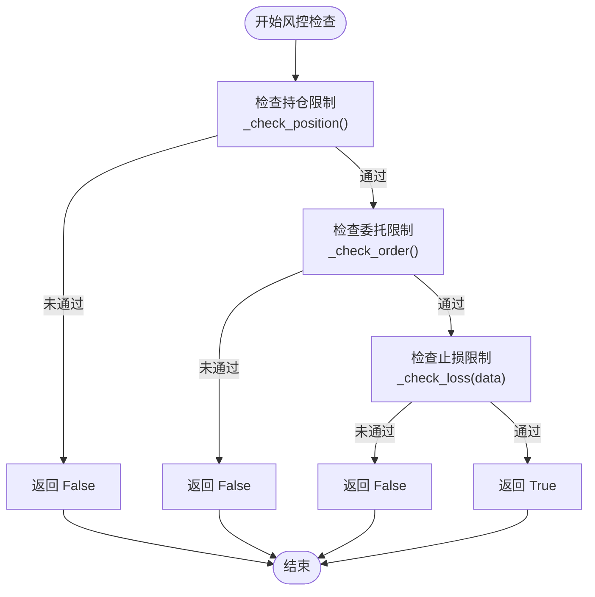
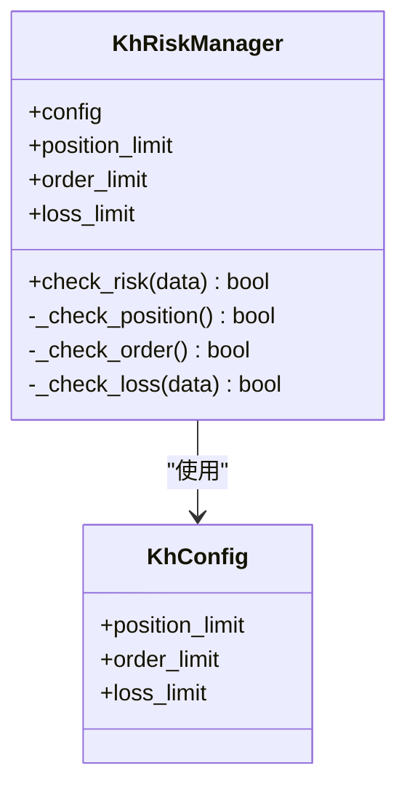
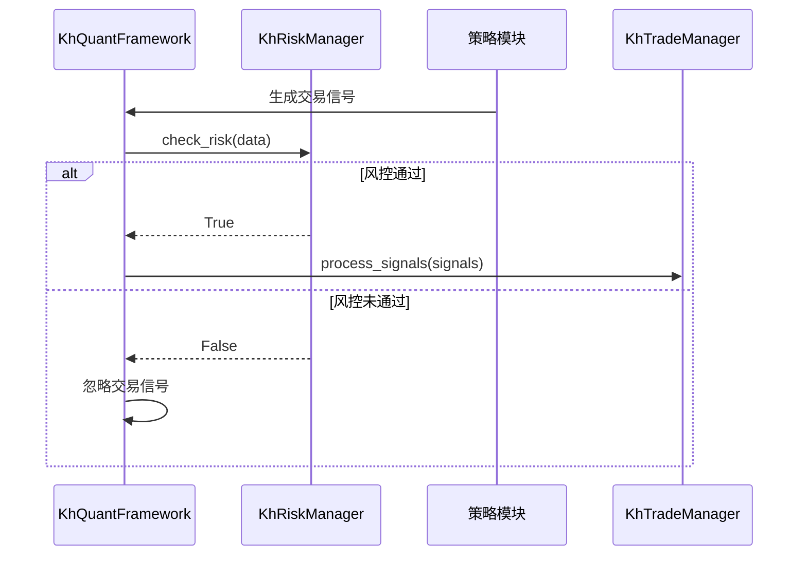

# 风险管理

<cite>
**本文档引用的文件**   
- [khRisk.py](file://khRisk.py)
- [khConfig.py](file://khConfig.py)
- [khFrame.py](file://khFrame.py)
- [khTrade.py](file://khTrade.py)
- [khQTTools.py](file://khQTTools.py)
- [khQuantImport.py](file://khQuantImport.py)
</cite>

## 目录
1. [引言](#引言)
2. [核心组件分析](#核心组件分析)
3. [风控检查流程](#风控检查流程)
4. [配置参数详解](#配置参数详解)
5. [扩展性设计](#扩展性设计)
6. [开发者指南](#开发者指南)

## 引言
`KhRiskManager`类是量化交易框架中的核心风控组件，负责在交易执行前对策略信号进行综合风险评估。该类通过`check_risk`方法协调多个私有检查方法，确保交易行为符合预设的风险控制规则。尽管当前实现默认返回`True`，但其设计为未来扩展提供了清晰的框架。

## 核心组件分析

`KhRiskManager`类的设计旨在提供一个模块化和可扩展的风险控制框架。其核心功能通过`check_risk`方法协调三个私有方法：`_check_position`、`_check_order`和`_check_loss`。这种设计模式允许将复杂的风控逻辑分解为独立的、可管理的单元，便于维护和扩展。

**Section sources**
- [khRisk.py](file://khRisk.py#L4-L51)

## 风控检查流程

**Diagram sources**
- [khRisk.py](file://khRisk.py#L15-L36)

`check_risk`方法是风控流程的入口，它按照预定义的顺序依次调用各个检查方法。如果任何一个检查失败，方法将立即返回`False`，阻止交易执行。这种短路逻辑确保了风控检查的高效性。

**Section sources**
- [khRisk.py](file://khRisk.py#L15-L36)

## 配置参数详解

风控参数通过`KhConfig`类从配置文件中加载，确保了配置的集中管理和灵活性。主要参数包括：

| 参数 | 默认值 | 说明 |
| :--- | :--- | :--- |
| `position_limit` | 0.95 | 持仓限制，表示最大持仓比例 |
| `order_limit` | 100 | 委托限制，表示最大委托数量 |
| `loss_limit` | 0.1 | 止损限制，表示最大亏损比例 |

**Section sources**
- [khConfig.py](file://khConfig.py#L47-L50)

## 扩展性设计

`KhRiskManager`类的设计充分考虑了未来的扩展性。每个私有检查方法（如`_check_position`、`_check_order`、`_check_loss`）都可以独立实现具体的风控逻辑。例如，`_check_position`方法可以基于`position_limit`参数检查当前持仓是否超过预设阈值。

**Diagram sources**
- [khRisk.py](file://khRisk.py#L4-L51)
- [khConfig.py](file://khConfig.py#L6-L105)

**Section sources**
- [khRisk.py](file://khRisk.py#L4-L51)
- [khConfig.py](file://khConfig.py#L6-L105)

## 开发者指南

开发者可以通过以下步骤扩展`KhRiskManager`类的功能：

1. **实现具体的检查逻辑**：在`_check_position`、`_check_order`和`_check_loss`方法中添加具体的风控规则。
2. **利用配置参数**：通过`self.config`访问`position_limit`、`order_limit`和`loss_limit`等参数，使风控逻辑可配置。
3. **集成到交易流程**：`KhRiskManager`实例在`KhQuantFramework`中被创建，并在交易信号处理前调用`check_risk`方法。

**Diagram sources**
- [khFrame.py](file://khFrame.py#L518)
- [khFrame.py](file://khFrame.py#L814)
- [khTrade.py](file://khTrade.py#L198)

**Section sources**
- [khFrame.py](file://khFrame.py#L518)
- [khFrame.py](file://khFrame.py#L814)
- [khTrade.py](file://khTrade.py#L198)