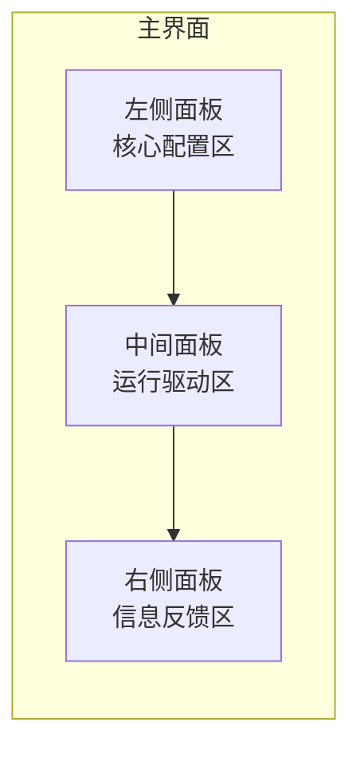
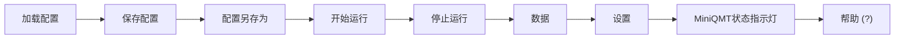

# 用户界面组件

<cite>
**本文档引用的文件**   
- [README.md](file://README.md)
- [GUIkhQuant.py](file://GUIkhQuant.py)
- [SettingsDialog.py](file://SettingsDialog.py)
- [backtest_result_window.py](file://backtest_result_window.py)
</cite>

## 目录
1. [主界面布局](#主界面布局)
2. [顶部工具栏功能](#顶部工具栏功能)
3. [软件设置对话框](#软件设置对话框)
4. [回测结果报告](#回测结果报告)

## 主界面布局

根据 `README.md` 的“第五章：主界面巡览”，主程序界面采用三栏式布局，清晰地划分了策略配置、运行监控和状态反馈三大功能区域。

**Diagram sources**
- [README.md](file://README.md#L640-L655)

### 左侧面板（核心配置区）

左侧面板是策略配置的核心区域，用户在此设置策略文件、回测参数、数据周期和股票池。

*   **策略配置**：通过“选择策略文件”按钮加载用户编写的Python策略脚本（`.py`文件）。当前版本的运行模式固定为“回测”。
*   **回测参数**：设置基准合约（如 `sh.000300`）、交易成本（最低佣金、佣金比例、卖出印花税等）以及回测的时间区间。
*   **数据设置**：选择K线数据的复权方式（如“前复权”、“等比前复权”）、数据周期（如 `1m`, `5m`, `1d`）以及策略运行所需的具体数据字段。
*   **股票池设置**：通过勾选“上证50”、“沪深300”等常用指数，或在下方的表格中手动添加、删除股票代码来管理股票池。

**Section sources**
- [README.md](file://README.md#L678-L710)
- [GUIkhQuant.py](file://GUIkhQuant.py#L1333-L1653)

### 中间面板（运行驱动区）

中间面板负责定义策略的触发机制和账户信息。

*   **触发方式设置**：通过下拉菜单选择策略的触发类型，包括“Tick触发”、“1分钟K线触发”、“5分钟K线触发”、“日K线触发”和“自定义定时触发”。选择“自定义定时触发”时，可输入具体的时间点列表或使用时间点生成器。
*   **账户信息**：在回测模式下，设置策略的“初始资金”和“最小交易量”。
*   **盘前盘后触发设置**：可勾选并设置时间，以在每日开盘前或收盘后自动执行策略中的 `khPreMarket` 或 `khPostMarket` 函数。

**Section sources**
- [README.md](file://README.md#L713-L733)
- [GUIkhQuant.py](file://GUIkhQuant.py#L1657-L1859)

### 右侧面板（信息反馈区）

右侧面板是观察系统运行状态的主要窗口。

*   **系统日志**：一个实时滚动的文本框，显示软件的运行状态、策略中 `print()` 的输出、交易委托与成交的详细回报以及任何错误或警告信息。
*   **日志操作**：提供“日志类型过滤”（可筛选 `DEBUG`, `INFO`, `WARNING`, `ERROR`, `TRADE` 等级别）、“清空日志”、“保存日志”、“测试日志”和“打开回测指标”等按钮。

**Section sources**
- [README.md](file://README.md#L736-L753)
- [GUIkhQuant.py](file://GUIkhQuant.py#L1861-L1941)

## 顶部工具栏功能

顶部工具栏集成了最高频使用的全局操作按钮。

**Diagram sources**
- [README.md](file://README.md#L660-L674)

*   **加载配置**：加载一个之前保存的 `.kh` 配置文件，快速恢复所有参数设置。
*   **保存配置**：将当前所有参数设置保存到当前加载的 `.kh` 文件中。
*   **配置另存为**：将当前所有设置保存为一个新的 `.kh` 文件。
*   **开始运行**：根据当前配置，启动策略回测。
*   **停止运行**：手动停止当前正在运行的策略。
*   **数据**：打开数据中心，用于补充和管理回测所需的历史数据。
*   **设置**：打开“软件设置”对话框，配置MiniQMT路径等全局参数。
*   **MiniQMT状态指示灯**：显示与MiniQMT的连接状态（🟢已连接 / 🔴未连接）。
*   **帮助 (?)**：打开在线教程文档。

**Section sources**
- [README.md](file://README.md#L658-L674)
- [GUIkhQuant.py](file://GUIkhQuant.py#L1050-L1149)

## 软件设置对话框

`SettingsDialog.py` 文件定义了软件的设置对话框，用于配置全局参数。

*   **客户端设置**：这是最关键的设置，需要正确配置两个MiniQMT路径。
    *   **miniQMT客户端路径**：指向MiniQMT的主程序文件 `XtItClient.exe`。
    *   **miniQMT路径**：指向MiniQMT的用户数据文件夹 `userdata_mini`。
*   **基本参数设置**：包括设置无风险收益率（用于计算夏普比率等指标）、是否启用延迟显示日志、最大日志显示行数等。
*   **账户设置**：设置账户名称和账户类型（STOCK, CREDIT, FUTURES）。
*   **股票列表管理**：提供“更新成分股列表”按钮，用于更新本地的股票列表数据。

**Section sources**
- [README.md](file://README.md#L363-L384)
- [SettingsDialog.py](file://SettingsDialog.py#L29-L540)

## 回测结果报告

`backtest_result_window.py` 文件定义了回测结果窗口，用于展示策略的绩效分析。

*   **核心绩效指标**：在“基本信息”面板中，报告包含总收益率、年化收益率、最大回撤、夏普比率、索提诺比率、阿尔法、贝塔、胜率、盈亏比等关键指标。
*   **资金曲线图**：在“收益曲线”标签页中，以图表形式展示策略净值与基准的对比、回撤曲线、日盈亏和成交记录。
*   **详细交易记录**：在“交易记录”标签页中，以表格形式列出每一笔买入和卖出的详细信息，包括交易时间、证券代码、交易方向、成交价格、成交数量、成交金额和手续费。

**Section sources**
- [README.md](file://README.md#L595-L603)
- [backtest_result_window.py](file://backtest_result_window.py#L36-L378)