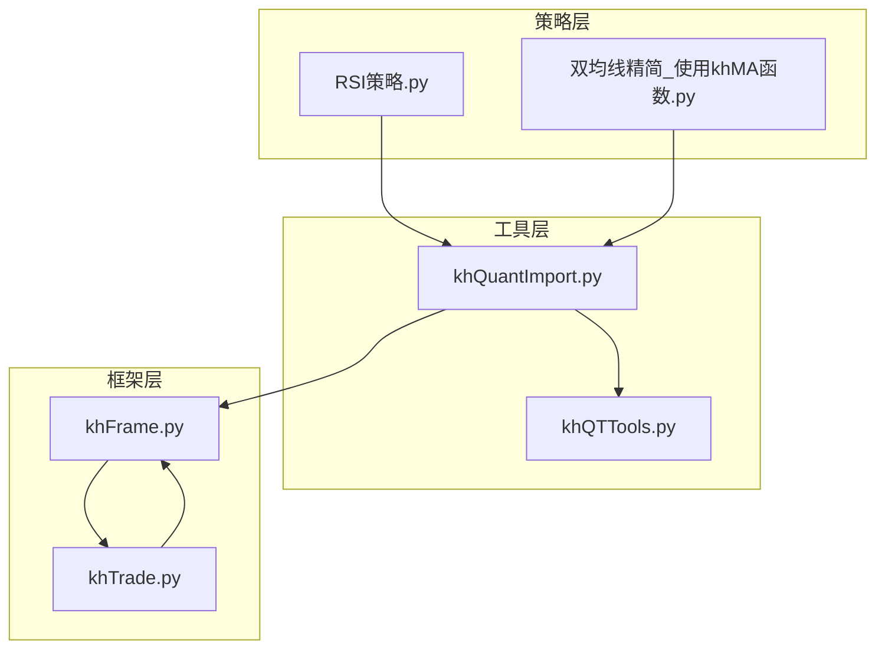
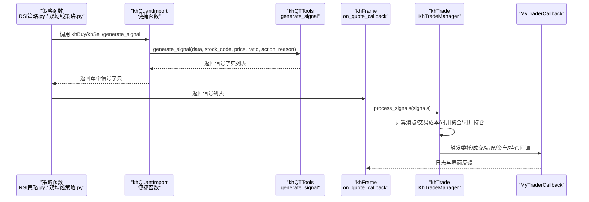
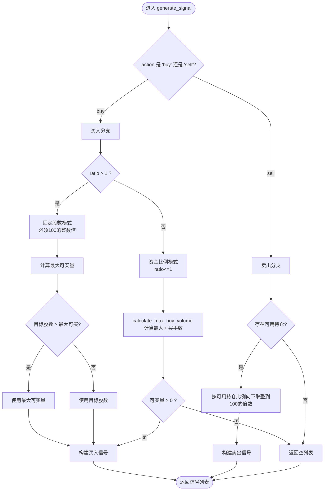
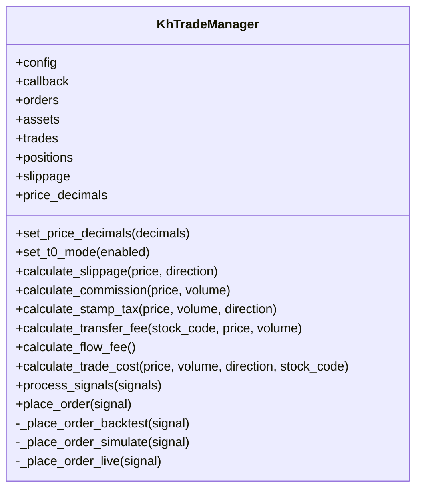
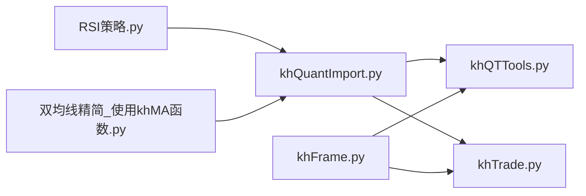

# 交易指令与执行

<cite>
**本文引用的文件**
- [khQuantImport.py](file://khQuantImport.py)
- [khQTTools.py](file://khQTTools.py)
- [khTrade.py](file://khTrade.py)
- [khFrame.py](file://khFrame.py)
- [RSI策略.py](file://strategies/RSI策略.py)
- [双均线精简_使用khMA函数.py](file://strategies/双均线精简_使用khMA函数.py)
</cite>

## 目录
1. [简介](#简介)
2. [项目结构](#项目结构)
3. [核心组件](#核心组件)
4. [架构总览](#架构总览)
5. [详细组件分析](#详细组件分析)
6. [依赖分析](#依赖分析)
7. [性能考量](#性能考量)
8. [故障排查指南](#故障排查指南)
9. [结论](#结论)
10. [附录](#附录)

## 简介
本章节面向策略开发者，系统讲解如何在策略中发出交易指令并理解其执行过程。重点围绕 khQuantImport 模块提供的便捷交易函数（如 khBuy、khSell），并通过 generate_signal 的参数与行为，解释策略如何构建交易信号并返回给框架；随后说明 khFrame 框架如何接收信号，khTrade.py 如何处理并模拟/回测下单，最终与 xtquant MiniQMT 客户端对接完成实际交易。

## 项目结构
围绕“交易指令与执行”的主题，涉及的关键文件与职责如下：
- khQuantImport.py：统一导入与便捷函数入口，提供 khBuy/khSell/generate_signal 等工具，封装数据解析与上下文访问。
- khQTTools.py：交易信号生成与下单辅助函数（generate_signal、calculate_max_buy_volume 等），负责信号规范化与资金/持仓约束校验。
- khTrade.py：交易管理器，负责信号处理、下单、成交、资产与持仓更新、交易成本计算与回调触发。
- khFrame.py：框架调度层，负责策略加载、行情回调、触发器、交易回调桥接与回测记录。
- 策略示例：RSI策略.py、双均线精简_使用khMA函数.py，演示 generate_signal 的典型用法与信号返回。

图表来源
- [khQuantImport.py](file://khQuantImport.py#L1-L120)
- [khQTTools.py](file://khQTTools.py#L542-L741)
- [khTrade.py](file://khTrade.py#L198-L595)
- [khFrame.py](file://khFrame.py#L1-L200)
- [RSI策略.py](file://strategies/RSI策略.py#L1-L26)
- [双均线精简_使用khMA函数.py](file://strategies/双均线精简_使用khMA函数.py#L1-L31)

章节来源
- [khQuantImport.py](file://khQuantImport.py#L1-L120)
- [khQTTools.py](file://khQTTools.py#L542-L741)
- [khTrade.py](file://khTrade.py#L198-L595)
- [khFrame.py](file://khFrame.py#L1-L200)
- [RSI策略.py](file://strategies/RSI策略.py#L1-L26)
- [双均线精简_使用khMA函数.py](file://strategies/双均线精简_使用khMA函数.py#L1-L31)

## 核心组件
- khQuantImport 模块
  - 提供 khBuy/khSell 等便捷函数，内部调用 generate_signal 并返回单个信号字典。
  - 提供 khGet/khPrice/khHas 等数据访问工具，统一时间、账户、持仓、股票池等数据获取。
- khQTTools 模块
  - generate_signal：标准化交易信号生成，支持按资金比例或固定股数（必须100的整数倍）两种模式；自动处理价格精度、滑点、交易成本与可用资金/可用持仓约束。
  - calculate_max_buy_volume：在考虑交易成本（含滑点）的前提下，计算最大可买入手数（按100取整）。
- khTrade 框架
  - KhTradeManager：处理信号、下单、成交、资产与持仓更新、交易成本计算与回调触发。
  - MyTraderCallback：交易回调桥接，将委托、成交、错误、资金/持仓变动等事件传递给框架。
- khFrame 框架
  - 触发器（Tick/K线/自定义时间）驱动策略执行。
  - on_quote_callback：组装带时间信息的数据字典，调用策略主函数，接收并处理返回的信号列表。
  - 交易回调桥接：将 khTrade 的回调转发至 GUI 日志与业务处理。

章节来源
- [khQuantImport.py](file://khQuantImport.py#L377-L572)
- [khQTTools.py](file://khQTTools.py#L542-L741)
- [khTrade.py](file://khTrade.py#L198-L595)
- [khFrame.py](file://khFrame.py#L745-L820)

## 架构总览
交易指令从策略侧生成，经框架接收与处理，最终由交易管理器执行并触发回调。

图表来源
- [RSI策略.py](file://strategies/RSI策略.py#L12-L24)
- [双均线精简_使用khMA函数.py](file://strategies/双均线精简_使用khMA函数.py#L11-L29)
- [khQuantImport.py](file://khQuantImport.py#L508-L570)
- [khQTTools.py](file://khQTTools.py#L635-L741)
- [khFrame.py](file://khFrame.py#L745-L820)
- [khTrade.py](file://khTrade.py#L198-L595)

## 详细组件分析

### 1) khQuantImport 模块与便捷交易函数
- khBuy/khSell
  - 行为：获取当前价格，若价格有效则调用 generate_signal 生成信号，返回单个信号字典；失败返回空字典。
  - 参数：data（策略数据）、stock_code（股票代码）、ratio（仓位比例或固定股数）、volume（可选，覆盖 ratio）、reason（交易理由）。
  - 返回：单个信号字典，便于策略直接追加到列表或单独返回。
- khGet/khPrice/khHas
  - 提供统一的数据访问能力：时间、账户、股票池、持仓等；价格获取支持 tick/K 线兼容；持仓检查简化策略判断。
- StrategyContext.buy_signal/sell_signal
  - 面向上下文的便捷方法，内部同样调用 generate_signal，便于在策略中以对象化方式组织数据与信号。

章节来源
- [khQuantImport.py](file://khQuantImport.py#L508-L570)
- [khQuantImport.py](file://khQuantImport.py#L340-L376)
- [khQuantImport.py](file://khQuantImport.py#L381-L528)

### 2) generate_signal 信号生成器
- 输入参数
  - data：包含时间、账户、持仓信息与框架对象的字典。
  - stock_code：目标股票代码。
  - price：委托价格（将按价格精度四舍五入）。
  - ratio：买入时为资金比例（≤1），或固定股数（>1，必须100的整数倍）；卖出时为可用持仓比例。
  - action：'buy' 或 'sell'。
  - reason：交易原因说明。
- 生成规则
  - 买入：
    - ratio>1：按固定股数生成信号，要求必须是100的整数倍；若目标股数超过最大可买量，自动调整为最大可买量。
    - ratio≤1：按资金比例计算最大可买手数（向下取整到100的倍数），返回信号。
  - 卖出：
    - 从 __positions__ 获取可用持仓（优先 can_use_volume，否则 volume），按比例向下取整到100的倍数生成信号。
- 价格精度与时间戳
  - 自动按 get_price_decimals 获取精度并四舍五入。
  - 若 data 中存在 __current_time__，将 timestamp 写入信号字段。
- 返回值
  - 单元素信号字典列表；若无法满足约束（资金不足、无可用持仓、价格异常等），返回空列表。

图表来源
- [khQTTools.py](file://khQTTools.py#L635-L741)
- [khQTTools.py](file://khQTTools.py#L542-L635)

章节来源
- [khQTTools.py](file://khQTTools.py#L635-L741)
- [khQTTools.py](file://khQTTools.py#L542-L635)

### 3) calculate_max_buy_volume 最大可买量计算
- 输入：data、stock_code、price、cash_ratio（资金使用比例，默认1.0）。
- 步骤：
  - 从 __account__ 获取可用资金，按 cash_ratio 计算可用资金。
  - 从 __framework__ 获取配置，构造 KhTradeManager 以获得交易成本参数（佣金、过户费、滑点等）。
  - 初步估算：基于价格与成本近似计算可买手数，再向下取整到100的倍数。
  - 精确校验：逐手递减，使用 calculate_trade_cost 计算实际总成本（含滑点），直到可用资金足以覆盖总成本。
  - 返回：满足约束的最大手数（整数）。
- 作用：为 generate_signal 的资金比例模式提供精确的可买量，保证信号在回测/实盘中可执行。

章节来源
- [khQTTools.py](file://khQTTools.py#L542-L635)

### 4) khFrame 框架接收与处理信号
- on_quote_callback：将行情数据与时间信息合并为 data_with_time，使用触发器判断是否触发策略；触发后调用策略主函数（如 khHandlebar），接收返回的信号列表。
- 回测记录：在回测过程中，框架会批量处理信号并记录交易明细（成交价格、手续费、总成本等）。

章节来源
- [khFrame.py](file://khFrame.py#L745-L820)
- [khFrame.py](file://khFrame.py#L2678-L2696)

### 5) khTrade 交易管理器处理信号
- process_signals：遍历信号列表，对每个信号：
  - 忽略 volume≤0 的信号。
  - 计算滑点与交易成本（佣金、印花税、过户费、流量费），并将实际成交价格与总成本写入信号。
  - 根据运行模式（回测/模拟/实盘）执行下单。
- 回测下单（_place_order_backtest）：
  - 检查资金/可用持仓是否满足要求，否则触发委托错误回调。
  - 生成委托与成交记录，更新 orders/trades/assets/positions。
  - 触发委托/成交/资产/持仓回调。
- 交易成本计算：
  - calculate_slippage：支持 tick 与 ratio 两种滑点模型。
  - calculate_commission/calculate_stamp_tax/calculate_transfer_fee/calculate_flow_fee：分别计算佣金、印花税、过户费、流量费。
  - calculate_trade_cost：汇总滑点与各项费用，返回实际成交价格与总成本。

图表来源
- [khTrade.py](file://khTrade.py#L1-L197)
- [khTrade.py](file://khTrade.py#L198-L595)

章节来源
- [khTrade.py](file://khTrade.py#L1-L197)
- [khTrade.py](file://khTrade.py#L198-L595)

### 6) 策略示例中的信号生成与返回
- RSI策略.py
  - 使用 khHistory 拉取历史收盘价，计算 RSI(14)；当 RSI 由下穿30上穿30（金叉）且无持仓时，调用 generate_signal 生成买入信号；当 RSI 由上穿70下穿70（死叉）且有持仓时，生成卖出信号。
  - 通过 signals.extend(...) 将多个信号加入返回列表。
- 双均线策略.py
  - 使用 khMA 计算短均线与长均线；当金叉且无持仓时生成全仓买入信号；当死叉且有持仓时生成全仓卖出信号。
  - 直接返回单个信号字典（由 generate_signal 返回）。

章节来源
- [RSI策略.py](file://strategies/RSI策略.py#L12-L24)
- [双均线精简_使用khMA函数.py](file://strategies/双均线精简_使用khMA函数.py#L11-L29)

### 7) 与 xtquant/MiniQMT 的对接
- khFrame 中定义了 MyTraderCallback，用于桥接交易回调（委托回报、成交回报、错误、资金/持仓变动等），并在回测模式下通过 KhTradeManager 的回调进行日志与界面输出。
- 实盘模式下，place_order_live 将调用 MiniQMT 的交易接口（当前为占位实现，便于扩展）。

章节来源
- [khFrame.py](file://khFrame.py#L277-L495)
- [khTrade.py](file://khTrade.py#L256-L270)

## 依赖分析
- khQuantImport 依赖 khQTTools（generate_signal、calculate_max_buy_volume 等）与 khTrade（交易成本与下单）。
- khFrame 依赖 khTrade（交易管理器）与 khQTTools（价格精度、T+0 等工具）。
- 策略示例依赖 khQuantImport 的便捷函数与 khQTTools 的指标函数。

图表来源
- [khQuantImport.py](file://khQuantImport.py#L1-L120)
- [khQTTools.py](file://khQTTools.py#L542-L741)
- [khTrade.py](file://khTrade.py#L198-L595)
- [khFrame.py](file://khFrame.py#L1-L200)
- [RSI策略.py](file://strategies/RSI策略.py#L1-L26)
- [双均线精简_使用khMA函数.py](file://strategies/双均线精简_使用khMA函数.py#L1-L31)

章节来源
- [khQuantImport.py](file://khQuantImport.py#L1-L120)
- [khQTTools.py](file://khQTTools.py#L542-L741)
- [khTrade.py](file://khTrade.py#L198-L595)
- [khFrame.py](file://khFrame.py#L1-L200)
- [RSI策略.py](file://strategies/RSI策略.py#L1-L26)
- [双均线精简_使用khMA函数.py](file://strategies/双均线精简_使用khMA函数.py#L1-L31)

## 性能考量
- 信号生成阶段尽量避免重复计算指标与数据拉取，可在策略侧缓存每日指标，减少 khHistory/khMA 的调用频率。
- 交易成本计算在回测中会逐信号执行，建议合理设置滑点与交易成本参数，避免过高的计算开销。
- 使用 khGet/khPrice/khHas 等便捷函数可减少重复解析与异常处理，提升策略执行效率。

## 故障排查指南
- 无法生成买入信号
  - 检查 price 是否有效（>0），资金是否充足（calculate_max_buy_volume 返回>0），或 ratio>1 时是否为100的整数倍。
  - 查看日志中关于“资金不足”“目标股数必须是100的整数倍”等提示。
- 无法生成卖出信号
  - 检查 __positions__ 中是否存在该股票，可用持仓 can_use_volume/volume 是否>0。
  - 查看日志中关于“无可用持仓”“计算可卖量为0”的提示。
- 回测下单失败
  - 资金不足：查看委托错误回调中“所需资金/可用资金”的日志。
  - 持仓不足：查看委托错误回调中“可用持仓不足”的日志。
- 交易成本异常
  - 检查滑点类型与参数（tick/ratio），确认佣金、印花税、过户费、流量费设置是否符合预期。

章节来源
- [khQTTools.py](file://khQTTools.py#L635-L741)
- [khTrade.py](file://khTrade.py#L270-L507)
- [khFrame.py](file://khFrame.py#L277-L495)

## 结论
通过 khQuantImport 的 khBuy/khSell 与 generate_signal，策略可以以极简的方式生成标准化交易信号；khFrame 负责接收与调度，khTrade 负责信号处理与回测下单，最终通过回调将交易结果反馈到界面与日志。掌握 generate_signal 的参数与行为、calculate_max_buy_volume 的资金约束逻辑，以及 khTrade 的交易成本与下单流程，是编写稳健策略的关键。

## 附录

### A. 交易信号字段说明
- code：股票代码
- action：'buy'/'sell'
- price：委托价格（已按精度四舍五入）
- volume：委托数量（股）
- reason：交易原因
- timestamp：委托时间戳（可选）
- order_type/position_type/order_time/remark：可选字段（由策略或框架填充）

章节来源
- [khTrade.py](file://khTrade.py#L198-L241)

### B. 底层交易函数与使用场景
- khBuy/khSell
  - 场景：策略侧快速生成单个信号，适合简单条件触发（如金叉/死叉、突破）。
  - 注意：返回单个信号字典，策略侧可直接追加到列表或单独返回。
- generate_signal
  - 场景：复杂策略中需要严格控制资金比例、固定股数、滑点与交易成本的信号生成。
  - 注意：ratio>1 时必须为100的整数倍；ratio≤1 时按资金比例计算最大可买量。
- calculate_max_buy_volume
  - 场景：在 generate_signal 内部或策略侧需要精确计算最大可买手数时使用。
  - 注意：考虑滑点与交易成本，返回值按100取整。
- order_target_value（概念说明）
  - 概念：在现有持仓基础上，通过买入/卖出达到目标总市值的指令。在本框架中，可通过 generate_signal 的 ratio 参数与 calculate_max_buy_volume 的组合实现类似效果（按资金比例或固定股数生成信号，再由 khTrade 执行）。
  - 使用建议：若需“目标市值”而非“目标手数”，可在策略侧计算目标手数或目标资金比例，再调用 generate_signal。

章节来源
- [khQuantImport.py](file://khQuantImport.py#L508-L570)
- [khQTTools.py](file://khQTTools.py#L542-L741)
- [khTrade.py](file://khTrade.py#L198-L595)