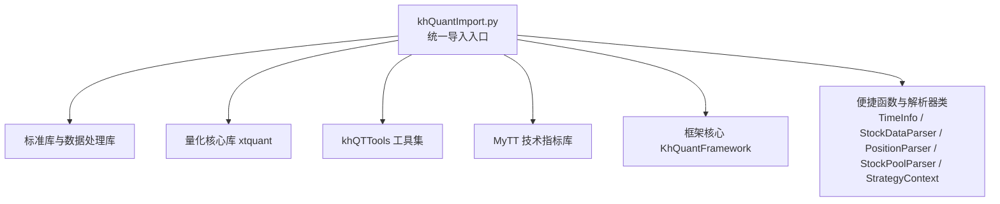
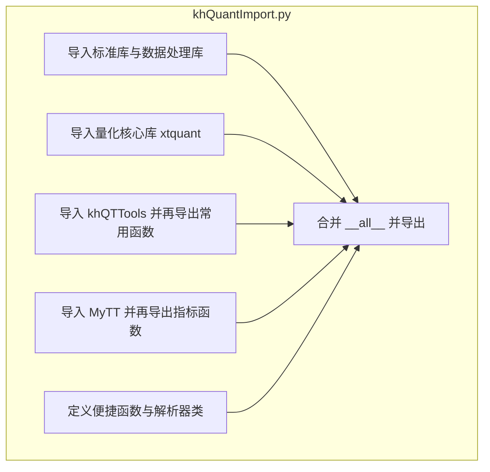
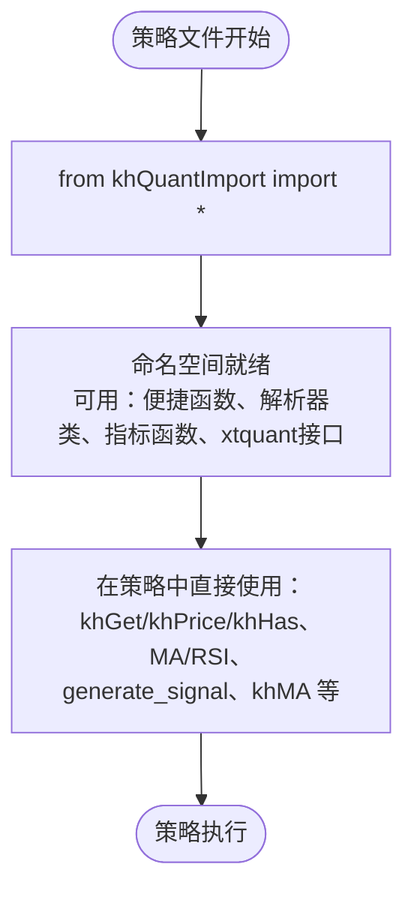
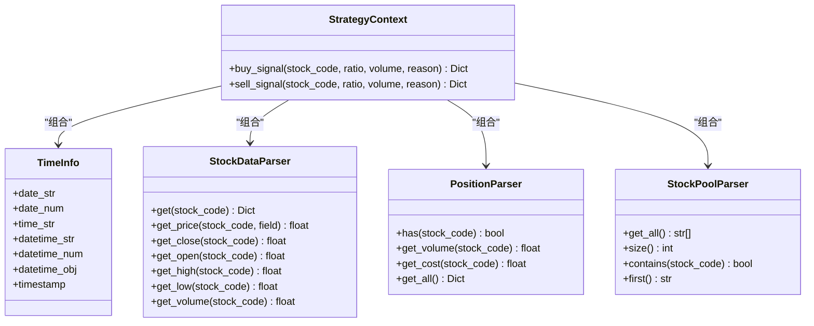
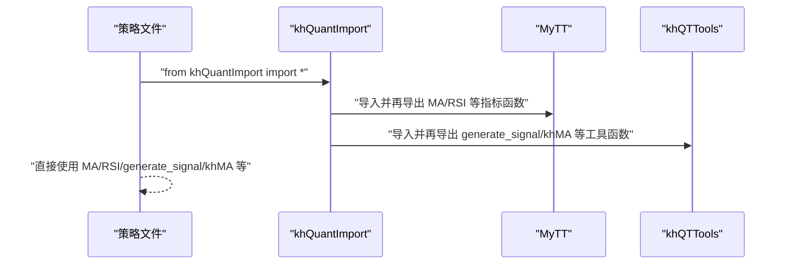
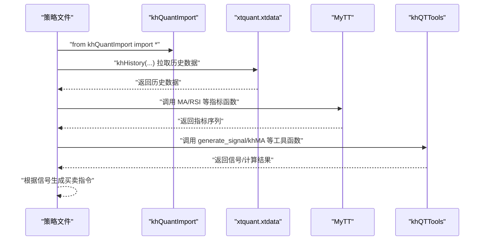
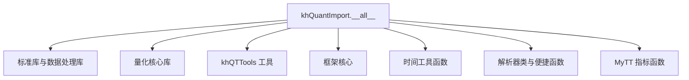
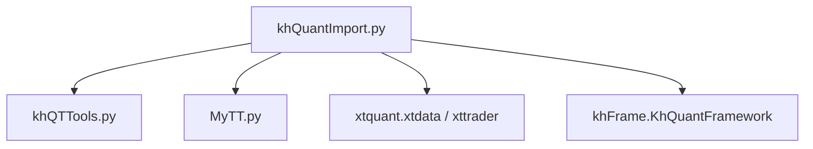

# 导入与初始化

<cite>
**本文引用的文件**
- [khQuantImport.py](file://khQuantImport.py)
- [MyTT.py](file://MyTT.py)
- [khQTTools.py](file://khQTTools.py)
- [RSI策略.py](file://strategies/RSI策略.py)
- [双均线多股票_使用MA函数.py](file://strategies/双均线多股票_使用MA函数.py)
- [双均线多股票_使用khMA函数.py](file://strategies/双均线多股票_使用khMA函数.py)
- [RSI策略.kh](file://strategies/RSI策略.kh)
- [双均线多股票_使用khMA函数.kh](file://strategies/双均线多股票_使用khMA函数.kh)
- [khQuantImport.md](file://modules/khQuantImport.md)
</cite>

## 目录
1. [简介](#简介)
2. [项目结构](#项目结构)
3. [核心组件](#核心组件)
4. [架构总览](#架构总览)
5. [详细组件分析](#详细组件分析)
6. [依赖关系分析](#依赖关系分析)
7. [性能考量](#性能考量)
8. [故障排查指南](#故障排查指南)
9. [结论](#结论)
10. [附录](#附录)

## 简介
本章节聚焦于“导入与初始化”，系统性阐述如何正确导入量化开发所需的全部工具与函数，重点强调统一导入语句“from khQuantImport import *”的作用与意义。该语句将自动整合三大核心来源：xtquant数据接口、khQTTools工具集、MyTT技术指标库，并提供一系列便捷函数与解析器类，帮助策略开发者以最少的学习成本快速上手。

## 项目结构
khQuant 的导入体系由统一入口模块 khQuantImport.py 组织，它在内部导入并再导出：
- 标准库与数据处理库（os, sys, json, logging, datetime, typing；numpy, pandas）
- 量化核心库（xtquant.xtdata；xtquant.xttrader 的交易接口，缺失时提供占位符）
- 项目内部工具（khQTTools，含 generate_signal、calculate_max_buy_volume、khMA、is_trade_time 等）
- 框架核心（KhQuantFramework）
- 技术指标库（MyTT，含 MA、RSI 等）

此外，khQuantImport.py 还定义了若干便捷函数与解析器类，用于统一访问时间、股票数据、持仓与股票池信息，并提供信号生成与风控参数默认值。

**图表来源**
- [khQuantImport.py](file://khQuantImport.py#L1-L572)

**章节来源**
- [khQuantImport.py](file://khQuantImport.py#L1-L572)

## 核心组件
- 统一导入语句：from khQuantImport import *
- 便捷函数族：khGet、khPrice、khHas、generate_signal、calculate_max_buy_volume、khMA、is_trade_time、is_trade_day、get_trade_days_count 等
- 解析器类：TimeInfo、StockDataParser、PositionParser、StockPoolParser、StrategyContext
- 指标函数：来自 MyTT 的 MA、RSI 等
- 数据接口：xtquant.xtdata（行情数据），xtquant.xttrader（交易接口，缺失时为 None）

这些组件共同构成策略开发的“一站式工具箱”，开发者只需在策略文件顶部写一行导入语句，即可获得所有常用工具。

**章节来源**
- [khQuantImport.py](file://khQuantImport.py#L1-L572)
- [MyTT.py](file://MyTT.py#L1-L624)
- [khQTTools.py](file://khQTTools.py#L1-L800)

## 架构总览
khQuantImport 的内部结构体现了“聚合与再导出”的设计：将 khQTTools 与 MyTT 的公共符号自动并入 __all__，并通过便捷函数与解析器类提供统一的策略开发接口。下图展示了 khQuantImport.py 的关键导入与导出关系。

**图表来源**
- [khQuantImport.py](file://khQuantImport.py#L1-L572)

**章节来源**
- [khQuantImport.py](file://khQuantImport.py#L1-L572)

## 详细组件分析

### 1) 统一导入语句与命名空间
- 使用方式：在策略文件顶部添加 from khQuantImport import *
- 作用：一次性导入所有常用模块、工具函数、指标函数与解析器类，避免分散导入带来的遗漏与混乱
- 导入范围：标准库、数据处理库、xtquant、khQTTools、MyTT、框架核心、便捷函数与解析器类

**图表来源**
- [khQuantImport.py](file://khQuantImport.py#L1-L572)

**章节来源**
- [khQuantImport.py](file://khQuantImport.py#L1-L572)

### 2) 便捷函数与解析器类
- khGet：统一获取时间、账户、股票池、持仓等信息，支持多种键名别名
- khPrice：统一获取股票价格，自动处理 pandas Series、数组与 NaN/Inf 等异常
- khHas：检查是否持有某股票
- TimeInfo：统一时间格式转换与访问
- StockDataParser：统一股票数据访问与兼容处理（含 tick/K线字段映射）
- PositionParser：统一持仓信息访问
- StockPoolParser：统一股票池访问
- StrategyContext：整合上述解析器，提供 buy_signal/sell_signal 等便捷方法

**图表来源**
- [khQuantImport.py](file://khQuantImport.py#L133-L375)

**章节来源**
- [khQuantImport.py](file://khQuantImport.py#L133-L375)

### 3) 技术指标与工具函数
- MyTT 指标：MA、RSI、MACD、KDJ、BOLL、CCI、ATR 等
- khQTTools 工具：generate_signal、calculate_max_buy_volume、khMA、is_trade_time、is_trade_day、get_trade_days_count 等
- khQuantImport 通过 from khQTTools import * 与 from MyTT import * 将这些函数直接暴露到统一命名空间

**图表来源**
- [khQuantImport.py](file://khQuantImport.py#L31-L45)
- [MyTT.py](file://MyTT.py#L1-L624)
- [khQTTools.py](file://khQTTools.py#L1-L800)

**章节来源**
- [khQuantImport.py](file://khQuantImport.py#L31-L45)
- [MyTT.py](file://MyTT.py#L1-L624)
- [khQTTools.py](file://khQTTools.py#L1-L800)

### 4) 实战策略中的导入位置与作用
- RSI 策略：在策略文件顶部使用统一导入，随后通过 khGet 获取日期与股票池，通过 khHistory 拉取历史数据，使用 RSI 计算并生成交易信号
- 双均线策略（使用 MA）：统一导入后，遍历股票池，使用 MA 计算均线并生成买卖信号
- 双均线策略（使用 khMA）：统一导入后，直接使用 khMA 获取均线，配合 generate_signal 生成信号

**图表来源**
- [RSI策略.py](file://strategies/RSI策略.py#L1-L26)
- [双均线多股票_使用MA函数.py](file://strategies/双均线多股票_使用MA函数.py#L1-L36)
- [双均线多股票_使用khMA函数.py](file://strategies/双均线多股票_使用khMA函数.py#L1-L33)

**章节来源**
- [RSI策略.py](file://strategies/RSI策略.py#L1-L26)
- [双均线多股票_使用MA函数.py](file://strategies/双均线多股票_使用MA函数.py#L1-L36)
- [双均线多股票_使用khMA函数.py](file://strategies/双均线多股票_使用khMA函数.py#L1-L33)

### 5) khQuantImport 的内部结构与导出清单
khQuantImport.py 在文件末尾通过 __all__ 明确列出所有对外导出的符号，涵盖：
- 标准库与数据处理库（os, sys, json, logging, datetime, typing；np, pd）
- 量化核心库（xtdata, XtQuantTrader, XtQuantTraderCallback）
- khQTTools 工具（generate_signal, calculate_max_buy_volume, KhQuTools, khMA 等）
- 框架核心（KhQuantFramework）
- 时间工具函数（is_trade_time, is_trade_day, get_trade_days_count）
- 解析器类与便捷函数（TimeInfo, StockDataParser, PositionParser, StockPoolParser, StrategyContext, khGet, khPrice, khHas, get_default_risk_params）
- 指标函数（MA, RSI, khMA）

**图表来源**
- [khQuantImport.py](file://khQuantImport.py#L540-L572)

**章节来源**
- [khQuantImport.py](file://khQuantImport.py#L540-L572)

## 依赖关系分析
khQuantImport.py 的依赖关系如下：
- khQTTools：提供 generate_signal、calculate_max_buy_volume、khMA、is_trade_time、is_trade_day、get_trade_days_count 等
- MyTT：提供 MA、RSI 等技术指标函数
- xtquant：提供 xtdata（行情数据）与 xttrader（交易接口，缺失时为 None）
- khFrame：KhQuantFramework（框架核心）

**图表来源**
- [khQuantImport.py](file://khQuantImport.py#L21-L45)

**章节来源**
- [khQuantImport.py](file://khQuantImport.py#L21-L45)

## 性能考量
- 便捷函数与解析器类在数据访问与类型转换上做了大量兼容性处理，建议在策略中：
  - 使用 khGet/khPrice/khHas 等封装函数，避免重复判断与异常处理
  - 对于批量计算，尽量复用历史数据与中间结果，减少重复拉取
  - 在高频触发场景下，合理使用日志级别，避免过多 DEBUG 输出影响性能

[本节为通用建议，不直接分析具体文件]

## 故障排查指南

### 常见导入错误与解决
- 模块未找到（ModuleNotFoundError）
  - 现象：from khQuantImport import * 报错，提示找不到模块
  - 排查：确认 khQuantImport.py 与 khQTTools.py、MyTT.py、khFrame.py 等文件在同一工作目录或 PYTHONPATH 中
  - 解决：将项目根目录加入 Python 路径，或在 IDE 中设置工作目录为仓库根目录

- 函数未定义（NameError）
  - 现象：使用 MA/RSI/generate_signal 等时报未定义
  - 排查：确认是否使用了 from khQuantImport import *；检查策略文件顶部导入语句是否正确
  - 解决：确保导入语句在策略文件顶部，且 khQuantImport.py 可被正确导入

- 交易接口缺失（XtQuantTrader 为 None）
  - 现象：xtquant.xttrader 无法导入，XtQuantTrader 为 None
  - 排查：确认已安装 xtquant 且版本兼容
  - 解决：安装或升级 xtquant；若仅进行回测，可忽略交易接口

- 数据接口异常
  - 现象：khHistory 拉取历史数据失败或返回空
  - 排查：确认 MiniQMT 客户端已登录并提供接口；检查策略文件路径与工程配置
  - 解决：先启动 MiniQMT 并登录，再运行策略；检查 .kh 工程配置中的策略文件路径与数据字段

- 价格与数据类型异常
  - 现象：khPrice 返回 0.0 或 NaN/Inf
  - 排查：检查数据源是否为 tick/K线混合；确认字段映射（close/lastPrice）
  - 解决：使用 khPrice 自动处理字段映射；对返回值进行有效性检查后再使用

**章节来源**
- [khQuantImport.py](file://khQuantImport.py#L21-L45)
- [khQTTools.py](file://khQTTools.py#L1-L800)
- [RSI策略.py](file://strategies/RSI策略.py#L1-L26)
- [双均线多股票_使用MA函数.py](file://strategies/双均线多股票_使用MA函数.py#L1-L36)
- [双均线多股票_使用khMA函数.py](file://strategies/双均线多股票_使用khMA函数.py#L1-L33)

## 结论
统一导入语句“from khQuantImport import *”是 khQuant 量化开发的“一键式工具箱”入口。它将 xtquant 数据接口、khQTTools 工具集与 MyTT 技术指标库有机整合，并提供便捷函数与解析器类，显著降低策略开发的学习成本与心智负担。建议在所有策略文件中统一采用该导入方式，并结合 khGet/khPrice/khHas 等封装函数与 generate_signal/khMA 等工具函数，构建清晰、稳健、可维护的策略逻辑。

[本节为总结性内容，不直接分析具体文件]

## 附录

### A. 导入语句在策略中的位置示例
- RSI 策略：在文件顶部使用统一导入，随后在 khHandlebar 中使用 khGet、khHistory、RSI、generate_signal 等
- 双均线策略（使用 MA）：统一导入后，使用 MA 计算均线并生成信号
- 双均线策略（使用 khMA）：统一导入后，使用 khMA 获取均线并生成信号

**章节来源**
- [RSI策略.py](file://strategies/RSI策略.py#L1-L26)
- [双均线多股票_使用MA函数.py](file://strategies/双均线多股票_使用MA函数.py#L1-L36)
- [双均线多股票_使用khMA函数.py](file://strategies/双均线多股票_使用khMA函数.py#L1-L33)

### B. 工程配置与策略文件路径
- .kh 工程文件中需正确配置 userdata_path、strategy_file、回测时间、数据字段与股票池等
- 建议将策略文件保存在用户策略目录，避免升级覆盖

**章节来源**
- [RSI策略.kh](file://strategies/RSI策略.kh#L1-L71)
- [双均线多股票_使用khMA函数.kh](file://strategies/双均线多股票_使用khMA函数.kh#L1-L71)

### C. khQuantImport 文档与最佳实践
- khQuantImport.md 提供了模块概述、架构、便捷函数与解析器类详解、与 khQTTools/MyTT 的集成示例、最佳实践建议等
- 建议在策略中统一使用 khGet/khPrice/khHas 等封装函数，减少重复代码与异常处理

**章节来源**
- [khQuantImport.md](file://modules/khQuantImport.md#L1-L800)