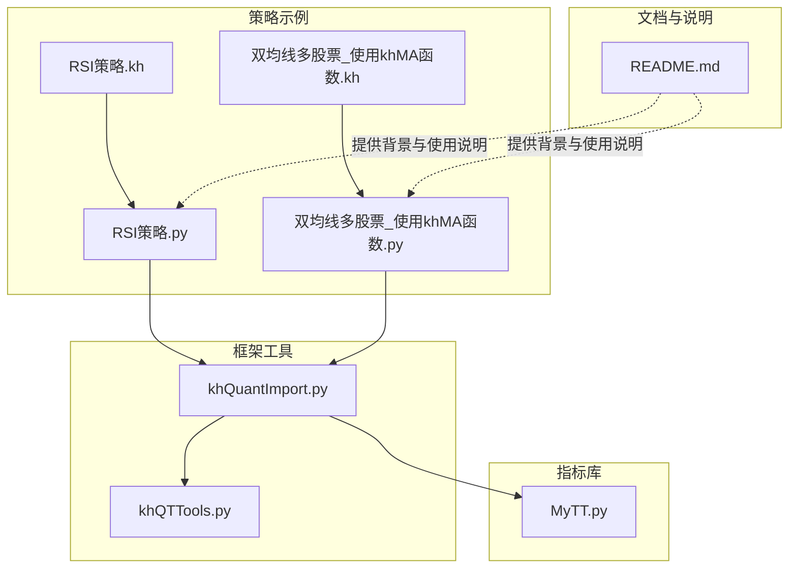
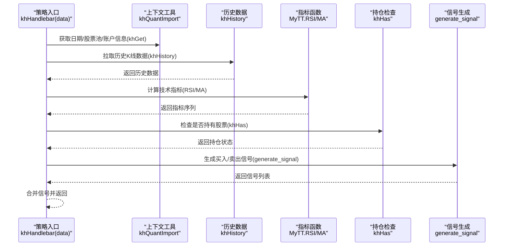
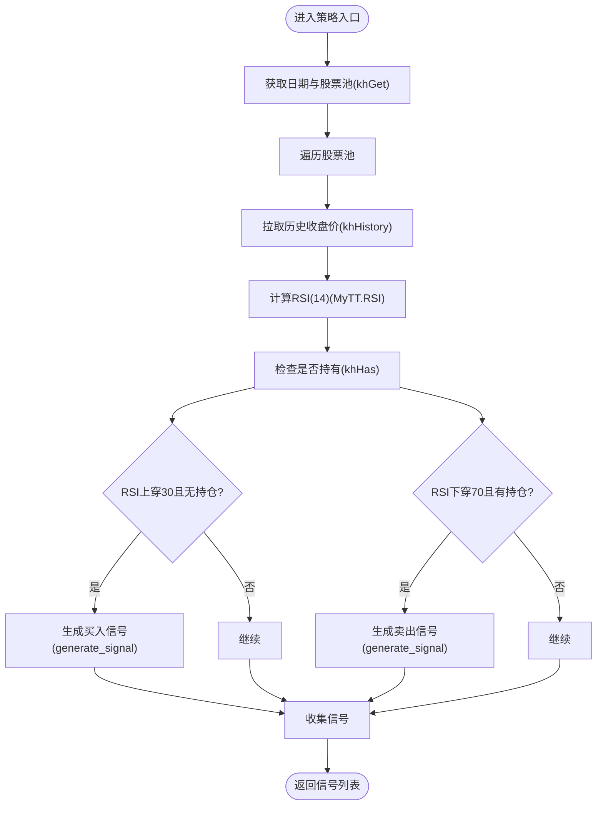
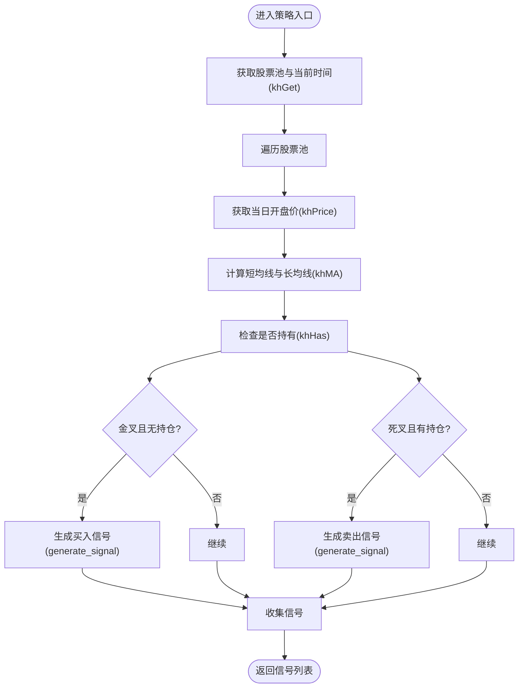
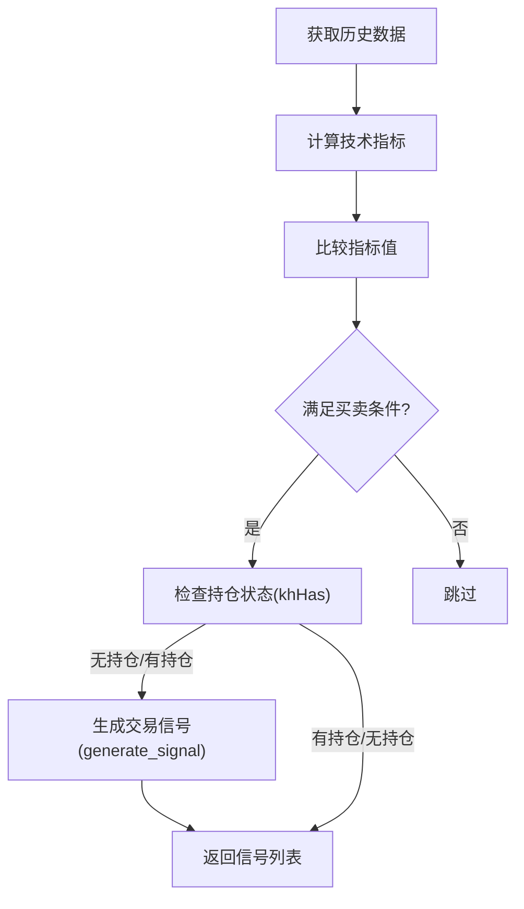
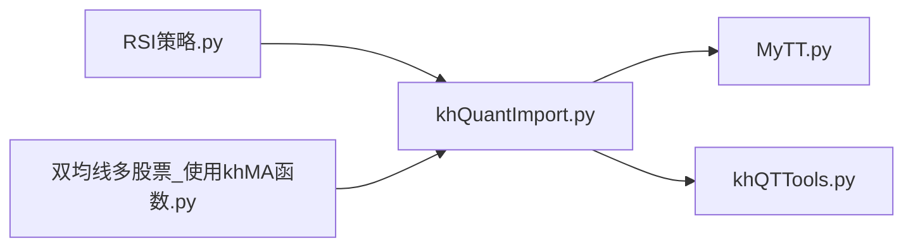

# 技术指标与信号生成

<cite>
**本文引用的文件**
- [MyTT.py](file://MyTT.py)
- [khQuantImport.py](file://khQuantImport.py)
- [khQTTools.py](file://khQTTools.py)
- [RSI策略.py](file://strategies/RSI策略.py)
- [RSI策略.kh](file://strategies/RSI策略.kh)
- [双均线多股票_使用khMA函数.py](file://strategies/双均线多股票_使用khMA函数.py)
- [双均线多股票_使用khMA函数.kh](file://strategies/双均线多股票_使用khMA函数.kh)
- [README.md](file://README.md)
</cite>

## 目录
1. [简介](#简介)
2. [项目结构](#项目结构)
3. [核心组件](#核心组件)
4. [架构总览](#架构总览)
5. [详细组件分析](#详细组件分析)
6. [依赖关系分析](#依赖关系分析)
7. [性能考量](#性能考量)
8. [故障排查指南](#故障排查指南)
9. [结论](#结论)
10. [附录](#附录)

## 简介
本章节面向希望利用技术指标生成交易信号的用户，系统性介绍如何在本项目中使用 MyTT 技术指标库与 khQuant 框架函数，完成从“获取历史数据 -> 计算技术指标 -> 比较指标值 -> 判断买卖条件 -> 生成信号”的完整流程。文档以 RSI 策略与双均线策略为例，演示如何调用 RSI 指标与 khMA 函数，并结合 khGet、khHas 等函数完善信号生成逻辑（如检查持仓状态）。

## 项目结构
本项目采用“策略示例 + 框架工具 + 指标库”的分层组织方式：
- 指标库：MyTT.py 提供常用技术指标与基础运算函数
- 框架工具：khQuantImport.py 汇总导入策略开发常用工具，统一暴露 khGet、khPrice、khHas、khMA 等便捷函数
- 策略示例：strategies 目录包含 RSI 策略与双均线策略的 Python 与 kh 工程文件
- 文档与说明：README.md 提供系统背景、安装与回测流程说明

**图表来源**
- [RSI策略.py](file://strategies/RSI策略.py#L1-L26)
- [双均线多股票_使用khMA函数.py](file://strategies/双均线多股票_使用khMA函数.py#L1-L33)
- [khQuantImport.py](file://khQuantImport.py#L1-L120)
- [MyTT.py](file://MyTT.py#L1-L120)
- [khQTTools.py](file://khQTTools.py#L491-L541)
- [RSI策略.kh](file://strategies/RSI策略.kh#L1-L71)
- [双均线多股票_使用khMA函数.kh](file://strategies/双均线多股票_使用khMA函数.kh#L1-L71)
- [README.md](file://README.md#L1-L120)

**章节来源**
- [README.md](file://README.md#L1-L120)

## 核心组件
- MyTT 技术指标库：提供 MA、RSI、MACD、KDJ、WR、BIAS、BOLL、PSY、CCI、ATR、BBI、DMI、TAQ、KTN、TRIX、VR、CR、EMV、DPO、BRAR、DFMA、MTM、MASS、ROC、EXPMA、OBV、MFI、ASI、XSII 等指标函数，以及 HHV、LLV、REF、DIFF、STD、SUM、SMA、EMA、WMA、DMA、AVEDEV、SLOPE、FORCAST、LAST 等基础运算函数。
- khQuantImport 统一导入模块：将 MyTT 指标与 khQTTools 工具函数统一暴露，提供 khGet、khPrice、khHas、generate_signal、khMA 等便捷函数，简化策略编写。
- khQTTools 工具函数：提供 khMA（封装行情获取与均线计算）、generate_signal（生成标准交易信号）、calculate_max_buy_volume（按交易成本估算最大可买）、is_trade_time/is_trade_day/get_trade_days_count 等辅助函数。
- 策略示例：RSI策略.py 使用 MyTT.RSI 计算 RSI(14)，并结合 khHas/khGet/khPrice 实现“RSI<30 买入、RSI>70 卖出”的信号生成；双均线策略使用 khMA 计算 5 日与 20 日均线，结合 khHas 实现“金叉买入、死叉卖出”。

**章节来源**
- [MyTT.py](file://MyTT.py#L193-L391)
- [khQuantImport.py](file://khQuantImport.py#L31-L60)
- [khQTTools.py](file://khQTTools.py#L491-L541)
- [RSI策略.py](file://strategies/RSI策略.py#L1-L26)
- [双均线多股票_使用khMA函数.py](file://strategies/双均线多股票_使用khMA函数.py#L1-L33)

## 架构总览
下图展示了策略执行的总体流程：策略入口函数接收数据上下文，通过 khGet/khPrice 获取时间与价格，通过 khHistory 获取历史数据，调用 MyTT 指标函数计算技术指标，再结合 khHas 检查持仓状态，最终通过 generate_signal 生成交易信号。

**图表来源**
- [RSI策略.py](file://strategies/RSI策略.py#L12-L24)
- [双均线多股票_使用khMA函数.py](file://strategies/双均线多股票_使用khMA函数.py#L12-L31)
- [khQuantImport.py](file://khQuantImport.py#L381-L528)
- [MyTT.py](file://MyTT.py#L211-L215)
- [khQTTools.py](file://khQTTools.py#L491-L541)

## 详细组件分析

### MyTT 技术指标库（常用指标）
- MA：简单移动平均，用于趋势判断
- RSI：相对强弱指数，衡量超买/超卖
- MACD：指数平滑异同平均线，用于动量与趋势判断
- KDJ：随机指标，辅助超买超卖判断
- WR：威廉指标，衡量超买/超卖
- BOLL：布林带，衡量波动与突破
- PSY：心理线，衡量多空情绪
- CCI：商品通道指数，衡量超买/超卖
- ATR：平均真实波幅，衡量波动率
- BBI：多周期均线合成
- DMI：动向指标，衡量趋势强度
- MFI：成交量 RSI，结合成交量判断
- OBV：能量潮，衡量资金流入流出
- ROC：变动率指标
- EXPMA：双指数均线
- SAR：抛物转向
- 等等

这些指标函数均以收盘价/最高价/最低价/成交量等字段为输入，返回对应的指标序列，便于策略直接比较与判断。

**章节来源**
- [MyTT.py](file://MyTT.py#L193-L391)

### khQuantImport 统一导入模块
- khGet：统一获取时间、股票池、账户、持仓等上下文信息
- khPrice：统一获取价格（自动处理 tick/K 线字段差异）
- khHas：检查是否持有某股票
- generate_signal：生成标准交易信号（买入/卖出，支持按比例或按股数）
- khMA：封装行情获取与均线计算，简化策略编写

这些函数统一暴露，便于策略以“一行导入”方式直接使用。

**章节来源**
- [khQuantImport.py](file://khQuantImport.py#L381-L528)
- [khQuantImport.py](file://khQuantImport.py#L540-L572)

### khQTTools 工具函数
- khMA：内部调用 khHistory 获取历史数据，计算均线并按精度四舍五入
- generate_signal：按比例或股数生成买入/卖出信号，自动处理价格精度与交易成本
- calculate_max_buy_volume：根据可用资金与交易成本估算最大可买手数
- is_trade_time/is_trade_day/get_trade_days_count：交易时间与交易日辅助函数

这些函数为策略提供“拉取数据 -> 计算指标 -> 生成信号”的一站式能力。

**章节来源**
- [khQTTools.py](file://khQTTools.py#L491-L541)
- [khQTTools.py](file://khQTTools.py#L635-L740)
- [khQTTools.py](file://khQTTools.py#L543-L634)

### RSI 策略（RSI<30 买入、RSI>70 卖出）
- 获取历史数据：使用 khHistory 拉取 60 日收盘价序列
- 计算指标：调用 MyTT.RSI 计算 RSI(14)
- 生成信号：
  - RSI 上穿 30 且无持仓：生成买入信号
  - RSI 下穿 70 且有持仓：生成卖出信号
- 使用的上下文函数：khGet、khHas、khPrice、generate_signal

**图表来源**
- [RSI策略.py](file://strategies/RSI策略.py#L12-L24)

**章节来源**
- [RSI策略.py](file://strategies/RSI策略.py#L1-L26)
- [RSI策略.kh](file://strategies/RSI策略.kh#L1-L71)

### 双均线策略（khMA 便捷性对比）
- 使用 khMA：直接传入周期（如 5、20），内部自动拉取历史数据并计算均线，策略代码更简洁
- 使用 MyTT.MA：需要先调用 khHistory 获取收盘价，再调用 MA 计算均线
- 生成信号：金叉（短均线上穿长均线）且无持仓则买入；死叉且有持仓则卖出

**图表来源**
- [双均线多股票_使用khMA函数.py](file://strategies/双均线多股票_使用khMA函数.py#L12-L31)

**章节来源**
- [双均线多股票_使用khMA函数.py](file://strategies/双均线多股票_使用khMA函数.py#L1-L33)
- [双均线多股票_使用khMA函数.kh](file://strategies/双均线多股票_使用khMA函数.kh#L1-L71)

### 信号生成的逻辑流程（通用）
- 获取历史数据：khHistory
- 计算技术指标：MyTT 指标函数
- 比较指标值：阈值判断（如 RSI<30/RSI>70；均线交叉）
- 判断买卖条件：结合 khHas 检查持仓状态
- 生成信号：generate_signal，支持按比例或按股数下单

**图表来源**
- [khQuantImport.py](file://khQuantImport.py#L512-L528)
- [khQTTools.py](file://khQTTools.py#L635-L740)

## 依赖关系分析
- 策略文件依赖 khQuantImport 提供的统一工具与指标函数
- khQuantImport 同时导入 MyTT 与 khQTTools，策略只需一行导入即可使用
- RSI 策略直接调用 MyTT.RSI；双均线策略优先使用 khMA（内部封装 khHistory 与 MA）

**图表来源**
- [RSI策略.py](file://strategies/RSI策略.py#L1-L11)
- [双均线多股票_使用khMA函数.py](file://strategies/双均线多股票_使用khMA函数.py#L1-L11)
- [khQuantImport.py](file://khQuantImport.py#L31-L60)

**章节来源**
- [khQuantImport.py](file://khQuantImport.py#L31-L60)

## 性能考量
- 数据拉取：khHistory 默认不强制下载，回测时优先使用本地缓存数据，提高速度
- 指标计算：MyTT 指标函数基于 NumPy/Pandas 向量化计算，适合批量股票池处理
- 信号生成：generate_signal 与 calculate_max_buy_volume 会考虑交易成本与滑点，避免无效下单
- 交易时间：khMA 在日内频率下会结合 is_trade_time 判断，避免非交易时间计算

**章节来源**
- [khQTTools.py](file://khQTTools.py#L518-L541)
- [khQTTools.py](file://khQTTools.py#L543-L634)

## 故障排查指南
- 无法获取价格：khPrice 对 tick/K 线字段差异做了兼容处理，若仍返回 0，检查数据字段映射与数据完整性
- 无法生成信号：generate_signal 会校验买入股数必须为 100 的整数倍、可用资金是否足够、可卖数量是否大于 0 等，查看日志定位问题
- 指标计算异常：MyTT 指标函数依赖历史数据长度，若数据不足会抛出异常，检查回测时间与数据补全情况
- 交易时间限制：khMA 在日内频率下要求处于交易时间，否则抛出异常

**章节来源**
- [khQuantImport.py](file://khQuantImport.py#L443-L511)
- [khQTTools.py](file://khQTTools.py#L635-L740)
- [khQTTools.py](file://khQTTools.py#L491-L541)

## 结论
通过 MyTT 指标库与 khQuantImport/khQTTools 的统一工具，策略开发者可以快速完成“获取历史数据 -> 计算技术指标 -> 比较指标值 -> 判断买卖条件 -> 生成信号”的完整流程。RSI 策略与双均线策略分别展示了直接使用 MyTT 指标与使用 khMA 封装函数的两种写法，前者更灵活，后者更简洁。结合 khHas 检查持仓状态，可进一步完善信号生成逻辑，避免重复下单或错误平仓。

## 附录
- 常用指标函数路径参考：
  - RSI：[MyTT.RSI](file://MyTT.py#L211-L215)
  - MA：[MyTT.MA](file://MyTT.py#L87-L93)
  - khMA：[khQTTools.khMA](file://khQTTools.py#L491-L541)
  - generate_signal：[khQTTools.generate_signal](file://khQTTools.py#L635-L740)
  - khGet/khPrice/khHas：[khQuantImport.khGet/khPrice/khHas](file://khQuantImport.py#L381-L528)