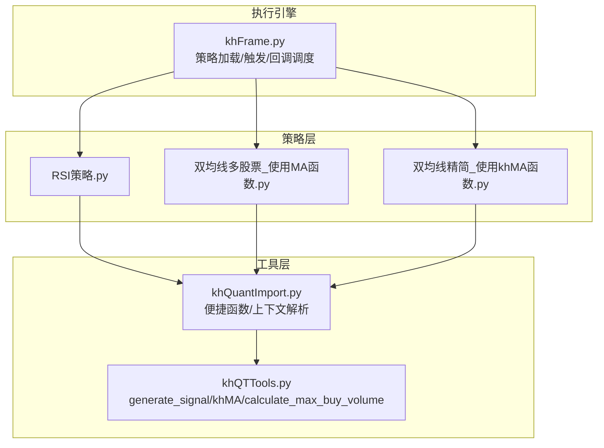
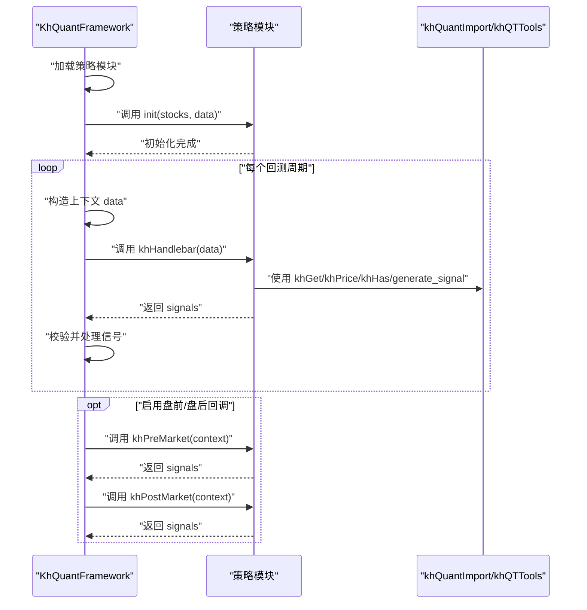
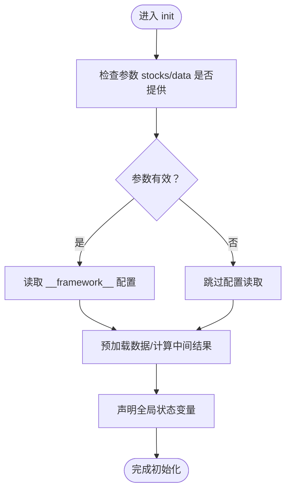
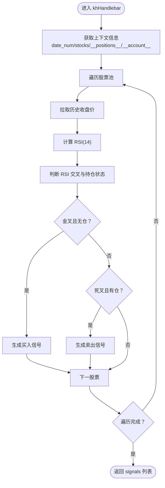
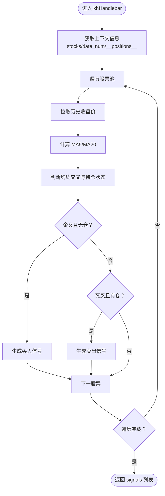
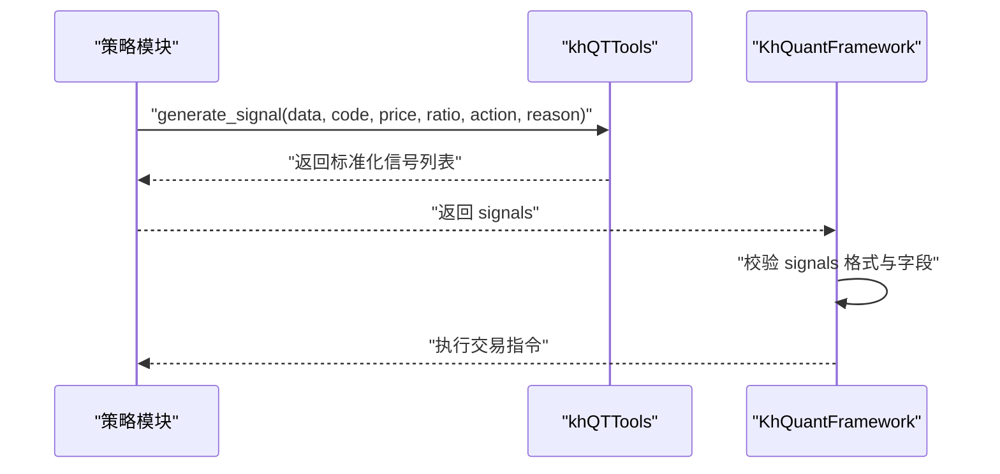
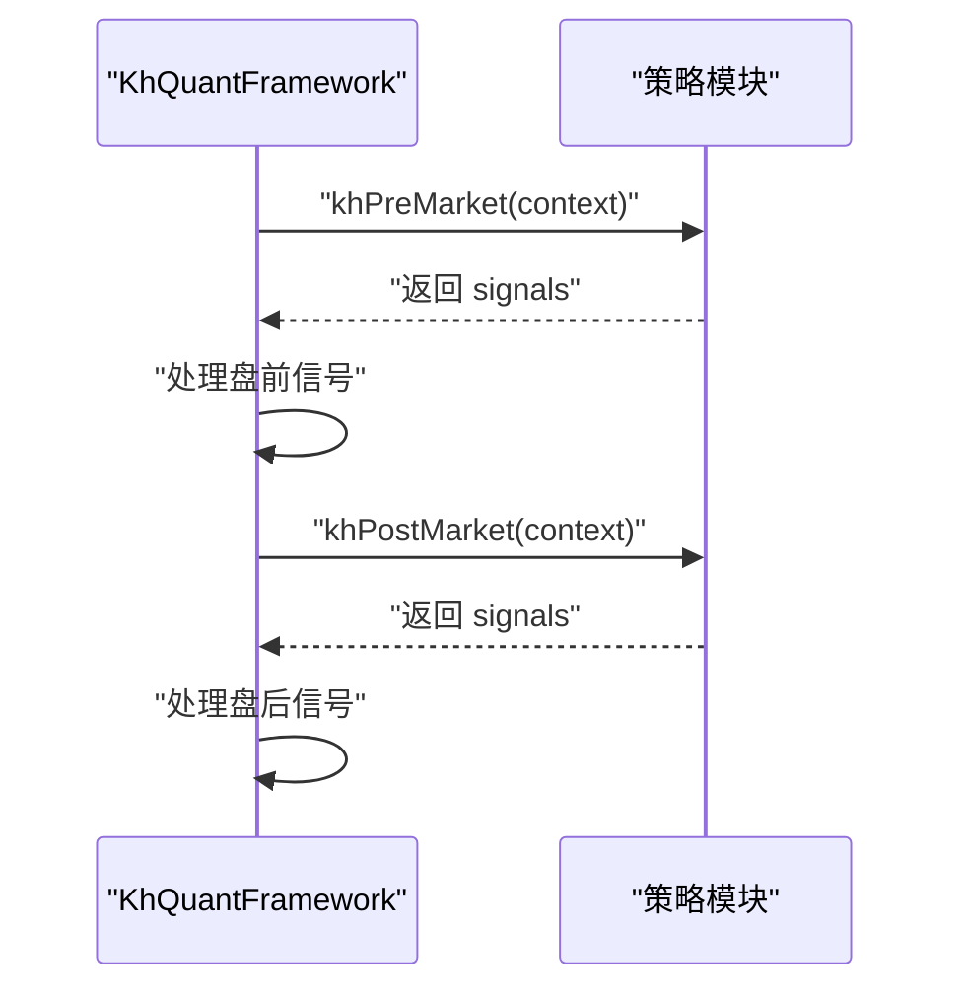
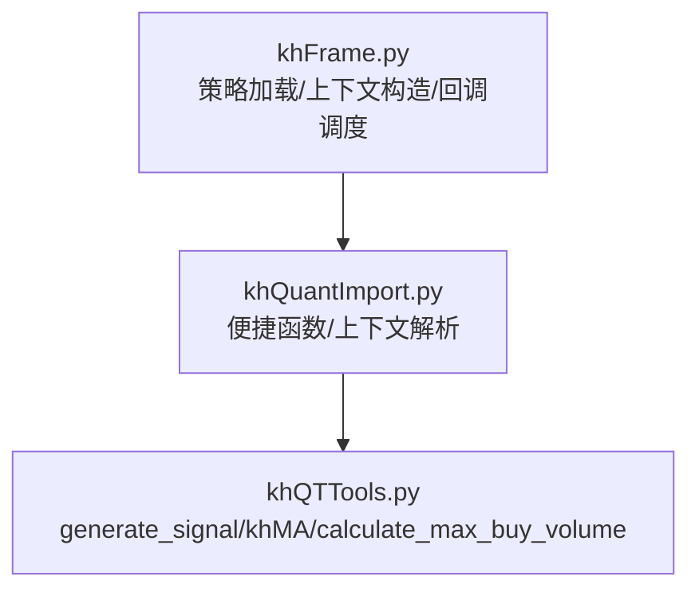

# 核心回调函数

<cite>
**本文引用的文件**
- [khQuantImport.py](file://khQuantImport.py)
- [khQTTools.py](file://khQTTools.py)
- [khFrame.py](file://khFrame.py)
- [RSI策略.py](file://strategies/RSI策略.py)
- [双均线多股票_使用MA函数.py](file://strategies/双均线多股票_使用MA函数.py)
- [双均线精简_使用khMA函数.py](file://strategies/双均线精简_使用khMA函数.py)
- [README.md](file://README.md)
</cite>

## 目录
1. [简介](#简介)
2. [项目结构](#项目结构)
3. [核心组件](#核心组件)
4. [架构总览](#架构总览)
5. [详细组件分析](#详细组件分析)
6. [依赖关系分析](#依赖关系分析)
7. [性能考量](#性能考量)
8. [故障排查指南](#故障排查指南)
9. [结论](#结论)

## 简介
本章节聚焦于策略文件中必须实现的核心回调函数，系统讲解以下三类回调：
- init(stocks=None, data=None)：策略初始化，负责参数配置、状态变量声明、预加载数据等。
- khHandlebar(data: Dict) -> List[Dict]：策略主逻辑入口，每个回测周期（日线、分钟线等）被调用，返回交易信号列表。
- khPreMarket(context: Dict) / khPostMarket(context: Dict)：可选的盘前/盘后处理回调，分别在每个交易日的指定时间点执行。

通过对 RSI 策略与双均线策略示例的逐行解读，阐明 data/context 的结构、关键字段（如 __current_time__、__positions__、__account__、__stock_list__、__framework__）、以及返回值 signals 的格式要求与生成流程。

## 项目结构
围绕“核心回调函数”的主题，与之直接相关的模块与策略文件如下：
- khQuantImport.py：提供统一导入、便捷函数（khGet、khPrice、khHas、generate_signal 等）、上下文解析类（TimeInfo、StockDataParser、PositionParser、StockPoolParser、StrategyContext）。
- khQTTools.py：提供 generate_signal、khMA、calculate_max_buy_volume 等信号生成与交易辅助函数。
- khFrame.py：策略执行引擎，负责加载策略模块、构造上下文、触发 khHandlebar、以及可选的 khPreMarket/khPostMarket 回调。
- 策略示例：RSI策略.py、双均线多股票_使用MA函数.py、双均线精简_使用khMA函数.py，展示了 init 与 khHandlebar 的典型实现。

图表来源
- [khQuantImport.py](file://khQuantImport.py#L377-L572)
- [khQTTools.py](file://khQTTools.py#L635-L740)
- [khFrame.py](file://khFrame.py#L604-L649)

章节来源
- [khQuantImport.py](file://khQuantImport.py#L377-L572)
- [khQTTools.py](file://khQTTools.py#L635-L740)
- [khFrame.py](file://khFrame.py#L604-L649)

## 核心组件
- init(stocks=None, data=None)
  - 作用：在回测开始前进行策略初始化，声明参数、状态变量、预加载数据等。
  - 调用时机：策略模块加载后，回测开始前。
  - 参数含义：stocks 为股票池列表；data 为初始化上下文，包含 __current_time__、__account__、__positions__、__stock_list__、__framework__ 等。
  - 示例参考：RSI策略.py、双均线多股票_使用MA函数.py、双均线精简_使用khMA函数.py 中的 init 函数均为空实现或最小化实现，体现“无需特殊初始化”的策略风格。

- khHandlebar(data: Dict) -> List[Dict]
  - 作用：策略主逻辑入口，每个回测周期被调用，返回交易信号列表。
  - 输入 data 结构要点：
    - __current_time__：包含 timestamp、datetime、date、time 等字段。
    - __account__：包含 cash、market_value、total_asset 等账户资产信息。
    - __positions__：以股票代码为键的持仓字典。
    - __stock_list__：股票池列表。
    - __framework__：框架实例，提供配置、工具等能力。
    - [股票代码]：以股票代码为键的行情数据（pandas Series）。
  - 返回值 signals：交易信号列表，每条信号字典包含 code、action、price、volume 等必需字段，以及可选 reason、timestamp。
  - 示例参考：RSI策略.py、双均线多股票_使用MA函数.py、双均线精简_使用khMA函数.py 的 khHandlebar 均演示了遍历股票池、获取历史数据、计算指标、判断买卖条件、生成信号的完整流程。

- khPreMarket(context: Dict) / khPostMarket(context: Dict)
  - 作用：可选回调，分别在每个交易日的盘前/盘后指定时间点执行。
  - 调用时机：由框架在交易日的预设时间点触发；需在界面勾选“触发盘前/盘后回调”才生效。
  - 参数 context：与 khHandlebar 的 context 结构一致，包含账户、持仓、股票池及行情数据。
  - 返回值：交易信号列表。
  - 示例参考：README.md 中对 khPreMarket/khPostMarket 的说明与用途描述。

章节来源
- [RSI策略.py](file://strategies/RSI策略.py#L8-L26)
- [双均线多股票_使用MA函数.py](file://strategies/双均线多股票_使用MA函数.py#L9-L36)
- [双均线精简_使用khMA函数.py](file://strategies/双均线精简_使用khMA函数.py#L8-L31)
- [README.md](file://README.md#L1700-L1747)

## 架构总览
下图展示了策略回调在框架中的调用链路与数据流。

图表来源
- [khFrame.py](file://khFrame.py#L604-L649)
- [khFrame.py](file://khFrame.py#L1756-L2052)
- [khQuantImport.py](file://khQuantImport.py#L377-L572)
- [khQTTools.py](file://khQTTools.py#L635-L740)

## 详细组件分析

### init(stocks=None, data=None) 组件分析
- 设计要点
  - 作为策略生命周期的起点，init 负责：
    - 声明与初始化全局参数与状态变量。
    - 预加载必要的历史数据或中间结果，减少 khHandlebar 中的重复计算。
    - 读取 __framework__ 配置，按需调整策略行为。
  - 在示例策略中，init 多为占位或极简实现，表明策略可在 khHandlebar 中按需获取数据与计算。

- 代码级关系示意

图表来源
- [RSI策略.py](file://strategies/RSI策略.py#L8-L11)
- [双均线多股票_使用MA函数.py](file://strategies/双均线多股票_使用MA函数.py#L9-L12)
- [双均线精简_使用khMA函数.py](file://strategies/双均线精简_使用khMA函数.py#L8-L11)

章节来源
- [RSI策略.py](file://strategies/RSI策略.py#L8-L11)
- [双均线多股票_使用MA函数.py](file://strategies/双均线多股票_使用MA函数.py#L9-L12)
- [双均线精简_使用khMA函数.py](file://strategies/双均线精简_使用khMA函数.py#L8-L11)

### khHandlebar(data: Dict) 组件分析
- 设计要点
  - 每个回测周期被调用，负责：
    - 读取当前时间、账户、持仓、股票池等上下文信息。
    - 遍历股票池，获取历史数据并计算指标。
    - 基于规则判断生成买入/卖出信号。
    - 返回信号列表供框架执行。
  - 返回值 signals 的格式要求：
    - 必须为列表；列表元素为字典，包含 code、action、price、volume 等字段。
    - 可选字段：reason、timestamp。
    - 价格与数量需满足精度与单位要求（如价格按框架精度四舍五入，数量按100的整数倍）。

- RSI 策略示例流程

图表来源
- [RSI策略.py](file://strategies/RSI策略.py#L12-L26)

- 双均线策略示例流程

图表来源
- [双均线多股票_使用MA函数.py](file://strategies/双均线多股票_使用MA函数.py#L14-L36)
- [双均线精简_使用khMA函数.py](file://strategies/双均线精简_使用khMA函数.py#L11-L31)

- 信号生成与校验

图表来源
- [khQTTools.py](file://khQTTools.py#L635-L740)
- [khFrame.py](file://khFrame.py#L1756-L2052)

章节来源
- [RSI策略.py](file://strategies/RSI策略.py#L12-L26)
- [双均线多股票_使用MA函数.py](file://strategies/双均线多股票_使用MA函数.py#L14-L36)
- [双均线精简_使用khMA函数.py](file://strategies/双均线精简_使用khMA函数.py#L11-L31)
- [khQTTools.py](file://khQTTools.py#L635-L740)
- [README.md](file://README.md#L1700-L1747)

### khPreMarket / khPostMarket 组件分析
- 设计要点
  - khPreMarket：在每个交易日的盘前时间点（如 09:00）被调用一次，用于每日选股、因子计算、状态重置、预埋单设置等。
  - khPostMarket：在每个交易日的盘后时间点（如 15:30）被调用一次，用于当日复盘、统计、数据保存、清理等。
  - 两者均返回交易信号列表，结构与 khHandlebar 一致。

- 调用时机与上下文
  - 由框架在交易日的预设时间点触发；需在界面勾选“触发盘前/盘后回调”才生效。
  - context 结构与 khHandlebar 完全相同，包含 __current_time__、__account__、__positions__、__stock_list__、__framework__ 以及各股票的行情数据。

- 代码级关系示意

图表来源
- [khFrame.py](file://khFrame.py#L1756-L2052)
- [README.md](file://README.md#L1727-L1747)

章节来源
- [khFrame.py](file://khFrame.py#L1756-L2052)
- [README.md](file://README.md#L1727-L1747)

## 依赖关系分析
- khQuantImport.py 提供：
  - khGet：统一获取时间、账户、股票池、持仓等上下文信息。
  - khPrice：获取指定股票的指定字段价格，兼容 tick/K 线数据。
  - khHas：检查是否持有某股票。
  - generate_signal：生成标准化交易信号。
  - 上下文解析类：TimeInfo、StockDataParser、PositionParser、StockPoolParser、StrategyContext。
- khQTTools.py 提供：
  - generate_signal：信号生成与校验（字段完整性、价格精度、数量单位等）。
  - khMA：封装历史数据获取与均线计算。
  - calculate_max_buy_volume：根据账户资金与交易成本估算最大可买数量。
- khFrame.py 负责：
  - 动态加载策略模块。
  - 构造 data/context 上下文字典（包含 __current_time__、__account__、__positions__、__stock_list__、__framework__）。
  - 触发 khHandlebar、khPreMarket、khPostMarket 回调。
  - 校验并执行信号。

图表来源
- [khQuantImport.py](file://khQuantImport.py#L377-L572)
- [khQTTools.py](file://khQTTools.py#L635-L740)
- [khFrame.py](file://khFrame.py#L604-L649)

章节来源
- [khQuantImport.py](file://khQuantImport.py#L377-L572)
- [khQTTools.py](file://khQTTools.py#L635-L740)
- [khFrame.py](file://khFrame.py#L604-L649)

## 性能考量
- 数据获取与缓存
  - 在 init 中预加载常用数据，减少 khHandlebar 中重复请求。
  - 使用 khHistory 获取历史数据时，合理设置 bar_count 与 fre_step，避免过度请求。
- 指标计算
  - 使用向量化计算（如 numpy/pandas）替代循环，提升性能。
  - 避免重复计算相同指标，利用缓存或全局变量。
- 信号生成
  - 合理设置 ratio 与 price，避免频繁微小调整导致的多次交易。
  - 使用 calculate_max_buy_volume 评估资金约束，减少无效下单。
- 触发器与周期
  - 根据策略需求选择合适的触发器（tick/1m/5m/1d/custom），平衡回测速度与信号质量。

## 故障排查指南
- 信号格式错误
  - 现象：框架拒绝执行信号或报错。
  - 排查：确认 signals 列表中每条信号包含 code、action、price、volume；action 为 'buy'/'sell'；price>0；volume>0 且为100的整数倍；可选字段 reason、timestamp 合法。
  - 参考：README.md 中对交易信号字典字段的说明。
- 价格精度与数量单位
  - 现象：下单失败或成交数量异常。
  - 排查：使用 generate_signal 生成信号，框架会按精度四舍五入；确保 volume 为100的整数倍。
  - 参考：khQTTools.py 中 generate_signal 的字段校验与处理。
- 持仓状态判断
  - 现象：重复下单或未按预期止盈止损。
  - 排查：使用 khHas 判断是否持有；核对 __positions__ 中的 volume/can_use_volume 等字段。
  - 参考：khQuantImport.py 中 PositionParser.has/get_volume 的实现。
- 盘前/盘后回调未触发
  - 现象：khPreMarket/khPostMarket 未被执行。
  - 排查：确认界面勾选“触发盘前/盘后回调”，并设置正确的触发时间。
  - 参考：khFrame.py 中对 khPreMarket/khPostMarket 的启用与调用逻辑。

章节来源
- [README.md](file://README.md#L1700-L1747)
- [khQTTools.py](file://khQTTools.py#L635-L740)
- [khQuantImport.py](file://khQuantImport.py#L290-L315)
- [khFrame.py](file://khFrame.py#L1756-L2052)

## 结论
- init 与 khHandlebar 是策略开发的两大基石：前者负责“准备”，后者负责“执行”。二者配合 khQuantImport/khQTTools 提供的便捷函数，可快速构建稳健的策略逻辑。
- khPreMarket/khPostMarket 为策略提供了每日“预热/收尾”的扩展点，适合做因子预计算、状态重置、复盘统计等工作。
- 在实践中，建议遵循“init 中预加载、khHandlebar 中轻量计算、信号生成规范化”的原则，结合性能优化与严格的质量控制，提升策略稳定性与回测效率。