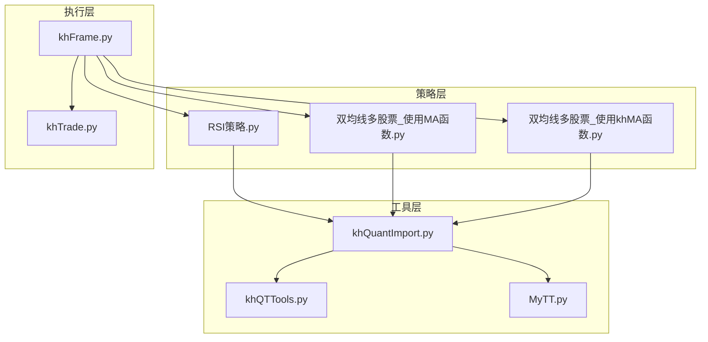
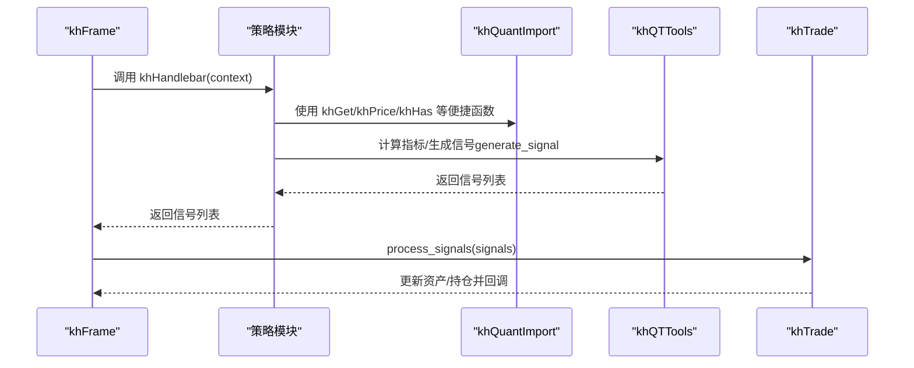
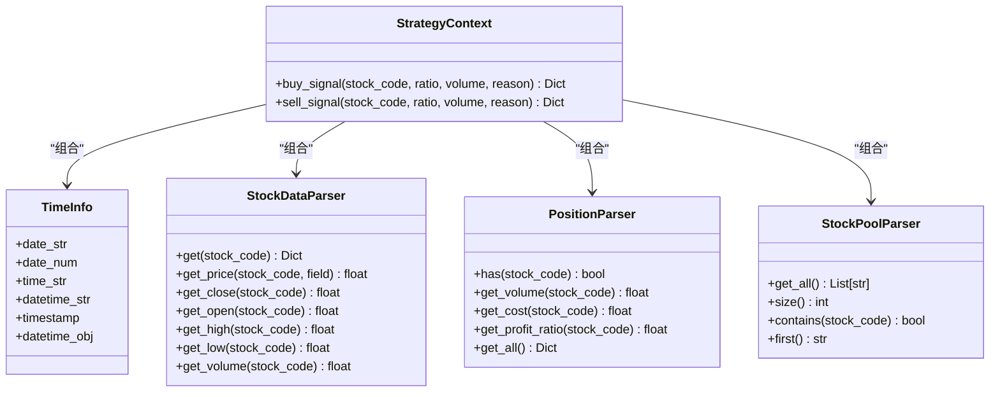
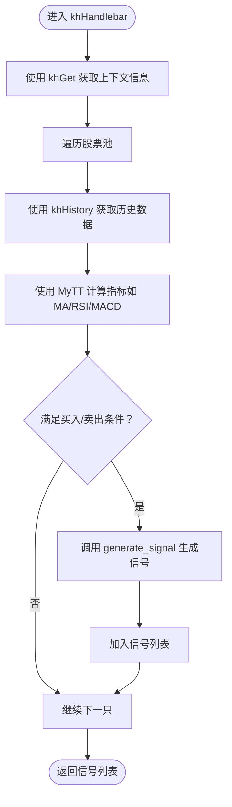
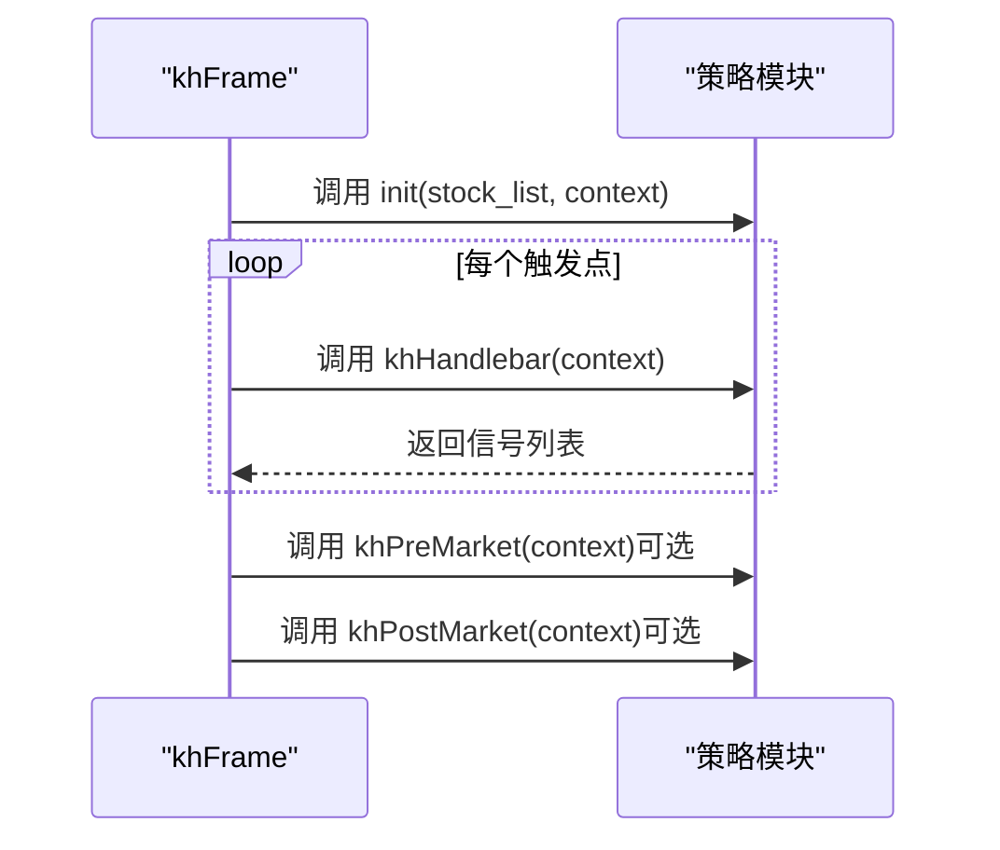
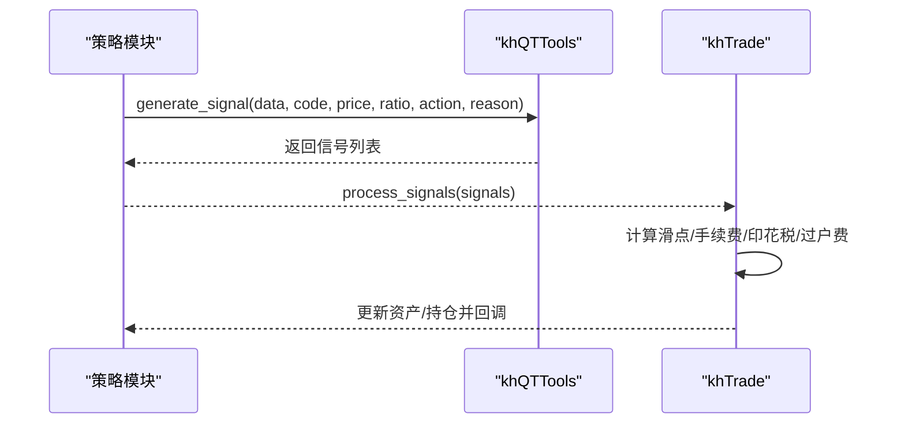
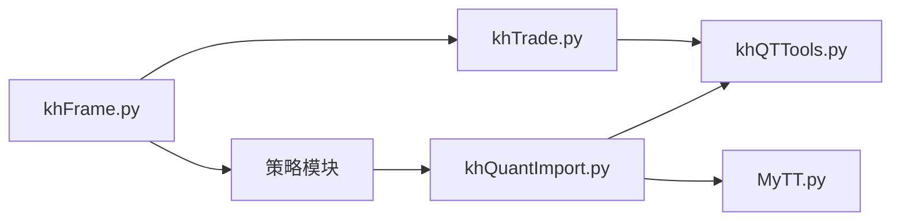

# 策略代码编写

<cite>
**本文引用的文件**
- [khQuantImport.py](file://khQuantImport.py)
- [khQuantImport.md](file://modules/khQuantImport.md)
- [MyTT.py](file://MyTT.py)
- [khQTTools.py](file://khQTTools.py)
- [khTrade.py](file://khTrade.py)
- [khFrame.py](file://khFrame.py)
- [RSI策略.py](file://strategies/RSI策略.py)
- [RSI策略.kh](file://strategies/RSI策略.kh)
- [双均线多股票_使用MA函数.py](file://strategies/双均线多股票_使用MA函数.py)
- [双均线多股票_使用khMA函数.py](file://strategies/双均线多股票_使用khMA函数.py)
- [README.md](file://README.md)
</cite>

## 目录
1. [简介](#简介)
2. [项目结构](#项目结构)
3. [核心组件](#核心组件)
4. [架构总览](#架构总览)
5. [详细组件分析](#详细组件分析)
6. [依赖关系分析](#依赖关系分析)
7. [性能考量](#性能考量)
8. [故障排查指南](#故障排查指南)
9. [结论](#结论)
10. [附录](#附录)

## 简介
本指南面向希望在本量化平台编写策略的开发者，系统讲解如何使用统一导入模块 khQuantImport 提供的便捷函数与工具，构建稳健、可维护的策略代码。文档重点覆盖：
- 必须使用“统一导入”以获取所有工具与指标
- 策略回调函数规范（init、khHandlebar、khPreMarket、khPostMarket）
- 如何使用 MyTT 技术指标（MA、RSI、MACD 等）生成交易信号
- 如何使用 khQuantImport 的便捷函数（khGet、khPrice、khHas、khBuy、khSell）简化数据访问与下单
- 如何调用 generate_signal 等底层交易函数实现下单
- 从零开始创建新策略的完整流程与调试技巧
- 结合 khQuantImport.md 的最佳实践（错误处理、日志记录、性能优化）

## 项目结构
策略开发围绕以下模块协作：
- khQuantImport：统一导入与便捷函数入口，导出 khQTTools、MyTT、xtquant 等工具
- khQTTools：提供 generate_signal、calculate_max_buy_volume、khMA、khHistory 等核心交易与数据函数
- MyTT：技术指标库（MA、RSI、MACD、KDJ 等）
- khTrade：交易成本与下单执行（回测/实盘）
- khFrame：策略调度与回调（khHandlebar、khPreMarket、khPostMarket）
- strategies：示例策略（RSI、双均线）

图表来源
- [khQuantImport.py](file://khQuantImport.py#L1-L120)
- [khQTTools.py](file://khQTTools.py#L634-L738)
- [MyTT.py](file://MyTT.py#L1-L120)
- [khFrame.py](file://khFrame.py#L1985-L2052)
- [khTrade.py](file://khTrade.py#L198-L260)
- [RSI策略.py](file://strategies/RSI策略.py#L1-L26)
- [双均线多股票_使用MA函数.py](file://strategies/双均线多股票_使用MA函数.py#L1-L36)
- [双均线多股票_使用khMA函数.py](file://strategies/双均线多股票_使用khMA函数.py#L1-L33)

章节来源
- [khQuantImport.py](file://khQuantImport.py#L1-L120)
- [khFrame.py](file://khFrame.py#L1985-L2052)

## 核心组件
- 统一导入模块 khQuantImport
  - 提供 from khQuantImport import * 一键导入策略所需工具与指标
  - 暴露 khGet、khPrice、khHas、khBuy、khSell、generate_signal、khMA、MA、RSI、MACD 等
  - 内置 TimeInfo、StockDataParser、PositionParser、StockPoolParser、StrategyContext 等解析器
- 技术指标库 MyTT
  - 提供 MA、RSI、MACD、KDJ 等常用指标函数
- 交易工具 khQTTools
  - generate_signal：统一生成买入/卖出信号，自动计算可买/可卖数量
  - calculate_max_buy_volume：计算最大可买股数
  - khHistory：历史数据获取
  - khMA：封装行情获取与均线计算
- 交易执行 khTrade
  - 计算滑点、佣金、印花税、过户费、流量费
  - 处理信号并更新资产/持仓
- 策略调度 khFrame
  - 触发 khHandlebar、khPreMarket、khPostMarket
  - 统一处理信号与交易执行

章节来源
- [khQuantImport.py](file://khQuantImport.py#L540-L572)
- [khQuantImport.md](file://modules/khQuantImport.md#L340-L570)
- [MyTT.py](file://MyTT.py#L87-L240)
- [khQTTools.py](file://khQTTools.py#L634-L738)
- [khTrade.py](file://khTrade.py#L198-L260)
- [khFrame.py](file://khFrame.py#L1985-L2052)

## 架构总览
策略执行的关键流程：
- khFrame 在每个触发点调用策略模块的回调函数（khHandlebar、khPreMarket、khPostMarket）
- 策略通过 khQuantImport 的便捷函数访问数据、生成信号
- khQTTools 的 generate_signal 将信号规范化并计算可买/可卖数量
- khTrade 根据交易成本模型执行下单并更新资产与持仓

图表来源
- [khFrame.py](file://khFrame.py#L1985-L2052)
- [khQTTools.py](file://khQTTools.py#L634-L738)
- [khTrade.py](file://khTrade.py#L198-L260)

章节来源
- [khFrame.py](file://khFrame.py#L1985-L2052)
- [khTrade.py](file://khTrade.py#L198-L260)

## 详细组件分析

### 统一导入与便捷函数
- 必须使用 from khQuantImport import * 获取所有工具与指标
- khGet：统一获取时间、账户、持仓、股票池等信息
- khPrice：统一获取价格，兼容 tick/K 线字段映射
- khHas：检查是否持有某股票
- khBuy/khSell：生成买入/卖出信号（内部调用 generate_signal）
- StrategyContext：整合 TimeInfo、StockDataParser、PositionParser、StockPoolParser，提供 buy_signal/sell_signal

图表来源
- [khQuantImport.py](file://khQuantImport.py#L133-L375)

章节来源
- [khQuantImport.py](file://khQuantImport.py#L133-L375)
- [khQuantImport.md](file://modules/khQuantImport.md#L340-L570)

### 技术指标与信号生成
- 使用 MyTT 的 MA、RSI、MACD、KDJ 等指标
- khQTTools 的 generate_signal 自动处理：
  - 买入：按资金比例或固定股数（必须是100的倍数）
  - 卖出：按可用持仓比例（向下取整到100的倍数）
  - 价格精度与时间戳填充
- khQTTools 的 calculate_max_buy_volume 基于交易成本估算最大可买股数

图表来源
- [RSI策略.py](file://strategies/RSI策略.py#L12-L26)
- [双均线多股票_使用MA函数.py](file://strategies/双均线多股票_使用MA函数.py#L14-L33)
- [khQTTools.py](file://khQTTools.py#L634-L738)
- [MyTT.py](file://MyTT.py#L87-L240)

章节来源
- [RSI策略.py](file://strategies/RSI策略.py#L12-L26)
- [双均线多股票_使用MA函数.py](file://strategies/双均线多股票_使用MA函数.py#L14-L33)
- [khQTTools.py](file://khQTTools.py#L634-L738)
- [MyTT.py](file://MyTT.py#L87-L240)

### 回调函数与控制流
- init(stock_list, context)：策略初始化，可预加载数据或设置全局参数
- khHandlebar(context)：主策略逻辑入口，返回信号列表
- khPreMarket(context)：盘前处理（可选）
- khPostMarket(context)：盘后处理（可选）

图表来源
- [README.md](file://README.md#L1677-L1735)
- [khFrame.py](file://khFrame.py#L1985-L2052)

章节来源
- [README.md](file://README.md#L1677-L1735)
- [khFrame.py](file://khFrame.py#L1985-L2052)

### 交易执行与下单
- generate_signal 会根据 ratio 与账户/持仓信息计算可买/可卖数量，并填充价格精度与时间戳
- khTrade 根据交易成本配置（佣金、印花税、过户费、滑点）计算实际成交价格与总成本
- khFrame 将信号交给 khTrade 执行并触发回调

图表来源
- [khQTTools.py](file://khQTTools.py#L634-L738)
- [khTrade.py](file://khTrade.py#L198-L260)

章节来源
- [khQTTools.py](file://khQTTools.py#L634-L738)
- [khTrade.py](file://khTrade.py#L198-L260)

## 依赖关系分析
- khQuantImport 作为统一入口，聚合 khQTTools 与 MyTT，并导出便捷函数
- 策略模块依赖 khQuantImport 提供的便捷函数与指标
- khFrame 依赖策略模块的回调函数，并将信号交给 khTrade 执行
- khTrade 依赖交易成本配置与 khQTTools 的辅助函数

图表来源
- [khQuantImport.py](file://khQuantImport.py#L1-L120)
- [khFrame.py](file://khFrame.py#L1985-L2052)
- [khTrade.py](file://khTrade.py#L198-L260)

章节来源
- [khQuantImport.py](file://khQuantImport.py#L1-L120)
- [khFrame.py](file://khFrame.py#L1985-L2052)

## 性能考量
- 使用 khQuantImport.md 中的缓存与预计算建议，避免重复计算指标
- 在 init 中预加载股票池与必要数据，减少 khHandlebar 中的 IO 与计算
- 合理使用 logging 级别，避免在高频触发中输出过多 DEBUG 信息
- 使用 khGet/khPrice/khHas 等便捷函数，减少重复解析与类型转换

章节来源
- [khQuantImport.md](file://modules/khQuantImport.md#L728-L800)

## 故障排查指南
- 信号为空
  - 检查 khHas 是否正确识别持仓
  - 检查 khPrice 是否返回有效价格（tick/K 线字段映射）
  - 检查 generate_signal 的 ratio 与账户资金/可用持仓是否足够
- 交易未成交
  - 检查交易成本配置（佣金、印花税、过户费、滑点）
  - 检查是否满足最小交易单位（100 的倍数）
- 日志定位
  - 使用 INFO/DEBUG/WARNING 级别区分关键信息与调试信息
  - 在 khPreMarket/khPostMarket 中输出每日统计与风控检查

章节来源
- [khQuantImport.md](file://modules/khQuantImport.md#L728-L800)
- [khTrade.py](file://khTrade.py#L198-L260)

## 结论
通过统一导入与便捷函数，策略开发可以快速、稳定地使用技术指标与交易工具。遵循回调函数规范、合理使用 generate_signal、结合交易成本模型与日志/性能优化实践，能够显著提升策略质量与可维护性。

## 附录

### 从零开始创建新策略的完整步骤
- 文件命名与位置
  - 将策略文件放置在 strategies/ 目录下，命名建议采用“中文描述_策略.py”
  - 示例：RSI策略.py、双均线多股票_使用MA函数.py、双均线多股票_使用khMA函数.py
- 代码结构
  - 必须使用 from khQuantImport import *
  - 实现 init(stock_list, context)、khHandlebar(context)、khPreMarket(context)、khPostMarket(context)
  - 在 khHandlebar 中：
    - 使用 khGet 获取时间、账户、股票池
    - 使用 khPrice 获取价格，使用 khHas 检查持仓
    - 使用 MyTT 指标（如 MA、RSI、MACD）生成交易信号
    - 使用 generate_signal 生成标准信号
  - 返回信号列表
- 调试技巧
  - 在 init 中打印初始化时间与股票池
  - 在 khHandlebar 中输出关键指标与决策依据
  - 在 khPreMarket/khPostMarket 中输出每日统计
  - 使用 khQuantImport.md 的最佳实践进行错误处理与性能优化

章节来源
- [RSI策略.py](file://strategies/RSI策略.py#L1-L26)
- [双均线多股票_使用MA函数.py](file://strategies/双均线多股票_使用MA函数.py#L1-L36)
- [双均线多股票_使用khMA函数.py](file://strategies/双均线多股票_使用khMA函数.py#L1-L33)
- [khQuantImport.md](file://modules/khQuantImport.md#L575-L649)

### 示例策略参考
- RSI 策略（使用 khHistory + MyTT.RSI）
  - 逐日遍历股票池，拉取历史收盘价，计算 RSI(14)，根据超买/超卖条件生成信号
  - 参考路径：strategies/RSI策略.py
- 双均线策略（使用 MyTT.MA）
  - 拉取历史收盘价，计算 MA5 与 MA20，金叉/死叉生成信号
  - 参考路径：strategies/双均线多股票_使用MA函数.py
- 双均线策略（使用 khQTTools.khMA）
  - khMA 内置行情获取与均线计算，策略更简洁
  - 参考路径：strategies/双均线多股票_使用khMA函数.py

章节来源
- [RSI策略.py](file://strategies/RSI策略.py#L1-L26)
- [双均线多股票_使用MA函数.py](file://strategies/双均线多股票_使用MA函数.py#L1-L36)
- [双均线多股票_使用khMA函数.py](file://strategies/双均线多股票_使用khMA函数.py#L1-L33)

### 策略配置参考
- 示例配置文件展示了回测参数、交易成本、触发方式等
- 参考路径：strategies/RSI策略.kh

章节来源
- [RSI策略.kh](file://strategies/RSI策略.kh#L1-L71)