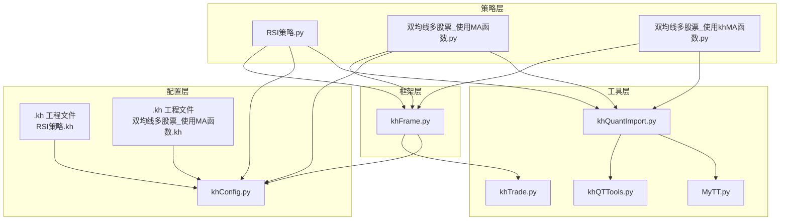
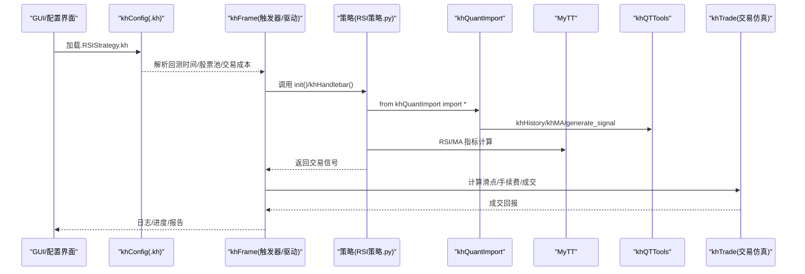
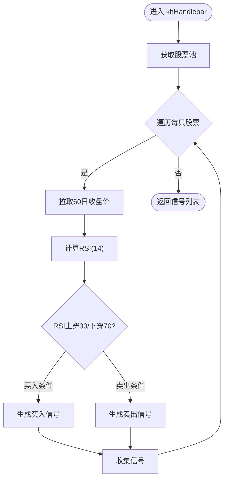
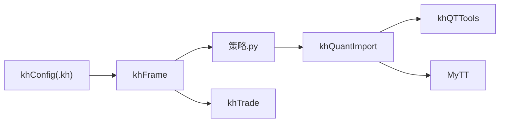

# 策略开发指南

<cite>
**本文引用的文件**
- [README.md](file://README.md)
- [khQuantImport.py](file://khQuantImport.py)
- [MyTT.py](file://MyTT.py)
- [khConfig.py](file://khConfig.py)
- [khFrame.py](file://khFrame.py)
- [khTrade.py](file://khTrade.py)
- [khQTTools.py](file://khQTTools.py)
- [strategies/RSI策略.kh](file://strategies/RSI策略.kh)
- [strategies/RSI策略.py](file://strategies/RSI策略.py)
- [strategies/双均线多股票_使用MA函数.kh](file://strategies/双均线多股票_使用MA函数.kh)
- [strategies/双均线多股票_使用MA函数.py](file://strategies/双均线多股票_使用MA函数.py)
- [strategies/双均线多股票_使用khMA函数.py](file://strategies/双均线多股票_使用khMA函数.py)
</cite>

## 目录
1. [简介](#简介)
2. [项目结构](#项目结构)
3. [核心组件](#核心组件)
4. [架构总览](#架构总览)
5. [详细组件分析](#详细组件分析)
6. [依赖关系分析](#依赖关系分析)
7. [性能与回测注意事项](#性能与回测注意事项)
8. [故障排查指南](#故障排查指南)
9. [结论](#结论)
10. [附录：从零开始创建新策略](#附录从零开始创建新策略)

## 简介
本指南面向希望在 KHQuant 平台上编写与管理量化交易策略的用户。内容涵盖：
- .kh 工程配置文件（JSON 格式）的作用与字段含义，强调“策略逻辑与配置分离”的设计；
- 策略文件（.py）的编写规范，统一导入与回调函数约定；
- 使用 MyTT 技术指标库生成交易信号；
- 在策略中调用交易函数（如生成信号）的方法；
- 从零开始创建新策略的完整流程与调试技巧；
- 策略文件管理的最佳实践（避免保存在软件安装目录，使用用户策略目录）。

## 项目结构
KHQuant 的策略开发围绕以下关键模块展开：
- khQuantImport.py：统一导入与便捷函数，提供策略开发一站式 API；
- MyTT.py：技术指标库（MA、RSI、MACD 等）；
- khQTTools.py：行情获取、信号生成、价格精度与 T+0 支持等工具；
- khConfig.py：.kh 工程配置文件的解析与保存；
- khFrame.py：触发器、交易回调、回测驱动；
- khTrade.py：交易成本、滑点、手续费等交易仿真；
- strategies/：示例策略（RSI、双均线等），配套 .kh 工程文件。

图表来源
- [khQuantImport.py](file://khQuantImport.py#L1-L120)
- [MyTT.py](file://MyTT.py#L1-L120)
- [khQTTools.py](file://khQTTools.py#L1-L120)
- [khConfig.py](file://khConfig.py#L1-L105)
- [khFrame.py](file://khFrame.py#L1-L200)
- [khTrade.py](file://khTrade.py#L1-L120)
- [strategies/RSI策略.kh](file://strategies/RSI策略.kh#L1-L71)
- [strategies/双均线多股票_使用MA函数.kh](file://strategies/双均线多股票_使用MA函数.kh#L1-L71)

章节来源
- [README.md](file://README.md#L440-L626)

## 核心组件
- khQuantImport：提供 from khQuantImport import * 的统一入口，自动导入 xtquant、khQTTools、MyTT、便捷函数与解析器类，简化策略开发。
- MyTT：提供 MA、RSI、MACD 等指标函数，支持日线字段依赖。
- khQTTools：提供 khHistory、khMA、generate_signal、calculate_max_buy_volume 等工具，支持信号生成与历史数据拉取。
- khConfig：解析 .kh 工程文件，读取回测时间、股票池、交易成本、风控等配置。
- khFrame：触发器（Tick/K线/自定义定时）、交易回调、回测驱动。
- khTrade：交易成本（佣金、印花税、过户费、流量费）、滑点模型。

章节来源
- [khQuantImport.py](file://khQuantImport.py#L1-L120)
- [MyTT.py](file://MyTT.py#L1-L120)
- [khQTTools.py](file://khQTTools.py#L1-L120)
- [khConfig.py](file://khConfig.py#L1-L105)
- [khFrame.py](file://khFrame.py#L1-L200)
- [khTrade.py](file://khTrade.py#L1-L120)

## 架构总览
策略执行流程（以 RSI 策略为例）：

图表来源
- [strategies/RSI策略.kh](file://strategies/RSI策略.kh#L1-L71)
- [strategies/RSI策略.py](file://strategies/RSI策略.py#L1-L26)
- [khConfig.py](file://khConfig.py#L1-L105)
- [khFrame.py](file://khFrame.py#L1-L200)
- [khQuantImport.py](file://khQuantImport.py#L1-L120)
- [MyTT.py](file://MyTT.py#L1-L120)
- [khQTTools.py](file://khQTTools.py#L1-L120)
- [khTrade.py](file://khTrade.py#L1-L120)

## 详细组件分析

### .kh 工程配置文件（JSON）解析与策略分离设计
- 作用：保存策略文件路径、回测时间、股票池、交易成本、触发方式、风控等所有设置，本质是可读的 JSON 文本。
- 关键字段（示例来自 RSI 策略.kh）：
  - system.userdata_path：MiniQMT 用户数据路径
  - run_mode：运行模式（回测）
  - account.account_id/account_type：账户标识与类型
  - strategy_file：策略文件绝对路径
  - backtest.start_time/end_time/init_capital/min_volume/benchmark/trade_cost/trigger
  - data.kline_period/dividend_type/fields/stock_list
  - market_callback.pre/post_market
  - risk.position_limit/order_limit/loss_limit
- 设计要点：将“策略逻辑”与“工程配置”分离，.kh 仅承载参数，策略文件专注于业务逻辑，便于迁移与复用。

章节来源
- [strategies/RSI策略.kh](file://strategies/RSI策略.kh#L1-L71)
- [strategies/双均线多股票_使用MA函数.kh](file://strategies/双均线多股票_使用MA函数.kh#L1-L71)
- [README.md](file://README.md#L440-L626)

### khQuantImport 统一导入与便捷函数
- 统一导入：from khQuantImport import *，自动暴露 xtquant、khQTTools、MyTT、便捷函数与解析器类。
- 便捷函数：
  - khGet(data, key)：统一获取日期、时间、资金、账户、持仓、股票池等；
  - khPrice(data, stock_code, field)：统一获取价格，兼容 tick/K 线字段；
  - khHas(data, stock_code)：检查是否持仓；
  - generate_signal(...)：生成交易信号（内部由 khQTTools 提供）。
- 解析器类：
  - TimeInfo：标准化时间访问；
  - StockDataParser：统一价格字段访问；
  - PositionParser：统一持仓访问；
  - StockPoolParser：统一股票池访问；
  - StrategyContext：整合上述能力，提供 buy_signal/sell_signal。

章节来源
- [khQuantImport.py](file://khQuantImport.py#L1-L120)
- [khQuantImport.py](file://khQuantImport.py#L340-L572)

### MyTT 技术指标库（MA、RSI、MACD 等）
- 提供 MA、RSI、MACD、KDJ、BOLL、CCI、ATR 等指标函数；
- 指标函数直接接收日线字段序列（如 CLOSE/HIGH/LOW/VOL），返回数组；
- 在策略中通过 khQuantImport 导入后直接使用。

章节来源
- [MyTT.py](file://MyTT.py#L1-L120)
- [MyTT.py](file://MyTT.py#L190-L240)

### khQTTools：历史数据与信号生成
- khHistory：按股票列表、字段、周期、长度、复权方式拉取历史数据；
- khMA：封装了行情获取与均线计算，策略中可直接使用；
- generate_signal：生成买入/卖出信号字典，供框架处理成交与成本；
- calculate_max_buy_volume：根据资金与价格计算可买数量。

章节来源
- [khQTTools.py](file://khQTTools.py#L1-L120)
- [khQuantImport.py](file://khQuantImport.py#L1-L120)

### khFrame：触发器与交易回调
- 触发器类型：
  - TickTrigger：每个 Tick 触发；
  - KLineTrigger：K 线形成时触发（1m/5m/1d）；
  - CustomTimeTrigger：自定义时间点触发；
- 交易回调：MyTraderCallback 接收委托与成交回报，格式化输出日志。

章节来源
- [khFrame.py](file://khFrame.py#L1-L200)
- [khFrame.py](file://khFrame.py#L200-L400)

### khTrade：交易成本与滑点
- 交易成本：最低佣金、佣金比例、印花税、过户费、流量费；
- 滑点：支持 tick 模式（最小变动价×跳数）与 ratio 模式（比例）；
- 价格精度：根据股票/ETF 自动设置小数位。

章节来源
- [khTrade.py](file://khTrade.py#L1-L120)

### 示例策略分析

#### RSI 策略（.py/.kh）
- 策略要点：
  - 遍历股票池，拉取 60 日收盘价；
  - 计算 RSI(14)，判断上穿 30/下穿 70；
  - 使用 khPrice 获取当日开盘价，generate_signal 生成信号；
  - 无持仓时买入，有持仓时卖出。
- 关键路径：
  - 策略文件：strategies/RSI策略.py
  - 工程配置：strategies/RSI策略.kh

图表来源
- [strategies/RSI策略.py](file://strategies/RSI策略.py#L1-L26)

章节来源
- [strategies/RSI策略.py](file://strategies/RSI策略.py#L1-L26)
- [strategies/RSI策略.kh](file://strategies/RSI策略.kh#L1-L71)

#### 双均线策略（MA 与 khMA）
- 使用 MyTT.MA 的版本：
  - 先 khHistory 拉取收盘价，再用 MA 计算均线；
  - 金叉买入、死叉卖出。
- 使用 khMA 的版本：
  - 直接调用 khMA 计算均线，更简洁；
  - 适合多股票批量处理。

章节来源
- [strategies/双均线多股票_使用MA函数.py](file://strategies/双均线多股票_使用MA函数.py#L1-L36)
- [strategies/双均线多股票_使用khMA函数.py](file://strategies/双均线多股票_使用khMA函数.py#L1-L33)

## 依赖关系分析
- khQuantImport 依赖 khQTTools 与 MyTT，统一导出；
- 策略文件依赖 khQuantImport，间接使用 MyTT 与 khQTTools；
- khFrame 依赖 khConfig 与 khTrade，驱动回测与交易仿真；
- .kh 工程文件由 khConfig 解析，贯穿策略生命周期。

图表来源
- [khQuantImport.py](file://khQuantImport.py#L1-L120)
- [MyTT.py](file://MyTT.py#L1-L120)
- [khQTTools.py](file://khQTTools.py#L1-L120)
- [khConfig.py](file://khConfig.py#L1-L105)
- [khFrame.py](file://khFrame.py#L1-L200)
- [khTrade.py](file://khTrade.py#L1-L120)

## 性能与回测注意事项
- 数据周期与字段：根据策略选择合适周期（tick/1m/5m/1d），并仅勾选所需字段，减少 IO；
- 指标计算：尽量使用向量化函数（MyTT），避免在循环内重复拉取历史数据；
- 触发频率：Tick 触发会产生大量调用，建议按需选择 K 线或自定义定时触发；
- 滑点与成本：合理设置滑点与交易成本，避免过度乐观的回测结果；
- 资金分配：使用 generate_signal 的资金比例参数，避免一次性满仓导致回撤放大。

[本节为通用建议，不直接分析具体文件]

## 故障排查指南
- 策略文件路径错误：确认 .kh 中 strategy_file 指向正确路径；
- 股票池为空：检查 data.stock_list 是否正确；
- 价格为 0/NaN：使用 khPrice 与 khHas 做前置检查；
- MiniQMT 未登录：确保 MiniQMT 客户端已登录并提供接口；
- 日志定位：使用系统日志面板过滤 DEBUG/INFO/WARNING/ERROR/TRADE 等级别。

章节来源
- [README.md](file://README.md#L390-L470)

## 结论
- .kh 工程文件承载配置，策略文件专注逻辑，二者分离提升可维护性；
- khQuantImport 提供统一 API，简化导入与开发；
- MyTT 提供丰富的技术指标，配合 khQTTools 的历史数据与信号生成；
- khFrame 与 khTrade 保障回测与交易仿真的一致性；
- 遵循最佳实践（用户策略目录、最小权限、备份）确保策略安全与可迁移。

[本节为总结，不直接分析具体文件]

## 附录：从零开始创建新策略

### 1. 准备工作
- 确认 MiniQMT 已登录并提供接口；
- 在 GUI 中加载或新建 .kh 工程文件，设置回测时间、股票池、交易成本与触发方式；
- 将策略文件保存在“用户策略目录”，避免安装目录。

章节来源
- [README.md](file://README.md#L440-L626)

### 2. 文件命名与结构
- 文件命名：策略名称+.py，如 my_strategy.py；
- 结构建议：
  - init(stocks=None, data=None)：初始化逻辑（可为空）；
  - khHandlebar(data: Dict) -> List[Dict]：主策略逻辑，返回信号列表；
  - 可选：khPreMarket(data)、khPostMarket(data)。

章节来源
- [strategies/RSI策略.py](file://strategies/RSI策略.py#L1-L26)
- [strategies/双均线多股票_使用MA函数.py](file://strategies/双均线多股票_使用MA函数.py#L1-L36)

### 3. 统一导入与指标使用
- 在策略文件顶部添加：from khQuantImport import *；
- 使用 khHistory 拉取历史数据，使用 MA/RSI 等指标；
- 使用 khPrice/khHas/khGet 获取价格与状态；
- 使用 generate_signal 生成信号。

章节来源
- [khQuantImport.py](file://khQuantImport.py#L1-L120)
- [MyTT.py](file://MyTT.py#L1-L120)
- [khQTTools.py](file://khQTTools.py#L1-L120)

### 4. 交易函数与风控
- 使用 generate_signal 的资金比例参数控制仓位；
- 通过 .kh 中 risk 字段设置风控上限；
- khTrade 自动计算滑点与手续费，无需在策略中重复计算。

章节来源
- [khTrade.py](file://khTrade.py#L1-L120)
- [strategies/RSI策略.kh](file://strategies/RSI策略.kh#L1-L71)

### 5. 调试技巧
- 使用 khGet 获取当前时间、资金、股票池，打印日志；
- 对关键变量（价格、指标）做边界检查；
- 逐步缩小范围：先在小股票池验证，再扩大；
- 使用 GUI 日志面板过滤级别，定位问题。

章节来源
- [khQuantImport.py](file://khQuantImport.py#L340-L572)
- [README.md](file://README.md#L440-L626)

### 6. 策略文件管理最佳实践
- 不要保存在软件安装目录；
- 使用用户策略目录（Windows: AppData\Local\KhQuant\strategies\）；
- 配置文件与策略文件均保存在用户目录；
- 定期备份重要策略与 .kh 工程文件。

章节来源
- [README.md](file://README.md#L440-L626)