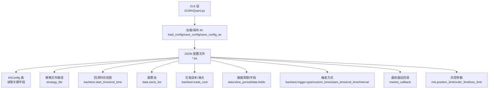
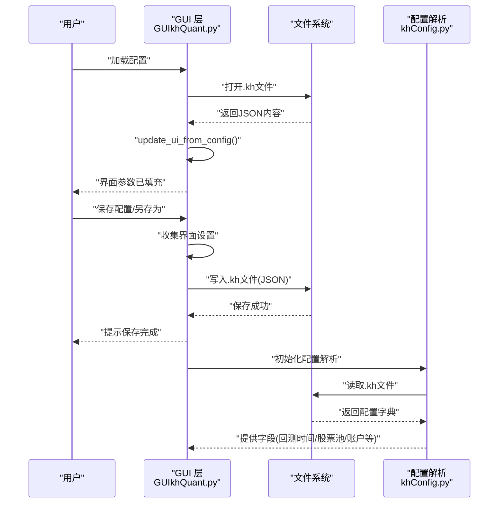
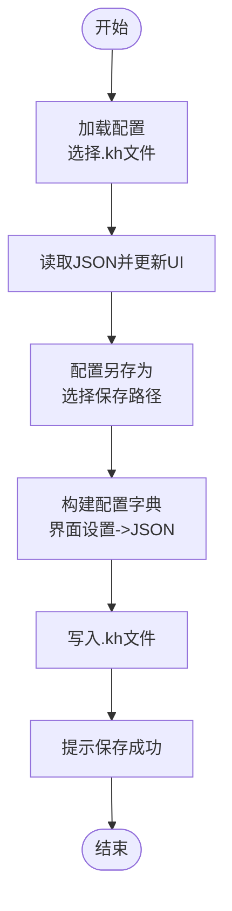
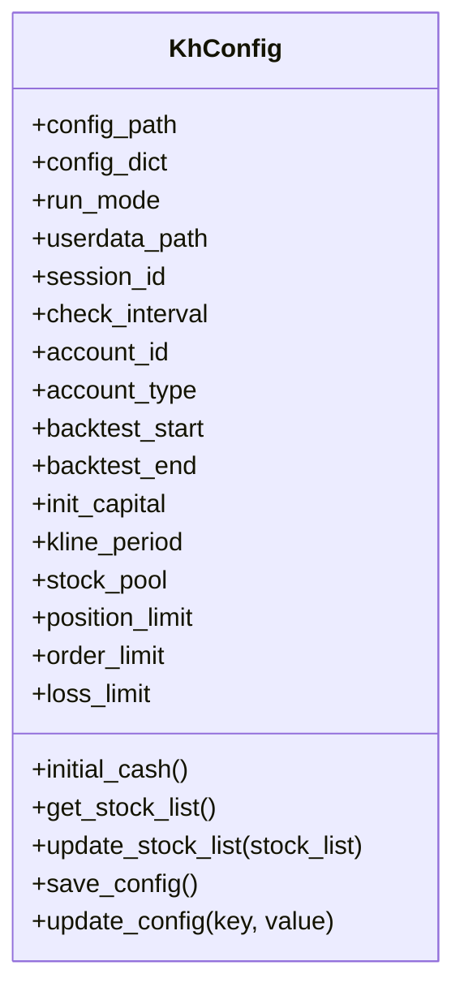
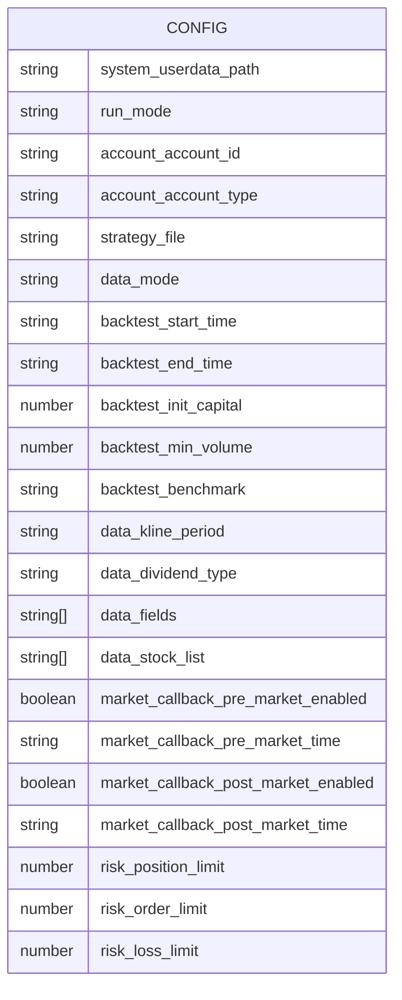
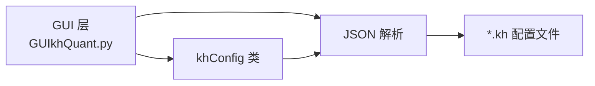

# 配置文件详解

<cite>
**本文引用的文件**
- [README.md](file://README.md)
- [GUIkhQuant.py](file://GUIkhQuant.py)
- [khConfig.py](file://khConfig.py)
- [RSI策略.kh](file://strategies/RSI策略.kh)
- [双均线多股票_使用MA函数.kh](file://strategies/双均线多股票_使用MA函数.kh)
- [双均线多股票_使用khMA函数.kh](file://strategies/双均线多股票_使用khMA函数.kh)
</cite>

## 目录
1. [简介](#简介)
2. [项目结构](#项目结构)
3. [核心组件](#核心组件)
4. [架构总览](#架构总览)
5. [详细组件分析](#详细组件分析)
6. [依赖分析](#依赖分析)
7. [性能考虑](#性能考虑)
8. [故障排除指南](#故障排除指南)
9. [结论](#结论)
10. [附录](#附录)

## 简介
.kh 是“看海量化交易系统”（KHQuant）的工程配置文件，采用 JSON 格式，用于完整保存图形界面中的所有回测设置，包括策略文件路径、回测时间范围、股票池、交易成本、数据周期、触发方式、风控参数等。它将策略逻辑与工程配置解耦，使同一份策略可在不同配置下运行，显著提升灵活性与可复用性。

## 项目结构
本仓库中与.kh配置文件直接相关的核心文件与位置如下：
- GUI 层：负责加载、保存、另存为.kh 文件，并将配置映射到界面控件
- 配置解析：khConfig 类用于从.kh文件读取关键字段（如回测起止时间、股票池、账户等）
- 示例配置：strategies 目录下包含多个.kh示例，展示字段结构与典型用法

**图表来源**
- [GUIkhQuant.py](file://GUIkhQuant.py#L2482-L2681)
- [khConfig.py](file://khConfig.py#L1-L105)
- [RSI策略.kh](file://strategies/RSI策略.kh#L1-L71)

**章节来源**
- [README.md](file://README.md#L486-L491)
- [GUIkhQuant.py](file://GUIkhQuant.py#L2482-L2681)
- [khConfig.py](file://khConfig.py#L1-L105)
- [RSI策略.kh](file://strategies/RSI策略.kh#L1-L71)

## 核心组件
- GUI 层（GUIkhQuant.py）
  - 加载配置：从用户选择的.kh文件读取 JSON，更新界面控件
  - 保存配置：将当前界面设置写回.kh文件，支持覆盖保存与另存为
  - 另存为：弹出保存对话框，确保扩展名为.kh，并写入完整配置
- 配置解析（khConfig.py）
  - 从.kh文件读取 run_mode、system、account、backtest、data、risk 等字段
  - 提供默认值与兼容性处理（如 stock_list 与 stock_pool 的兼容）

**章节来源**
- [GUIkhQuant.py](file://GUIkhQuant.py#L2482-L2681)
- [GUIkhQuant.py](file://GUIkhQuant.py#L4358-L4557)
- [khConfig.py](file://khConfig.py#L1-L105)

## 架构总览
.kh 配置文件在系统中的角色是“工程快照”，承载策略与回测环境的所有参数。GUI 层负责与用户交互，将界面设置序列化为.kh；框架层（khConfig）负责解析.kh并提供运行所需的字段。

**图表来源**
- [GUIkhQuant.py](file://GUIkhQuant.py#L2482-L2681)
- [GUIkhQuant.py](file://GUIkhQuant.py#L4358-L4557)
- [khConfig.py](file://khConfig.py#L1-L105)

## 详细组件分析

### GUI 层：加载、保存与另存为
- 加载配置（load_config）
  - 弹出文件对话框，限定文件类型为 *.kh
  - 读取 JSON 并调用 update_ui_from_config 将字段映射到界面控件
  - 记录当前配置文件路径，更新窗口标题
- 保存配置（save_config）
  - 若已有当前配置文件路径，弹出确认对话框后覆盖保存
  - 从界面控件收集设置，写入 JSON 字段
- 另存为（save_config_as）
  - 弹出保存对话框，确保扩展名为 .kh
  - 收集界面设置，写入 JSON 字段并记录当前配置文件路径

**图表来源**
- [GUIkhQuant.py](file://GUIkhQuant.py#L2482-L2681)
- [GUIkhQuant.py](file://GUIkhQuant.py#L4358-L4557)

**章节来源**
- [GUIkhQuant.py](file://GUIkhQuant.py#L2482-L2681)
- [GUIkhQuant.py](file://GUIkhQuant.py#L4358-L4557)

### 配置解析：khConfig 类
- 读取字段
  - system：userdata_path、session_id、check_interval、run_mode
  - account：account_id、account_type
  - backtest：start_time、end_time、init_capital、benchmark、trade_cost、trigger
  - data：kline_period、dividend_type、fields、stock_list
  - risk：position_limit、order_limit、loss_limit
  - market_callback：pre/post 市场回调开关与时间
- 默认值与兼容性
  - 若缺少字段，提供合理默认值
  - 兼容 stock_list 与 stock_pool 的命名差异

**图表来源**
- [khConfig.py](file://khConfig.py#L1-L105)

**章节来源**
- [khConfig.py](file://khConfig.py#L1-L105)

### 示例配置：RSI策略.kh
- 关键字段说明（节选）
  - system：userdata_path（MiniQMT 用户数据路径）
  - run_mode：运行模式（回测）
  - account：account_id、account_type
  - strategy_file：策略脚本路径
  - data_mode：数据获取模式（示例为 custom）
  - backtest：start_time、end_time、init_capital、min_volume、benchmark、trade_cost、trigger
  - data：kline_period、dividend_type、fields、stock_list
  - market_callback：pre/post 市场回调开关与时间
  - risk：position_limit、order_limit、loss_limit

**图表来源**
- [RSI策略.kh](file://strategies/RSI策略.kh#L1-L71)

**章节来源**
- [RSI策略.kh](file://strategies/RSI策略.kh#L1-L71)

### 示例配置：双均线多股票系列.kh
- 与 RSI 示例类似，包含 system、run_mode、account、strategy_file、data_mode、backtest、data、market_callback、risk 等字段
- 用于演示多股票池与不同数据周期的配置方式

**章节来源**
- [双均线多股票_使用MA函数.kh](file://strategies/双均线多股票_使用MA函数.kh#L1-L71)
- [双均线多股票_使用khMA函数.kh](file://strategies/双均线多股票_使用khMA函数.kh#L1-L71)

### 字段详解与设计理念
- 策略文件路径（strategy_file）
  - 指向 Python 策略脚本，GUI 层支持浏览选择
- 回测时间范围（backtest.start_time/end_time）
  - 控制回测数据的时间窗口
- 股票池（data.stock_list）
  - 支持多只股票，兼容旧字段 stock_pool
- 交易成本与滑点（backtest.trade_cost）
  - 包含最低佣金、佣金比例、印花税、流量费、滑点类型与值
- 数据周期与字段（data.kline_period、data.fields）
  - 周期类型（tick/1m/5m/1d），字段按周期动态选择
- 触发方式（backtest.trigger）
  - tick/1m/5m/1d/custom，支持自定义时间点、起止时间、间隔
- 盘前盘后回调（market_callback）
  - 控制 khPreMarket/khPostMarket 的启用与时间
- 风控参数（risk）
  - 仓位上限、订单上限、止损比例
- 策略逻辑与配置分离
  - 同一策略脚本可绑定多个.kh配置，实现策略复用与多场景回测

**章节来源**
- [README.md](file://README.md#L486-L491)
- [GUIkhQuant.py](file://GUIkhQuant.py#L2482-L2681)
- [khConfig.py](file://khConfig.py#L1-L105)
- [RSI策略.kh](file://strategies/RSI策略.kh#L1-L71)

## 依赖分析
- GUI 层依赖
  - 文件对话框：加载/保存 .kh
  - 界面控件：日期、数值、复选框、下拉框等
  - 配置解析：khConfig 读取字段
- 配置解析依赖
  - JSON 解析：读取 .kh 文件
  - 默认值与兼容性：stock_list 与 stock_pool 的兼容

**图表来源**
- [GUIkhQuant.py](file://GUIkhQuant.py#L2482-L2681)
- [khConfig.py](file://khConfig.py#L1-L105)

**章节来源**
- [GUIkhQuant.py](file://GUIkhQuant.py#L2482-L2681)
- [khConfig.py](file://khConfig.py#L1-L105)

## 性能考虑
- 配置文件为纯文本 JSON，体积小、解析轻量
- GUI 层在加载时一次性读取并映射到界面控件，避免频繁 IO
- 保存时批量写入，减少磁盘写入次数

[本节为通用建议，无需引用具体文件]

## 故障排除指南
- 加载失败
  - 检查 .kh 文件是否为有效 JSON
  - 确认字段命名与类型是否匹配（如日期格式、数值类型）
- 保存失败
  - 确认保存路径可写
  - 检查界面控件输入是否合法（如数值范围）
- 股票池为空
  - 确认 data.stock_list 是否存在，或旧字段 stock_list_file 是否可读
- 策略文件路径错误
  - 确认 strategy_file 指向的 Python 文件是否存在且可读

**章节来源**
- [GUIkhQuant.py](file://GUIkhQuant.py#L2482-L2681)
- [GUIkhQuant.py](file://GUIkhQuant.py#L4358-L4557)
- [khConfig.py](file://khConfig.py#L1-L105)

## 结论
.kh 配置文件是 KHQuant 的核心工程载体，通过将策略逻辑与工程设置解耦，实现了策略的高内聚与工程的低耦合。GUI 层提供直观的加载、保存与另存为操作，配合 khConfig 的字段解析，使用户能够快速复用策略并在不同场景下进行回测。建议将 .kh 文件保存在用户目录（如 AppData\Local\KhQuant），避免升级时丢失。

[本节为总结，无需引用具体文件]

## 附录

### GUI 操作指引（加载/保存/另存为）
- 加载配置
  - 顶部工具栏点击“加载配置”，选择 *.kh 文件
  - GUI 将读取 JSON 并填充界面参数
- 保存配置
  - 若已加载 .kh，点击“保存配置”覆盖当前文件
  - 确认对话框后执行覆盖保存
- 配置另存为
  - 点击“配置另存为”，选择保存路径并确保扩展名为 .kh
  - GUI 将收集界面设置并写入 JSON

**章节来源**
- [README.md](file://README.md#L474-L491)
- [GUIkhQuant.py](file://GUIkhQuant.py#L2482-L2681)
- [GUIkhQuant.py](file://GUIkhQuant.py#L4358-L4557)

### 手动编辑 .kh 文件指南
- .kh 文件为纯文本 JSON，可用任意文本编辑器打开
- 建议先在 GUI 中完成一次配置，再对照其生成的 JSON 字段进行手动编辑
- 重要字段建议保持类型一致（如日期为字符串、数值为数字）
- 编辑完成后，使用 GUI 加载验证 JSON 有效性

**章节来源**
- [README.md](file://README.md#L486-L491)
- [GUIkhQuant.py](file://GUIkhQuant.py#L2482-L2681)