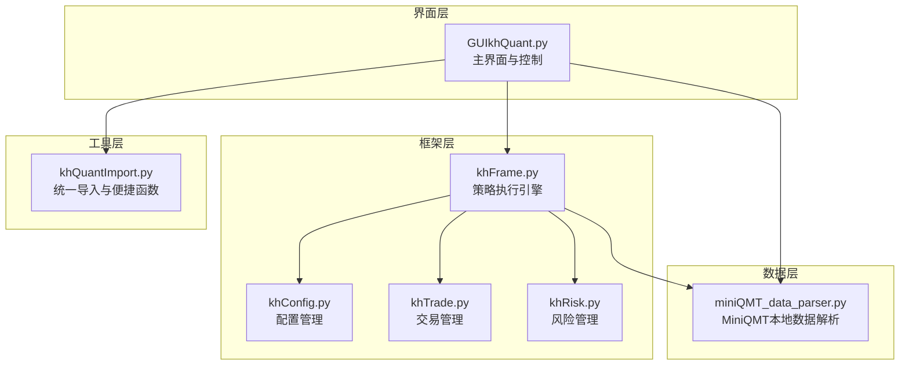
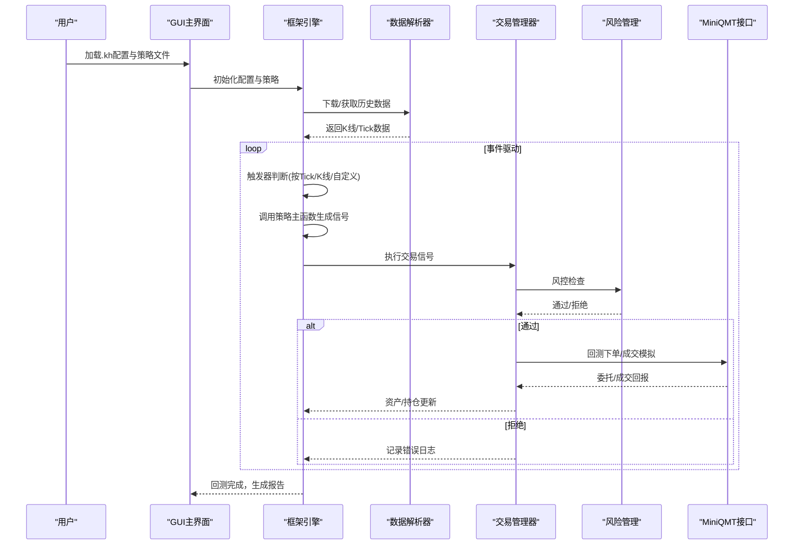
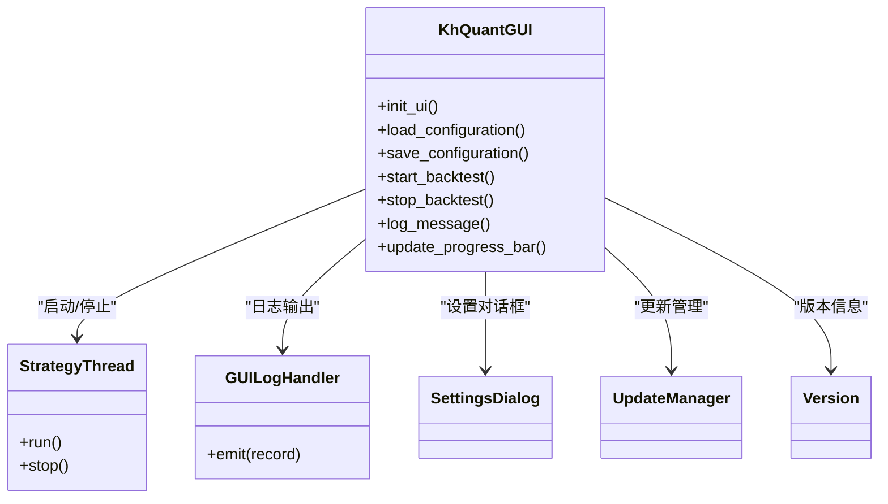
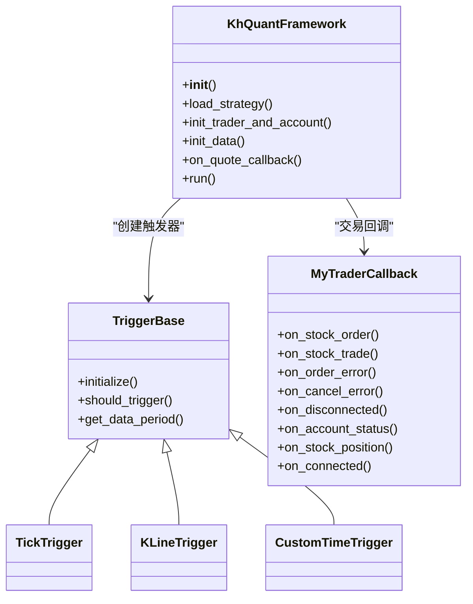
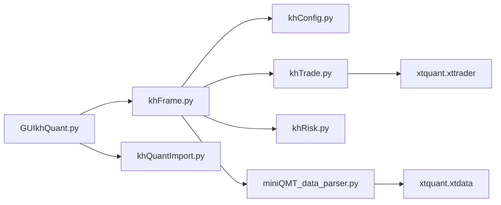

# 项目概述

<cite>
**本文引用的文件**
- [README.md](file://README.md)
- [GUIkhQuant.py](file://GUIkhQuant.py)
- [khFrame.py](file://khFrame.py)
- [khQuantImport.py](file://khQuantImport.py)
- [miniQMT_data_parser.py](file://miniQMT_data_parser.py)
- [khConfig.py](file://khConfig.py)
- [khTrade.py](file://khTrade.py)
- [khRisk.py](file://khRisk.py)
- [modules/GUIkhQuant.md](file://modules/GUIkhQuant.md)
- [modules/khFrame.md](file://modules/khFrame.md)
- [modules/khQuantImport.md](file://modules/khQuantImport.md)
</cite>

## 目录
1. [引言](#引言)
2. [项目结构](#项目结构)
3. [核心组件](#核心组件)
4. [架构总览](#架构总览)
5. [详细组件分析](#详细组件分析)
6. [依赖分析](#依赖分析)
7. [性能考虑](#性能考虑)
8. [故障排查指南](#故障排查指南)
9. [结论](#结论)
10. [附录](#附录)

## 引言
看海量化交易系统（KHQuant）是一个面向A股个人投资者的本地化量化研究平台，旨在提供“图形化、本地化、灵活实用”的策略回测与研究工具。项目以“乐高积木”式模块化设计为核心理念，将UI、数据、策略与核心框架解耦，既满足初学者“开箱即用”的易用性，又为开发者提供Python生态的高自由度与可扩展性。系统通过与MiniQMT深度集成，实现数据接口的开箱即用，并在回测中模拟交易成本、滑点与风控，帮助用户专注于策略逻辑与实验验证。

项目愿景与目标用户画像：
- 愿景：为个人量化爱好者与开发者提供一款免费、强大且称手的本地化量化研究工具，降低策略开发门槛，提升回测与分析效率。
- 目标用户：
  - 个人量化爱好者：希望通过图形化界面快速配置策略、补充数据、运行回测并查看报告。
  - 开发者与研究者：需要Python策略编写能力、灵活的数据与交易接口、可扩展的模块化架构。

项目核心优势（来自README）：
- 完全开源免费，拥抱社区共建生态
- 数据与策略本地化部署，安全与隐私可控
- 可视化便捷操作与Python代码灵活驱动，双引擎满足多层次需求
- 拥抱AI浪潮，为大模型辅助策略生成提供基础
- 深度整合MiniQMT，共享成熟稳定的交易执行
- 专注A股优化，更懂本土化交易者的实战需求
- 极致策略自由度，释放Python生态的无限潜能

## 项目结构
KHQuant采用模块化分层设计，围绕“GUI + 框架 + 数据 + 策略 + 工具”的结构组织，便于维护与扩展。核心模块包括：
- GUI层：提供主界面、配置面板、日志与状态反馈，负责用户交互与策略执行控制。
- 框架层：策略生命周期管理、事件驱动、数据与交易执行引擎。
- 数据层：MiniQMT本地数据解析与历史数据下载，支持Tick/K线等多周期。
- 工具层：统一导入模块、指标库、时间与数据解析工具，简化策略开发。
- 配置与交易：配置管理、交易成本与风控模块，支撑回测与模拟交易。

图表来源
- [GUIkhQuant.py](file://GUIkhQuant.py#L1-L200)
- [khFrame.py](file://khFrame.py#L1-L200)
- [khConfig.py](file://khConfig.py#L1-L105)
- [khTrade.py](file://khTrade.py#L1-L120)
- [khRisk.py](file://khRisk.py#L1-L51)
- [miniQMT_data_parser.py](file://miniQMT_data_parser.py#L1-L120)
- [khQuantImport.py](file://khQuantImport.py#L1-L120)

章节来源
- [README.md](file://README.md#L66-L110)
- [modules/GUIkhQuant.md](file://modules/GUIkhQuant.md#L1-L120)
- [modules/khFrame.md](file://modules/khFrame.md#L1-L120)
- [modules/khQuantImport.md](file://modules/khQuantImport.md#L1-L60)

## 核心组件
- GUI主界面与控制：负责策略加载、配置保存/加载、回测启动/停止、日志与状态反馈、MiniQMT连接状态指示。
- 框架执行引擎：策略生命周期管理、事件驱动（Tick/K线/自定义时间）、数据获取与缓存、交易执行与回测主循环。
- 配置管理：统一读取与写入.kh配置文件，提供回测时间、股票池、数据周期、交易成本等参数。
- 交易与风控：交易成本计算（佣金、印花税、过户费、流量费）、滑点模拟、资金与持仓变动、错误与回调处理。
- 数据解析：MiniQMT本地数据解析（Tick/K线），支持字段映射与时间格式转换，提供历史数据下载与缓存。
- 统一导入与便捷函数：提供TimeInfo、StockDataParser、PositionParser、StrategyContext等解析器与khGet/khPrice/khHas/khBuy/khSell等便捷函数，简化策略开发。

章节来源
- [GUIkhQuant.py](file://GUIkhQuant.py#L1-L200)
- [khFrame.py](file://khFrame.py#L1-L200)
- [khConfig.py](file://khConfig.py#L1-L105)
- [khTrade.py](file://khTrade.py#L1-L120)
- [khRisk.py](file://khRisk.py#L1-L51)
- [miniQMT_data_parser.py](file://miniQMT_data_parser.py#L1-L120)
- [khQuantImport.py](file://khQuantImport.py#L1-L120)

## 架构总览
KHQuant采用“事件驱动 + 模块解耦”的架构。GUI层通过配置文件与策略文件驱动框架层；框架层通过数据管理器获取历史数据，按触发器节奏调用策略主函数生成交易信号；交易管理器负责成本与风控计算、下单与成交回测模拟；MiniQMT提供数据与交易接口，确保本地化与合规性。

图表来源
- [GUIkhQuant.py](file://GUIkhQuant.py#L1-L200)
- [khFrame.py](file://khFrame.py#L1-L200)
- [khTrade.py](file://khTrade.py#L1-L120)
- [khRisk.py](file://khRisk.py#L1-L51)
- [miniQMT_data_parser.py](file://miniQMT_data_parser.py#L1-L120)

章节来源
- [README.md](file://README.md#L66-L110)
- [modules/GUIkhQuant.md](file://modules/GUIkhQuant.md#L460-L568)
- [modules/khFrame.md](file://modules/khFrame.md#L456-L586)

## 详细组件分析

### GUI主界面与控制（GUIkhQuant.py）
- 职责：主窗口布局、工具栏、左侧配置面板（策略、回测参数、数据设置、股票池）、中间驱动面板（触发方式、账户信息、盘前盘后）、右侧日志面板、底部状态栏与MiniQMT连接指示。
- 关键流程：加载.kh配置、保存配置、启动/停止回测、日志过滤与保存、进度条与状态更新。
- 线程与信号：使用QThread与信号槽实现后台回测，避免界面阻塞；日志通过GUILogHandler写入GUI表格，支持延迟刷新与行数限制。

图表来源
- [GUIkhQuant.py](file://GUIkhQuant.py#L1-L200)
- [GUIkhQuant.py](file://GUIkhQuant.py#L200-L400)
- [GUIkhQuant.py](file://GUIkhQuant.py#L400-L600)

章节来源
- [modules/GUIkhQuant.md](file://modules/GUIkhQuant.md#L1-L120)
- [modules/GUIkhQuant.md](file://modules/GUIkhQuant.md#L460-L568)

### 框架执行引擎（khFrame.py）
- 职责：策略生命周期管理（加载、初始化、主逻辑、盘前/盘后）、事件驱动（Tick/K线/自定义时间）、数据获取与缓存、交易执行与回测主循环。
- 触发器体系：TickTrigger、KLineTrigger、CustomTimeTrigger，支持按Tick/K线周期/自定义时间点触发。
- 回测主循环：按交易日推进，盘前/盘后回调，逐Bar处理策略，执行信号并记录结果。

图表来源
- [khFrame.py](file://khFrame.py#L1-L200)
- [khFrame.py](file://khFrame.py#L200-L400)
- [khFrame.py](file://khFrame.py#L400-L600)

章节来源
- [modules/khFrame.md](file://modules/khFrame.md#L1-L120)
- [modules/khFrame.md](file://modules/khFrame.md#L120-L302)
- [modules/khFrame.md](file://modules/khFrame.md#L456-L586)

### 配置管理（khConfig.py）
- 职责：加载.kh配置文件，提供回测起止时间、股票池、数据周期、交易成本、风控参数等访问接口；支持更新与保存。
- 关键点：run_mode、account_id/account_type、backtest_start/backtest_end、init_capital、kline_period、stock_pool等。

章节来源
- [khConfig.py](file://khConfig.py#L1-L105)

### 交易与风控（khTrade.py、khRisk.py）
- 交易管理：交易成本计算（佣金、印花税、过户费、流量费）、滑点模拟（按比例/按最小变动价）、下单与成交回测模拟、资金与持仓更新、委托/成交/错误回调。
- 风控管理：提供风控检查入口（持仓限制、委托限制、止损限制），预留扩展点。

章节来源
- [khTrade.py](file://khTrade.py#L1-L120)
- [khTrade.py](file://khTrade.py#L120-L240)
- [khRisk.py](file://khRisk.py#L1-L51)

### 数据解析（miniQMT_data_parser.py）
- 职责：解析MiniQMT本地数据（Tick/K线），支持字段映射与时间格式转换，提供历史数据下载与缓存。
- 关键点：根据路径推断股票代码与周期，调用xtquant接口获取数据，处理缺失字段与异常情况。

章节来源
- [miniQMT_data_parser.py](file://miniQMT_data_parser.py#L1-L120)
- [miniQMT_data_parser.py](file://miniQMT_data_parser.py#L120-L240)

### 统一导入与便捷函数（khQuantImport.py）
- 职责：提供统一导入入口（from khQuantImport import *），封装TimeInfo、StockDataParser、PositionParser、StockPoolParser、StrategyContext等解析器，以及khGet/khPrice/khHas/khBuy/khSell等便捷函数。
- 价值：降低策略开发学习成本，统一开发体验，减少样板代码。

章节来源
- [modules/khQuantImport.md](file://modules/khQuantImport.md#L1-L120)
- [modules/khQuantImport.md](file://modules/khQuantImport.md#L120-L240)
- [modules/khQuantImport.md](file://modules/khQuantImport.md#L340-L428)

## 依赖分析
- GUI与框架：GUI通过配置与策略文件驱动框架；框架通过数据解析器与交易管理器完成回测。
- 数据依赖：MiniQMT本地数据解析依赖xtquant接口；历史数据下载通过xtquant的download接口。
- 交易依赖：交易管理器通过XtQuantTraderCallback接收委托/成交回报，模拟回测下单与成交。
- 工具依赖：khQuantImport统一导入标准库、数据处理库、量化库、项目工具与指标库，简化策略开发。

图表来源
- [GUIkhQuant.py](file://GUIkhQuant.py#L1-L200)
- [khFrame.py](file://khFrame.py#L1-L200)
- [khTrade.py](file://khTrade.py#L1-L120)
- [miniQMT_data_parser.py](file://miniQMT_data_parser.py#L1-L120)
- [khQuantImport.py](file://khQuantImport.py#L1-L120)

章节来源
- [README.md](file://README.md#L66-L110)

## 性能考虑
- 数据缓存：框架层与数据解析层均提供缓存机制，减少重复下载与解析，提升回测速度。
- 线程与异步：GUI使用QThread与信号槽，避免阻塞；日志批量刷新与行数限制，降低界面压力。
- 交易成本与滑点：在回测中模拟真实交易成本与滑点，提升回测结果的真实性与稳健性。
- 事件驱动：按Tick/K线/自定义时间点触发，兼顾灵活性与性能。

章节来源
- [modules/khFrame.md](file://modules/khFrame.md#L302-L456)
- [modules/GUIkhQuant.md](file://modules/GUIkhQuant.md#L747-L792)

## 故障排查指南
- MiniQMT连接问题：检查MiniQMT客户端路径与userdata路径配置，确保MiniQMT已登录并处于运行状态；关注MiniQMT状态指示灯。
- 策略加载失败：确认策略文件存在、语法正确、包含必需函数（如init、khHandlebar）；GUI会进行必要校验并提示错误。
- 数据不足：回测前确保所需周期（如1分钟、日线）数据已补充完整；数据不足会导致策略计算异常或回测报告不准确。
- 交易成本与风控：检查交易成本配置（最低佣金、佣金比例、印花税、流量费、滑点类型与值）；风控参数可根据需要调整。
- 日志与报告：使用日志过滤查看DEBUG/INFO/WARNING/ERROR/TRADE等级；回测结束后可打开回测指标窗口查看详细报告。

章节来源
- [README.md](file://README.md#L391-L438)
- [modules/GUIkhQuant.md](file://modules/GUIkhQuant.md#L460-L568)

## 结论
KHQuant以“乐高积木”式模块化设计为核心，将GUI、数据、策略与核心框架解耦，既满足个人量化爱好者的易用性需求，也为开发者提供了Python生态的高自由度与可扩展性。通过与MiniQMT深度集成，系统实现了数据接口的开箱即用与本地化安全；通过统一导入与便捷函数，大幅降低了策略开发门槛。项目在回测中模拟交易成本、滑点与风控，帮助用户专注于策略逻辑与实验验证，为A股个人投资者提供了一个免费、强大且称手的量化研究利器。

## 附录
- 与现有工具的比较（来自README）：
  - GUI友好，与MiniQMT深度集成，数据接口开箱即用
  - 生态初期，功能待完善，依赖MiniQMT，个人维护
  - 目标用户：注重易用性的个人量化爱好者，希望数据策略本地化
  - 策略编程：Python
  - 数据获取：内置MiniQMT接口，开箱即用
  - 界面形态：PyQt5构建的桌面GUI
  - 使用成本：免费

章节来源
- [README.md](file://README.md#L66-L110)