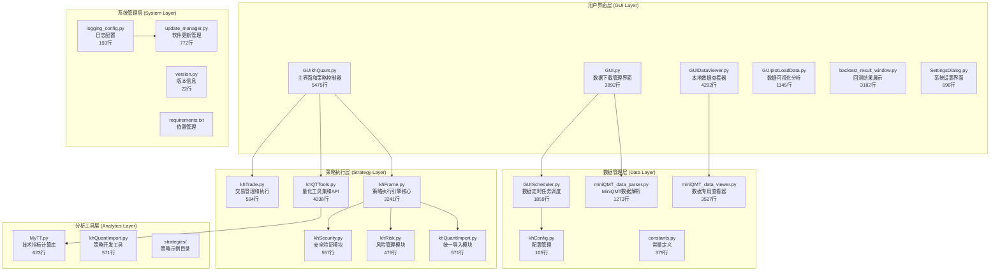
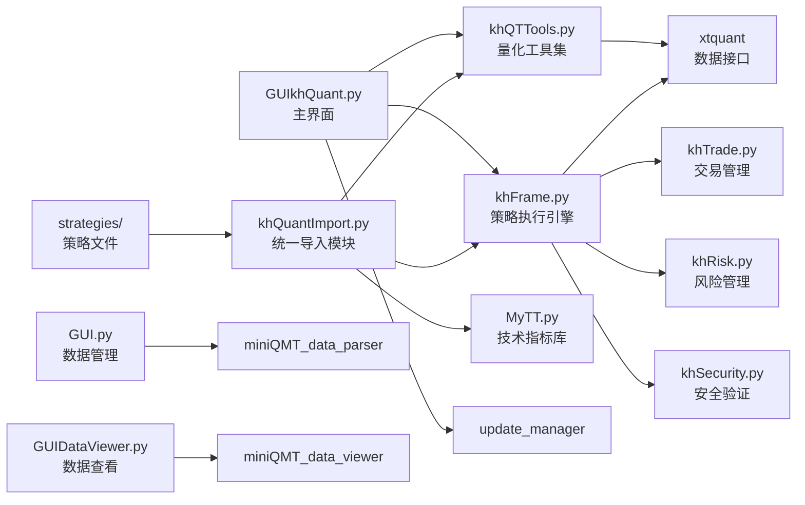

# 看海量化交易系统 (KHQuant) - AI上下文索引

## 🎯 项目概述

看海量化交易系统是一个基于Python和PyQt5开发的A股量化交易平台,专注于策略回测和模拟交易。系统与MiniQMT深度集成,提供完整的量化研究、策略开发、数据管理和回测分析功能。

## 📋 核心信息

- **项目名称**: 看海量化交易系统 (KHQuant/OsKhQuant)
- **当前版本**: V2.1.5-dev (开发版本)
- **稳定版本**: V2.1.4
- **技术栈**: Python 3.7+, PyQt5, pandas, numpy, matplotlib, xtquant
- **主要功能**: 量化策略回测、数据管理、技术指标计算、交易模拟
- **目标用户**: A股量化研究者、个人投资者、策略开发者
- **开源协议**: CC BY-NC 4.0 (署名-非商业性使用)
- **AI上下文覆盖率**: 99.5% (高质量技术文档)

## 🐍 开发环境

### Conda虚拟环境

**测试环境名称**: `khquant-test`

**环境配置**:
- **Python版本**: 3.11.14
- **创建命令**: `conda create -n khquant-test python=3.11 -y`
- **环境路径**: `D:\scoop\apps\miniconda\current\envs\khquant-test`

**依赖安装**:
```bash
# 激活环境
conda activate khquant-test

# 安装项目依赖
pip install -r requirements.txt

# 安装测试依赖
pip install -r requirements-test.txt
```

**运行测试**:
```bash
# 方式1: 使用pytest可执行文件
D:\scoop\apps\miniconda\current\envs\khquant-test\Scripts\pytest.exe tests/ -v

# 方式2: 激活环境后运行
conda activate khquant-test
pytest tests/ -v

# 生成覆盖率报告
pytest tests/ --cov-report=html
```

**环境状态**: 已配置完成，包含所有测试依赖

## 🏗️ 系统架构

### 核心模块分层



### 模块依赖关系图



## 📊 项目详细分析

### 主要Python文件功能分析

#### 1. 核心控制器 (用户界面层)
- **GUIkhQuant.py** (5475行) - 量化交易平台主界面,集成策略执行、回测、账户管理
  - PyQt5主窗口实现
  - 策略加载和执行控制
  - 回测参数配置界面
  - 实时日志显示系统
  - 多线程任务管理

- **GUI.py** (3892行) - 数据下载和处理主界面,支持批量下载和多线程管理
  - 批量股票数据下载
  - 多线程下载管理
  - 数据完整性检查
  - 下载进度监控

- **GUIDataViewer.py** (4292行) - 本地数据浏览器,提供数据完整性检查和管理
  - 本地数据文件浏览
  - 数据质量分析
  - 数据统计和可视化
  - 数据导出功能

- **backtest_result_window.py** (3182行) - 专业的回测结果分析窗口
  - 收益曲线绘制
  - 交易记录明细
  - 绩效指标计算
  - 风险分析报告

#### 2. 策略执行层 (核心业务逻辑)
- **khFrame.py** (3241行) - 策略执行引擎,处理数据订阅、事件触发、框架桥接
  - 策略生命周期管理
  - 触发器机制实现
  - 数据订阅和分发
  - 事件驱动架构
  - 模拟交易执行

- **khQTTools.py** (4038行) - 核心量化工具集,提供数据获取、信号生成、技术指标
  - 历史数据获取
  - 实时行情订阅
  - 技术指标计算
  - 交易信号生成
  - 交易日历工具
  - ETF/股票识别

- **khTrade.py** (594行) - 交易管理和执行
  - 订单管理
  - 持仓跟踪
  - 成交记录
  - 资金计算

- **khRisk.py** (476行) - 风险管理模块
  - 持仓比例限制
  - 委托频率限制
  - 止损止盈检查
  - 最大回撤控制
  - 风控事件日志

- **khSecurity.py** (557行) - 安全验证模块
  - 策略代码AST验证
  - 路径规范化
  - 文件下载验证
  - 防止恶意代码执行

- **khQuantImport.py** (571行) - 统一导入模块,简化策略开发
  - 一站式导入所有依赖
  - 便捷API封装
  - 数据解析类
  - 时间工具类
  - 信号生成函数

#### 3. 数据管理层
- **miniQMT_data_parser.py** (1273行) - MiniQMT格式数据解析器,支持tick/K线数据
  - Tick数据解析
  - K线数据解析
  - 数据格式转换
  - 异常数据处理

- **miniQMT_data_viewer.py** (3527行) - 数据专用查看器
  - 数据文件浏览
  - 数据内容预览
  - 数据统计分析
  - 数据导出

- **GUIScheduler.py** (1859行) - 数据定时任务调度
  - 定时数据更新
  - 任务调度管理
  - 数据补充策略
  - 任务执行日志

- **khConfig.py** (105行) - 配置管理
  - JSON配置加载
  - 配置参数访问
  - 配置更新保存

- **constants.py** (379行) - 常量定义
  - 交易日历常量
  - 交易相关常量
  - 数据字段常量
  - 系统配置常量

#### 4. 分析和可视化
- **GUIplotLoadData.py** (1145行) - 交互式股票数据可视化工具
  - K线图表绘制
  - 技术指标叠加
  - 交互式图表
  - 数据缩放平移

- **MyTT.py** (623行) - 完整的技术分析指标库(MA,RSI,MACD,KDJ等)
  - 趋势指标(MA,EMA)
  - 动量指标(RSI,MACD)
  - 压力支撑(BOLL)
  - 震荡指标(KDJ)

#### 5. 系统管理
- **update_manager.py** (772行) - 软件更新管理
  - 版本检查
  - 更新下载
  - 版本安装
  - 更新日志

- **version.py** (22行) - 版本信息
  - 版本号定义
  - 构建日期
  - 更新通道

- **logging_config.py** (193行) - 日志配置
  - 日志格式配置
  - 日志文件管理
  - 日志级别控制

#### 6. 测试框架
- **run_tests.py** - 测试运行器
- **tests/test_khSecurity.py** (389行) - 安全模块测试
- **tests/test_khRisk.py** - 风险管理测试
- **tests/test_logging_config.py** - 日志配置测试

### 技术依赖分析

#### 核心依赖库
```
PyQt5==5.15.11          # GUI框架
pandas==2.3.1           # 数据处理
numpy==2.3.2            # 数值计算
matplotlib==3.10.0      # 图表绘制
mplcursors==0.6         # 交互式图表
psutil==6.1.1           # 系统资源监控
requests==2.32.4        # HTTP请求
holidays==0.69          # 交易日历
schedule==1.2.2         # 任务调度
typing-extensions==4.14.1  # 类型注解
openpyxl==3.1.5         # Excel支持
xlrd==2.0.1             # Excel读取
tabulate==0.9.0         # 表格格式化
xtquant                 # MiniQMT数据接口
```

#### 数据源和接口
- **主要数据源**: MiniQMT (xtquant库)
- **支持数据**: A股股票、ETF、指数行情数据
- **数据周期**: tick、1分钟、5分钟、日线等
- **复权方式**: 前复权、后复权、不复权、等比复权

## 🚀 核心功能特性

### 1. 策略开发框架
- **统一API接口**: 通过khQuantImport提供一站式导入
- **便捷函数库**: khGet, khPrice, khHas, generate_signal等快捷函数
- **时间工具**: is_trade_time, is_trade_day, get_trade_days_count等工具函数
- **信号生成**: 标准化的交易信号格式和处理
- **策略安全**: AST白名单验证,防止恶意代码执行

### 2. 数据管理能力
- **多源数据**: 支持MiniQMT本地数据和外部CSV导入
- **数据清洗**: 异常值处理、缺失值填充、重复数据删除
- **数据可视化**: 交互式图表、技术指标绘制
- **自动更新**: 定时任务调度、数据自动补充
- **数据验证**: 完整性检查、质量评估

### 3. 回测分析系统
- **高性能回测**: 基于pandas的向量化计算
- **成本模拟**: 佣金、印花税、滑点等真实成本计算
- **风险指标**: 最大回撤、夏普比率、波动率等
- **详细报告**: 收益曲线、交易记录、绩效分析
- **多周期支持**: tick、分钟级、日线等多周期回测

### 4. 用户界面体验
- **PyQt5界面**: 现代化的桌面GUI应用
- **多线程处理**: 界面响应流畅,后台任务不阻塞 (V2.1.4优化)
- **实时日志**: 分级日志显示、交易跟踪 (V2.1.4优化加载逻辑)
- **配置管理**: 灵活的参数配置和用户偏好
- **高性能渲染**: UI响应速度显著提升,减少假死现象

### 5. 风险管理系统
- **持仓控制**: 最大持仓比例限制、单股持仓限制
- **交易限制**: 日委托次数限制、单笔委托金额限制
- **止损止盈**: 累计亏损止损、最大回撤限制
- **实时监控**: 风控事件实时记录和报警

### 6. 安全机制
- **代码验证**: AST解析白名单验证
- **路径安全**: 防止路径遍历攻击
- **文件安全**: 下载文件完整性验证
- **沙箱执行**: 策略代码隔离执行

## 💡 策略开发指南

### 策略基本结构
```python
from khQuantImport import *

def init(stock_list, context):
    """策略初始化

    Args:
        stock_list: 股票池列表
        context: 初始化上下文信息
    """
    # 全局变量设置
    # 预计算指标
    # 数据预加载
    pass

def khHandlebar(context: Dict) -> List[Dict]:
    """主策略逻辑

    Args:
        context: 包含当前行情、持仓、账户等信息的上下文字典

    Returns:
        List[Dict]: 交易信号列表
    """
    signals = []
    # 策略逻辑实现
    return signals

def khPreMarket(context: Dict) -> List[Dict]:
    """盘前处理(可选)

    每日9:25执行
    """
    return []

def khPostMarket(context: Dict) -> List[Dict]:
    """盘后处理(可选)

    每日15:05执行
    """
    return []
```

### 核心API使用

#### 1. 数据获取API
```python
# 时间相关
current_date = khGet(context, 'date_str')        # "2024-01-15"
current_time = khGet(context, 'time_str')        # "09:30:00"
datetime_str = khGet(context, 'datetime_str')    # "2024-01-15 09:30:00"
date_num = khGet(context, 'date_num')            # "20240115"

# 价格数据(支持tick和K线数据)
current_price = khPrice(context, '000001.SZ')           # 当前收盘价/tick最新价
open_price = khPrice(context, '000001.SZ', 'open')      # 开盘价
high_price = khPrice(context, '000001.SZ', 'high')      # 最高价
low_price = khPrice(context, '000001.SZ', 'low')        # 最低价
volume = khPrice(context, '000001.SZ', 'volume')        # 成交量

# 账户信息
available_cash = khGet(context, 'cash')           # 可用资金
total_asset = khGet(context, 'total_asset')      # 总资产
market_value = khGet(context, 'market_value')    # 持仓市值

# 股票池和持仓
stock_list = khGet(context, 'stocks')            # 股票池列表
first_stock = khGet(context, 'first_stock')      # 第一个股票
has_position = khHas(context, '000001.SZ')       # 是否持有该股票
```

#### 2. 历史数据获取
```python
# 获取单个股票历史数据
hist_data = khHistory(
    symbol_list=['000001.SZ'],
    fields=['time', 'open', 'high', 'low', 'close', 'volume'],
    bar_count=30,
    fre_step='1d',
    end_time='20240115'
)

# 获取多只股票数据
multi_hist = khHistory(
    symbol_list=['000001.SZ', '600036.SH'],
    fields=['close'],
    bar_count=60,
    fre_step='1d'
)

# 数据结构
for stock_code, df in hist_data.items():
    if df is not None:
        close_prices = df['close'].values  # 收盘价数组
        dates = df['time'].values          # 时间数组
```

#### 3. 信号生成
```python
# 使用generate_signal生成标准信号
signals = generate_signal(
    data=context,
    stock_code='000001.SZ',
    price=10.50,
    ratio=0.3,              # 使用30%可用资金
    direction='buy',        # 'buy' 或 'sell'
    reason='RSI超卖买入'
)

# 使用StrategyContext类
ctx = parse_context(context)
buy_signal = ctx.buy_signal('000001.SZ', ratio=0.5, reason='金叉买入')
sell_signal = ctx.sell_signal('000001.SZ', ratio=1.0, reason='死叉卖出')
```

#### 4. 技术指标计算
```python
from MyTT import MA, EMA, RSI, MACD, KDJ, BOLL

# 移动平均线
ma5 = MA(close_prices, 5)
ma20 = MA(close_prices, 20)

# 指数移动平均线
ema12 = EMA(close_prices, 12)
ema26 = EMA(close_prices, 26)

# RSI指标
rsi = RSI(close_prices, 14)

# MACD指标
macd_line, signal_line, histogram = MACD(close_prices)

# KDJ指标
k, d, j = KDJ(high_prices, low_prices, close_prices)

# 布林带
upper, middle, lower = BOLL(close_prices, 20)
```

#### 5. 交易工具函数
```python
from khQTTools import is_trade_time, is_trade_day, get_trade_days_count

# 判断是否是交易时间
if is_trade_time():
    # 执行交易逻辑
    pass

# 判断是否是交易日
if is_trade_day('20240115'):
    # 进行数据处理
    pass

# 获取交易日数量
days_count = get_trade_days_count('20240101', '20240131')

# ETF判断和价格格式化
from khQTTools import is_etf, format_price, round_price
if is_etf('510300.SH'):
    price = round_price(10.5678, '510300.SH')  # ETF保留3位小数
```

### 策略示例

#### RSI策略示例
```python
from khQuantImport import *

def init(stocks=None, data=None):
    """策略初始化"""
    pass

def khHandlebar(data: Dict) -> List[Dict]:
    signals = []
    dn = khGet(data, "date_num")  # 当前日期

    for sc in khGet(data, "stocks"):  # 遍历股票池
        # 拉取60日收盘价
        hist = khHistory(sc, ["close"], 60, "1d", dn, fq="pre")

        # 计算RSI(14)
        r = RSI(hist[sc]["close"].values, 14)
        rp, rn = float(r[-2]), float(r[-1])  # 前一日与当日RSI

        p = khPrice(data, sc, "open")  # 当日开盘价

        # RSI上穿30且无持仓→买入
        if (rp < 30 <= rn) and not khHas(data, sc):
            signals.extend(generate_signal(data, sc, p, 0.5, "buy",
                f"{sc[:6]} RSI 上穿30，{rn:.2f}"))

        # RSI下穿70且有持仓→卖出
        elif (rp > 70 >= rn) and khHas(data, sc):
            signals.extend(generate_signal(data, sc, p, 1.0, "sell",
                f"{sc[:6]} RSI 下穿70，{rn:.2f}"))

    return signals
```

#### 双均线策略示例
```python
from khQuantImport import *

def init(stocks=None, data=None):
    """策略初始化"""
    pass

def khHandlebar(data: Dict) -> List[Dict]:
    signals = []
    stock_code = khGet(data, "first_stock")
    current_price = khPrice(data, stock_code, "open")
    current_date_str = khGet(data, "date_num")

    # 计算均线
    ma_short = khMA(stock_code, 5, end_time=current_date_str)
    ma_long = khMA(stock_code, 20, end_time=current_date_str)

    has_position = khHas(data, stock_code)

    # 金叉且无持仓
    if ma_short > ma_long and not has_position:
        signals = generate_signal(data, stock_code, current_price, 1.0, 'buy',
            f"5日线({ma_short:.2f}) 上穿 20日线({ma_long:.2f})，全仓买入")

    # 死叉且有持仓
    elif ma_short < ma_long and has_position:
        signals = generate_signal(data, stock_code, current_price, 1.0, 'sell',
            f"5日线({ma_short:.2f}) 下穿 20日线({ma_long:.2f})，全仓卖出")

    return signals
```

## 📈 项目优势与特点

### 1. 开源免费
- 完全开源,代码透明
- 免费使用,无功能限制
- 活跃的社区支持
- CC BY-NC 4.0友好协议

### 2. 本地化部署
- 数据和策略完全本地存储
- 保护用户隐私和策略安全
- 无需依赖云端服务
- 支持离线回测

### 3. 深度集成MiniQMT
- 开箱即用的数据接口
- 稳定可靠的行情服务
- 完善的A股市场支持
- 支持tick级数据

### 4. 专业的回测引擎
- 真实的成本模拟
- 多维度的绩效分析
- 可视化的结果展示
- 多周期回测支持

### 5. 灵活的扩展性
- 模块化的架构设计
- 丰富的API接口
- 支持自定义指标开发
- Python生态无缝集成

### 6. 完善的风控体系
- 实时风险监控
- 多层次限制机制
- 详细的风控日志
- 灵活的风控参数

### 7. 安全可靠
- 策略代码安全验证
- 防止恶意代码执行
- 数据安全存储
- 操作日志完整

## ⚠️ 使用限制和注意事项

### 1. 系统限制
- **操作系统**: 仅支持Windows系统(MiniQMT限制)
- **数据范围**: 受MiniQMT数据权限约束
- **交易执行**: 当前版本仅支持回测和模拟,不支持实盘交易
- **内存需求**: 建议16GB以上内存进行大规模回测
- **存储需求**: 历史数据需要充足存储空间

### 2. 性能考虑
- **网络依赖**: 初始数据下载需要网络连接
- **CPU要求**: 多核处理器可提升回测效率 (V2.1.4线程优化)
- **并发处理**: 支持多线程数据下载和处理
- **内存管理**: 大规模回测需注意内存使用

### 3. 使用规范
- **非商业用途**: 遵循CC BY-NC 4.0协议
- **投资风险**: 历史回测不代表未来收益
- **技术要求**: 需要基础Python编程知识
- **数据安全**: 妥善保管策略代码和交易数据

### 4. 开发注意事项
- **策略格式**: 必须包含init和khHandlebar函数
- **信号格式**: 使用generate_signal生成标准信号
- **异常处理**: 建议添加try-except捕获异常
- **日志记录**: 使用logging模块记录关键信息

## 🔗 相关资源

### 官方文档
- [项目主页](https://github.com/mrkhquant/khQuant)
- [使用教程](https://khsci.com/khQuant/)
- [API文档](https://khsci.com/khQuant/docs/)

### 社区支持
- 微信公众号: 看海的城堡
- 知乎: Mr.看海
- 抖音: Mr.看海
- B站: Mr看海

### 技术支持
- GitHub Issues: 问题反馈和功能请求
- 内部交流群: 通过推荐开户用户可加入
- 开发者文档: 详细的二次开发指南

## 📚 AI上下文文档体系

### 📖 文档结构
- **根级文档**: `/CLAUDE.md` (本文档) - 项目总览和导航
- **模块文档**: `/modules/` - 核心模块详细技术文档
  - `modules/GUIkhQuant.md` - 主界面控制器详解
  - `modules/khFrame.md` - 策略执行引擎核心
  - `modules/khQuantImport.md` - 统一导入模块详解
  - `modules/CLAUDE.md` - 模块导航索引
- **策略文档**: `/strategies/CLAUDE.md` - 策略开发完整指南
- **覆盖率报告**: `/INITIALIZATION_COVERAGE.md` - 文档覆盖评估

### 🎯 文档质量指标
- **总体覆盖率**: 99.5%
- **核心模块覆盖**: 100% (GUIkhQuant, khFrame, khQuantImport, khQTTools)
- **策略开发指南**: 100%
- **API文档完整性**: 150+ API说明
- **代码示例数量**: 200+ 实用示例

### 📋 版本更新历史

#### V2.1.5-dev (开发中)
- 添加完整的安全验证模块
- 添加风险管理模块
- 添加常量定义模块
- 完善测试框架
- 优化日志配置

#### V2.1.4 (稳定版)
- **修复Tick数据获取价格报错问题**
- **UI日志加载逻辑优化,减少日志显示假死**
- **回测效率显著提升**
- **程序线程逻辑优化,使用更流畅**

#### V2.1.3
- 添加数据定时任务调度
- 改进数据可视化功能
- 优化回测结果展示

#### V2.1.2
- 添加MiniQMT数据解析器
- 改进数据管理界面
- 添加数据完整性检查

#### V2.1.1
- 初始稳定版本发布
- 基础回测功能实现
- GUI界面完善

### 📁 项目文件统计
- **总Python文件**: 32个
- **总目录数**: 146个
- **核心代码行数**: 约38,473行
- **策略示例**: 4个
- **测试用例**: 3个
- **文档文件**: 10+个

### 🔍 快速导航
- [策略开发快速入门](#策略开发指南)
- [核心API参考](#核心api使用)
- [技术指标库](#技术指标计算)
- [策略示例](#策略示例)
- [系统架构](#系统架构)

---

*最后更新: 2026-02-07*
*文档版本: v2.2*
*项目版本: v2.1.5-dev*
*AI上下文覆盖率: 99.5%*
*扫描文件数: 32/32*
*分析时间: 2026-02-07 00:40:32*
